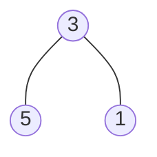

## Examples

**Example 1**

- Input: `nums = [113,215,221]`
- Output: `12`
- Explanation: The encodings describe a root with value `3`, a left leaf with value `5`, and a right leaf with value `1`. The two path sums contribute `(3 + 5) + (3 + 1) = 12`.

**Example 2**

- Input: `nums = [113,221]`
- Output: `4`
- Explanation: The encodings describe a root with value `3` and only its right child, a leaf with value `1`. The sole path sum is `(3 + 1) = 4`.

```mermaid
flowchart TB
  accTitle: The binary tree represented in Example 2
  accDescr: A root node with value 3 has only a right child with value 1, producing one root-to-leaf path.
  root3((3)) --- right1((1))
```

