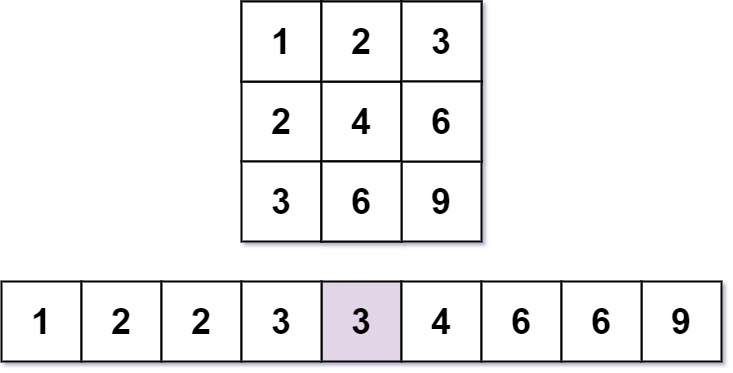
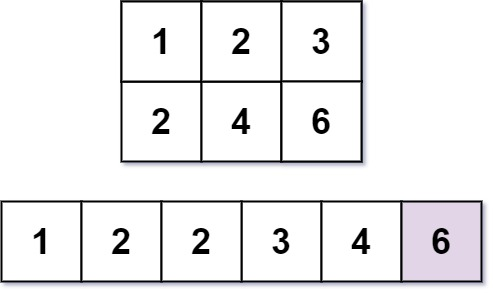

### 1. Description

Nearly everyone has used the <a href="https://en.wikipedia.org/wiki/Multiplication_table" target="_blank">Multiplication Table</a>. The multiplication table of size `m x n` is an integer matrix `mat` where $\text{mat}[i][j] = i * j$ (**1-indexed**).

Given three integers `m`, `n`, and `k`, return *the *$$k^{\text{th}}$$* smallest element in the *`m x n`* multiplication table*.

### 2. Function Contract

- `n`: Input parameter.
- Returns expected result.

### 3. Examples

#### Example 1

- **Input:** $m = 3, n = 3, k = 5$
- **Output:** `3`
- **Explanation:** The 5^th smallest number is 3.
#### Example 2

- **Input:** $m = 2, n = 3, k = 6$
- **Output:** `6`
- **Explanation:** The 6^th smallest number is 6.

### 4. Constraints

- $1 \le m, n \le 3 * 10^{4}$

- $1 \le k \le m * n$