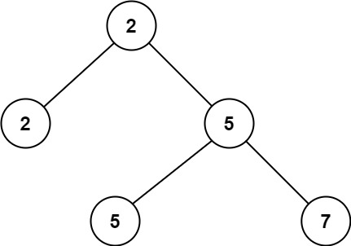

### 1. Description

Given a non-empty special binary tree consisting of nodes with the non-negative value, where each node in this tree has exactly `two` or `zero` sub-node. If the node has two sub-nodes, then this node's value is the smaller value among its two sub-nodes. More formally, the property $\text{root.val} = min(\text{root.left}.val, \text{root.right}.val)$ always holds.

Given such a binary tree, you need to output the **second minimum** value in the set made of all the nodes' value in the whole tree.

If no such second minimum value exists, output -1 instead.

### 2. Function Contract

- `n`: Input parameter.
- Returns expected result.

### 3. Examples

#### Example 1

- **Input:** `root = [2,2,5,null,null,5,7]`
- **Output:** `5`
- **Explanation:** The smallest value is 2, the second smallest value is 5.
#### Example 2

- **Input:** `root = [2,2,2]`
- **Output:** `-1`
- **Explanation:** The smallest value is 2, but there isn't any second smallest value.

### 4. Constraints

- The number of nodes in the tree is in the range `[1, 25]`.

- $1 \le \text{Node.val} \le 2^{31} - 1$

- $\text{root.val} = min(\text{root.left}.val, \text{root.right}.val)$ for each internal node of the tree.