## Solution

---

### Overview

We are given a string `s`, and the task is to check whether the string consisting of only `'('`, `')'` and `'*'` characters forms a valid sequence of parentheses. We consider `'*'` as a wildcard that can represent either `'('`, `')'` or an empty string.

**Key Observations:**
1. While traversing the string, the order of parentheses matters. `'('` must come before `')'` for a valid sequence.
2. The number of left parentheses `'('` and right parentheses `')'` must be the same, including considering `'*'`.
3. Using `'*'` optimally can help maintain the balance between open and closed parentheses.

> Note: The term "opening bracket" refers to the left parenthesis `'('` and "closing bracket" refers to the right parenthesis `')'`.

---

### Approach 1: Top-Down Dynamic Programming - Memoization

#### Intuition

One way to check if a given string of parentheses is valid is to use a stack. Whenever we encounter an opening bracket, we push it onto the stack. Whenever we encounter a closing bracket, we pop an opening bracket from the stack. If the stack is empty at the end of the string, then the string is valid. This is similar to problem [20. Valid Parentheses](https://leetcode.com/problems/valid-parentheses/description/).

However, the introduction of the wildcard character (`'*'`) complicates this approach. When dealing with the wildcard character (`'*'`), each `'*'` can represent an opening bracket, a closing bracket, or an empty string, leading to multiple branching possibilities.

We can explore all possible combinations in branching scenarios by applying recursive solutions.

We can track whether a string is valid by counting opening brackets:
- When we encounter an opening bracket, we increment the count of opening brackets by 1.
- Conversely, for a closing bracket, we decrement the count by 1.
- After processing a valid string, the count of opening brackets is 0, indicating proper closure by corresponding closing brackets.

Now, let's adapt our recursive solution based on these insights:
- The base case occurs when the index reaches the end of the string. At this point, we return true if the count of opening brackets is 0, indicating a valid string, otherwise, we return false.
- If the character at $s[index]$ is not `'*'`, we adjust the count of opening brackets accordingly:
  - If $s[index]$ is `'('`, we increment the count of opening brackets by 1 and move to $index + 1$.
  - If $s[index]$ is `')'`, we decrement the count of opening brackets by 1 if it is positive, then move to $index + 1$.
- If $s[index]$ is `'*'`, we explore all possible scenarios:
  - We can add an opening bracket (increment the count of opening brackets by 1) and move to $index + 1$.
  - We can add a closing bracket (decrement the count of opening brackets by 1), if the count is positive, then move to $index + 1$.
  - We can add an empty string and keep the count of opening brackets the same, then move to $index + 1$.

The recursive approach will result in Time Limit Exceeded (TLE) issues due to the exponential nature of possibilities ($3^{100}$ is a huge number).

To tackle this issue, we'll use dynamic programming (DP) with a two-dimensional table.

The DP table caches the results of subproblems, with rows representing different indices of the string `s` and columns representing different counts of opening brackets. Each cell stores a boolean value indicating whether the string from the current index with the given count of opening brackets is valid or not.

By caching the calculated states in the dp table, we can avoid recalculating the result for the same combination of index and opening bracket count. When encountering a state that has already been computed and stored in the dp table, instead of recursively exploring further, we can directly retrieve the cached result, significantly reducing the time complexity of the algorithm.

#### Algorithm

**`checkValidString` main function:**
- Initialize a 2D vector `memo` of size $\text{s.size}() x \text{s.size}() - 1$, representing an uninitialized state.
- Call the helper function `isValidString` with initial parameters $index = 0$, $openCount = 0$, and the given string `s`.
- Return the result of `isValidString`.

**`isValidString` helper function:**
- Base case: If `index` reaches the end of the string ($index = \text{s.size}()$), return true if `openCount` is 0 (all brackets are balanced), and false otherwise.
- Check if the result for the current `index` and `openCount` has already been computed (memoized) in `memo`. If so, return the memoized result.
- Initialize `isValid` to false.
- If the current character $s[index]$ is `'*'`:
  - Try treating `'*'` as `'('`:
- Call `isValidString` recursively with $index + 1$ and $openCount + 1$.
- If the recursive call returns true, update `isValid` to true.
  - If `openCount` is non-zero, try treating `'*'` as `')'`:
- Call `isValidString` recursively with $index + 1$ and $openCount - 1$.
- If the recursive call returns true, update `isValid` to true.
  - Try treating `'*'` as an empty character:
- Call `isValidString` recursively with $index + 1$ and the same `openCount`.
- If the recursive call returns true, update `isValid` to true.
- If the current character $s[index]$ is `'('`:
  - Call `isValidString` recursively with $index + 1$ and $openCount + 1$.
  - Update `isValid` with the result of the recursive call.
- If the current character $s[index]$ is `')'`:
  - If `openCount` is non-zero (there are open parentheses):
- Call `isValidString` recursively with $index + 1$ and $openCount - 1$.
- Update `isValid` with the result of the recursive call.
- Memoize the result of `isValid` in $\text{memo}[index][openCount]$.
- Return `isValid`.

#### Implementation

```python
class Solution:
    def checkValidString(self, s: str) -> bool:
        n = len(s)
        memo = [[-1] * n for _ in range(n)]
        return self.is_valid_string(0, 0, s, memo)

    def is_valid_string(self, index: int, open_count: int, s: str, memo: List[List[int]]) -> bool:
        # If reached end of the string, check if all brackets are balanced
        if index == len(s):
            return open_count == 0

        # If already computed, return memoized result
        if memo[index][open_count] != -1:
            return memo[index][open_count] == 1

        is_valid = False
        # If encountering '*', try all possibilities
        if s[index] == '*':
            is_valid |= self.is_valid_string(index + 1, open_count + 1, s, memo)  # Treat '*' as '('
            if open_count > 0:
                is_valid |= self.is_valid_string(index + 1, open_count - 1, s, memo)  # Treat '*' as ')'
            is_valid |= self.is_valid_string(index + 1, open_count, s, memo)  # Treat '*' as empty
        else:
            # Handle '(' and ')'
            if s[index] == '(':
                is_valid = self.is_valid_string(index + 1, open_count + 1, s, memo)  # Increment count for '('
            elif open_count > 0:
                is_valid = self.is_valid_string(index + 1, open_count - 1, s, memo)  # Decrement count for ')'

        # Memoize and return the result
        memo[index][open_count] = 1 if is_valid else 0
        return is_valid
```

#### Complexity Analysis

Let $n$ be the length of the input string.

- Time complexity: $O(n \cdot n)$

    The time complexity of the `isValidString` function can be analyzed by considering the number of unique subproblems that need to be solved. Since there are at most $n \cdot n$ unique subproblems (indexed by `index` and `openCount`), where `n` is the length of the input string, and each subproblem is computed only once (due to memoization), the time complexity is bounded by the number of unique subproblems. Therefore, the time complexity can be stated as $O(n \cdot n)$.

- Space complexity: $O(n \cdot n)$

    The space complexity of the algorithm is primarily determined by two factors: the auxiliary space used for memoization and the recursion stack space. The memoization table, denoted as `memo`, consumes $O(n \cdot n)$ space due to its size being proportional to the square of the length of the input string. Additionally, the recursion stack space can grow up to $O(n)$ in the worst case, constrained by the length of the input string, as each recursive call may add a frame to the stack. Therefore, the overall space complexity is the sum of these two components, resulting in $O(n \cdot n) + O(n)$, which simplifies to $O(n \cdot n)$.

---

### Approach 2: Bottom-Up Dynamic Programming - Tabulation

#### Intuition

Tabulation is a dynamic programming technique that involves systematically iterating through all possible combinations of changing parameters. Since tabulation operates iteratively, rather than recursively, it does not require overhead for the recursive stack space, making it more efficient than memoization. We have two variables that change as we progress through the string: the current index we're considering and the count of open brackets encountered so far. To thoroughly explore the combinations, we use two nested loops to iterate through these variables.

First, let's establish the base case:

```java
if (index == s.size()) return (openingBracket == 0);
```

We represent this base case in our tabulation matrix as $dp[\text{s.size}()][0] = true$, indicating that a string with no brackets is valid.

Our ultimate goal is to determine whether a valid parenthesis sequence can be achieved, and this information will be stored in $\text{dp}[0][0]$. To accomplish this, we traverse through every combination of index and open bracket count using the two nested loops. The outer loop iterates over the index, while the inner loop iterates over the count of open brackets (`openBracket`).

Throughout this traversal, we evaluate each state and update our tabulation matrix accordingly. Upon completing the traversal of the entire string, if $\text{dp}[0][0]$ evaluates to true, it signifies that there exists a valid parenthesis sequence.

#### Algorithm

- Initialize a 2D boolean vector `dp` of size $(n + 1) x (n + 1)$, where `n` is the length of the input string `s`. The $\text{dp}[index][openBracket]$ represents whether the substring starting from index `i` is valid with `j` opening brackets.
- Set the base case $\text{dp}[n][0]$ as true, as an empty string with no opening brackets is always valid.
- Iterate through the string from the end to the beginning (reverse order) using a nested loop:
  - Outer loop: Iterate over the indices of the string from $n - 1$ to `0`.
  - Inner loop: Iterate over the number of opening brackets from `0` to `n`.
  - For each character at index `index` and the current number of opening brackets `openBracket`, determine if the substring starting from `index` is valid with `openBracket` opening brackets:
- If the character is `'*'`:
      - Try treating `'*'` as `'('`: Check if the substring starting from $index + 1$ is valid with $openBracket + 1$ opening brackets ($dp[index + 1][openBracket + 1]$).
      - Try treating `'*'` as `')'`: If `openBracket > 0`, check if the substring starting from $index + 1$ is valid with $openBracket - 1$ opening brackets ($dp[index + 1][openBracket - 1]$).
      - Try ignoring `'*'`: Check if the substring starting from $index + 1$ is valid with the same number of opening brackets ($dp[index + 1][openBracket]$).
- If the character is `'('`:
      - Try treating `'('` as an opening bracket: Check if the substring starting from $index + 1$ is valid with $openBracket + 1$ opening brackets ($dp[index + 1][openBracket + 1]$).
- If the character is `')'`:
      - Try treating `')'` as a closing bracket: If `openBracket > 0`, check if the substring starting from $index + 1$ is valid with $openBracket - 1$ opening brackets ($dp[index + 1][openBracket - 1]$).
- Update the $\text{dp}[index][openBracket]$ value based on the result of the above checks.
- After completing the nested loops, the $\text{dp}[0][0]$ value represents whether the entire input string is valid with no excess opening brackets.

#### Implementation

```python
class Solution:
    def checkValidString(self, s: str) -> bool:
        n = len(s)
        # dp[i][j] represents if the substring starting from index i is valid with j opening brackets
        dp = [[False] * (n + 1) for _ in range(n + 1)]

        # base case: an empty string with 0 opening brackets is valid
        dp[n][0] = True

        for index in range(n - 1, -1, -1):
            for open_bracket in range(n):
                is_valid = False

                # '*' can represent '(' or ')' or '' (empty)
                if s[index] == '*':
                    if open_bracket < n:
                        is_valid |= dp[index + 1][open_bracket + 1]  # try '*' as '('
                    # opening brackets to use '*' as ')'
                    if open_bracket > 0:
                        is_valid |= dp[index + 1][open_bracket - 1]  # try '*' as ')'
                    is_valid |= dp[index + 1][open_bracket]  # ignore '*'
                else:
                    # If the character is not '*', it can be '(' or ')'
                    if s[index] == '(':
                        is_valid |= dp[index + 1][open_bracket + 1]  # try '('
                    elif open_bracket > 0:
                        is_valid |= dp[index + 1][open_bracket - 1]  # try ')'
                dp[index][open_bracket] = is_valid

        return dp[0][0]  # check if the entire string is valid with no excess opening brackets
```

#### Complexity Analysis

Let $n$ be the length of the input string.

* Time complexity: $O(n \cdot n)$

    This is due to the nested loop structure, where the outer loop iterates over each character of the string, and the inner loop iterates over all possible counts of opening brackets.

* Space complexity: $O(n \cdot n)$

    This is primarily due to the 2D array dp, which has dimensions $(n + 1) \cdot (n + 1)$.

---

### Approach 3: Using Two Stacks

#### Intuition

In Approach 1, we discussed how stacks can be used to solve brackets matching problems, but the wildcard `'*'` complicates this problem. We can tweak the stack method by creating two stacks: one for open brackets and another for the wildcard `'*'`.

This way, we maintain two stacks to process the string. The first stack keeps track of the indices of encountered open brackets, while the second stack is dedicated to storing the indices of asterisks.

As we traverse through the input string, every time we encounter an open bracket or an asterisk, we record its index by pushing it onto the respective stack.

When we encounter a right bracket, we first attempt to balance this right bracket with an open bracket. To do so, we peek into our open bracket stack. If it's not empty, indicating that there's a matching open bracket available, we pop the index from this stack and proceed.

However, if the open bracket stack is empty, we resort to using an asterisk. In this scenario, we peek into our asterisk stack and check if it contains any available asterisks. If so, we pop the index from this stack and proceed. This dynamic selection process ensures that we exhaust all possible options for balancing the right bracket.

If both the open bracket and asterisk stacks are empty, we return false, as this indicates an unmatched right bracket.

Once we've processed the whole string, our attention shifts to the remaining elements in the open bracket and asterisk stacks. Here, we check their positions relative to each other. We recognize that if an open bracket appears after the last encountered asterisk, there's no viable way to balance it because we have no available right brackets. Therefore, we return false. However, if no such mismatch is detected, we proceed to empty both stacks.

Here we used a greedy strategy, prioritizing the use of open brackets over asterisks whenever possible to balance the right brackets. This ensures that we exhaust all available options for balancing before resorting to using asterisks.

The following is an illustration demonstrating the stack solution:

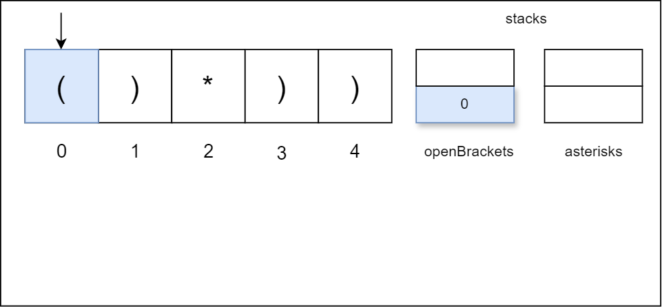

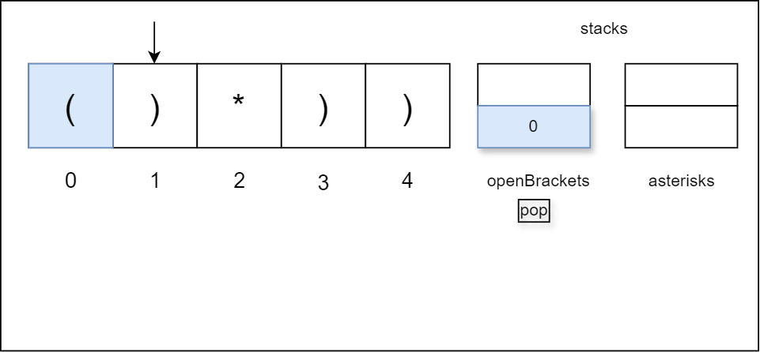

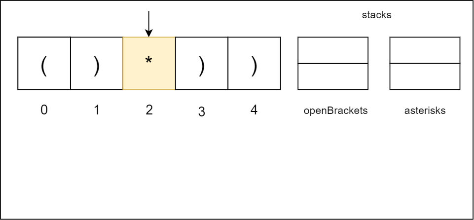

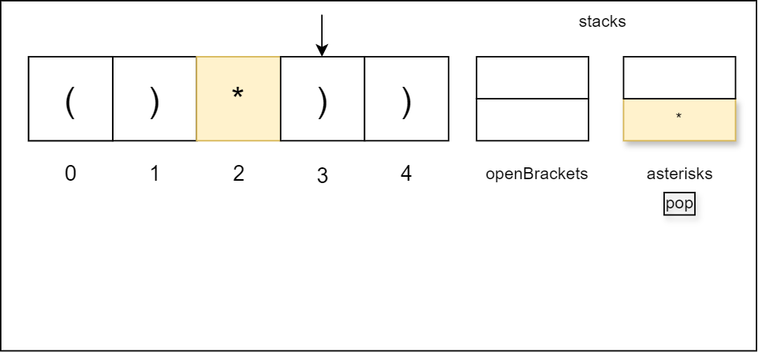

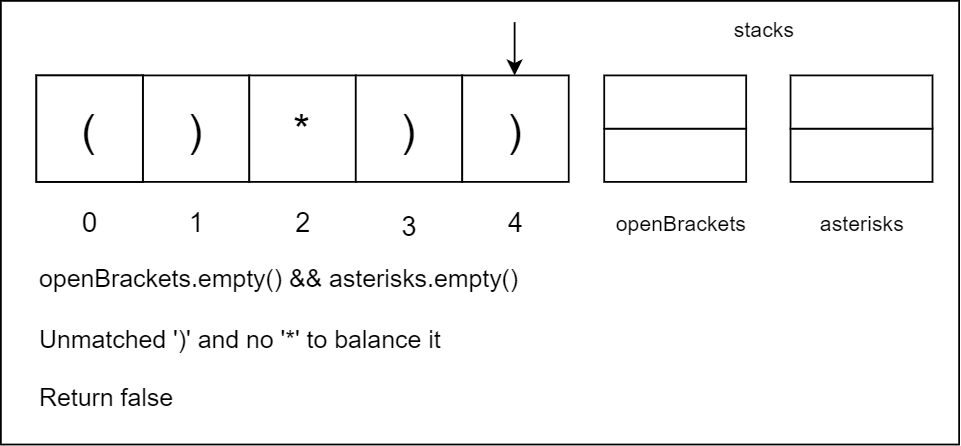

#### Algorithm

- Initialize two stacks: `openBrackets` to store indices of open brackets `'('`, and `asterisks` to store indices of asterisks `'*'`.
- Iterate through the string `s` character by character:
  - If the current character is `'('`, push its index onto the `openBrackets` stack.
  - If the current character is `'*'`, push its index onto the `asterisks` stack.
  - If the current character is `')'`:
- If `openBrackets` is not empty, pop an element from it (removing the matching open bracket).
- If `asterisks` is not empty, pop an element from `asterisks` (using an asterisk to balance the closing bracket).
- If neither an open bracket nor an asterisk is available, return false.
- After iterating through the entire string, check if any remaining open brackets and asterisks can balance each other:
  - While both `openBrackets` and `asterisks` are not empty:
- If the top element of `openBrackets` (representing an open bracket index) is greater than the top element of `asterisks` (representing an asterisk index), it means the open bracket appears after the asterisk, which cannot be balanced, so return false.
- Otherwise, pop elements from both `openBrackets` and `asterisks` stacks (matching an open bracket with an asterisk).
- If after the above step, `openBrackets` is empty, it means all open brackets have been matched or balanced, so return true. Otherwise, return false (unmatched open brackets are remaining).

#### Implementation

```python
class Solution:
    def checkValidString(self, s: str) -> bool:
        # Stacks to store indices of open brackets and asterisks
        open_brackets = []
        asterisks = []

        for i, ch in enumerate(s):
            # If current character is an open bracket, push its index onto the stack
            if ch == "(":
                open_brackets.append(i)
            # If current character is an asterisk, push its index onto the stack
            elif ch == "*":
                asterisks.append(i)
            # current character is a closing bracket ')'
            else:
                # If there are open brackets available, use them to balance the closing bracket
                if open_brackets:
                    open_brackets.pop()
                elif asterisks:
                    # If no open brackets are available, use an asterisk to balance the closing bracket
                    asterisks.pop()
                else:
                    # nnmatched ')' and no '*' to balance it.
                    return False

        # Check if there are remaining open brackets and asterisks that can balance them
        while open_brackets and asterisks:
            # If an open bracket appears after an asterisk, it cannot be balanced, return false
            if open_brackets.pop() > asterisks.pop():
                return False  # '*' before '(' which cannot be balanced.

        # If all open brackets are matched and there are no unmatched open brackets left, return true
        return not open_brackets
```

#### Complexity Analysis

Let $n$ be the length of the input string.

* Time complexity: $O(n)$

    The algorithm iterates through the entire string once, taking $O(n)$ time. Additionally, in the worst case, it may need to traverse both the `openBrackets` and `asterisks` stacks simultaneously to check for balanced parentheses, which also takes $O(n)$ time. Thus, the overall time complexity is $O(n)$.

* Space complexity: $O(n)$

    The algorithm uses two stacks, `openBrackets`, and `asterisks`, which could potentially hold up to $O(n)$ elements combined in the worst case. Additionally, there are a few extra variables and loop counters, which require constant space. Therefore, the overall space complexity is $O(n)$.

---

### Approach 4: Two Pointer

#### Intuition

The above approaches all use significant extra space to solve the problem. Let's develop an approach that uses constant space.

We can use a two-pointer greedy approach, which checks the balance between open and closed brackets from both ends of the array simultaneously, ensuring that no surplus or deficit of brackets occurs at any point during the iteration.

We initiate two pointers, one starting from the left and the other from the right of the array.

Starting from the left, we iterate through the array, counting the occurrences of open brackets `'('` and asterisks `'*'`. Whenever we encounter a closed bracket `')'`, we decrement the count of open brackets. This decrement operation mimics the process of matching an open bracket with a closed one.

Simultaneously, we traverse from the right of the array, counting the occurrences of closed brackets `')'` and asterisks `'*'`. Whenever we encounter an open bracket `'('`, we decrement the count of closed brackets. This simulates the process of matching a closed bracket with an open one.

Throughout this process, if either the count of open brackets or the count of closed brackets falls below zero (i.e., becomes negative), we immediately conclude that the sequence is invalid, as it indicates a surplus of closed brackets without corresponding open ones, or vice versa.

If neither of the counters becomes negative throughout the iteration, the sequence is valid, and we return true.

The following is an illustration demonstrating the two pointer solution:

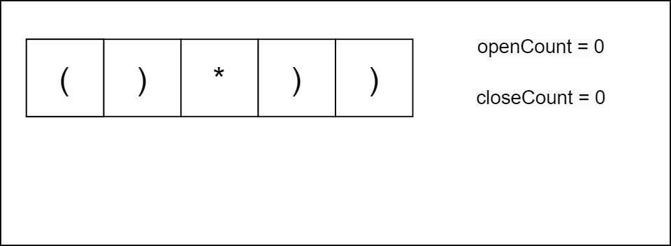

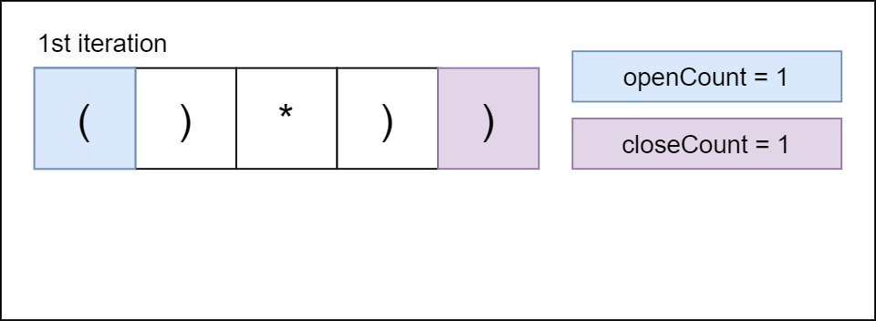

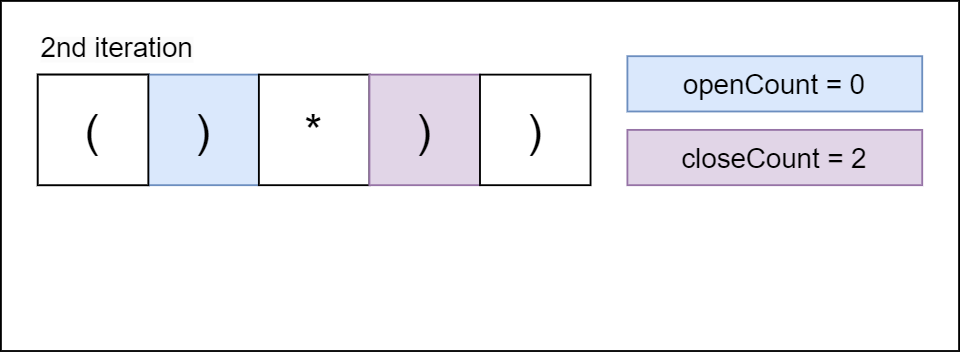

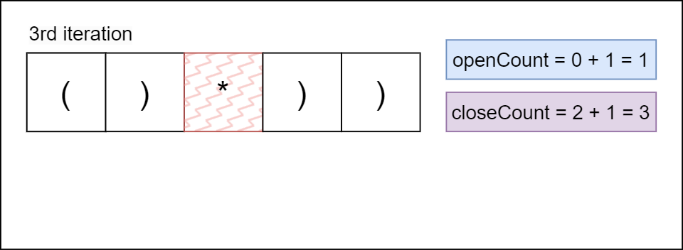

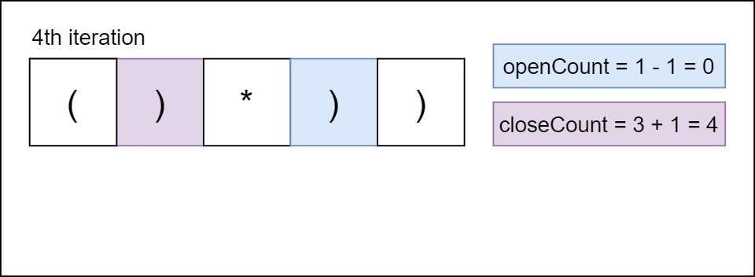

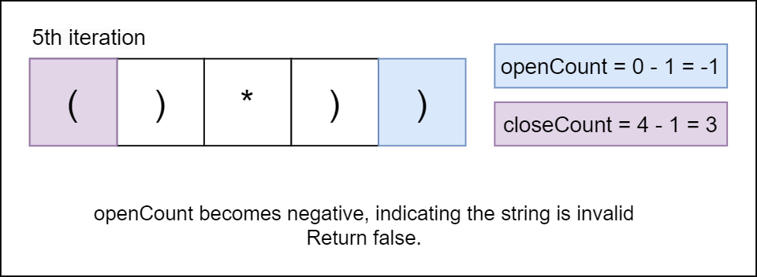

#### Algorithm

- Initialize two variables, `openCount` and `closeCount`, to keep track of the number of open and close parentheses (or asterisks) encountered so far.
- Calculate the length of the input string `s` and store it in the variable `length`.
- Traverse the string from both ends simultaneously using a single loop:
  - Iterate over the indices `i` from 0 to `length` (inclusive).
  - For each index `i`:
- If the character at index `i` is `'('` or `'*'`, increment `openCount`.
- Otherwise, decrement `openCount`.
- If the character at index $length - i$ is `')'` or `'*'`, increment `closeCount`.
- Otherwise, decrement `closeCount`.
  - If at any point during the loop, either `openCount` or `closeCount` becomes negative, it means there are more closing parentheses than open parentheses (or asterisks), which makes the string invalid. In this case, return false.
- After the loop finishes traversing the entire string without returning, `openCount` and `closeCount` are non-negative, which means that the string is valid, so return true.

#### Implementation

```python
class Solution:
    def checkValidString(self, s: str) -> bool:
        open_count = 0
        close_count = 0
        length = len(s) - 1

        # Traverse the string from both ends simultaneously
        for i in range(length + 1):
            # Count open parentheses or asterisks
            if s[i] == '(' or s[i] == '*':
                open_count += 1
            else:
                open_count -= 1

            # Count close parentheses or asterisks
            if s[length - i] == ')' or s[length - i] == '*':
                close_count += 1
            else:
                close_count -= 1

            # If at any point open count or close count goes negative, the string is invalid
            if open_count < 0 or close_count < 0:
                return False

        # If open count and close count are both non-negative, the string is valid
        return True
```

#### Complexity Analysis

Let $n$ be the length of the input string.

* Time complexity: $O(n)$

    The time complexity is $O(n)$, as we iterate through the string once.

* Space complexity: $O(1)$

    The space complexity is $O(1)$, as we use a constant amount of extra space to store the `openCount` and `closeCount` variables.

---