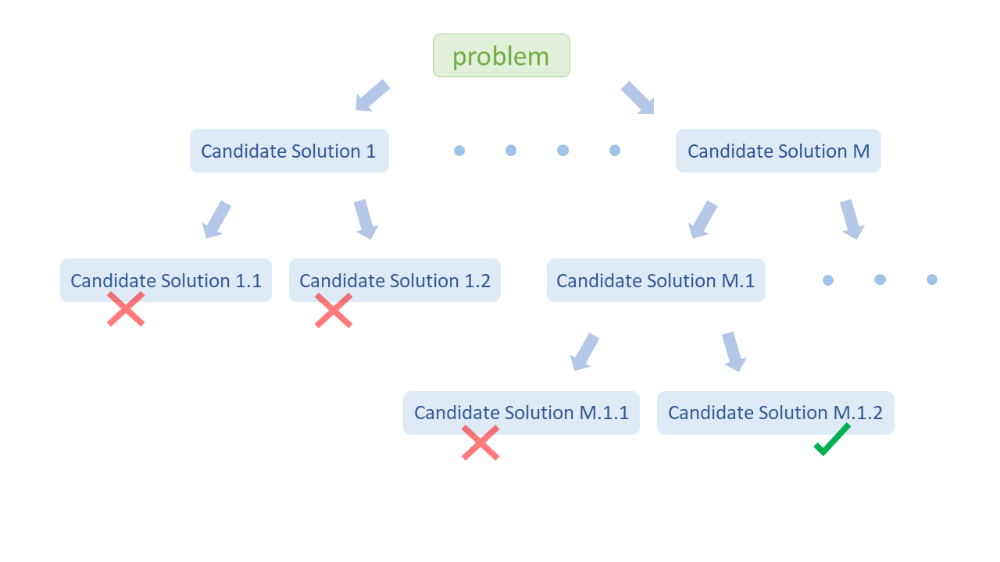
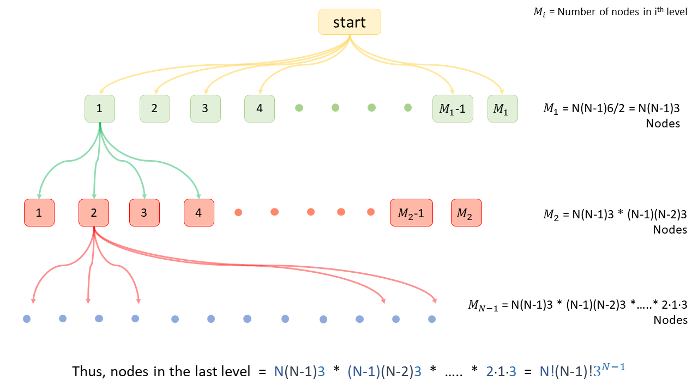

## Solution

---

### Overview

Given an array `cards` containing $4$ numbers, we have to check if there is a way to arrange these numbers in a mathematical expression using the operations `['+', '-', '*', '/']` such that the result equals $24$.

Here, the order of the numbers in the `cards` array does not matter as we have the choice to pick any number and use any operations on them.

What if we generate all the expressions using the given numbers and operators and check whether any expression evaluates to $24$?

In problems where we must generate all combinations, recursive backtracking solutions are often a good starting point. If you are not familiar with backtracking, we recommend you to check out the [Backtracking Explore Card](https://leetcode.com/explore/learn/card/recursion-ii/472/backtracking/2654/) to gain a basic understanding of how backtracking algorithms work.

</br>

---

### Approach 1: Backtracking

**Intuition**

> Backtracking can be defined as a general algorithmic technique that considers searching every possible combination to solve a computational problem. It incrementally builds candidates to the solution and abandons a candidate ("backtracks") when it determines that the candidate cannot lead to the solution.



The problem can be solved as follows:
(a) Choose any two numbers from the array and perform a mathematical operation on them. This will result in a new value.
(b) Remove the two numbers used in step (a), and replace them with the new value.
(c) Repeat steps (a) and (b) with the updated array until the array only contains one number.
(d) If this number is $24$, then we found a result. Otherwise, we **backtrack** and try selecting the numbers in a different order or using a different permutation of mathematical operations.

In other words, we will write a recursive backtracking function where we perform a mathematical operation on two numbers and then recursively perform the same operations on the rest of the numbers in the updated array and backtrack if we don't find the solution.

 <br />

Let's consider how we will build the recursive function. A recursive function consists of two parts:

**1. Base Case:**

> A base case is a simple case of the problem that we can answer directly (without using additional recursive calls). The base case is the terminating condition of the recursive search. Any recursive algorithm must have at least one base case. Without this, we would have infinite recursion.

In this approach, we will perform a mathematical operation on two numbers, remove those two numbers, and insert the new result into the array. So with each operation, we decrease the array size by one. When the array size becomes $1$, we can't perform any more operations, and this is the final result.

If the final result is $24$, return true, as we have found the solution; otherwise, return `false`.

> Note: We will be doing operations on decimal numbers so sometimes we might need to approximate the final result. For example, in cases like [3, 3, 8, 8], here the final equation will be $(8 / (3 - (8 / 3)))$ and the result we get is `23.99999999`. <br />
> This happens due to **rounding error**. Squeezing infinitely long decimal number into a finite number. For example, $8/3 = 2.66666...66$, but we represent it as `2.66666667`, thus due to these minor round offs the final result deviates form the correct result.

Thus, we choose an epsilon value, which you could consider is the acceptable error for decimal calculations.
Now, choosing what will be a correct value for epsilon is totally empirical. The deviation will be minor so even a large value like, 0.1, 0.01, etc, will be fine here.

So, instead of $(\text{array}[0] - 24 = 0)$, our base case will be:

```
if length(array) == 1:
    # If after all operations result approximates to 24, we return true.
    return abs(array[0] - 24) <= 0.1
```
<br />

**2. Recurrence Relation:**

> This is the step where we define the recursive call for the next recursion and that equation is called a recurrence relation.

In this approach, we perform a mathematical operation on any two numbers from the array, remove those numbers, push the new result in the array and call the recursion using this updated array to perform the same operations on this updated array.

While the recurrence relation is typically represented by a mathematical relation, to make it easier to read, here we will present pseudocode for the recursive function:

```
for num1 and num2 in array:
    array.remove(num1)
    array.remove(num2)

    for each operation in all_operations:
        array.insert(num1 operation num2)

        # Next Recursive Call
        # Check if using this updated array we can reach a result of 24.
        if check_if_res_reached(array):
            return true

        # Backtrack steps.
        array.remove(num1 operation num2)
    array.insert(num2)
    array.insert(num1)
```

<br />

**Algorithm**

1. Create a function `generatePossibleResults(a, b)`, which returns an array of results of all possible mathematical operations on two numbers.

2. Create a function `checkIfResultReached(list)`, to check whether we can reach the result $24$ using the current array `list`.
- First, check for base case conditions. If the array size is $1$, return $true$ if the result $24$, otherwise return $false$.
- If the array size is greater than $1$, we choose any two numbers from the $list$, perform all mathematical operations on them, create a new list with updated elements and call the recursive function again using this new list. If we don't reach the result $24$ using this new list, we **backtrack**.
- After trying all combinations, if none of them results in $24$, return $false$.

3. Call the function we created in step 2 (`checkIfResultReached`) with the initial cards list in the original problem.

**Implementation**

```python
class Solution:
    # All possible operations we can perform on two numbers.
    def generate_possible_results(self, a: float, b: float) -> List[float]:
        res = [a + b, a - b, b - a, a * b]
        if a:
            res.append(b / a)
        if b:
            res.append(a / b)
        return res

    # Check if using current list we can react result 24.
    def check_if_result_reached(self, cards: List[float]) -> bool:
        # Base Case: We have only one number left, check if it is approximately 24.
        if len(cards) == 1:
            return abs(cards[0] - 24.0) <= 0.1

        for i in range(len(cards)):
            for j in range(i + 1, len(cards)):
                # Create a new list with the remaining numbers and the new result.
                new_list = [number for k, number in enumerate(cards) if (k != i and k != j)]

                # For any two numbers in our list, we perform every operation one by one.
                for res in self.generate_possible_results(cards[i], cards[j]):
                    # Add the new result to the list.
                    new_list.append(res)

                    # Check if using this new list we can obtain the result 24.
                    if self.check_if_result_reached(new_list):
                        return True

                    # Backtrack: remove the result from the list.
                    new_list.pop()

        return False

    def judgePoint24(self, cards: List[int]) -> bool:
        return self.check_if_result_reached(cards)
```

**Complexity Analysis**

If $N$ is the number of cards in the input array.

* Time complexity: $O(N^{3} \cdot 3^{N - 1} \cdot N! \cdot (N - 1)!)$.

  - In a time-sensitive interview setting, it may be difficult to provide an exact analysis for this problem. A tighter upper bound likely exists, but the current analysis provides a reasonable upper bound for the time complexity.

  - In each recursive call, if we have $k$ elements in our array, we choose $k \cdot (k-1) / 2$ pairs of numbers and for each pair, we perform $6$ operations and for each operation, we make a recursive call.

  - With each recursive call, the array size decreases by $1$. Thus, the total number of recursive calls is:
  $N(N-1)(3) \cdot (N-1)(N-2)(3) \cdot ... \cdot (2)(1)(3)$ $= N! \cdot (N-1)! \cdot 3^{N-1}$

  

  - As the number of nodes more than doubles at every level, the total number of nodes can be approximated by the number of nodes in the last level, $N! \cdot (N-1)! \cdot 3^{N-1}$.

  - And the maximum time required for any node will be $O( \text{outer\\_two\\_for\\_loops} ) \cdot$\mathcal{O}(\text{array\_copy + inner\_for\_loop})$=$\mathcal{O}(N(N-1)$/2) \cdot$\mathcal{O}(N + 6)$= O(N^{3})$

  - So, we can say the time complexity is $O(N^{3} \cdot 3^{N - 1} \cdot N! \cdot (N - 1)!)$.

* Space complexity: $O(N^2)$.

  - At one time, we make at most $N$ recursive calls, and the recursive stack will take $O(N)$ space.

  - With each recursive call, we create a new array, and the array size decreases by $1$ with each call.

  - Thus, space used by new arrays will be $O((N-1) + (N-2) + (N-3) + .... + 2 + 1) = O(N^2)$.