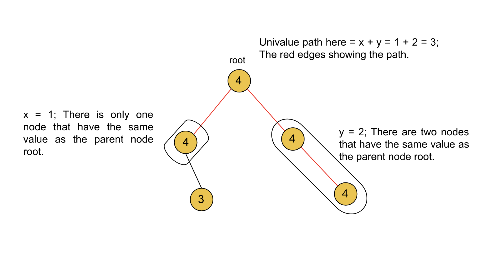
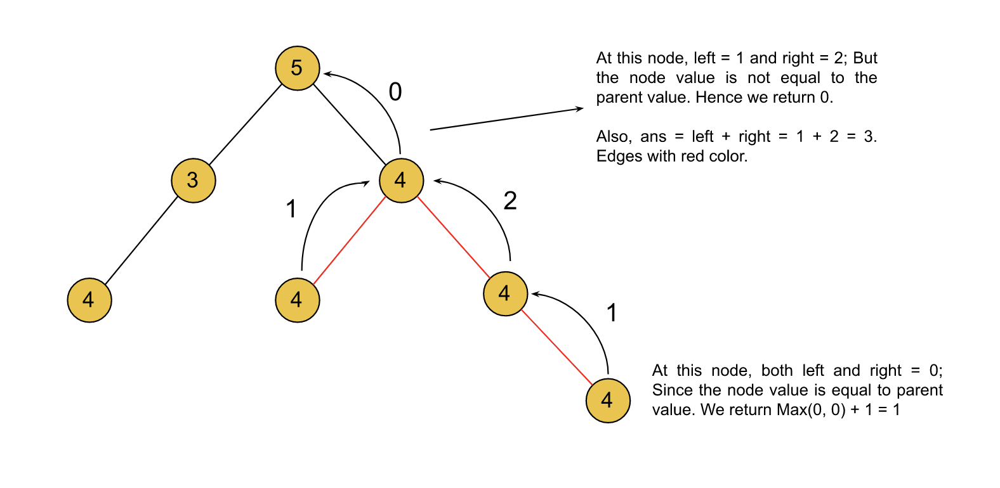

[TOC]

## Solution

---

### Approach 1: Depth-First Search

**Intuition**

We can try to solve the problem in a recursive manner, as for trees the recursive solutions are intuitive and easy to follow. Let's suppose we have a node in the binary tree, and for both the left and right child, we have the count of nodes in the path that is equal to the node's value. How can we determine the longest univalue path for this node? If the node count for the left and right child is `x` and `y` respectively, then the answer for the parent node should be $x + y$. This is because the longest path would be considering the nodes on both children starting from one child to the parent node and then to the other child.

In the image below, the univalue path for the root node will be 3, as the number of nodes on the left child path that have the same value as the root node is 1 and the number of nodes on the right child path having the same value as the root node is 2. Hence, the path will include the nodes on both left and right and thus will have a length of 3.



Now, we know that, for each left and right child path, we can find the number of nodes equal to their parent node. Then we can find the longest univalue path for the parent node. How to find the count of these nodes? As we just discussed above, if the number of nodes on the left and right child path have the same value as the node `x` and `y`, then the number of nodes that are equal to the parent node should be $max(x, y) + 1$. This is because we will consider only the longest child path, and there's an extra `1` representing the current node.

Therefore, in the recursive function, the base condition would be that if the node is null then we can return `0`. Otherwise, we will recursively call for the left and right child and store the count of nodes in the variables `left` and `right`. Update the answer variable if it's less than the univalue path at the current node which is $x + y$. Return the $max(x, y) + 1$ which is the maximum number of nodes that have the same value as `root` on either the left or right side.



**Algorithm**

1. Define the recursive function `solve()`, which accepts two arguments first the current node` root` and the second is the value of its parent node `parent`. This method returns the maximum number of consecutive nodes that are present on either the left or right side of the `root` with the same value, including the `root`.

1. If the root is `NULL`, then return `0`.
2. Recursively call `solve()` for the left and right child with the parent value as the value of `root`.
3. Update the answer variable `ans` if $left + right$ is greater than `ans`.
4. If the value of `root` is equal to the parent, return $max(left, right) + 1$, otherwise, return `0`.

2. Call `solve()` with `root` and parent value as `-1`.
3. Return the maximum univalue path length `ans`.

**Implementation**

```cpp
class Solution {
public:
    int ans;

    // Returns the length of the longest path (number of nodes) under the root
    // that have the value same as the root. The path could either be
    // on the left or right child of the root. The length includes the root as well.
    int solve(TreeNode* root, int parent) {
        if (root == NULL) {
            return 0;
        }

        int left = solve(root->left, root->val);
        int right = solve(root->right, root->val);

        //The longest univalue path will cover nodes on both sides of the root.
        ans = max(ans, left + right);

        // The number of nodes will be zero if the root value isn't equal to the root.
        // Otherwise return the max of left and right nodes plus one for the root itself.
        return root->val == parent ? max(left, right) + 1 : 0;
    }

    int longestUnivaluePath(TreeNode* root) {
        // Use -1 for the parent value for the tree root node.
        solve(root, -1);

        return ans;
    }
};
```

**Complexity Analysis**

Here, $N$ is the number of nodes in the binary tree.

* Time complexity: $O(N)$

  We are iterating over each node only once and hence the time complexity is equal to $O(N)$.

* Space complexity: $O(N)$

  The only space we need is during the recursion, the maximum number of active stack calls would be equal to the height of the tree. In the case of a skewed tree, the height of the tree will be equal to $N$, hence the space complexity is equal to $O(N)$.
  <br/>

---