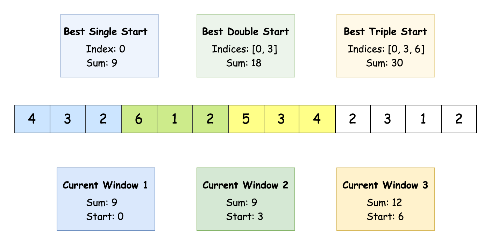
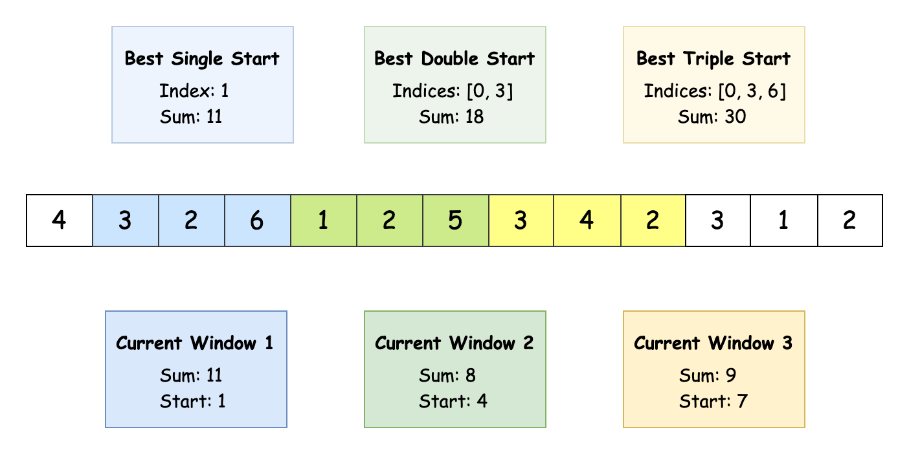
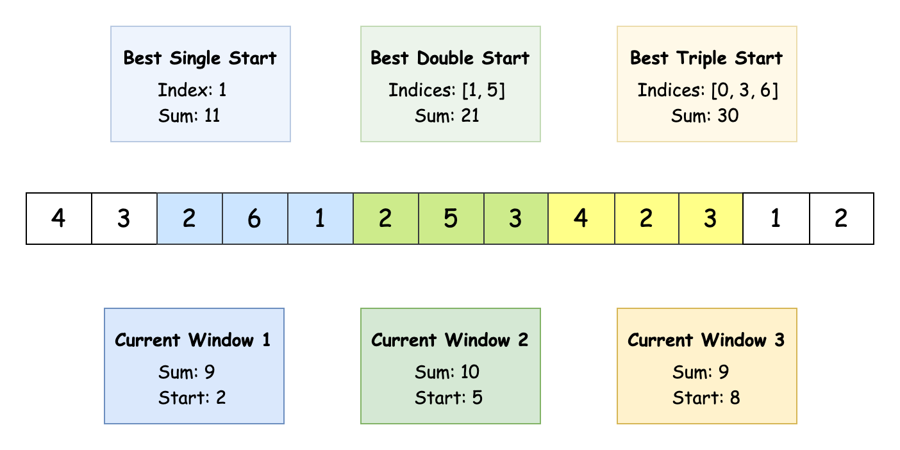
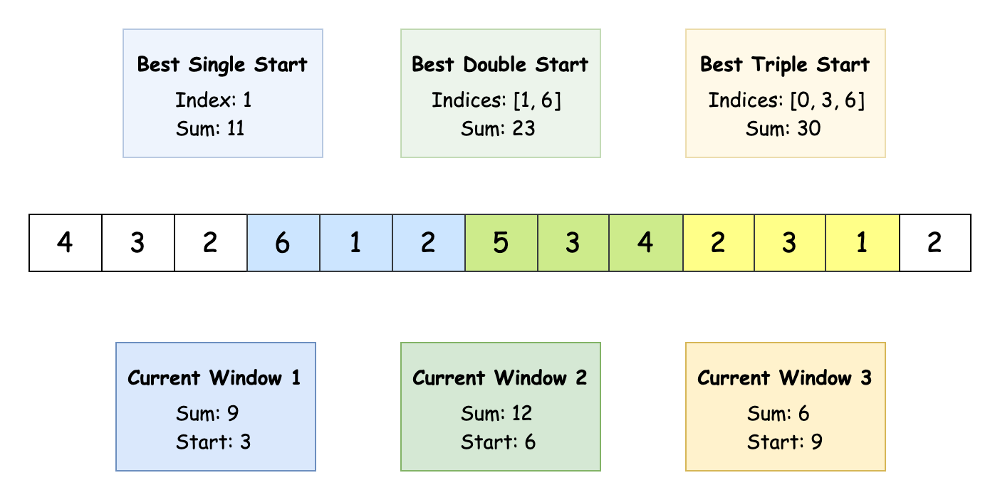
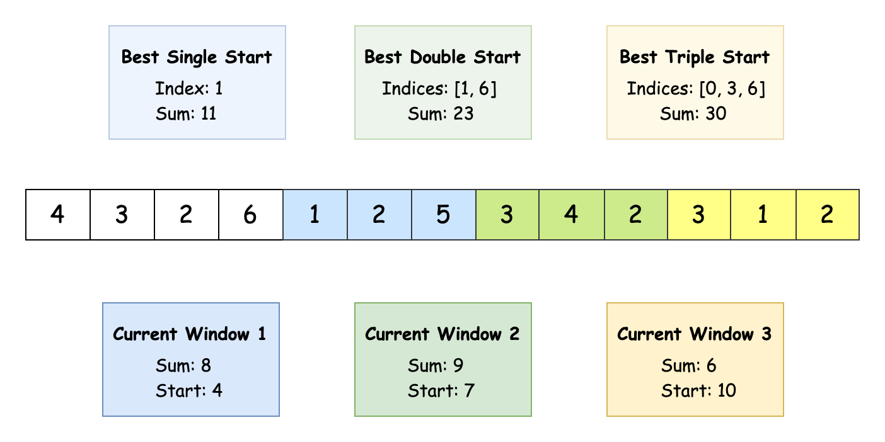

## Solution

---

### Overview

### Approach 1: Memoization

#### Intuition

At first, we might think of a greedy approach: since all array values are positive, we could just find the three largest `k`- length subarrays. Unfortunately, this doesn't always work because the subarrays might overlap and, even if we avoid overlaps, we might miss better combinations. For example, taking a smaller subarray sum early on could allow us to pick two much larger subarrays later. This is why a greedy approach fails - we need to balance between local (current subarray) and global (overall) optimization.

To find the optimal subarrays, we need to make a decision at each position in the array:
- Should we take the `k`-length subarray starting here?
- Or should we skip it and move to the next position?

This "take it or leave it" choice is typical in dynamic programming problems, similar to the 0/1 Knapsack Problem. If you are unfamiliar with the 0/1 Knapsack Problem, take a look at this excellent [LeetCode Discuss post 🔗](https://leetcode.com/discuss/study-guide/1152328/01-Knapsack-Problem-and-Dynamic-Programming#:~:text=Statement%3A%20Given%20a%20set%20of,equal%20to%20the%20knapsack's%20capacity.).

Let us try to implement a memoized recursive function which should pick three subarrays such that their total sum is as large as possible. However, it is too slow to calculate the `k`-length subarray whenever we want to pick a particular index. To optimize this, let's precalculate the sum of the `k`-length subarray starting at each index. We create an array `sums` and populate it by maintaining a window of size `k` that slides through the array, adding the new element and removing the oldest one at each step.

For our recursive function design, which returns the largest total sum after selecting the subarrays, we need to consider two base cases:
- If we’ve already selected 3 subarrays, return the current sum immediately.
- If we've reached the array's end, terminate naturally.

At each step, we have two choices:
1. Take the current subarray: Add its sum to the total and jump `k` positions forward (to avoid overlap).
2. Skip the current position: Move to the next position and continue looking for subarrays.

We take the larger of these two choices, and this forms our recurrence relation.

To keep track of these decisions and avoid recalculating results, we use a 2D array (`dp`) of size `n × 3`, where `n` is the length of the array and `3` represents the number of subarrays we need to find. Each cell in `dp` stores the best sum for a specific position and the number of remaining subarrays.

Once we’ve calculated the largest total sum using this DP table, we need to find the starting indices of the subarrays that produce this sum. This is the second phase of the solution: **path reconstruction**.

To do this, we use a Depth-First Search (DFS) to retrace the steps of the DP function. At each step, we decide whether to include the current position or skip it, and we check the `dp` table to guide our choice.
- If taking the current position gives the same or a better sum, we add its index to our result.

Since all DP states are precomputed, each DFS step is fast. After the DFS completes, the `indices` list contains the starting indices of the three non-overlapping subarrays. We return this list as our final answer.

> If you are unfamiliar with dynamic programming, check out the [Dynamic Programming Explore Card 🔗](https://leetcode.com/explore/featured/card/dynamic-programming/). This resource provides an in-depth look at the dynamic programming paradigm, explaining its key concepts and applications with a variety of problems to solidify understanding of the pattern.

#### Algorithm

- Create a variable `n` to store the number of possible starting positions for subarrays, calculated as the array length minus `k` plus 1.
- Initialize:
  - an array `sums` of size `n` to store sums of all possible `k`-length subarrays.
  - a variable `windowSum` to store the sum of the first `k` elements.
- Store the first window sum in $\text{sums}[0]$.
- Use a sliding window technique to calculate the remaining sums:
  - Subtract the leftmost element of the previous window.
  - Add the rightmost element of the current window.
  - Store the result in the corresponding position of the `sums` array.
- Initialize a 2D array `memo` of size `n x 4` to store dynamic programming states, where $\text{memo}[i][j]$ represents the largest sum possible starting from index `i` with `j` subarrays remaining.
- Initialize an empty list `indices` to store final result indices.
- Call `dp` to find the optimal sum using dynamic programming.
- Call `dfs` to reconstruct the path and find the starting indices.
- Return `indices` as the required answer.

In the `dp` function:
- Base case 1: If the remaining subarrays (`rem`) is 0, return 0 as we've found all required subarrays.
- Base case 2: If the current index (`idx`) exceeds array bounds, return -infinity if we still need subarrays, else return 0.
- Check if the current state is already computed by examining $\text{memo}[idx][rem]$. If the value is not -1, return the memoized result.
- Calculate the first choice by adding the current subarray sum ($\text{sums}[idx]$) to the result of a recursive call with:
  - Index advanced by `k` positions ($idx + k$).
  - One less subarray remaining ($rem - 1$).
- Calculate the second choice by making a recursive call with:
  - Index advanced by 1 ($idx + 1$).
  - Same number of subarrays remaining (`rem`).
- Store the larger of two choices in $\text{memo}[idx][rem]$.
- Return the stored largest value.

In the `dfs` function:
- Base case 1: If the remaining subarrays (`rem`) is `0`, return as the solution is complete.
- Base case 2: If the current index (`idx`) exceeds array bounds, return as the path is invalid.
- Calculate the largest sum possible by including the current subarray using the same parameters as in the `dp` function.
- Calculate the largest sum possible by skipping the current subarray using the same parameters as in the `dp` function.
- Compare the two possibilities:
  - If including the current subarray gives a greater or equal sum:
- Add the current index to the solution list.
- Make a recursive call with an index advanced by `k` and one less subarray remaining.
  - Otherwise:
- Make a recursive call with the next index and the same number of subarrays.

#### Implementation

```python
class Solution:
    def maxSumOfThreeSubarrays(self, nums: List[int], k: int) -> List[int]:
        # Number of possible subarray starting positions
        n = len(nums) - k + 1

        # Calculate sum of all possible k-length subarrays
        sums = [sum(nums[:k])]
        for i in range(k, len(nums)):
            sums.append(sums[-1] - nums[i - k] + nums[i])

        # memo[i][j]: max sum possible starting from index i with j subarrays remaining
        memo = [[-1] * 4 for _ in range(n)]
        indices = []

        # First find optimal sum using DP
        self._dp(sums, k, 0, 3, memo)

        # Then reconstruct the path to find indices
        self._dfs(sums, k, 0, 3, memo, indices)

        return indices

    def _dp(self, sums, k, idx, rem, memo):
        if rem == 0:
            return 0
        if idx >= len(sums):
            return float("-inf") if rem > 0 else 0

        if memo[idx][rem] != -1:
            return memo[idx][rem]

        # Try taking current subarray vs skipping it
        with_current = sums[idx] + self._dp(sums, k, idx + k, rem - 1, memo)
        skip_current = self._dp(sums, k, idx + 1, rem, memo)

        memo[idx][rem] = max(with_current, skip_current)
        return memo[idx][rem]

    def _dfs(self, sums, k, idx, rem, memo, indices):
        if rem == 0 or idx >= len(sums):
            return

        with_current = sums[idx] + self._dp(sums, k, idx + k, rem - 1, memo)
        skip_current = self._dp(sums, k, idx + 1, rem, memo)

        # Choose path that gave optimal result in DP
        if with_current >= skip_current:  # Take current subarray
            indices.append(idx)
            self._dfs(sums, k, idx + k, rem - 1, memo, indices)
        else:  # Skip current subarray
            self._dfs(sums, k, idx + 1, rem, memo, indices)
```

#### Complexity Analysis

Let $n$ be the length of the input array `nums`, $k$ be the length of each subarray and $m$ be the required number of non-overlapping subarrays.

- Time Complexity: $O(n \cdot m) \approx O(n)$

    The algorithm first computes prefix sums in $O(n)$ time using a sliding window. The `dp` function fills an $n \times (m + 1)$ memo table, where each state `(i, j)` is computed once due to memoization. The `dfs` function reconstructs the solution in $O(m)$ time by tracing the path through the `dp` table.

    Combining these, the overall time complexity is $O(n)$ for prefix sums, $O(n \cdot m)$ for DP, and $O(m)$ for DFS, resulting in $O(n \cdot m)$. With $m$ fixed at 3, this simplifies to $O(n)$.

- Space Complexity: $O(n \cdot m) \approx O(n)$

    The algorithm uses an array `sums` of size $n$ to store subarray sums and a `memo` table of size $n \times (m + 1)$, which requires $O(n \cdot m)$ space. The recursion stack depth is limited by $m$, contributing $O(m)$ to space complexity. The `indices` list stores $m$ elements.

    Thus, the space complexity is dominated by the `memo` table, resulting in $O(n \cdot m)$. With $m$ fixed at 3, this simplifies to $O(n)$.

> Note: While $m = 3$ is fixed in this problem, we've kept it as a variable in the analysis to show how the complexity would scale if `m` were different.

---

### Approach 2: Tabulation

#### Intuition

Our previous top-down dynamic programming approach had two main drawbacks: recursive overhead and complex path reconstruction. Let's develop a more efficient bottom-up approach that eliminates the need for recursive path reconstruction.

Let's shift our insight a bit: instead of thinking about "What choices do we have at each position?", we can think about "What’s the best result we can achieve with a specific number of subarrays up to each position?".

Notice that at a particular position, if we know the best possible answer for the two subarrays occurring before it, we can easily find the biggest third subarray occurring after it and complete the problem. So, we can build our answer progressively by finding the best arrangements for one subarray first, then using that information to find the best arrangements for two subarrays, and finally for three subarrays.

To make this process faster, we optimize how we calculate subarray sums by using prefix sums. A prefix sum array holds the sum of elements from the start of the array up to each position. This lets us calculate any subarray sum quickly by subtracting two values from the prefix sum array: $\text{prefixSum}[end] - \text{prefixSum}[start]$.

Now, let's build the main solution. For each index in the array, we’ll keep track of two things:
1. The best sum possible up to that index, called `bestSum`.
2. The starting index that gives us this best sum, called `bestIndex`.

We’ll calculate these values for 1, 2, and 3 subarrays. To do this, we use a `bestIndex` matrix of size $4 \times (n + 1)$, where $\text{bestIndex}[i][j]$ gives the best sum achieved up to index `j` with `i` subarrays.

We'll loop over each number of subarrays starting from 1. Inside this loop, we loop over each array position and calculate the best possible sum for that position. For each index, the best sum will be one of two options:
- Option 1: The sum we get by including a subarray that ends at this position.
- Option 2: The best sum we had up to the previous index (for the same number of subarrays).

To calculate **Option 2**, we simply retrieve the best sum from the previous index for the same subarray count from the `bestSum` array.

To calculate **Option 1**, we check the sum of the `k`-length subarray ending at the current position and add it to the best sum we could get with one less subarray, ending at the position $index - k$. This comes from the $bestSum[subarrayCount - 1][index - k]$.

If including the current subarray gives us a better sum, we update both `bestSum` and `bestIndex` to reflect this. If not, we keep the best values from the previous position. This approach also ensures that we find the lexicographically smallest result, because we only update when we find a strictly better sum.

Once the main loop is done, we'll have the best sum and the corresponding index for the three subarrays. Now, we need to figure out where each of these subarrays starts.

Starting from the end of the array, we use the `bestIndex` table to trace back the starting index for each subarray. For the third subarray, we check the starting index stored for the best sum with three subarrays. After that, we work backward to find the starting index for the second and first subarrays. Each time we find the start of a subarray, we update `currentEnd` to be the start of the subarray we just picked. This ensures there is no overlap between subarrays.

At the end of this process, we’ll have the starting indices of the three subarrays that give the largest sum.

#### Algorithm

- Initialize a variable `n` to store the length of the input array `nums`.
- Create a prefix sum array of size $n + 1$:
  - Populate the prefix sum array by iteratively adding each element to the previous sum.
- Create a 2D array:
  - `bestSum` of size $4 x (n + 1)$ to store the largest sums achievable with up to 3 subarrays ending at each position.
  - `bestIndex` of size $4 x (n + 1)$ to store starting indices of subarrays that give the best sums.
- For each possible number of subarrays `subarrayCount`:
  - For each possible ending position ($k * subarrayCount$ to `n`):
- Calculate the current sum by adding the:
      - Sum of the current window (using prefix sum).
      - Best sum achievable with one less subarray ending before the current window.
- If the current sum is greater than the best sum ending at the previous position:
      - Update `bestSum` at current position with current sum.
      - Store the starting index of the current window in `bestIndex`.
- Otherwise:
      - Copy `bestSum` and `bestIndex` from the previous position to the current position.
- Create a `result` array of size 3 to store the final starting indices.
- Initialize `currentEnd` to point to the end of the array.
- For each subarray (counting down from `3` to `1`):
  - Store the best starting index for the current subarray count in the `result` array.
  - Update `currentEnd` to point to the start of the just-placed subarray.
- Return the `result` array containing optimal starting indices.

#### Implementation

```python
class Solution:

    def maxSumOfThreeSubarrays(self, nums: List[int], k: int) -> List[int]:
        n = len(nums)

        # Prefix sum array to calculate sum of any subarray in O(1) time
        prefix_sum = [0] * (n + 1)
        for i in range(1, n + 1):
            prefix_sum[i] = prefix_sum[i - 1] + nums[i - 1]

        # Arrays to store the best sum and starting indices for up to 3 subarrays
        best_sum = [[0] * (n + 1) for _ in range(4)]
        best_index = [[0] * (n + 1) for _ in range(4)]

        # Compute the best sum and indices for 1, 2, and 3 subarrays
        for t in range(1, 4):
            for i in range(k * t, n + 1):
                current_sum = (
                    prefix_sum[i] - prefix_sum[i - k] + best_sum[t - 1][i - k]
                )

                # Check if the current configuration gives a better sum
                if current_sum > best_sum[t][i - 1]:
                    best_sum[t][i] = current_sum
                    best_index[t][i] = i - k
                else:
                    best_sum[t][i] = best_sum[t][i - 1]
                    best_index[t][i] = best_index[t][i - 1]

        # Trace back the indices of the three subarrays
        result = [0] * 3
        end = n
        for t in range(3, 0, -1):
            result[t - 1] = best_index[t][end]
            end = result[t - 1]

        return result
```

#### Complexity Analysis

Let $n$ be the length of the input array `nums`, $k$ be the length of each subarray and $m$ be the required number of non-overlapping subarrays.

- Time complexity: $O(n \cdot m) \approx O(n)$

    The algorithm first computes prefix sums in $O(n)$ time by traversing the array once. For each $t$ from $1$ to $m$, it iterates from position $k \cdot t$ to $n$, performing constant-time operations at each step. This results in $O(n \cdot m)$ operations due to the nested loops - $m$ outer iterations and approximately $n$ inner iterations. The final backtracking step takes $O(m)$ time. Thus, the overall time complexity is $O(n \cdot m)$. With $m = 3$, this simplifies to $O(n)$.

- Space complexity: $O(n \cdot m) \approx O(n)$

    The algorithm uses a prefix sum array of size $n + 1$ to store cumulative sums. It also maintains two 2D arrays `bestSum` and `bestIndex`, each of size $(m + 1) \times (n + 1)$, resulting in $O(n \times m)$ space. The `result` array uses $O(m)$ space. Therefore, the total space complexity is $O(n \times m)$. Since $m = 3$ in this problem, this reduces to $O(n)$.

> Note: While $m = 3$ is fixed in this problem, we've kept it as a variable in the analysis to show how the complexity would scale if `m` were different.

---

### Approach 3: Three Pointers

#### Intuition

In the previous two approaches, we focused on finding the best solution for any number of non-overlapping subarrays. However, since our problem only requires finding 3 subarrays, we can use this fact to simplify our approach.

We can break the problem into three parts by **fixing the position of the middle subarray** first. This divides the array into three regions:
1. The left region (before the middle subarray), where we need to find the best left subarray.
2. The middle subarray itself.
3. The right region (after the middle subarray), where we need to find the best right subarray.

For each possible position of the middle subarray, we can then find the best subarrays in the left and right regions. The highest sum across all possible middle subarray positions will give us the final answer.

However, we need to optimize the way we calculate each subarray on either side while also maintaining information about their starting positions. In previous approaches, we used a prefix sum to precompute subarray sums. We'll now extend that idea further to also precompute the starting positions of the best subarray sums for each index in the array.

To implement this concept, we will create two arrays, `leftMaxIndex` and `rightMaxIndex`, to help us track the best subarrays for each segment.

The $\text{leftMaxIndex}[i]$ array will store the starting index of the best subarray sum that ends at index `i`. To calculate this value, we compare the sum of the `k`-length subarray ending at `i` with the best sum we've found to the left of `i`. If the sum before is equal to the sum at index `i`, we prefer the earlier subarray, as we want the lexicographically smallest index. Similarly, we will build the `rightMaxIndex` array, where $\text{rightMaxIndex}[i]$ will store the starting index of the best subarray sum starting at or after index `i`.

In the main loop, we will consider `k`-length subarrays starting from each index in the `nums` array. For each subarray, we will look up the corresponding `leftMaxIndex` and `rightMaxIndex` values, calculate the sum for these subarrays, and store the starting indices of the subarrays that give us the largest sum.

#### Algorithm

- Initialize variables:
  - `n` to store the length of input array nums.
  - `maxSum` to store the largest sum possible with three non-overlapping subarrays.
- Create a prefix sum array of size $n + 1$ to enable quick calculation of subarray sums.
- Populate the prefix sum array by iteratively adding each element to the previous sum.
- Create arrays `leftMaxIndex` and `rightMaxIndex` to store the best starting index for the left and right subarrays. respectively at each position.
- Create a `result` array of size 3 to store the final starting indices.
- Iterate from position `k` to $n - 1$ to find the best left subarray for each position:
  - Calculate the current subarray sum using prefix sum array.
  - If current subarray sum is greater than the largest sum we have seen so far:
- Update `leftMaxIndex` at current position with the starting index of current subarray.
- Update the largest sum seen so far.
  - Otherwise:
- Copy the previous best index to current position.
- Set the rightmost possible position as initial best right subarray position.
- Iterate from position $n - k - 1$ to `0` to find the best right subarray for each position:
  - Calculate the current subarray sum using prefix sum array.
  - If current subarray sum is greater than or equal to the largest sum seen so far:
- Update `rightMaxIndex` at current position with the starting index of current subarray.
- Update the largest sum seen so far.
  - Otherwise:
- Copy the next position's best index to current position.
- Iterate over all possible middle subarray positions from `k` to $n - 2*k$:
  - Get the best left subarray index before current position.
  - Get the best right subarray index after current position plus `k`.
  - Calculate total sum of all three subarrays using prefix sum array.
  - If total sum is greater than `maxSum`:
- Update `maxSum` with the new largest sum.
- Store the three starting indices in the `result` array.
- Return the `result` array containing the three optimal starting indices.

#### Implementation

```python
class Solution:
    def maxSumOfThreeSubarrays(self, nums: List[int], k: int) -> List[int]:
        n = len(nums)
        max_sum = 0

        # Create prefix sum array using accumulate
        prefix_sum = [0] + list(accumulate(nums))

        # Initialize arrays for best indices
        left_max_idx = [0] * n
        right_max_idx = [0] * n
        result = [0] * 3

        # Calculate best left subarray positions
        curr_max_sum = prefix_sum[k] - prefix_sum[0]
        for i in range(k, n):
            curr_sum = prefix_sum[i + 1] - prefix_sum[i + 1 - k]
            if curr_sum > curr_max_sum:
                left_max_idx[i] = i + 1 - k
                curr_max_sum = curr_sum
            else:
                left_max_idx[i] = left_max_idx[i - 1]

        # Calculate best right subarray positions
        right_max_idx[n - k] = n - k
        curr_max_sum = prefix_sum[n] - prefix_sum[n - k]
        for i in range(n - k - 1, -1, -1):
            curr_sum = prefix_sum[i + k] - prefix_sum[i]
            if curr_sum >= curr_max_sum:
                right_max_idx[i] = i
                curr_max_sum = curr_sum
            else:
                right_max_idx[i] = right_max_idx[i + 1]

        # Find optimal middle position
        for i in range(k, n - 2 * k + 1):
            left_idx = left_max_idx[i - 1]
            right_idx = right_max_idx[i + k]
            total_sum = (
                prefix_sum[i + k]
- prefix_sum[i]
                + prefix_sum[left_idx + k]
- prefix_sum[left_idx]
                + prefix_sum[right_idx + k]
- prefix_sum[right_idx]
            )

            if total_sum > max_sum:
                max_sum = total_sum
                result = [left_idx, i, right_idx]

        return result
```

#### Complexity Analysis

Let $n$ be the length of the input array `nums`.

- Time complexity: $O(n)$

    The algorithm performs four linear scans. The first scan builds the prefix sum array in $O(n)$ time. The second builds the `leftMaxIndex` array from left to right in $O(n)$. The third scan builds the `rightMaxIndex` array from right to left, also in $O(n)$. The final scan finds the optimal middle position in $O(n)$. Since each operation is a sequential linear scan, the overall time complexity is $O(n)$.

- Space complexity: $O(n)$

    The algorithm uses three arrays of size proportional to the input length: the prefix sum array of size $n+1$, a `leftMaxIndex` array of size $n$, and a `rightMaxIndex` array of size $n$. Since all auxiliary space usage grow linearly with the input size, the total space complexity is $O(n)$.

---

### Approach 4: Sliding Window

#### Intuition

In Approach 2, we built up the solution incrementally: the best two subarrays were derived from the best single subarray, and the best three subarrays were built from the best two. We can extend this concept to create a more optimized solution that doesn’t require storing all possible sums — just the best ones at each step.

Imagine a train with three cars, each of length `k`, moving along a track (our array). The cars must maintain their order and can't overlap:

```
Initial position:
[Car1][Car2][Car3]------------------
 0    k     2k

After one move:
-[Car1][Car2][Car3]-----------------
 1    k+1   2k+1

And so on...
```
Each car calculates the sum of the numbers it covers. At each position, Car1 finds the best single-window sum seen so far, Car2 combines its current sum with the best sum from Car1, and Car3 combines its current sum with the best combined sum from Cars 1 and 2.

The main idea in this approach is that we don’t need to try every possible combination of subarrays. Instead, by keeping track of the best results so far at each level - for one subarray, two subarrays, and three subarrays - we can build the solution incrementally. When we reach the end of the `nums` array, the best result for three subarrays will be our final answer.

We'll first need to set up three sliding windows. We only need to keep track of their starting points, which will be `0`, `k`, and `2*k` respectively. This ensures that the windows never overlap. We'll calculate the sums of the subarrays within these windows and store them in three variables:
1. `bestSingleSum` — The best sum for a single subarray.
2. `bestDoubleSum` — The best sum for two non-overlapping subarrays.
3. `bestTripleSum` — The best sum for three non-overlapping subarrays.

As the windows slide forward over the array, we update the current sums by subtracting the element that moves out of the window and adding the new element that enters. At each step, we update the “best seen so far” sums in sequence: first `bestSingleSum`, then `bestDoubleSum`, and finally `bestTripleSum`.

Along with updating the sums, we also track the starting indices for these best subarrays, so by the end of the loop, the indices corresponding to `bestTripleSum` will represent the solution. We return these indices as the final result.

The slideshow below demonstrates the algorithm in action (Consider $k = 3$):











#### Algorithm

- Initialize:
  - a variable `bestSingleStart` to store the starting index of the best single subarray.
  - an array `bestDoubleStart` to store the starting indices of the best two subarrays.
  - an array `bestTripleStart` to store the starting indices of the best three subarrays.
- Create a variable `currentWindowSumSingle` to store the sum of the first `k` elements.
  - Calculate `currentWindowSumSingle` by adding the first `k` elements from the input array.
- Create a variable `currentWindowSumDouble` to store the sum of the second window of `k` elements.
  - Calculate `currentWindowSumDouble` by adding elements from index `k` to $2*k - 1$.
- Create a variable `currentWindowSumTriple` to store the sum of the third window of `k` elements.
  - Calculate `currentWindowSumTriple` by adding elements from index `2*k` to $3*k - 1$.
- Initialize variables `bestSingleSum`, `bestDoubleSum` and `bestTripleSum` to store the largest sum achieved with one, two, and three subarrays, respectively.
- Initialize three sliding window pointers: `singleStartIndex` at `1`, `doubleStartIndex` at $k + 1$, and `tripleStartIndex` at $2*k + 1$.
- While `tripleStartIndex` is less than or equal to array length minus `k`:
  - Update `currentWindowSumSingle`, `currentWindowSumDouble`, and `currentWindowSumTriple` by removing the leftmost element and adding the new rightmost element.
  - If current `currentWindowSumSingle` is greater than `bestSingleSum`:
- Update `bestSingleStart` to current `singleStartIndex`.
- Update `bestSingleSum` to current `currentWindowSumSingle`.
  - If the sum of current `currentWindowSumDouble` and `bestSingleSum` is greater than `bestDoubleSum`:
- Update `bestDoubleStart` with `bestSingleStart` and current `doubleStartIndex`.
- Update `bestDoubleSum` with the new largest sum.
  - If the sum of current `currentWindowSumTriple` and `bestDoubleSum` is greater than `bestTripleSum`:
- Update `bestTripleStart` with `bestDoubleStart` and current `tripleStartIndex`.
- Update `bestTripleSum` with the new largest sum.
  - Increment all three sliding window pointers.
- Return `bestTripleStart` containing the optimal starting indices.

#### Implementation

```python
class Solution:
    def maxSumOfThreeSubarrays(self, nums: List[int], k: int) -> List[int]:
        # Variables to track the best indices for one, two, and three subarray configurations
        best_single_start = 0
        best_double_start = [0, k]
        best_triple_start = [0, k, k * 2]

        # Compute the initial sums for the first three subarrays
        current_window_sum_single = sum(nums[:k])
        current_window_sum_double = sum(nums[k : k * 2])
        current_window_sum_triple = sum(nums[k * 2 : k * 3])

        # Track the best sums found so far
        best_single_sum = current_window_sum_single
        best_double_sum = current_window_sum_single + current_window_sum_double
        best_triple_sum = (
            current_window_sum_single
            + current_window_sum_double
            + current_window_sum_triple
        )

        # Sliding window pointers for the subarrays
        single_start_index = 1
        double_start_index = k + 1
        triple_start_index = k * 2 + 1

        # Slide the windows across the array
        while triple_start_index <= len(nums) - k:
            # Update the sums using the sliding window technique
            current_window_sum_single = (
                current_window_sum_single
- nums[single_start_index - 1]
                + nums[single_start_index + k - 1]
            )
            current_window_sum_double = (
                current_window_sum_double
- nums[double_start_index - 1]
                + nums[double_start_index + k - 1]
            )
            current_window_sum_triple = (
                current_window_sum_triple
- nums[triple_start_index - 1]
                + nums[triple_start_index + k - 1]
            )

            # Update the best single subarray start index if a better sum is found
            if current_window_sum_single > best_single_sum:
                best_single_start = single_start_index
                best_single_sum = current_window_sum_single

            # Update the best double subarray start indices if a better sum is found
            if current_window_sum_double + best_single_sum > best_double_sum:
                best_double_start[0] = best_single_start
                best_double_start[1] = double_start_index
                best_double_sum = current_window_sum_double + best_single_sum

            # Update the best triple subarray start indices if a better sum is found
            if current_window_sum_triple + best_double_sum > best_triple_sum:
                best_triple_start[0] = best_double_start[0]
                best_triple_start[1] = best_double_start[1]
                best_triple_start[2] = triple_start_index
                best_triple_sum = current_window_sum_triple + best_double_sum

            # Move the sliding windows forward
            single_start_index += 1
            double_start_index += 1
            triple_start_index += 1

        # Return the starting indices of the three subarrays with the maximum sum
        return best_triple_start
```

#### Complexity Analysis

Let $n$ be the length of the input array `nums`.

- Time complexity: $O(n + k)$

    The algorithm computes three initial window sums, each taking $O(k)$. It then processes the array with three sliding windows, requiring $O(n)$. Since all operations are constant-time during the single pass, the total time complexity is $O(n + k)$.

- Space complexity: $O(1)$

    The algorithm uses a constant amount of extra space regardless of input size. It maintains three arrays of fixed sizes (`bestDoubleStart` of size $2$ and `bestTripleStart` of size $3$) and several single variables. Since none of these space requirements grow with the input size, the space complexity is $O(1)$.

---