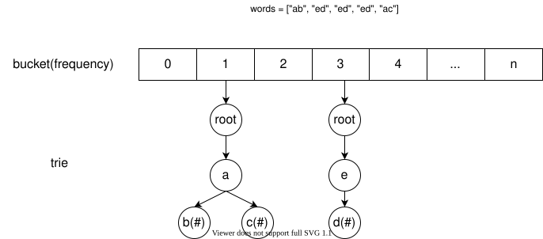

## Solution

### Overview

At first glance, this problem is very similar to [347. Top K Frequent Elements](https://leetcode.com/problems/top-k-frequent-elements/), except for some subtle differences:

1. The input is a list of **strings**, not **int values**.
2. Require to return a **sorted** list of strings, not **in any order**.
3. The frequency of a word is not guaranteed to be **unique**, so you have to break a tie when they have an identical frequency.

The detailed approaches to find out *$k$ most frequent elements* are given in the [solution](https://leetcode.com/problems/top-k-frequent-elements/solution/) to 347, so we only give a brief description of those approaches here. Based on 347, the primary challenge to solving this problem is to figure out a proper data structure and algorithm to give a **lexicographically smaller string** when breaking a tie in frequency and returning the list in the correct order. In the following approaches, we will start from the most naive approach and discuss how to utilize some complicated data structures, e.g., heap and trie, to reduce the complexity step by step.

### Approach 1: Brute Force

#### Intuition

As we need the most frequent `k` words, to find which words are of higher frequencies, we just need to sort all words by their frequencies and return the first k words. Notice that the sorting order is first by frequencies and then lexicographically.

#### Algorithm

According to the requirement of the problem, we

1. Count the frequency of each word and store the records by a HashMap `cnt`.
2. Define the sorting order as what the problem indicates (by frequencies from high to low, and then from lexicographically smaller ones to larger ones when we meet a tie-in frequency) and sort the entire list of all words.
3. Only return the first k words as the returned result.

#### Implementation

```python
from collections import Counter

class Solution:
    def topKFrequent(self, words: List[str], k: int) -> List[str]:
        cnt = Counter(words)
        return sorted(list(cnt.keys()), key=lambda x: (-cnt[x], x))[:k]
```

#### Complexity Analysis

let $N$ be the length of `words`.

* Time Complexity: $O(N \log{N})$. We count the frequency of each word in $O(N)$ time, and then we sort the given words in $O(N \log{N})$ time.

* Space Complexity: $O(N)$, the space used to store frequencies in a HashMap and return a slice from a sorted list of length $O(N)$.

---

### Approach 2: Max Heap

#### Intuition

If we put all numbers into a max heap, the top element of the heap must be the max value of all numbers in the heap. So instead of sorting all unique words, we only need to pop the word with the max frequency from a max heap `k` times.

#### Algorithm

1. Count the frequency of each word like Approach 1.
2. Heapify: make the list of words as a max heap `h` by their frequencies, in which the top element has the max frequency and lexicographically in all words with the same frequency.
3. Pop the top element from the max heap `h` totally `k` times, and then the words you get are already in the correct order.

#### Implementation

```python
from collections import Counter
from heapq import heapify, heappop

class Solution:
    def topKFrequent(self, words: List[str], k: int) -> List[str]:
        cnt = Counter(words)
        heap = [(-freq, word) for word, freq in cnt.items()]
        heapify(heap)

        return [heappop(heap)[1] for _ in range(k)]
```

#### Complexity Analysis

Let $N$ be the length of `words`.

* Time Complexity: $O(N + k\log{N})$. We count the frequency of each word in $O(N)$ time and then heapify the list of unique words in $O(N)$ time. Each time we pop the top from the heap, it costs $\log{N}$ time as the size of the heap is $O(N)$.

* Space Complexity: $O(N)$, the space used to store our counter `cnt` and heap `h`.

---

### Approach 3: Min Heap

#### Intuition

Approach 2 looks perfect when the given input is offline, i.e., no new unique words will be added later. For those top-k elements problems that may have dynamically added elements, we often solve them by maintaining a min heap of size `k` to store the largest `k` elements so far. Every time we enumerate a new element, just compare it with the top of the min heap and check if it is one of the largest k elements.

#### Algorithm

It's almost the same idea as [Approach 1 in solution to 347](https://leetcode.com/problems/top-k-frequent-elements/solution/), except that:

1. We need to be careful with the order, considering not only the frequency but the word lexicographically.
2. The min heap doesn't guarantee the order. We need to sort the elements in the heap before returning them or just pop them one by one from the min-heap to our result in order.

#### Implementation

```python
from collections import Counter
from heapq import heappush, heappop

class Pair:
    def __init__(self, word, freq):
        self.word = word
        self.freq = freq

    def __lt__(self, p):
        return self.freq < p.freq or (self.freq == p.freq and self.word > p.word)

class Solution:
    def topKFrequent(self, words: List[str], k: int) -> List[str]:
        cnt = Counter(words)
        h = []
        for word, freq in cnt.items():
            heappush(h, Pair(word, freq))
            if len(h) > k:
                heappop(h)
        return [p.word for p in sorted(h, reverse=True)]
```

#### Complexity Analysis

* Time Complexity: $O(N\log{k})$, where $N$ is the length of `words`. We count the frequency of each word in $O(N)$ time, then we add $N$ words to the heap, each in $O(\log {k})$ time. Finally, we pop from the heap up to $k$ times or just sort all elements in the heap as the returned result, which takes $O(k\log{k})$. As $k \le N$, $O(N) +$\mathcal{O}(N\\log{k})$+$\mathcal{O}(k\\log{k})$= O(N\log{k})$

* Space Complexity: $O(N)$, $O(N)$ space is used to store our counter `cnt` while $O(k)$ space is for the heap.

---

### Approach 4: Bucket Sorting + Trie

#### Intuition

Since we need at least $k\log{k}$ time to sort k elements by comparison (for more about sorting, see [this explore card](https://leetcode.com/explore/learn/card/sorting/693/introduction/)), we have to turn to non-comparison sorting such as bucket/counting sorting to determine potential k elements with max frequencies.

For the words with the same frequency, we store them together in a trie (for more about trie, see[this explore card](https://leetcode.com/explore/learn/card/trie/)). By traversing a trie in a pre-order DFS way, we can get all words in the trie in a lexicographical order.

For example, if we have `words` as

```
words = ["ab", "ed", "ed", "ed", "ac"]
```

`"ab"` and `"ac"` only occur once, but `"ed"` occurs three times. We build the following bucket and tries:



`#` marks the node in a trie as a leaf in the graph above. We build a trie in bucket 1 to store the word `"ab"` and `"ac"`, and another trie in bucket 3 to store the word `"ed"`. Then we start from `n=5` to 1, and enumerate every bucket: if there is a non-empty trie in this bucket, we read words in the trie by traversing every path lexicographically. For example, when we traverse the trie in bucket 1, we first go to `a` and then go to `b`, as `b` is a leaf node, we now get a complete word along this path as `"ab"`. Similarly, we will traverse all tries and get the result `["ed", "ab", "ac"].`

#### Algorithm

We use counting sorting, a special bucket sorting with a bucket size of 1, to

1. Count the frequency of each word as what we did in all previous approaches, and get a counter `cnt`.
2. Initialize `bucket` of length `N+1` (`N` is the length of `words`) with an empty trie in each bucket, that is, the trie in $\text{bucket}[i]$ stores all words with frequency `i`.
3. Enumerate words in `cnt`, and add each word to the trie mapping to its frequency.
4. Enumerate all frequencies `i` in from `N` to `1`, traverse every $\text{bucket}[i]$ to get all words within it from lexicographically smaller ones to the larger ones, and add the obtained words to the result until `k` words are obtained in the result. Then, this is our final result.

#### Implementation

```python
from collections import Counter

class Solution:
    def topKFrequent(self, words: List[str], k: int) -> List[str]:
        n = len(words)
        cnt = Counter(words)
        bucket = [{} for _ in range(n+1)]
        self.k = k

        def add_word(trie: Mapping, word: str) -> None:
            root = trie
            for c in word:
                if c not in root:
                    root[c] = {}
                root = root[c]
            root['#'] = {}

        def get_words(trie: Mapping, prefix: str) -> List[str]:
            if self.k == 0:
                return []
            res = []
            if '#' in trie:
                self.k -= 1
                res.append(prefix)
            for i in range(26):
                c = chr(ord('a') + i)
                if c in trie:
                    res += get_words(trie[c], prefix+c)
            return res

        for word, freq in cnt.items():
            add_word(bucket[freq], word)

        res = []
        for i in range(n, 0, -1):
            if self.k == 0:
                return res
            if bucket[i]:
                res += get_words(bucket[i], '')
        return res
```

#### Complexity Analysis

Let $N$ be the length of `words`.

* Time Complexity: $O(N)$. We take $O(N)$ time to count frequencies and enumerate all buckets. Since we only need to get $k$ words from tries, we traverse $k$ paths in tries, and each path is neglectable in length ($\le 10$), $O(k)$ time is required to generate all those words from tries. Besides, it takes $O(N)$ time to put $N$ words in tries. As $k \le N$, $O(N+k) = O(N)$
* Space Complexity: $O(N)$, like other approaches, our counter `cnt` needs $O(N)$ space. Besides, tries to store at most $N$ words also needs $O(n)$ space.

> Note: Though we optimize the time complexity to $O(N)$, it may run slower than previous approaches due to the large constant factors.