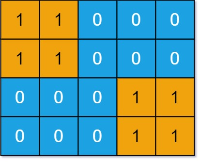
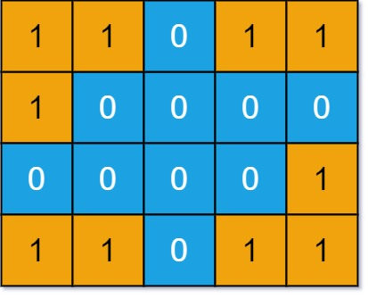

## Description

You are given an `m x n` binary matrix `grid`. An island is a group of `1`'s (representing land) connected **4-directionally** (horizontal or vertical.) You may assume all four edges of the grid are surrounded by water.

An island is considered to be the same as another if and only if one island can be translated (and not rotated or reflected) to equal the other.

Return *the number of **distinct** islands*.
### Function Contract

$solve(grid: list[\text{list}[int]]) -> int$

**Inputs**

- `grid`: an $m \times n$ binary matrix whose `1` cells are land and whose `0` cells are water.

**Return value**

Return the number of island shape classes under translation alone. Horizontal and vertical contact joins land; rotation and reflection do not make two shapes equivalent.

### Examples

#### Example 1

- **Input:** `grid = [[1,1,0,0,0],[1,1,0,0,0],[0,0,0,1,1],[0,0,0,1,1]]`
- **Output:** `1`
#### Example 2

- **Input:** `grid = [[1,1,0,1,1],[1,0,0,0,0],[0,0,0,0,1],[1,1,0,1,1]]`
- **Output:** `3`
### Constraints

- $m = \text{grid.length}$

- $n = \text{grid}[i].length$

- $1 \le m, n \le 50$

- $\text{grid}[i][j]$ is either `0` or `1`.