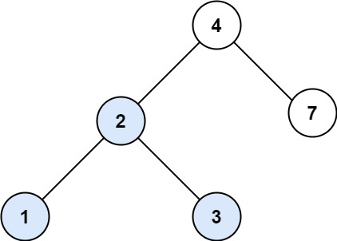

## Description

You are given the `root` of a binary search tree (BST) and an integer `val`.

Find the node in the BST that the node's value equals `val` and return the subtree rooted with that node. If such a node does not exist, return `null`.
### Function Contract

- `n`: Input parameter.
- Returns expected result.

### Examples

#### Example 1

- **Input:** `root = [4,2,7,1,3], val = 2`
- **Output:** `[2,1,3]`
#### Example 2

- **Input:** `root = [4,2,7,1,3], val = 5`
- **Output:** `[]`
### Constraints

- The number of nodes in the tree is in the range `[1, 5000]`.

- $1 \le \text{Node.val} \le 10^{7}$

- `root` is a binary search tree.

- $1 \le val \le 10^{7}$