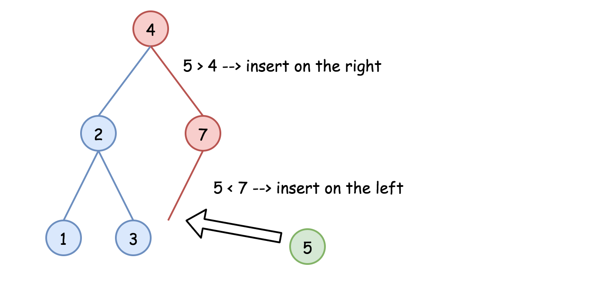
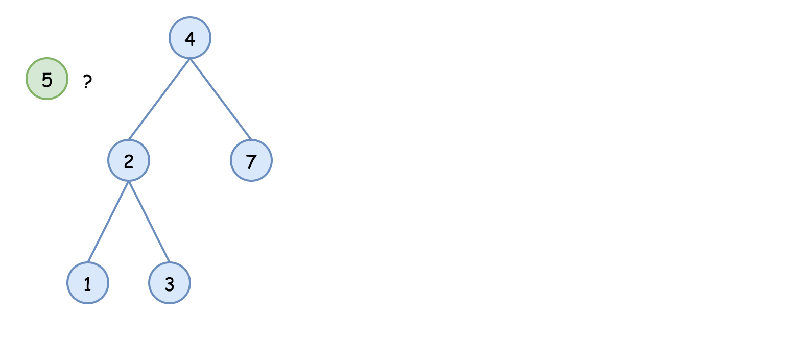
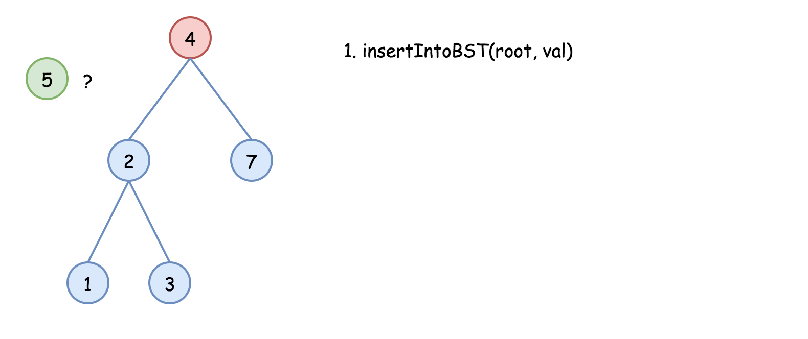
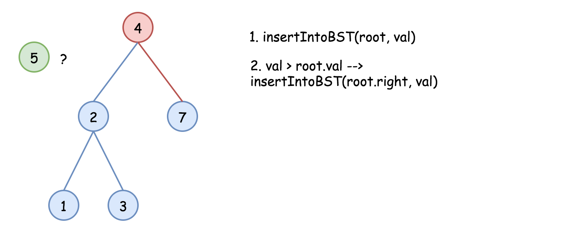
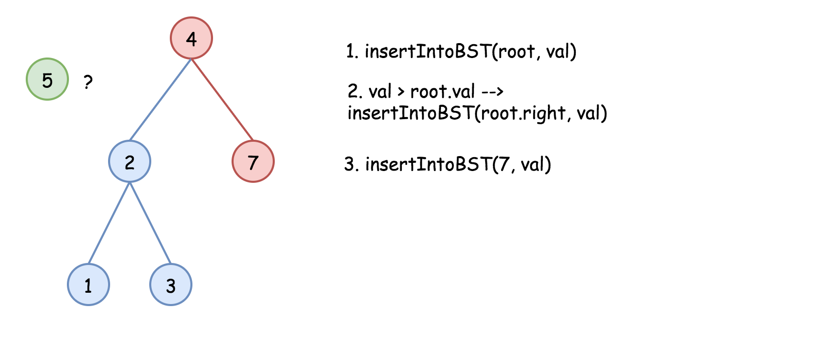
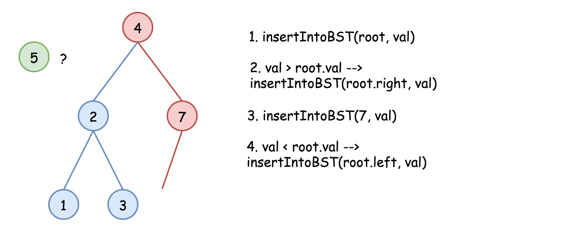
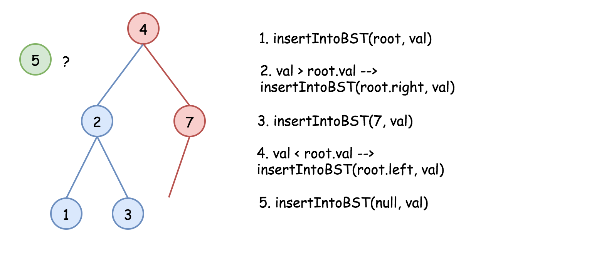
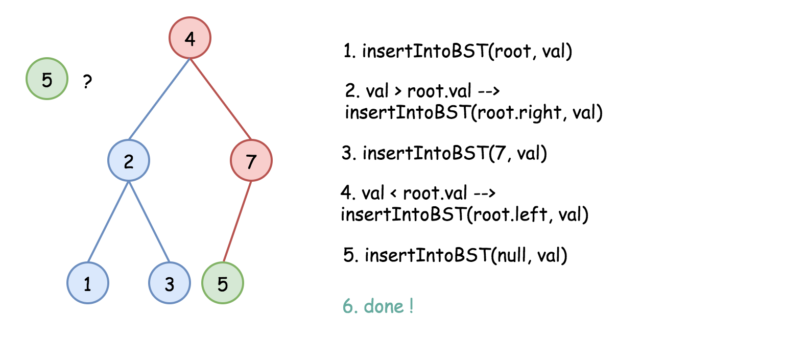

[TOC]

## Solution

---

#### Intuition

One of the huge BST advantages is a [search](https://leetcode.com/problems/search-in-a-binary-search-tree/) for _arbitrary_ element in $\mathcal{O}(\log N)$ time. Here we'll see that the insert time is $\mathcal{O}(\log N)$, too, in the average case.

The problem solution is very simple - one could always insert a new node as a child of the leaf. To define which leaf to use, one could follow the standard BST logic :

- If `val > node.val` - go to insert into the right subtree.

- If `val < node.val` - go to insert into the left subtree.



<br />
<br />

---
### Approach 1: Recursion

The recursion implementation is very straightforward :

- If `root` is null - return `TreeNode(val)`.

- If `val > root.val` - go to insert into the right subtree.

- If `val < root.val` - go to insert into the left subtree.

- Return `root`.















```python
class Solution:
    def insertIntoBST(self, root: TreeNode, val: int) -> TreeNode:
        if not root:
            return TreeNode(val)

        if val > root.val:
            # insert into the right subtree
            root.right = self.insertIntoBST(root.right, val)
        else:
            # insert into the left subtree
            root.left = self.insertIntoBST(root.left, val)
        return root
```

**Complexity Analysis**

* Time complexity : $\mathcal{O}(H)$, where $H$ is a tree height. That results in $\mathcal{O}(\log N)$ in the average case, and $\mathcal{O}(N)$ in the worst case.

    Let's compute time complexity with the help of [master theorem](https://en.wikipedia.org/wiki/Master_theorem_(analysis_of_algorithms)) $T(N) = aT\left(\frac{N}{b}\right) + \Theta(N^d)$. The equation represents dividing the problem up into $a$ subproblems of size $\frac{N}{b}$ in $\Theta(N^d)$ time. Here at step, there is only one subproblem $a = 1$, its size is half of the initial problem $b = 2$, and all this happens in a constant time $d = 0$, as for the binary search. That means that $\log_b{a} = d$ and hence we're dealing with [case 2](https://en.wikipedia.org/wiki/Master_theorem_(analysis_of_algorithms)#Case_2_example) that results in $\mathcal{O}(n^{\log_b{a}} \log^{d + 1} N)$ = $\mathcal{O}(\log N)$ time complexity.

* Space complexity : $\mathcal{O}(H)$ to keep the recursion stack, i.e. $\mathcal{O}(\log N)$ in the average case, and $\mathcal{O}(N)$ in the worst case.

<br />
<br />

---
### Approach 2: Iteration

The recursion above could be converted into the iteration

```python
class Solution:
    def insertIntoBST(self, root: TreeNode, val: int) -> TreeNode:
        node = root
        while node:
            # insert into the right subtree
            if val > node.val:
                # insert right now
                if not node.right:
                    node.right = TreeNode(val)
                    return root
                else:
                    node = node.right
            # insert into the left subtree
            else:
                # insert right now
                if not node.left:
                    node.left = TreeNode(val)
                    return root
                else:
                    node = node.left
        return TreeNode(val)
```

**Complexity Analysis**

* Time complexity : $\mathcal{O}(H)$, where $H$ is a tree height. That results in $\mathcal{O}(\log N)$ in the average case, and $\mathcal{O}(N)$ in the worst case.

    Let's compute time complexity with the help of [master theorem](https://en.wikipedia.org/wiki/Master_theorem_(analysis_of_algorithms)) $T(N) = aT\left(\frac{N}{b}\right) + \Theta(N^d)$. The equation represents dividing the problem up into $a$ subproblems of size $\frac{N}{b}$ in $\Theta(N^d)$ time. Here at step, there is only one subproblem $a = 1$, its size is half of the initial problem $b = 2$, and all this happens in a constant time $d = 0$, as for the binary search. That means that $\log_b{a} = d$ and hence we're dealing with [case 2](https://en.wikipedia.org/wiki/Master_theorem_(analysis_of_algorithms)#Case_2_example) that results in $\mathcal{O}(n^{\log_b{a}} \log^{d + 1} N)$ = $\mathcal{O}(\log N)$ time complexity.

* Space complexity : $\mathcal{O}(1)$ since it's a constant space solution.