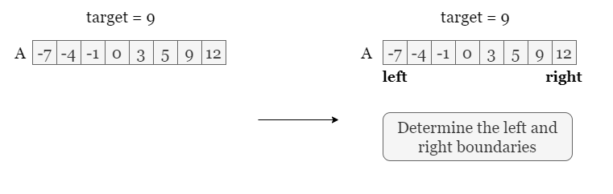
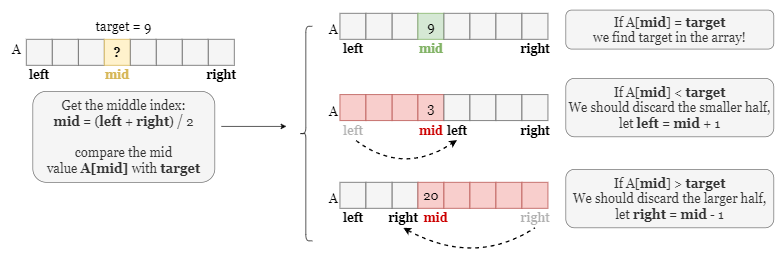
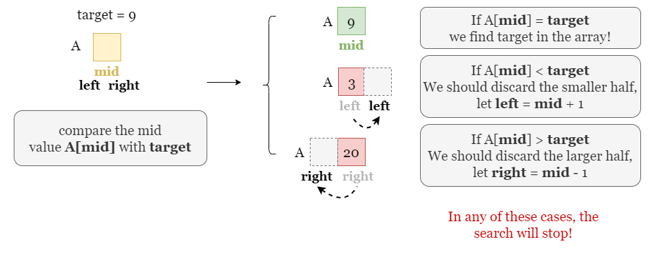
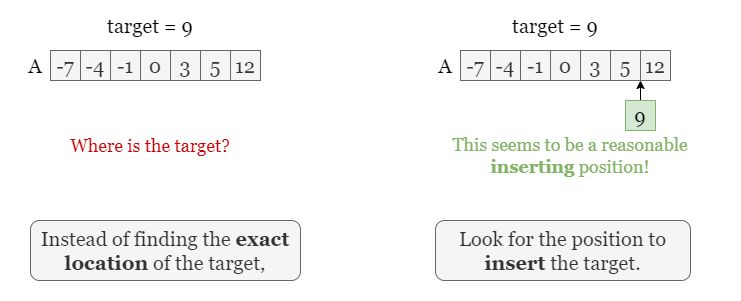
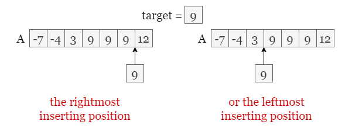
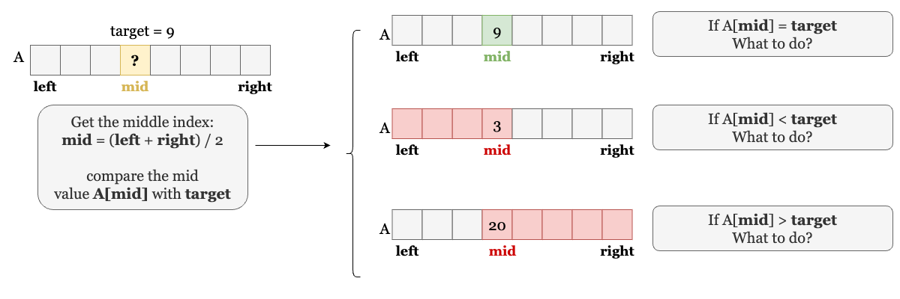
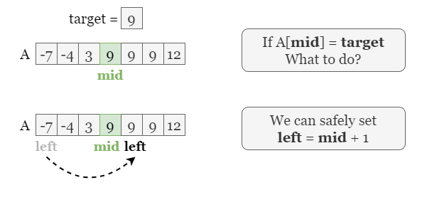
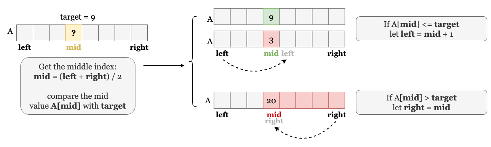
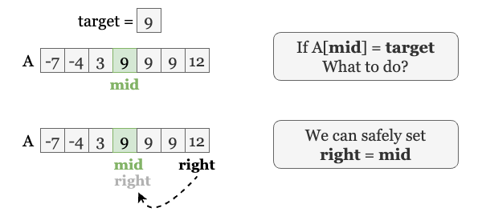
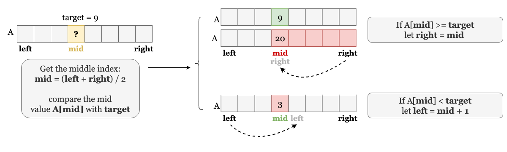

[TOC]

## Solution

---

### Overview

If you don't have much experience with binary-search-related problems, we strongly suggest you read this [LeetCode Explore Card](https://leetcode.com/explore/learn/card/binary-search/), our explore card for binary search! We'll cover four methods, the first three of which are closely related to those presented in this card, so it's helpful to look ahead!

---

### Approach 1: Find the Exact Value

#### Intuition

We start from the most basic and elementary template.

First, we define the search space using two boundary indexes, `left` and `right`, all possible indexes are within the inclusive range `[left, right]`. We shall continue searching over the search space as long as it is not empty. A general way is to use a while loop with the condition $left \le right$, so we can break out of this loop if we empty the range or trigger other conditions which we will discuss later.



The next step is to find the 'pivot point', the middle index that divides the search space into two halves. We need to compare the value at the middle index $\text{nums}[mid]$ with `target`, the purpose of this step is to cut one half that is guaranteed not to contain `target`.

- If $\text{nums}[mid] = target$, it means we find `target`, and the job is done! We can break the loop by returning `mid`.
- If $\text{nums}[mid] < target$, combined with the array is sorted, we know that all values in the left half are smaller than `target`, so we can safely cut this half by letting $left = mid + 1$.
- If $\text{nums}[mid] > target$, it means all values in the right half are larger than `target` and can be cut safely!



Does this loop ever stop? Yes, take the following picture as an example, suppose we are searching over an array of size 1, in this case, `left`, `right`, and `mid` all stand for the only index in the array. In any of the three conditions, we trigger one of the break statements and stop the loop.



<br>

#### Algorithm

1) Initialize the boundaries of the search space as $left = 0$ and $right = \text{nums.size} - 1$.
2) If there are elements in the range `[left, right]`, we find the middle index $mid = (left + right) / 2$ and compare the middle value $\text{nums}[mid]$ with `target`:
- If $\text{nums}[mid] = target$, return `mid`.
- If $\text{nums}[mid] < target$, let $left = mid + 1$ and repeat step 2.
- If $\text{nums}[mid] > target$, let $right = mid - 1$ and repeat step 2.
3) We finish the loop without finding `target`, return `-1`.

#### Implementation

```python
class Solution:
    def search(self, nums: List[int], target: int) -> int:
        # Set the left and right boundaries
        left = 0
        right = len(nums) - 1

        # Under this condition
        while left <= right:
            # Get the middle index and the middle value.
            mid = (left + right) // 2

            # Case 1, return the middle index.
            if nums[mid] == target:
                return mid
            # Case 2, discard the smaller half.
            elif nums[mid] < target:
                left = mid + 1
            # Case 3, discard the larger half.
            else:
                right = mid - 1

        # If we finish the search without finding target, return -1.
        return -1
```

#### Complexity Analysis

Let $n$ be the size of the input array `nums`.

* Time complexity: $O(\log n)$

- `nums` is divided into half each time. In the worst-case scenario, we need to cut `nums` until the range has no element, and it takes logarithmic time to reach this break condition.

* Space complexity: $O(1)$

- During the loop, we only need to record three indexes, `left`, `right`, and `mid`, they take constant space.

<br/>

---

### Approach 2: Find Upper bound

#### Intuition

Here we introduce an alternative way to implement binary search: instead of looking for `target` in the array `nums`, we look for the insert position where we can put `target` in without disrupting the order.



Generally, we have two inserting ways, insert into the rightmost possible position which we called finding the **upper bound**, and insert into the leftmost possible position which we called finding the **lower bound**. We will implement them in the following approaches.

Take the picture below as an example. Assume that we want to insert `9` into array `A`. If we look for the **upper bound**, we have to insert `9` to the right of all existing `9`s in the array. Similarly, if we look for the **lower bound**, we have to insert `9` to the left of all existing `9`s. (Although we don't have duplicate elements in this problem, having duplicate elements is more common in problems so we would better know this concept in advance!)



Now we start the binary search. Similar to the previous approach, we still use `left` and `right` as two boundary indexes. The question is, what is the next step after we find the middle index `mid`?



- If $\text{nums}[mid] < target$, the insert position is on `mid`'s right, so we let $left = mid + 1$ to discard the left half and `mid`.

- If $\text{nums}[mid] = target$, the insert position is on `mid`'s right, so we let $left = mid + 1$ to discard the left half and `mid`.



- If $\text{nums}[mid] > target$, `mid` can also be the insert position. So we let $right = mid$ to discard the right half while keeping `mid`.

Therefore, we merged the two conditions $\text{nums}[mid] = target$ and $\text{nums}[mid] < target$ and there are only two conditions in the `if-else` statement!



Once the loop stops, `left` stands for the insert position and $left - 1$ is the largest element that is no larger than `target`. We just need to check if $nums[left - 1]$ equals `target`. Note this boundary condition where $left = 0$, which means all elements in `nums` are larger than `target`, so there is no `target` in `nums`.

<br>

#### Algorithm

1) Initialize the boundaries of the search space as $left = 0$ and $right = \text{nums.size}$ (Note that the maximum insert position can be `nums.size`)
2) If there are elements in the range `[left, right]`, we find the middle index $mid = (left + right) / 2$ and compare the middle value $\text{nums}[mid]$ with `target`:
- If $\text{nums}[mid] \le target$, let $left = mid + 1$ and repeat step 2.
- If $\text{nums}[mid] > target$, let $right = mid$ and repeat step 2.
3) We finish the loop and `left` stands for the insert position:
- If `left > 0` and $nums[left - 1] = target$, return $left - 1$.
- Otherwise, return `-1`.

#### Implementation

```python
class Solution:
    def search(self, nums: List[int], target: int) -> int:
        # Set the left and right boundaries
        left = 0
        right = len(nums)

        while left < right:
            mid = (left + right) // 2
            if nums[mid] <= target:
                left = mid + 1
            else:
                right = mid

        if left > 0 and nums[left - 1] == target:
            return left - 1
        else:
            return -1
```

#### Complexity Analysis

Let $n$ be the size of the input array `nums`.

* Time complexity: $O(\log n)$

- `nums` is divided into half each time. In the worst-case scenario, we need to cut `nums` until the range has no element, it takes logarithmic time to reach this break condition.

* Space complexity: $O(1)$

- During the loop, we only need to record three indexes, `left`, `right`, and `mid`, they take constant space.

<br/>

---

### Approach 3: Find Lower bound

#### Intuition

Different from the previous method, here we are looking for the **leftmost** insert position. Therefore, we will make the following changes to the judgment condition:

- If $\text{nums}[mid] < target$, `mid` can also be the insertion position. So we let $left = mid + 1$, that is, discard the left half while keeping `mid`.

- If $\text{nums}[mid] = target$, the insert position is on `mid`'s left, so we let $right = mid$ to discard both the right half and `mid`.



- If $\text{nums}[mid] > target$, the insert position is on `mid`'s left, so we let $right = mid$ to discard both the right half and `mid`.

Therefore, we merged the two conditions $\text{nums}[mid] = target$ and $\text{nums}[mid] > target$ and there are only two conditions in the `if-else` statement!



Once the loop stops, `left` stands for the insert position and $\text{nums}[left]$ is the smallest element that is no less than `target`. We just need to check if $\text{nums}[left]$ equals `target`. Note this boundary condition $left = \text{nums.size}$, which means all elements in `nums` are smaller than `target`, so there is no `target` in `nums`.

<br>

#### Algorithm

1) Initialize the boundaries of the search space as $left = 0$ and $right = \text{nums.size}$ (Note that the maximum insert position can be `nums.size`)
2) If there are elements in the range `[left, right]`, we find the middle index $mid = (left + right) / 2$ and compare the middle value $\text{nums}[mid]$ with `target`:
- If $\text{nums}[mid] \ge target$, let $right = mid$ and repeat step 2.
- If $\text{nums}[mid] < target$, let $left = mid + 1$ and repeat step 2.
3) We finish the loop and `left` stands for the insert position:
- If `left < nums.size` and $\text{nums}[left] = target$, return `left`.
- Otherwise, return `-1`.

#### Implementation

```python
class Solution:
    def search(self, nums: List[int], target: int) -> int:
        # Set the left and right boundaries
        left = 0
        right = len(nums)

        while left < right:
            mid = (left + right) // 2
            if nums[mid] >= target:
                right = mid
            else:
                left = mid + 1

        if left < len(nums) and nums[left] == target:
            return left
        else:
            return -1
```

#### Complexity Analysis

Let $n$ be the size of the input array `nums`.

* Time complexity: $O(\log n)$

- `nums` is divided into half each time. In the worst-case scenario, we need to cut `nums` until the range has no element, it takes logarithmic time to reach this break condition.

* Space complexity: $O(1)$

- During the loop, we only need to record three indexes, `left`, `right`, and `mid`, they take constant space.

<br/>

---

### Approach 4: Use built-in tools.

#### Intuition

We have implemented various templates of binary search, now let's quickly go through the last approach that uses built-in functions. C++ provides the `<algorithm>` library that defines functions for binary searching, Python provides `bisect` module which also supports binary search functions. If we are solving some standard problems that do not require a lot of customization, it's feasible to rely on these built-in tools to save time.

Note that $\text{upper}_{bound}$ and $bisect.\text{bisect}_{right}$ look for the rightmost insertion position and bring the same result as approach 2, while $\text{lower}_{bound}$ and $bisect.\text{bisect}_{left}$ look for the leftmost insertion position and end up with the same result as approach 3. Once we find the insertion position, check if the value at the corresponding position equals `target`.

Here we implement the method that uses **upper_bound** or **bisect.bisect_right** and leave another half as a practice!

<br>

#### Algorithm

1) Use built-in tools to locate the rightmost insertion position `idx`.
2) If `idx > 0` and $nums[idx - 1] = target$, return `idx -1`. Otherwise, return `-1`.

#### Implementation

```python
class Solution:
    def search(self, nums: List[int], target: int) -> int:
        # Find the insertion position `idx`.
        idx = bisect.bisect_right(nums, target)

        if idx > 0 and nums[idx - 1] == target:
            return idx - 1
        else:
            return -1
```

#### Complexity Analysis

Let $n$ be the size of the input array `nums`.

* Time complexity: $O(\log n)$

- The time complexity of the built-in binary search is $O(\log n)$.

* Space complexity: $O(1)$

- The built-in binary search only takes $O(1)$ space.

<br/>