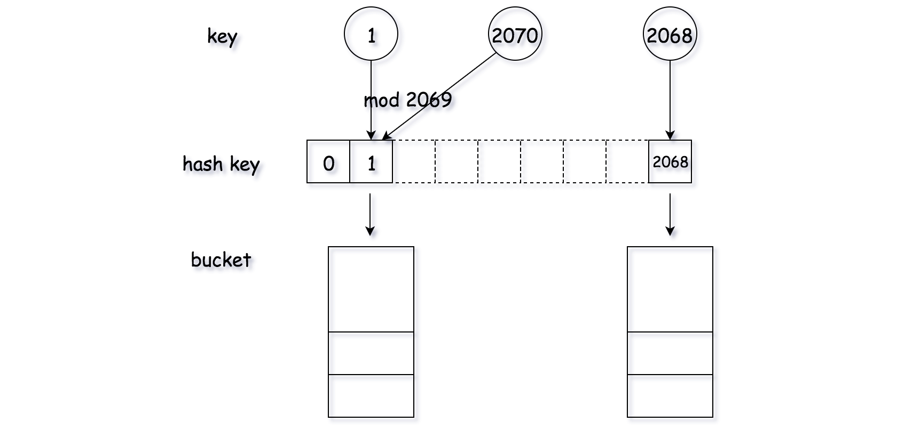

## Solution

---
#### Intuition

Hashmap is a common data structure that is implemented in various forms in different programming languages, _e.g._ `dict` in Python and `HashMap` in Java. The most distinguish characteristic about hashmap is that it provides a fast access to a **value** that is associated with a given **key**.

>There are two main issues that we should tackle, in order to design an _efficient_ hashmap data structure: _1). hash function design_ and _2). collision handling_.

- **1). hash function design**: the purpose of hash function is to map a key value to an address in the storage space, similarly to the system that we assign a postcode to each mail address.
As one can image, for a good hash function, it should map different keys **_evenly_** across the storage space, so that we don't end up with the case that the majority of the keys are _concentrated_ in a few spaces.

- **2). collision handling**: essentially the hash function reduces the vast key space into a limited address space. As a result, there could be the case where two different keys are mapped to the same address, which is what we call _'collision'_.
Since the collision is inevitable, it is important that we have a strategy to handle the collision.

Depending on how we deal with each of the above two issues, we could have various implementation of hashmap data structure.
<br/>
<br/>

---
### Approach 1: Modulo + Array

**Intuition**

As one of the most intuitive implementations, we could adopt the `modulo` operator as the hash function, since the key value is of integer type. In addition, in order to minimize the potential collisions, it is advisable to use a prime number as the base of modulo, _e.g._ `2069`.

We organize the storage space as an **array** where each element is indexed with the output value of the hash function.

In case of _collision_, where two different keys are mapped to the same address, we use a **bucket** to hold all the values. The bucket is a container that hold all the values that are assigned by the hash function. We could use either a `LinkedList` or an `Array` to implement the bucket data structure.

**Algorithm**

For each of the methods in hashmap data structure, namely `get()`, `put()` and `remove()`, it all boils down to the method to locate the value that is stored in hashmap, given the key.

This localization process can be done in two steps:

- For a given `key` value, first we apply the hash function to generate a hash key, which corresponds to the address in our main storage. With this hash key, we would find the _bucket_ where the value should be stored.

- Now that we found the bucket, we simply iterate through the bucket to check if the desired `<key, value>` pair does exist.



```python
class Bucket:
    def __init__(self):
        self.bucket = []

    def get(self, key):
        for (k, v) in self.bucket:
            if k == key:
                return v
        return -1

    def update(self, key, value):
        found = False
        for i, kv in enumerate(self.bucket):
            if key == kv[0]:
                self.bucket[i] = (key, value)
                found = True
                break

        if not found:
            self.bucket.append((key, value))

    def remove(self, key):
        for i, kv in enumerate(self.bucket):
            if key == kv[0]:
                del self.bucket[i]

class MyHashMap(object):

    def __init__(self):
        """
        Initialize your data structure here.
        """
        # better to be a prime number, less collision
        self.key_space = 2069
        self.hash_table = [Bucket() for i in range(self.key_space)]

    def put(self, key, value):
        """
        value will always be non-negative.
        :type key: int
        :type value: int
        :rtype: None
        """
        hash_key = key % self.key_space
        self.hash_table[hash_key].update(key, value)

    def get(self, key):
        """
        Returns the value to which the specified key is mapped, or -1 if this map contains no mapping for the key
        :type key: int
        :rtype: int
        """
        hash_key = key % self.key_space
        return self.hash_table[hash_key].get(key)

    def remove(self, key):
        """
        Removes the mapping of the specified value key if this map contains a mapping for the key
        :type key: int
        :rtype: None
        """
        hash_key = key % self.key_space
        self.hash_table[hash_key].remove(key)

# Your MyHashMap object will be instantiated and called as such:
# obj = MyHashMap()
# obj.put(key,value)
# param_2 = obj.get(key)
# obj.remove(key)
```

Note that in the above implementations, we use `Array` to implement the _bucket_ in Python, while we use `LinkedList` in Java.

**Complexity Analysis**

- Time Complexity: for each of the methods, the time complexity is $\mathcal{O}(\frac{N}{K})$ where $N$ is the number of all possible keys and $K$ is the number of predefined buckets in the hashmap, which is `2069` in our case.

- In the ideal case, the keys are evenly distributed in all buckets. As a result, *on average*, we could consider the size of the bucket is $\frac{N}{K}$.

- Since in the worst case we need to iterate through a bucket to find the desire value, the time complexity of each method is $\mathcal{O}(\frac{N}{K})$.

- Space Complexity: $\mathcal{O}(K+M)$ where $K$ is the number of predefined buckets in the hashmap and $M$ is the number of unique keys that have been inserted into the hashmap.
<br/>
<br/>