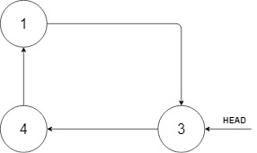
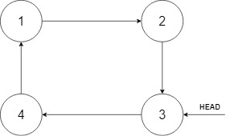

## Description

Given a Circular Linked List node, which is sorted in non-descending order, write a function to insert a value `insertVal` into the list such that it remains a sorted circular list. The given node can be a reference to any single node in the list and may not necessarily be the smallest value in the circular list.

If there are multiple suitable places for insertion, you may choose any place to insert the new value. After the insertion, the circular list should remain sorted.

If the list is empty (i.e., the given node is `null`), you should create a new single circular list and return the reference to that single node. Otherwise, you should return the originally given node.
### Function Contract

`solve(head: Node | None, insertVal: int) -> Node`

`Node` contains an integer `val` and a `next` reference to another node in the cycle.

**Inputs**

- `head`: any node in a sorted circular singly linked list, or `None` for an empty list.
- `insertVal`: the value to store in the newly allocated node.

**Return value**

Insert exactly one node and preserve the circular, non-descending cyclic order. Return the original linked-list head node when the input is nonempty; otherwise return the newly created self-linked node. Any insertion location satisfying the order contract is valid.

### Examples
#### Example 1

- **Input:** $head = [3,4,1], insertVal = 2$
- **Output:** `[3,4,1,2]`
- **Explanation:** In the figure above, there is a sorted circular list of three elements. You are given a reference to the node with value 3, and we need to insert 2 into the list. The new node should be inserted between node 1 and node 3. After the insertion, the list should look like this, and we should still return node 3.

#### Example 2

- **Input:** $head = [], insertVal = 1$
- **Output:** `[1]`
- **Explanation:** The list is empty (given head is null). We create a new single circular list and return the reference to that single node.
#### Example 3

- **Input:** $head = [1], insertVal = 0$
- **Output:** `[1,0]`
### Constraints

- The number of nodes in the list is in the range $[0, 5 * 10^{4}]$.

- $-10^{6} \le \text{Node.val}, insertVal \le 10^{6}$