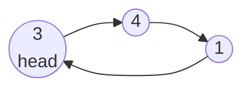
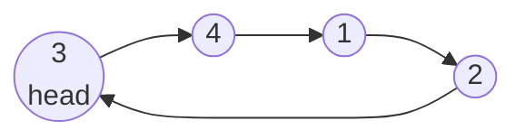

## Examples

**Example 1**

Before insertion, the supplied `head` points to `3` in the three-node cycle:

- Input: `head = [3,4,1], insertVal = 2`
- Output: `[3,4,1,2]`
- Explanation: The supplied reference is the node containing `3` in the sorted three-node cycle `3 -> 4 -> 1 -> 3`. The new node containing `2` belongs between `1` and `3`. After that splice, return the original node containing `3`.

After insertion, the new node extends the same cycle between `1` and `3`:

**Example 2**

- Input: `head = [], insertVal = 1`
- Output: `[1]`
- Explanation: Because the input list is empty, create one node containing `1`, link it to itself, and return it.

**Example 3**

- Input: `head = [1], insertVal = 0`
- Output: `[1,0]`
