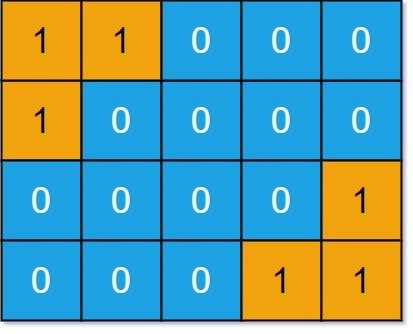

### 1. Description

You are given an `m x n` binary matrix `grid`. An island is a group of `1`'s (representing land) connected **4-directionally** (horizontal or vertical.) You may assume all four edges of the grid are surrounded by water.

An island is considered to be the same as another if they have the same shape, or have the same shape after **rotation** (90, 180, or 270 degrees only) or **reflection** (left/right direction or up/down direction).

Return *the number of **distinct** islands*.

### 2. Function Contract

$solve(grid: list[\text{list}[int]]) -> int$

Let $m$ be the number of rows and $n$ the number of columns.

**Inputs**

- `grid`: an $m \times n$ rectangular binary matrix in which `1` is land and `0` is water.

**Return value**

Return the number of island equivalence classes when absolute position, the permitted quarter-turn rotations, and horizontal or vertical reflection do not distinguish shapes. Only horizontal and vertical adjacency connects land cells.

### 3. Examples

#### Example 1

- **Input:** `grid = [[1,1,0,0,0],[1,0,0,0,0],[0,0,0,0,1],[0,0,0,1,1]]`
- **Output:** `1`
- **Explanation:** The two islands are considered the same because if we make a 180 degrees clockwise rotation on the first island, then two islands will have the same shapes.
#### Example 2

- **Input:** `grid = [[1,1,0,0,0],[1,1,0,0,0],[0,0,0,1,1],[0,0,0,1,1]]`
- **Output:** `1`

### 4. Constraints

- $m = \text{grid.length}$

- $n = \text{grid}[i].length$

- $1 \le m, n \le 50$

- $\text{grid}[i][j]$ is either `0` or `1`.