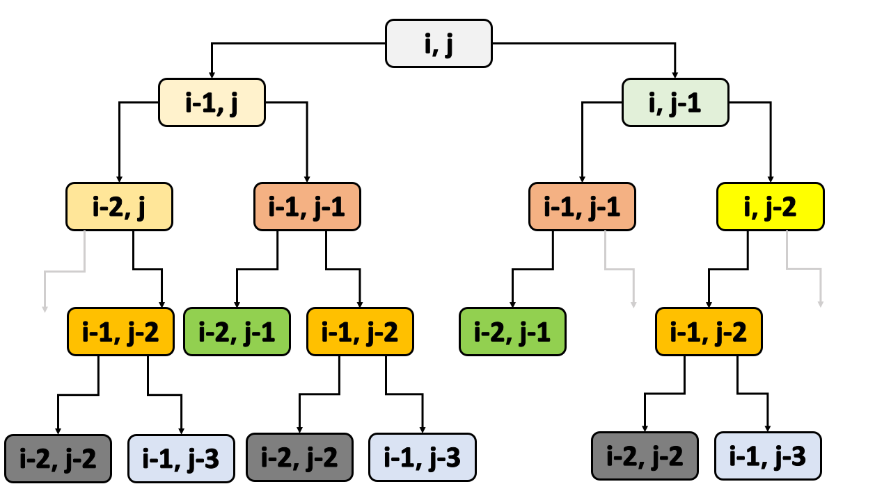

[TOC]

## Solution

---

### Overview

We are given two strings `s1` and `s2`. Our purpose is to make the two strings equal by deleting (possibly none) characters from both strings. The cost of deleting a character is the ASCII value of that character. We need to find the minimum cost to make two strings equal.

> As a note, we can delete any character from any string. It is not necessary to delete consecutive characters only.

<details>

<summary>Before we proceed, we must know what is ASCII value of a character. Readers who are not familiar with ASCII value can read by clicking to expand this section.</summary>

<p>

**ASCII** stands for **A**merican **S**tandard **C**ode for **I**nformation **I**nterchange. It is a character encoding standard for electronic communication. It is a 7-bit encoding scheme, which means that it can represent 128 (2<sup>7</sup>) characters.

**Why do we need encoding?**
Computers can only understand binary numbers. So, we need to convert characters to binary numbers. This conversion is called encoding. There are many encoding schemes, and ASCII is one of them.

The ASCII value of a character is the decimal representation of the character in the ASCII table.

- ASCII value of `a` is 97
- ASCII value of `A` is 65
- ASCII value of `0` is 48

The table can be found [here](https://www.ascii-code.com/).

ASCII was developed in the 1960s, and originally it was a 7-bit encoding scheme. Later, it was extended to 8 bits, and the extended version is called **Extended ASCII**. The extended ASCII can represent 256 (2<sup>8</sup>) characters.

Many programming languages use ASCII encoding. They provide built-in functions to convert characters to ASCII value and vice-versa.

- In Python, we can use [`ord`](https://docs.python.org/3/library/functions.html#ord) function to get the ASCII value of a character, and [`chr`](https://docs.python.org/3/library/functions.html#chr) function to get the character from ASCII value.

    It is worth noting that `ord` ideally returns the Unicode code point of a character. But, since ASCII is a subset of Unicode, we can interpret the return value of `ord` as the ASCII value of a character. Similarly, `chr` returns a Unicode character from a Unicode code point. But, since ASCII is a subset of Unicode, we can interpret the return value of `chr` as an ASCII character from the ASCII value.

- In C++ and Java, we can use casting to get the ASCII value of a character. If `c` is a character, then `(int)c` will give the ASCII value of `c`.

In the problem description, it is given that

> `s1` and `s2` consist of lowercase English letters.

So, our ASCII will be in the range 97 to 122, since the ASCII value of `a` is 97 and the ASCII value of `z` is 122.

</p>

</details>

<br/>

$\downarrow_{\text{After Refreshing ASCII}}$

For formulating the solution, let's revisit the example given in the problem description.

<code>
<b>Input:</b> s1 = "delete", s2 = "leet"
</code>

<br/>
<br/>

We want to make both strings equal. So, we need to delete some characters from both strings. Let's convince ourselves that there indeed can be multiple ways to make both strings equal.

- Delete all characters from `s1` and `s2`. Both strings will become empty, and hence equal. Since we have deleted all characters, the cost will be the sum of the ASCII values of all characters in `s1` and `s2`.

    We must note that every deletion has a cost. If there are three `e`, then the cost to delete all three `e` will be three times the ASCII value of `e`.

- Make both strings equal to `e`.

    We can do this by deleting `d`, `l`, `t`, and any two `e`'s from `s1`, and deleting `l`, `t`, and any one `e` from `s2`.

- Make both strings equal to `l`.

- Make both strings equal to `t`.

- Make both strings equal to `ee`.

- Make both strings equal to `le`.

    Note that we can't make both strings equal to `el`. The only permitted operation is deletion, and we can't change the order of characters.

    In other words, **we can make both strings equal to a common subsequence only.**

    > A subsequence is a sequence that can be derived from a given string by deleting some characters without changing the order of the remaining characters.

    > A common subsequence of two strings is a subsequence that is common to both strings.

- Make both strings equal to `lt`.

- Make both strings equal to `lee`, the sub-optimal solution as explained in the explanation.

- Make both strings equal to `let`, the optimal solution as explained in the explanation.

- Make both strings equal to `eet`.

... and perhaps a few more ways.

Thus, we may have to look for each and every possible way to make both strings equal, and then take the minimum cost. The editorial will try to systematically find the minimum cost with the aim of improving the time complexity, and also to improve the space complexity.

Throughout the editorial, the following notations will be used, unless otherwise specified.

- we will use $M$ and $N$ to denote the length of `s1` and `s2` respectively. In code, they will be denoted by `m` and `n` respectively.

- we may have to iterate the input strings. For iterating `s1`, we will use `i` as the pointer. Similarly, for iterating `s2`, we will use `j` as the pointer.

---

### Approach 1: Recursion

#### Intuition

Let's see how we can make two strings equal. For this, we will use two **life productivity hacks.**

- **When we have a lot of work on our to-do list, instead of jumping on all the tasks simultaneously, we should complete tasks from one side 📑**

    Following a similar analogy, let's analyze the given strings from one side. We will start from the right side of both strings and move towards the left side.

    After intuition is clear, readers can come back and can appreciate that we can analyze the strings from the left side as well.

- **When a problem is tough to solve, we should try to break it into smaller sub-problems and should try to solve the sub-problems 🧩**

    Following a similar analogy, let's change our thought process. Instead of thinking about making two strings equal, let's think about making two characters equal.

    After the character at some index-duo `i`-`j` is equal, we can move to the string with a smaller length.

After applying the above two life hacks, let's see how we can proceed.

Let `i` point to the last character of `s1`, and `j` point to the last character of `s2`.

- if both characters are equal, then we don't need to delete any character. We can move to the next character.

    We can do this by decrementing both `i` and `j` by one.

    In other words, if $\text{s1}[i] = \text{s2}[j]$, then we can think of solving the problem for `s1[0...i-1]` and `s2[0...j-1]`.

    And, does this breaking down of the problem into smaller sub-problems add any cost? No, since we are not deleting any character.

- if the characters are not equal, we need to delete a character from at least one string.

    We can do this by deleting a character from `s1` or `s2` or both.

    Let's delete a character from `s1`. The cost will be the ASCII value of $\text{s1}[i]$. After deleting $\text{s1}[i]$, we can think of making `s1[0...i-1]` and `s2[0...j]` equal. The string `s2` is not changed.

    Let's delete a character from `s2`. The cost will be the ASCII value of $\text{s2}[j]$. After deleting $\text{s2}[j]$, we can think of making `s1[0...i]` and `s2[0...j-1]` equal. The string `s1` is not changed.

    Let's delete both characters. The cost will be the ASCII value of $\text{s1}[i]$ + the ASCII value of $\text{s2}[j]$. After deleting $\text{s1}[i]$ and $\text{s2}[j]$, we can think of making `s1[0...i-1]` and `s2[0...j-1]` equal.

    Thus, at any point in time, we have three options. We would prefer the one with minimum cost.

    In other words, if $\text{s1}[i] \neq \text{s2}[j]$, then the cost will be the minimum of these three sub-problems.

- ASCII value of $\text{s1}[i]$ + cost to make `s1[0...i-1]` and `s2[0...j]` equal
- ASCII value of $\text{s2}[j]$ + cost to make `s1[0...i]` and `s2[0...j-1]` equal
- ASCII value of $\text{s1}[i]$ + ASCII value of $\text{s2}[j]$ + cost to make `s1[0...i-1]` and `s2[0...j-1]` equal

This breaking down of problems into smaller sub-problems can be easily done using **recursion**.

**Will our algorithm terminate?**
At any point in time, we are making at least one string smaller. Thus, we will reach a point where some string will become empty. So, our algorithm will terminate.

But we need to define what to do when it is in the terminating condition. This is called as **base condition**.

**What will be the base condition?**
- What if `s1` reduces to an empty string? In this case, we need to delete all characters of `s2[0...j]`. Thus, the cost will be the sum of ASCII values of all characters of `s2[0...j]`.
- What if `s2` reduces to an empty string? In this case, we need to delete all characters of `s1[0...i]`. Thus, the cost will be the sum of ASCII values of all characters of `s1[0...i]`.
- What if both `s1` and `s2` reduces to an empty string? In this case, we don't need to delete any character. Thus, cost will be zero.

For implementation purpose, we can have a function `computeCost(s1, s2, i, j)` which will return the minimum cost to make `s1[0...i]` and `s2[0...j]` equal. It will recursively call itself to compute the cost for smaller sub-problems depending on the value of `i` and `j`.

#### Algorithm

1. Define a function `computeCost`. It will take `s1`, `s2`, `i`, and `j` as input parameters. It will return the minimum cost to make `s1[0...i]` and `s2[0...j]` equal.

2. In the `computeCost` function

- if any string is empty, then return the sum of ASCII values of all characters of the other string. This is the base condition.  The emptiness of a string can be checked by checking the value of the pointer `i` or `j`. A negative `i` indicates that `s1` is empty. Similarly, a negative `j` indicates that `s2` is empty.

- Compare $\text{s1}[i]$ and $\text{s2}[j]$. If they are equal, then no deletion is required to make them equal. Thus, we can move to the next character. We can do this by calling `computeCost(s1, s2, i-1, j-1)`.

- Else if they are not equal, then we need to delete character from at least one string. We will return the minimum of the following three sub-problems.

      - ASCII value of $\text{s1}[i]$ + `computeCost(s1, s2, i-1, j)`
      - ASCII value of $\text{s2}[j]$ + `computeCost(s1, s2, i, j-1)`
      - ASCII value of $\text{s1}[i]$ + ASCII value of $\text{s2}[j]$ + `computeCost(s1, s2, i-1, j-1)`

3. Call `computeCost(s1, s2, s1.size()-1, s2.size()-1)` and return the result.

#### Implementation

```python
class Solution:
    def minimumDeleteSum(self, s1: str, s2: str) -> int:

        # Return minimum cost to make s1[0...i] and s2[0...j] equal
        def compute_cost(i, j):

            # If s1 is empty, then we need to delete all characters of s2
            if i < 0:
                delete_cost = 0
                for pointer in range(j+1):
                    delete_cost += ord(s2[pointer])
                return delete_cost

            # If s2 is empty, then we need to delete all characters of s1
            if j < 0:
                delete_cost = 0
                for pointer in range(i+1):
                    delete_cost += ord(s1[pointer])
                return delete_cost

            # Check s1[i] and s2[j]
            if s1[i] == s2[j]:
                return compute_cost(i-1, j-1)
            else:
                return min(
                    ord(s1[i]) + compute_cost(i-1, j),
                    ord(s2[j]) + compute_cost(i, j-1),
                    ord(s1[i]) + ord(s2[j]) + compute_cost(i-1, j-1)
                )

        # Call helper function for complete strings
        return compute_cost(len(s1)-1, len(s2)-1)
```

**Note:** The code above will give TLE for large inputs because of high time complexity.

#### Complexity Analysis

Let `s` be the longer string between `s1` and `s2`. Let $K$ be the length of `s`.

* Time complexity: $O(3^{K} \cdot K)$.

    For each character of `s`, we recursively explore three possibilities. Either we can delete this character from `s`, or from another string, or we can delete both characters. Thus, we have three recursive calls for each character of `s`. Hence, there will be $3^{K}$ recursive calls.

    The time complexity of each recursive call is $O(K)$ because we may need to traverse the complete string to calculate the cost.

    Thus, the total time complexity will be $O(3^{K} \cdot K)$.

* Space complexity: $O(K)$.

    The space complexity will be $O(K)$ because of the recursion stack. The recursive process will terminate when either of the strings becomes empty. Thus, the maximum depth of the recursion tree will be $K$.

---

### Approach 2: Top-down Dynamic Programming

#### Intuition

Let's analyze this portion of the previous approach

$\downarrow$

> if both characters are not equal, then we need to delete character from at least one string.
>
> We can do this by deleting character from `s1` or `s2` or both.

$\uparrow$

**Do we really need to delete character from $\ast \text{both}$ strings at this step?**

Let's see the code of `computeCost` for `i, j` as input.

```pseudocode []

computeCost(i, j)
{
    .
    .
    .

    if (s1[i] != s2[j])
    {
        return min(
            ASCII(s1[i]) + computeCost(i-1, j),
            ASCII(s2[j]) + computeCost(i, j-1),
            ASCII(s1[i]) + ASCII(s2[j]) + computeCost(i-1, j-1)
        )
    }

    .
    .
    .
}
```

And what will the code of `computeCost` look like if we have `i-1, j` as input?

```pseudocode []
computeCost(i-1, j)
{
    .
    .
    .

    if (s1[i-1] != s2[j])
    {
        return min(
            ASCII(s1[i-1]) + computeCost(i-2, j),
            ASCII(s2[j]) + computeCost(i-1, j-1),
            ASCII(s1[i-1]) + ASCII(s2[j]) + computeCost(i-2, j-1)
        )
    }

    .
    .
    .
}
```

The third sub-problem called in `computeCost(i, j)` is exactly the same as the second sub-problem called in `computeCost(i-1, j)`. Both eventually boils down to `ASCII(s1[i]) + ASCII(s2[j]) + computeCost(i-1, j-1)`.

Hence, the third sub-problem is redundant, or we can say that it was overlapping with the sub-problem of the subsequent recursive call.

$\downarrow$

**Is there any other overlapping sub-problem?**

For this, we can draw the recursion tree for `computeCost(i, j)`.


<br/>

As visible in the recursion tree, there are many same-colored overlapping sub-problems. **Is there any point in calculating the same sub-problem again and again?** No, right?

**What if we store the result of each sub-problem and use it when required?** This is what we do in dynamic programming. We store the result of each sub-problem and use it when required.

> Dynamic programming is a programming paradigm in which we break a problem into sub-problems and store the result of each sub-problem and use it when required. To dive deep into dynamic programming, readers can visit [Dynamic Programming Explore Card](https://leetcode.com/explore/featured/card/dynamic-programming/).

Since there are two state variables `i` and `j`, we can use a two-dimensional array to store the result of each sub-problem.

> If there are $T$ state variables, then we need an array of at most $T$ dimensions to store the result of each sub-problem.

$\downarrow$

**Is there any other optimization we can do? Isn't the base case time-consuming?**

Let's focus on the following portion of [implementation of Approach-1](#implementation) where we computed the cost of deleting all remaining characters of the other string.

```pseudocode []
// If s1 is empty, then we need to delete all characters of s2
if (i < 0) {
    delete_cost = 0
    for pointer = 0 to j:
        delete_cost += ASCII(s2[pointer])
    return delete_cost
}
```

Assume, `i < 0` and `j == 4`, then we will have to traverse from index `0` to `4` of string `s2` to compute the cost of deleting all characters of `s2`.

Now assume `i < 0` and `j == 5`, then we will have to traverse from index `0` to `5` of string `s2` to compute the cost of deleting all characters of `s2`. But we already have traversed from index `0` to `4` of string `s2` in the previous call.

Is there any overlapping here? Yes, there is. Hence, we can decompose the `for` loop as

```pseudocode []
// If s1 is empty, then we need to delete all characters of s2
if (i < 0) {
    return ASCII(s2[j]) + computeCost(i, j-1)
}
```

Let's assume the answer of `i < 0` and `j == 4` was computed and saved. Now, if we call the function with `i < 0` and `j == 5`, it will return `ASCII(s2[5]) + computeCost(i, 4)`. The function `computeCost(i, 4)` will return the answer of `i < 0` and `j == 4` which was already computed and saved. So, we will not have to traverse from index `0` to `4` of string `s2` again.

Hence, the conditions when at least one string is empty can be optimized.

```pseudocode []
// If both strings are empty, then no deletion is required
if (i < 0 && j < 0) {
    return 0
}

// If any one string is empty, then delete all characters of the other string
if (i < 0) {
    return ASCII(s2[j]) + computeCost(i, j-1)
}
if (j < 0) {
    return ASCII(s1[i]) + computeCost(i-1, j)
}
```

$\downarrow$

Thus, we have done three optimizations:

* Two recursive calls instead of three.

* Changing linear runtime base case to recursive calls. Recursive calls will be amortized constant.

    > **Amortized Analysis:** Amortized analysis gives the average performance (over time) of each operation in the worst case. The basic idea is that the worst-case operation can alter the state in such a way that the worst-case cannot occur again for a long time, thus amortizing its cost.
    >
    > Now, assume that the length of `s2` is `n`. The worst case will be when `i < 0` and `j == n-1`. In this case, we will have to traverse from index `n-1` to `0` of string `s2` to compute the cost of deleting all characters of `s2`. But after this traversal, if we call the function with `i < 0` and `j == n-2`, then its answer will already be saved because it was computed in the previous call. So, we will not have to traverse from index `n-2` to `0` of string `s2` again. Hence, the worst case will occur only once in a while. Most of the time, the function will return the answer to the previous call. So, the amortized time complexity of the base case will be constant.

* Storing the result of each sub-problem to avoid repeated calculation.

$\downarrow$

We also need to keep in mind, how and using which data structure we will store the result of each sub-problem. We need to cache the result where one of the parameters/state-variable can be negative. So, we can't use an array to store the result because arrays can't have negative indices. We can have the following solution for this

- Use the Hash map to cache the result. The key of the hash map will be a pair of integers `(i, j)` and the value will be the result of `computeCost(i, j)`. This will take $O(M \cdot N)$ space.

- Shift the indices by unit and use the two-dimensional array `savedResult` to cache the result. This will take $O((M+1) \cdot (N+1))$ space. After doing this, `savedResult[i][j]` will store the result of `computeCost(i-1, j-1)`.

In this approach, we will use the hash map to cache the result. In [next approach](#approach-3-bottom-up-dynamic-programming), we will use the two-dimensional array.

#### Algorithm

1. Declare a hash map `savedResult` to store the result of each sub-problem. The key of the hash map will be a pair of integers `(i, j)` and the value will be the result of `computeCost(i, j)`. Initialize `savedResult` to an empty hash map.

2. Define function `computeCost` which will return the minimum ASCII sum of deleted characters to make `s1[0..i]` and `s2[0..j]` equal. It will take `i` and `j` as input. We can also pass `s1`, and `s2` so that we can access them in the `computeCost` function.

1. If both strings are empty, then no deletion is required. Hence, return `0`. This can be checked by checking if `i < 0` and `j < 0`.

2. If the result for `computeCost(i, j)` is already computed, then return it. This can be checked by if `savedResult` contains the key `(i, j)`, or not.

3. If `i < 0`, then we need to delete all characters of `s2[0..j]`. Hence, the answer would be `ASCII(s2[j]) + computeCost(i, j-1)`. Save the answer in `savedResult[(i, j)]` and return it.

4. If `j < 0`, then we need to delete all characters of `s1[0..i]`. Hence, the answer would be `ASCII(s1[i]) + computeCost(i-1, j)`. Save the answer in `savedResult[(i, j)]` and return it.

5. If `s1[i] == s2[j]`, then we don't need to delete any character. Hence, call `computeCost(i-1, j-1)`. Save the result in `savedResult[(i, j)]` and return it.

6. If `s1[i] != s2[j]`, then we need to delete either `s1[i]` or `s2[j]`. We need to delete the character which will result in a minimum ASCII sum of deleted characters. Hence, find minimum of  `ASCII(s1[i]) + computeCost(i-1, j)` and `ASCII(s2[j]) + computeCost(i, j-1)`. Save the result in `savedResult[(i, j)]` and return it.

3. Call `computeCost(s1.length()-1, s2.length()-1)` and return the answer.

#### Implementation

```python
class Solution:
    def minimumDeleteSum(self, s1: str, s2: str) -> int:

        # Dictionary to store the result of each sub-problem
        saved_result = {}

        # Return minimum cost to make s1[0...i] and s2[0...j] equal
        def compute_cost(i, j):

            # If both strings are empty, then no deletion is required
            if i < 0 and j < 0:
                return 0

            # If already computed, then return the result from the dictionary
            if (i, j) in saved_result:
                return saved_result[(i, j)]

            # If any one string is empty, delete all characters of the other string
            if i < 0:
                saved_result[(i, j)] = ord(s2[j]) + compute_cost(i, j-1)
                return saved_result[(i, j)]
            if j < 0:
                saved_result[(i, j)] = ord(s1[i]) + compute_cost(i-1, j)
                return saved_result[(i, j)]

            # Call sub-problem depending on s1[i] and s2[j]
            # Save the computed result.
            if s1[i] == s2[j]:
                saved_result[(i, j)] = compute_cost(i-1, j-1)
            else:
                saved_result[(i, j)] = min(
                    ord(s1[i]) + compute_cost(i-1, j),
                    ord(s2[j]) + compute_cost(i, j-1)
                )

            return saved_result[(i, j)]

        # Return the result of the main problem
        return compute_cost(len(s1)-1, len(s2)-1)
```

#### Complexity Analysis

* Time complexity: $O(M \cdot N)$.

    There will be at most $(M + 1) \cdot (N + 1)$ combination of `(i, j)` pair. Thus, the function `computeCost` will be called at most $(M + 1) \cdot (N + 1)$ times.

    Each call to `computeCost` takes $O(1)$ time.

    Hence, the time complexity is $O(M \cdot N)$.

* Space complexity: $O(M \cdot N)$.

    There will be at most $(M + 1) \cdot (N + 1)$ entries in the hash map. Both `i` and `j` have one more possible value, which is `-1`.
*(The `i < 0` simply means `i == -1` and `j < 0` simply means `j == -1`. They won't be less than `-1`, because once any index is negative, we don't call the function `computeCost` with further negative indices.)*.

    Hence, the space complexity is $O(M \cdot N)$.

---

###

<details><summary> We can also use prefix sum arrays, and can smartly compute the case when exactly one string is empty in constant time. For more details on the same, click here. </summary>

<p>

In the base case of [Approach-1](#implementation), if `i < 0`, then we need to traverse to compute the sum of ASCII values of `s2[0..j]`.

We perhaps for every `j` can store the sum of ASCII values of `s2[0..j]` in an array, say `s2_ascii_sum`. Then, we can use this array to get the sum of ASCII values of `s2[0..j]` in constant time.

The sum can be computed using [prefix sum logic](https://leetcode.com/problems/running-sum-of-1d-array/). In brief, `s2_ascii_sum[j]` will be `ASCII(s2[j]) + s2_ascii_sum[j-1]`. We just have to add the ASCII value of the current character to the sum of ASCII values till the preceding character.

> This way of preparing the array, famously known as prefix sum, can also be labeled as dynamic programming. We are saving the result for every index to efficiently compute the result for subsequent indices.

Similarly, we can prepare the `s1_ascii_sum` array.

$\downarrow$

Now, here there is no need to save the result when one of the indices is negative because the answer is saved in the `s1_ascii_sum` or `s2_ascii_sum` array. So, we can either use a hash map or a two-dimensional array (without shifting) to save the result of the sub-problems.

```python
class Solution:
    def minimumDeleteSum(self, s1: str, s2: str) -> int:

        # Pre-compute sum of ASCII values of s1
        m = len(s1)
        s1_ascii_sum = [0] * m
        s1_ascii_sum[0] = ord(s1[0])
        for i in range(1, m):
            s1_ascii_sum[i] = ord(s1[i]) + s1_ascii_sum[i-1]

        # Pre-compute sum of ASCII values of s2
        n = len(s2)
        s2_ascii_sum = [0] * n
        s2_ascii_sum[0] = ord(s2[0])
        for i in range(1, n):
            s2_ascii_sum[i] = ord(s2[i]) + s2_ascii_sum[i-1]

        # Dictionary to store the result of each sub-problem
        saved_result = {}

        # Return minimum cost to make s1[0...i] and s2[0...j] equal
        def compute_cost(i, j):

            # If both strings are empty, then no deletion is required
            if i < 0 and j < 0:
                return 0

            # If any one string is empty, delete all characters of the other string
            if i < 0:
                return s2_ascii_sum[j]
            if j < 0:
                return s1_ascii_sum[i]

            # If already computed, then return the result
            if (i, j) in saved_result:
                return saved_result[(i, j)]

            # Call sub-problem depending on s1[i] and s2[j]
            # Save the computed result.
            if s1[i] == s2[j]:
                saved_result[(i, j)] = compute_cost(i-1, j-1)
                return saved_result[(i, j)]
            else:
                saved_result[(i, j)] = min(
                    ord(s1[i]) + compute_cost(i-1, j),
                    ord(s2[j]) + compute_cost(i, j-1)
                )
                return saved_result[(i, j)]

        # Return minimum deletion cost
        return compute_cost(m-1, n-1)
```

Here, **Time Complexity** will be $O(M \cdot N)$. Preparing `s1_ascii_sum` takes $O(M)$ time, and preparing `s2_ascii_sum` takes $O(N)$ time. Next, we call the `computeCost` function. This will be called $O(M \cdot N)$ times because there will be $O(M \cdot N)$ unique pairs of `(i, j)`. In each call, we do constant work. So, the total time complexity is $O(M + N + M \cdot N) = O(M \cdot N)$.

And, **Space Complexity** will be $O(M \cdot N)$. We use $O(M)$ space for `s1_ascii_sum`, $O(N)$ space for `s2_ascii_sum`, and $O(M \cdot N)$ space for `savedResult` array. Hence, total space complexity is $O(M + N + M \cdot N) = O(M \cdot N)$.

</p>

</details>

---

### Approach 3: Bottom-up Dynamic Programming

#### Intuition

Let's transform the recursive solution into an iterative solution.

For this let's write the mathematical recurrence for the problem. For succinctness

- we will use $A(x)$ to denote the ASCII value of character $x$.

- The function `computeCost(i, j)` will be denoted by $C(i, j)$.

And the equation for the recurrence (which is often called Bellman Equation)

$$ C(i, j) = \begin{cases} 0 & \text{if } i < 0 \text{ and } j < 0 \\ A(s_2[j]) + C(i, j-1) & \text{if } i < 0 \\ A(s_1[i]) + C(i-1, j) & \text{if } j < 0 \\ C(i-1, j-1) & \text{if } s_1[i] = s_2[j] \\ \min(A(s_1[i]) + C(i-1, j), A(s_2[j]) + C(i, j-1)) & \text{otherwise} \end{cases} $$

Since there are two state variables $i$ and $j$, we may need a two-dimensional array to store the result of each sub-problem. Let's call this array `computeCost` only.

Our agenda is
- to transform the above recurrence into iterative
- to transform function `computeCost` into a two-dimensional array `computeCost`.
- to fill the array in a bottom-up manner. This means that we will fill the array first for base cases, then for subsequent recursive cases.

In this problem, small subproblems translate into small `(i, j)` pairs. So, we will fill the array in a bottom-up manner starting from `(0, 0)` and ending at last. Hence, we can traverse the array row-wise from the top row to the bottom row and within each row, we have to traverse from left to right.

> Readers must note that small subproblems do not necessarily translate into small `(i, j)` pairs for all problems. Many problems require traversal in a diagonal manner. Thus, critically analyze the Bellman Equation to conclude the order of filling the array.

Now, the base case is defined for negative values of `i`'s and `j`'s. However, the array indices cannot be negative. So, we need to shift the equation by adding `1` to `i` and `j`. This will make the base case to be defined for `i = 0` and `j = 0`.

> In the [Overview](#overview) section, it was decided that `i` will be used for `s1` and `j` will be used for `s2`. In the [previous approach](#approach-2-top-down-dynamic-programming), we used `i` to denote the index of interest in `s1`. However, in this approach, due to shifting, we will use `i` to denote the "**length of `s1` under consideration**".
>
> - If `i = 0`, it means that we are not considering any character from `s1`, a base case
> - If `i = m`, it means that we are considering all characters from `s1`, the very last case. The character for making the decision will be `s1[m-1]`.

After shifting, the equation becomes

$$ C(i, j) = \begin{cases} 0 & \text{if } i = 0 \text{ and } j = 0 \\ A(s_2[j-1]) + C(i, j-1) & \text{if } i = 0 \\ A(s_1[i-1]) + C(i-1, j) & \text{if } j = 0 \\ C(i-1, j-1) & \text{if } s_1[i-1] = s_2[j-1] \\ \min(A(s_1[i-1]) + C(i-1, j), A(s_2[j-1]) + C(i, j-1)) & \text{otherwise} \end{cases} $$

> **Connecting the dots:** In the [Overview](#overview) section, we concluded that we can make both strings, `s1` and `s2` equal to their common subsequence only. Logically, to have a minimum ASCII sum of deleted characters, the common subsequence must be one of the longest common subsequences so that we delete the minimum number of characters.
>
> Finding the longest common subsequence is a classic dynamic programming problem. The Bellman Equation for that problem is similar to the above equation. Readers are encouraged to solve [**Longest Common Subsequence**](https://leetcode.com/problems/longest-common-subsequence/description/) to appreciate the connection between the two problems.
>
> Also, what this problem is trying to do is essentially quantify the similarity between two strings. The similarity is quantified by the ASCII sum of deleted characters. The more the ASCII sum, the more dissimilar the strings are. The less the ASCII sum, the more similar the strings are. This quantification of similarity (by different similarity metrics) has wide-ranging applications in Natural Language Processing, particularly in Spelling Correction and Suggestions. Readers can practice the [**Edit Distance**](https://leetcode.com/problems/edit-distance/description/) problem too.
>
> In fact, the longest common subsequence (LCS) distance is edit distance with insertion and deletion as the only two edit operations, both at unit cost.

What we need for the entire array is the value of $C(m, n)$. So, we will return `computeCost[m][n]` as the answer.

#### Algorithm

1. Save the length of `s1` and `s2` in variables `m` and `n` respectively.

2. Declare a two-dimensional array `computeCost` of size `(m + 1) * (n + 1)`. Initialize `computeCost[0][0] = 0`, the base case when both the input strings are empty.

3. Fill the values when `j = 0` This `j` now represents the length of `s2` under consideration. So, `computeCost[i][0] = computeCost[i-1][0] + ascii(s1[i-1])` for `i = 1` to `m`. This is because, if `s2` is empty, we need to delete all characters from `s1` to make them equal.

4. Fill the values when `i = 0` This `i` now represents length of `s1` under consideration. So, `computeCost[0][j] = computeCost[0][j-1] + ascii(s2[j-1])` for `j = 1` to `n`. This is because, if `s1` is empty, we need to delete all characters from `s2` to make them equal.

5. Fill the remaining cells using the Bellman Equation. Using two nested loops, traverse the array row-wise from top to bottom, and within each row, traverse from left to right.

    For each `(i, j)` pair,

- if `s1[i-1] == s2[j-1]`, then `computeCost[i][j] = computeCost[i-1][j-1]`.

-  Otherwise, `computeCost[i][j] = min(ascii(s1[i-1]) + computeCost[i-1][j], ascii(s2[j-1]) + computeCost[i][j-1])`.

6. Return `computeCost[m][n]` as the answer.

Here is the illustration of the above algorithm for `s1 = "delete"` and `s2 = "leet"`. The `m` and `n` values are `6` and `4` respectively, thus our 2D array will be of size `7 * 5`.

!?!../Documents/712/712_DP_Fillup_Example.json:1280,720!?!
<br/>

#### Implementation

```python
class Solution:
    def minimumDeleteSum(self, s1: str, s2: str) -> int:

        # Prepare the two-dimensional array
        m, n = len(s1), len(s2)
        compute_cost = [[0] * (n + 1) for _ in range(m + 1)]

        # Fill the base case values
        for i in range(1, m + 1):
            compute_cost[i][0] = compute_cost[i-1][0] + ord(s1[i-1])
        for j in range(1, n + 1):
            compute_cost[0][j] = compute_cost[0][j-1] + ord(s2[j-1])

        # Fill the remaining cells using the Bellman Equation
        for i in range(1, m + 1):
            for j in range(1, n + 1):
                if s1[i-1] == s2[j-1]:
                    compute_cost[i][j] = compute_cost[i-1][j-1]
                else:
                    compute_cost[i][j] = min(
                        ord(s1[i-1]) + compute_cost[i-1][j],
                        ord(s2[j-1]) + compute_cost[i][j-1]
                    )

        # Return the answer for entire input strings
        return compute_cost[m][n]
```

#### Complexity Analysis

* Time complexity: $O(M \cdot N)$.

    We are filling the `computeCost` array of size $(M + 1) \cdot (N + 1)$ in a row-wise fashion. For each cell, we are performing constant work. So, the time complexity is $O((M + 1) \cdot (N + 1))$ which using the asymptotic notation is $O(M \cdot N)$.

* Space complexity: $O(M \cdot N)$.

    We are using a two-dimensional `computeCost` array of size $(M + 1) \cdot (N + 1)$ to store the intermediate results. So, the space complexity is $O((M + 1) \cdot (N + 1))$ which using the asymptotic notation is $O(M \cdot N)$.

---

### Approach 4: Space-Optimized Bottom-up Dynamic Programming

#### Intuition

The rule of thumb is

> If there are $T$ state variables, then we need an array of **at most** $T$ dimensions to store the result of each sub-problem.

And the good part is **at most**. We perhaps can reduce the number of dimensions in the array by critically analyzing the recurrence relation.

$$ C(i, j) = \begin{cases} 0 & \text{if } i = 0 \text{ and } j = 0 \\ A(s_2[j-1]) + C(i, j-1) & \text{if } i = 0 \\ A(s_1[i-1]) + C(i-1, j) & \text{if } j = 0 \\ C(i-1, j-1) & \text{if } s_1[i-1] = s_2[j-1] \\ \min(A(s_1[i-1]) + C(i-1, j), A(s_2[j-1]) + C(i, j-1)) & \text{otherwise} \end{cases} $$

Let's fix one $i$, which essentially means that we are fixing one row of the `computeCost` array.

- if $j = 0$, then we can compute the value of `computeCost[i][0]`, which depends on the previous row's value `computeCost[i-1][0]`. More particularly, given any row, computing the first column's value is dependent on the first column of the previous row. It doesn't depend on any other cell of the two-dimensional array.

- if $j \neq 0$, then from the table, we might need at most three values to compute `computeCost[i][j]`:

- `computeCost[i-1][j-1]`, which is $C(i-1, j-1)$ in equation.

- `computeCost[i-1][j]`, which is $C(i-1, j)$ in equation.
- `computeCost[i][j-1]`, which is $C(i, j-1)$ in equation.

    The first two values are from the previous row, and the last value is from the current row. So, the value at the current cell is directly dependent on the previous row and the current row only. It doesn't directly *(although it does indirectly)* depend on any other cell of the two-dimensional array.

Hence, we can compute answers row-by-row, and we don't need to store the entire two-dimensional array.

- The first row will be the case when one `s1` is empty. This can be built using the prefix sum logic (the case when $i = 0$, and $j \neq 0$ in the recurrence relation).
- The second row will be built using the first row. And after computing the second row, we can discard the first row.
- Then build the third row using the second row. And after preparing the third row, we can discard the second row.
- And so on.

This in pseudo-code looks like this:

```pseudocode []
prevRow = array of size N + 1 built using prefix sum logic

for i = 1 to M:

    currRow = array of size N + 1
    currRow[0] = prevRow[0] + ASCII(s1[i-1])

    for j = 1 to N:
        if s1[i-1] == s2[j-1]:
            currRow[j] = prevRow[j-1]
        else:
            currRow[j] = min(
                ASCII(s1[i-1]) + prevRow[j],
                ASCII(s2[j-1]) + currRow[j-1]
            )

    prevRow = currRow
```

Thus, there are two arrays, `prevRow` and `currRow`. **Can we brainstorm further to have only one array?**

We are traversing rows left-to-right, and since in the equation, we may need the current column value (`prevRow[j]`) and previous column value (`prevRow[j-1]`), we cannot overwrite the values of `prevRow` array. In brief, `prevRow[j]` might be needed for `prevRow[j+1]`, and we can't overwrite it.

Also, we can't traverse from right-to-left, because we need the `currRow[j-1]` value to compute `currRow[j]`.

Let's enlist. For computing `currRow[j]`, we need
- `prevRow[j]` value, which is the current column value. We can't overwrite it because it might be needed for computing `currRow[j+1]`.
- `prevRow[j-1]` value.
- `currRow[j-1]` value.

That bottleneck `prevRow[j]` while computing `currRow[j]` is the only reason we need two arrays. This is top-left-diagonal for `currRow[j+1]`. Can we save this in a temporary variable, `diag`, and overwrite `prevRow[j]` with `currRow[j]`? Turns out, we can.
Let's have a single array, `currRow`.

For computing answer of `currRow[j]`, we need
- `currRow[j]` value, which represents non-existent `prevRow[j]` value, or top value.
- `diag` value, which represents non-existent `prevRow[j-1]` value, or top-left-diagonal value.
- `currRow[j-1]` value, which represents the left value.

But before overwriting `currRow[j]` with the answer, we need to save it in the `diag` variable, because it was originally the `prevRow[j]` value, and will serve as the top-left-diagonal value for computing `currRow[j+1]`.

This in pseudo-code looks like this:

```pseudocode []
currRow = array of size N + 1 built using prefix sum logic

for i = 1 to M:

    diag = currRow[0]
    currRow[0] = prevRow[0] + ASCII(s1[i-1])

    for j = 1 to N:
        if s1[i-1] == s2[j-1]:
            answer = diag
        else:
            answer = min(
                ASCII(s1[i-1]) + prevRow[j],
                ASCII(s2[j-1]) + currRow[j-1]
            )
        diag = currRow[j]
        currRow[j] = answer
```

So, we have reduced the space used from $(M + 1) \cdot (N + 1)$ to $2(N + 1)$, then to $(N + 1)$. Any further optimization?

We used $M$ to denote the length of `s1`, and $N$ to denote the length of `s2`. So, space complexity depends on the number of characters in `s2`. Thus, we can make sure that `s2` always denotes the (possibly) smaller string. This way, we can reduce the space complexity from $O(N)$ to $O(\min(M, N))$.

#### Algorithm

1. We need to make sure that in `minimumDeleteSum(s1, s2)`, second argument is the smaller string. So, if `s1.length() < s2.length()`, call `minimumDeleteSum(s2, s1)`.

2. Save the length of `s1` and `s2` as `m` and `n` respectively.

3. Declare the `currRow` array of size `n + 1`. Initialize `currRow[0]` as `0`.

4. Compute the `currRow` array for `i == 0`. Traverse `j`, the pointer for `s2`, from `1` to `n`. For each `j`, compute `currRow[j]` as `currRow[j - 1] + ASCII(s2[j - 1])`.

5. Traverse row-by-row using `i` pointer for `s1`, from `1` to `m`. For each `i`

   - Save `currRow[0]` as `diag`. This is the top-left-diagonal value for computing `currRow[1]`.

   - Update `currRow[0]` as `currRow[0] + ASCII(s1[i - 1])`.

   - Traverse all columns using the `j` pointer for `s2`, from `1` to `n`. For each `j`, initialize an `answer` variable.

     - If `s1[i - 1] == s2[j - 1]`, then `answer = diag`. The two-dimensional equation for this was `computeCost[i][j] = computeCost[i - 1][j - 1]`.

     - Otherwise, `answer = min(ASCII(s1[i - 1]) + currRow[j], ASCII(s2[j - 1]) + currRow[j - 1])`. The two-dimensional equation for this was `computeCost[i][j] = min(ASCII(s1[i - 1]) + computeCost[i - 1][j], ASCII(s2[j - 1]) + computeCost[i][j - 1])`.

     - Save `currRow[j]` as `diag`. This will serve as the top-left-diagonal value for computing `currRow[j + 1]`.

     - Overwrite `currRow[j]` with `answer`.

6. Return `currRow[n]` as answer.

#### Implementation

```python
class Solution:
    def minimumDeleteSum(self, s1: str, s2: str) -> int:

        # Make sure s2 is smaller string
        if len(s1) < len(s2):
            return self.minimumDeleteSum(s1 = s2, s2 = s1)

        # Case for empty s1
        m, n = len(s1), len(s2)
        curr_row = [0] * (n + 1)
        for j in range(1, n + 1):
            curr_row[j] = curr_row[j - 1] + ord(s2[j - 1])

        # Compute answer row-by-row
        for i in range(1, m + 1):

            diag = curr_row[0]
            curr_row[0] += ord(s1[i - 1])

            for j in range(1, n + 1):

                # If characters are the same, the answer is top-left-diagonal value
                if s1[i - 1] == s2[j - 1]:
                    answer = diag

                # Otherwise, the answer is minimum of top and left values with
                # deleted character's ASCII value
                else:
                    answer = min(
                        ord(s1[i - 1]) + curr_row[j],
                        ord(s2[j - 1]) + curr_row[j - 1]
                    )

                # Before overwriting curr_row[j] with the answer, save it in diag
                # for the next column
                diag = curr_row[j]
                curr_row[j] = answer

        # Return answer
        return curr_row[-1]
```

#### Complexity Analysis

* Time complexity: $O(M \cdot N)$.

    There are two nested for loops, thus there will be $M \cdot N$ iterations. In each iteration, we are doing constant work. Thus, the time complexity is $O(M \cdot N)$.

* Space complexity: $O(\min(M, N))$.

    We are using a one-dimensional array of size $\min(M, N) + 1$ to store the current row. Thus, the space complexity is $O(\min(M, N))$.

---

### Follow Up

We have computed the minimum ASCII deletion sum for two strings. What if we were asked to produce the actual deleted characters? How can we use the `computeCost` array to backtrack and produce the deleted characters?

Readers are encouraged to ponder over this question and share their thoughts in the comments section below.

---