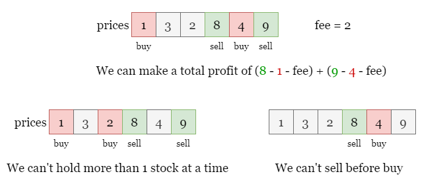
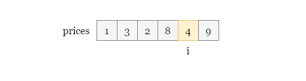
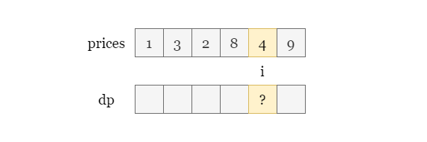
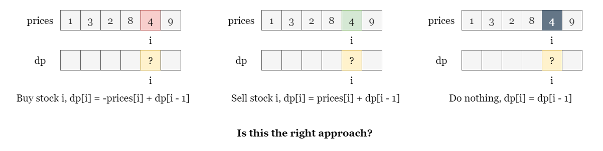
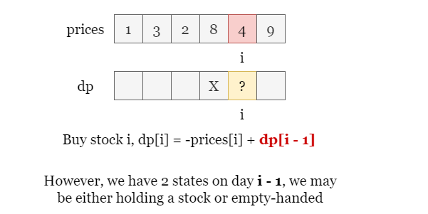
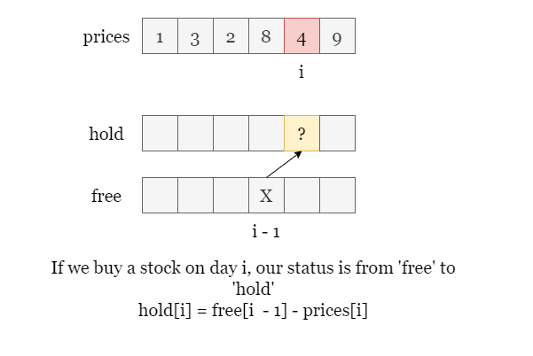
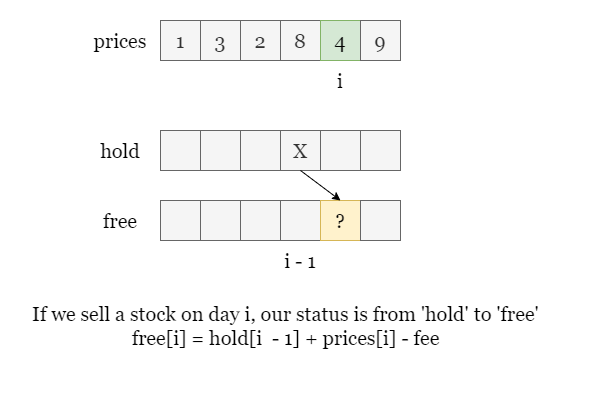
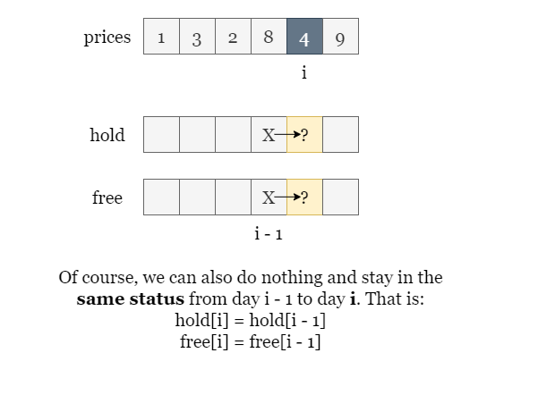

## Solution

---

### Overview

As shown in the picture below, if we do the following operations:

- Buy the stock on day `0`.
- Sell the stock on day `3`.
- Buy the stock on day `4`.
- Sell the stock on day `5`.

Considering the two transaction fees, we can make a total profit of `8`.



However, we have to be aware of some restrictions:

- We can hold at most 1 stock at a time, we can't buy this stock twice.
- We can't sell the stock before we hold it.

---

### Approach 1: Dynamic Programming

#### Intuition

If you are not familiar with dynamic programming, please refer to our [Dynamic Programming Explore Card](https://leetcode.com/explore/featured/card/dynamic-programming/630/an-introduction-to-dynamic-programming/)!

<br>

Given the length of `prices` is `n`, which means that we want to get the maximum profit after `n` days. Assume that we are on day `i`, the profit we can make today is determined by today's operation plus the maximum profit we have made before. The question is, how do we get the maximum profit that can be obtained from the previous `i` days?

We can perform one of the three operations on day `i`:
- Buy the stock.
- Sell the stock.
- Do nothing.

The profit depends on our operations and the maximum profit obtained from the previous $i - 1$ days. To solve the problem on day `i`, we need to use the sub-problem of day $i - 1$. This state transition equation implies that we can solve it with dynamic programming.



Let's first try the most basic dynamic programming approach. We create an array called `dp` of length `n` where $\text{dp}[i]$ records the maximum profit we can obtain from the first `i` days.



Next, we need to find the state transition equation. Recall that we have three operations on day `i`:
- Buy the stock, spend $\text{prices}[i]$.
- Sell the stock, gain $\text{prices}[i]$.
- Do nothing.



But this solution above is **incorrect** because of the constraints given in the problem. Let's analyze where the problem lies. On the day `i`, if we want to sell the stock, the prerequisite is that we must hold the stock. However, we might have two different status on day `i`:
- Currently holding the stock.

- Not currently holding the stock.

The state transition equation in our previous method did not distinguish between these two states.



<br>

Therefore, our dynamic programming array $\text{dp}[i]$ should also have two states:

- The maximum profit when free of stock.
- The maximum profit when holding the stock.

So, we would need to create two arrays, which we call `free` and `hold`, corresponding to the maximum profit that can be obtained without holding the stock or holding the stock in the first `i` days.

Back to the previous analysis, if we buy the stock on the day `i`, the profit obtained is the maximum profit without holding the stock on the previous day i - 1 $free[i - 1]$ plus the profit from buying the stock $-\text{prices}[i]$.



If we sell the stock on the day `i`, our state changes from holding the stock to not holding the stock, so our current profit is the maximum profit of holding the stock on the previous day i - 1 $hold[i - 1]$ plus the profit from selling the stock $\text{prices}[i] - fee$.



Of course, we can also choose to do nothing, in which case our profit on day `i` is equal to the maximum profit of the previous day.

- $\text{free}[i] = free[i - 1]$
- $\text{hold}[i] = hold[i - 1]$



Therefore, we can get the state transition equation for the maximum profit with different states on day `i` as:

- $\text{free}[i] = max(free[i - 1], hold[i - 1] + \text{prices}[i] - fee)$

- $\text{hold}[i] = max(hold[i - 1], free[i - 1] - \text{prices}[i])$

Once we create these two arrays, we will set $\text{free}[0] = 0$ since we will make no profit with an empty hand on the first day, and set $\text{hold}[0] = -\text{prices}[0]$ as we need to buy the stock on day `0` to maintain the holding state.

Then we iterate from day `1` to day $n - 1$, update `free` and `hold` and get the maximum profit from the last day $free[n - 1]$. (There is no point in ending the problem while still holding stock, we might as well sell it on the last day)

<br>

#### Algorithm

1) Create two arrays of length `n`, `free` and `hold`. Set $\text{hold}[0] = -\text{prices}[0]$ and $\text{free}[0] = 0$.

2) Iterate from day `1` to day $n - 1$, on each day `i`:
- Update $\text{hold}[i]$ to the larger of $hold[i - 1]$ and $free[i - 1] - \text{prices}[i]$.
- Update $\text{free}[i]$ to the larger of $free[i - 1]$ and $hold[i - 1] + \text{prices}[i] - fee$.

3) Return $free[i - 1]$ once the iteration ends.

#### Implementation

```python
class Solution:
    def maxProfit(self, prices: List[int], fee: int) -> int:
        n = len(prices)
        hold, free = [0] * n, [0] * n

        # In order to hold a stock on day 0, we have no other choice but to buy it for prices[0].
        hold[0] = -prices[0]

        for i in range(1, n):
            hold[i] = max(hold[i - 1], free[i - 1] - prices[i])
            free[i] = max(free[i - 1], hold[i - 1] + prices[i] - fee)

        return free[-1]
```

#### Complexity Analysis

Let $n$ be the length of the input array `prices`.

* Time complexity: $O(n)$

- We iterate from day `1` to day $n - 1$, which contains $n - 1$ steps.
- At each step, we update $\text{free}[i]$ and $\text{hold}[i]$ which takes $O(1)$.

* Space complexity: $O(n)$

- We create two arrays of length `n` to record the maximum profit with two status on each day.

<br/>

---

### Approach 2: Space-Optimized Dynamic Programming

#### Intuition

In the previous solution, we created two arrays of length `n` to record the maximum profits up to each day.

However, if we look at the state transition equation:

- $\text{hold}[i] = max(hold[i - 1], free[i - 1] - \text{prices}[i])$
- $\text{free}[i] = max(free[i - 1], hold[i - 1] + \text{prices}[i] - fee)$

We can see that the maximum profit up to day `i` ($\text{hold}[i]$ or $\text{free}[i]$) only depends on the maximum profit up to day $i - 1$ ($hold[i - 1]$ and $free[i - 1]$), and we don't need to keep track of the profits from earlier days.

Therefore, we can use only two variables `hold` and `free` to represent the maximum profits in the two states on the current day. When we move to the next day (day `i`), we can simply update these two variables.

- $hold = max(hold, free - \text{prices}[i])$
- $free = max(free, hold + \text{prices}[i] - fee)$

To avoid modifying `hold` before updating `free`, we can do the following:

- $tmp = hold$
- $hold = max(hold, free - \text{prices}[i])$
- $free = max(free, tmp + \text{prices}[i] - fee)$

<br>

#### Algorithm

1) Set $free = 0$ and $hold = -\text{prices}[0]$ as the maximum profit for two status on day `0`.

2) Iterate from day `1` to day $n - 1$, on each day `i`:
- Set $tmp = hold$ so that we record the maximum profit for holding a stock on day $i - 1$.
- Update `hold` to the larger of `hold` and $free - \text{prices}[i]$.
- Update `free` to the larger of `free` and $tmp + \text{prices}[i] - fee$.

3) Return `free` once the iteration ends.

#### Implementation

```python
class Solution:
    def maxProfit(self, prices: List[int], fee: int) -> int:
        n = len(prices)
        hold, free = -prices[0], 0

        for i in range(1, n):
            tmp = hold
            hold = max(hold, free - prices[i])
            free = max(free, tmp + prices[i] - fee)

        return free
```

#### Complexity Analysis

Let $n$ be the length of the input array `prices`.

* Time complexity: $O(n)$

- We iterate from day `1` to day $n - 1$, which contains $n - 1$ steps.
- At each step, we update `free` and `hold` which takes $O(1)$.

* Space complexity: $O(1)$

- We only need to update three parameters `tmp`, `free` and `hold`.

<br/>