[TOC]

## Solution

---

### Overview

The game process may be somewhat complex. Let's start by understanding the game steps and finding the corresponding actions for each step. We can divide this game into several (potentially repeating) steps:

- find
- crush
- drop

Find stands for finding all crushable candies, crush represents the elimination of adjacent candies, while drop involves rearranging the candies and making the ones above fall down. We mention that these steps are potentially repeated because after a drop, the rearranged candies may form new groups of candies to be crushed, requiring us to repeat the steps until we can no longer find a group of crushable candies.

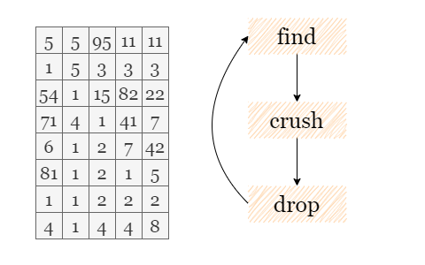

---

### Approach 1: Separate Steps: Find, Crush, Drop

#### Intuition

Starting from the first step: find and mark cells in the current board to be crushed. One simple approach is to check if three candies in the same row or column centered around a particular cell `(r, c)`, are the same. That is, either $\text{board}[r][c] = board[r - 1][c] = board[r + 1][c]$, or $\text{board}[r][c] = \text{board}[r][c - 1] = \text{board}[r][c + 1]$. If certain candies meet these conditions and qualify as crushable candies, we can store their positions.

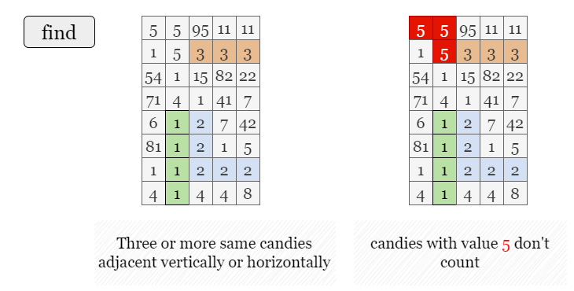

After iterating through all the cells, if no new candies to be crushed are found, it indicates that the game is over. Otherwise, we continue with crushing candies. We modify the values of the stored candy positions to `0`, indicating that they have been eliminated. At this point, we have completed the second step of the game.

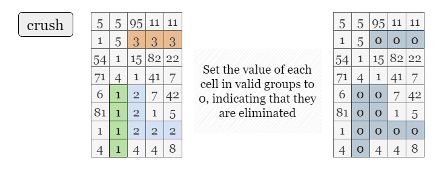

In the third step, we need to make the candies above fall down until they hit the bottom or another candy.

During this process, the candies can only fall downwards, meaning that each column of the board is independent. It would be helpful to discuss them separately for easier computation.

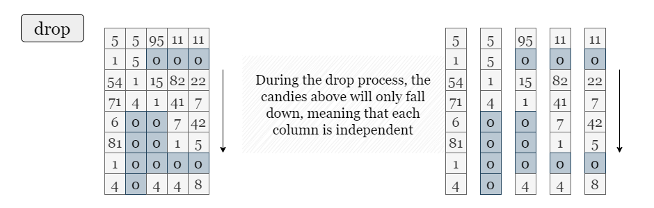

For each column, we traverse from bottom to top. Throughout this process, we keep track of the position of **the lowest 0** value. If the current cell is not 0, it will eventually fall to this lowest 0 position. Therefore, we swap its position with the position of the lowest 0, and raise the position of the lowest 0 by 1.

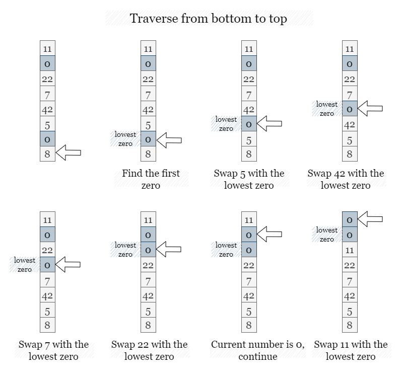

In summary, through the aforementioned three steps, we obtain a new board.

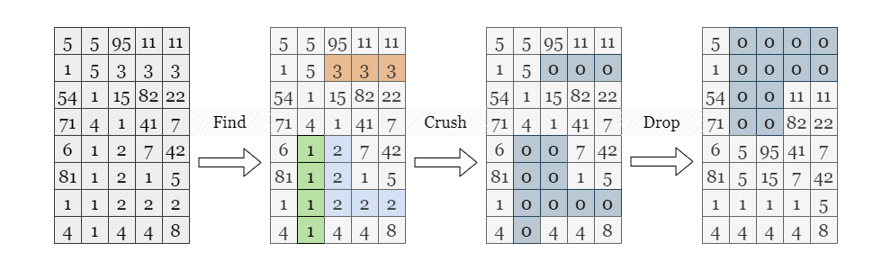

Next, we need to continue checking if there are any crushable candies in the new grid. If we discover new crushable candies, we repeat these steps again.

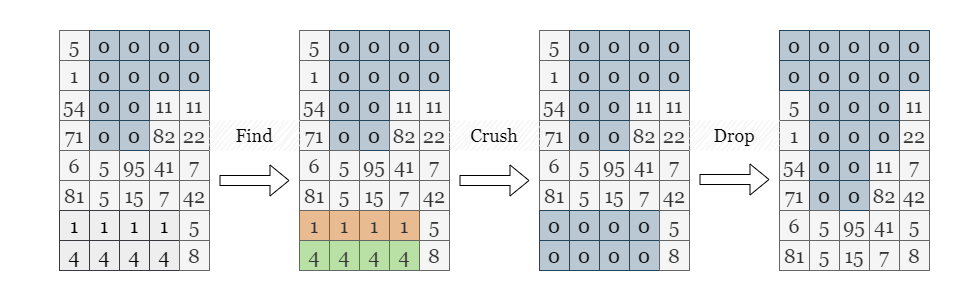

Finally, when no group of crushable candies can be found, it indicates that the game is over.

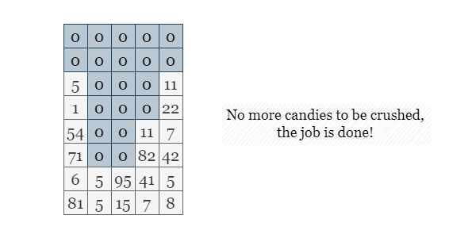

<br>

#### Algorithm

1) Define `find()` to find all crushable candies:
- Initialize an empty set $\text{crushed}_{set}$.
- Iterate over each candy `(r, c)`:
- If $\text{board}[r][c] = 0$, continue.
- If $\text{board}[r][c] = board[r + 1][c] = board[r - 1][c]$, add `(r, c)`, $(r + 1, c)$ and $(r - 1, c)$ to the set. If $\text{board}[r][c] = \text{board}[r][c + 1] = \text{board}[r][c - 1]$, add `(r, c)`, $(r, c + 1)$ and $(r, c - 1)$ to the set.
- Return $\text{crushed}_{set}$.

2) Define $crush(\text{crushed}_{set})$ to mark all crushable candies:
- Iterate over every candy `(r, c)` in $\text{crushed}_{set}$ and set $\text{board}[r][c] = 0$.

3) Define `drop()` to rearrange the candies' new positions based on the rules:
- Iterate over each column `c`.
- For each column, set $\text{lowest}_{zero}$ as `-1` since there is no lowest zero yet.
- Iterate candies `(r, c)` from bottom to top, for each candy $\text{board}[r][c]$. If $\text{board}[r][c]$ is zero, update $\text{lowest}_{zero}$ as $\text{lowest}_{zero} = max(\text{lowest}_{zero}, r)$. If $\text{board}[r][c]$ is non-zero and $\text{lowest}_{zero}$ is not `-1`, then we swap $\text{board}[r][c]$ with $board[\text{lowest}_{zero}][c]$ and decrement $\text{lowest}_{zero}$ by 1.

4) While `find()` returns an non-empty set $\text{crushed}_{set}$:
- Perform $crush(\text{crushed}_{set})$.
- Perform `drop()`.

5) Return `board` when the while loop is complete.

#### Implementation

```python
class Solution:
    def candyCrush(self, board: List[List[int]]) -> List[List[int]]:
        m, n = len(board), len(board[0])

        def find():
            crushed_set = set()

            # Check vertically adjacent candies
            for r in range(1, m - 1):
                for c in range(n):
                    if board[r][c] == 0:
                        continue
                    if board[r][c] == board[r - 1][c] == board[r + 1][c]:
                        crushed_set.add((r, c))
                        crushed_set.add((r - 1, c))
                        crushed_set.add((r + 1, c))

            # Check horizontally adjacent candies
            for r in range(m):
                for c in range(1, n - 1):
                    if board[r][c] == 0:
                        continue
                    if board[r][c] == board[r][c - 1] == board[r][c + 1]:
                        crushed_set.add((r, c))
                        crushed_set.add((r, c - 1))
                        crushed_set.add((r, c + 1))
            return crushed_set

        # Set the value of each candies to be crushed as 0
        def crush(crushed_set):
            for (r, c) in crushed_set:
                board[r][c] = 0

        def drop():
            for c in range(n):
                lowest_zero = -1

                # Iterate over each column
                for r in range(m - 1, -1, -1):
                    if board[r][c] == 0:
                        lowest_zero = max(lowest_zero, r)

                    # Swap current non-zero candy with the lowest zero.
                    elif lowest_zero >= 0:
                        board[r][c], board[lowest_zero][c] = board[lowest_zero][c], board[r][c]
                        lowest_zero -= 1

        # Continue with the three steps until we can no longer find any crushable candies.
        crushed_set = find()
        while crushed_set:
            crush(crushed_set)
            drop()
            crushed_set = find()

        return board
```

#### Complexity Analysis

Let $m \times n$ be the size of the grid `board`.

* Time complexity: $O(m^2 \cdot n^2)$
- Each `find` process takes $O(m \cdot n)$ time as we need to iterate over every cell of `board`.
- There could be at most $O(m \cdot n)$ independent `drop` steps to eliminate all valid candy groups, as shown in the picture below:

    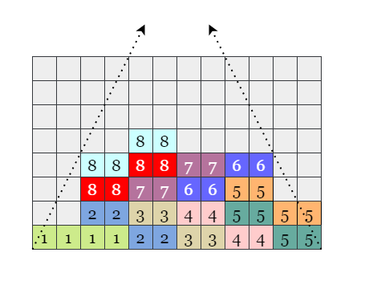

    We can construct the following board where around half of the candies ($\frac{m \cdot n}{2}$) are crushed, and each crush operation eliminates at most two groups (8) of candies. Therefore, we need at least $\frac{m \cdot n}{16}$ drops to obtain the final board.

- In summary, the time complexity in the worst-case scenario is $O(m^2 \cdot n^2)$.

<br>

* Space complexity: $O(m \cdot n)$
- In each `find` step, we store the crushable candies in $\text{crushed}_{set}$, there can be at most $O(m \cdot n)$ candies in the set (imagine all candies are of the same value).

- The `drop` and `crush` steps involve in-place modification and do not require additional space.

<br/>

---

### Approach 2: In-place Modification

#### Intuition

In the previous solution, we require $O(m \cdot n)$ auxiliary space to store the candies that needed to be crushed at each step. Now, we can improve the way we mark the candies, allowing us to directly record the candies that need to be crushed by updating `board` in-place.

We can change the value of the crushed candies to their negative values. For example, if $\text{board}[r][c] = 1$, we change it to $\text{board}[r][c] = -1$. This way, during the `crush` operation, we only need to change all negative values to 0.

However, this approach introduces a new problem. How do we determine other connected crushable candies? For example, as shown in the picture below, consider the column with `[1,1,1,1]`. If we mark the first three candies as `-1`, it becomes `[-1,-1,-1,1]`. According to the original comparing conditions, the last `1` will not be marked as crushable.

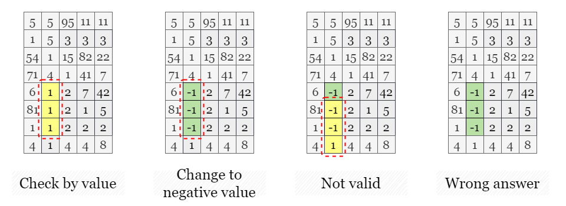

To address this, we can modify the original conditions to compare **absolute values**. With this modification, the last `1` will be changed to `-1`, since all of them have an absolute value of `1`.

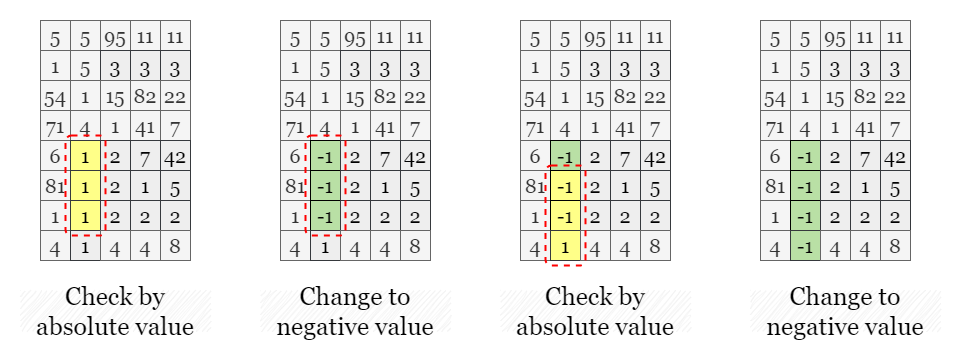

<br>

#### Algorithm

1) Define `find_and_crush()` to find and eliminate all crushable candies:
- Set `complete` as `True`.
- Iterate over each candy `(r, c)`:
- If $\text{board}[r][c] = 0$, continue.
- If $abs(\text{board}[r][c]) = abs(board[r + 1][c]) = abs(board[r - 1][c])$, update $\text{board}[r][c]$, $board[r + 1][c]$ and $board[r - 1][c]$ as their negative absolute values. If $abs(\text{board}[r][c]) = abs(\text{board}[r][c + 1]) = abs(\text{board}[r][c - 1])$, update $\text{board}[r][c]$, $\text{board}[r][c - 1]$ and $\text{board}[r][c + 1]$ as their negative absolute values. Update `complete` as `False`.
- Iterate over `board` and set each negative value as `0`.
- Return `complete`.

2) Define `drop()` to rearrange the candies' new positions based on the rules:
- Iterate over each column `c`.
- For each column, set $\text{lowest}_{zero}$ as `-1` since there is no lowest zero yet.
- Iterate candies `(r, c)` from bottom to top, for each candy $\text{board}[r][c]$. If $\text{board}[r][c]$ is zero, update $\text{lowest}_{zero}$ as $\text{lowest}_{zero} = max(\text{lowest}_{zero}, r)$. If $\text{board}[r][c]$ is non-zero and $\text{lowest}_{zero}$ is not `-1`, then we swap $\text{board}[r][c]$ with $board[\text{lowest}_{zero}][c]$ and decrement $\text{lowest}_{zero}$ by 1.

4) While `find_and_crush()` returns `False`:
- Perform `drop()`.

5) Return `board` when the while loop is complete.

#### Implementation

```python
class Solution:
    def candyCrush(self, board: List[List[int]]) -> List[List[int]]:
        m, n = len(board), len(board[0])

        def find_and_crush():
            complete = True

            # Check vertically adjacent candies
            for r in range(1, m - 1):
                for c in range(n):
                    if board[r][c] == 0:
                        continue
                    if abs(board[r][c]) == abs(board[r - 1][c]) == abs(board[r + 1][c]):
                        board[r][c] = -abs(board[r][c])
                        board[r - 1][c] = -abs(board[r - 1][c])
                        board[r + 1][c] = -abs(board[r + 1][c])
                        complete = False

            # Check horizontally adjacent candies
            for r in range(m):
                for c in range(1, n - 1):
                    if board[r][c] == 0:
                        continue
                    if abs(board[r][c]) == abs(board[r][c - 1]) == abs(board[r][c + 1]):
                        board[r][c] = -abs(board[r][c])
                        board[r][c - 1] = -abs(board[r][c - 1])
                        board[r][c + 1] = -abs(board[r][c + 1])
                        complete = False

            # Set the value of each candies to be crushed as 0
            for r in range(m):
                for c in range(n):
                    if board[r][c] < 0:
                        board[r][c] = 0
            return complete

        def drop():
            for c in range(n):
                lowest_zero = -1

                # Iterate over each column
                for r in range(m - 1, -1, -1):
                    if board[r][c] == 0:
                        lowest_zero = max(lowest_zero, r)

                    # Swap current non-zero candy with the lowest zero.
                    elif lowest_zero >= 0:
                        board[r][c], board[lowest_zero][c] = board[lowest_zero][c], board[r][c]
                        lowest_zero -= 1

        # Continue with the three steps until we can no longer find any crushable candies.
        while not find_and_crush():
            drop()

        return board
```

#### Complexity Analysis

Let $m \times n$ be the size of the grid `board`.

* Time complexity: $O(m^2 \cdot n^2)$

- Each `find_and_crush` process takes $O(m \cdot n)$ time as we need to iterate over every cell of `board`.
- There could be at most $O(m \cdot n)$ independent `drop` steps to eliminate all valid candy groups.
- In summary, the time complexity in the worst-case scenario is $O(m^2 \cdot n^2)$.

* Space complexity: $O(1)$

- Both the function `drop` and `find_and_crush` involve in-place modification and do not require additional space.

<br/>