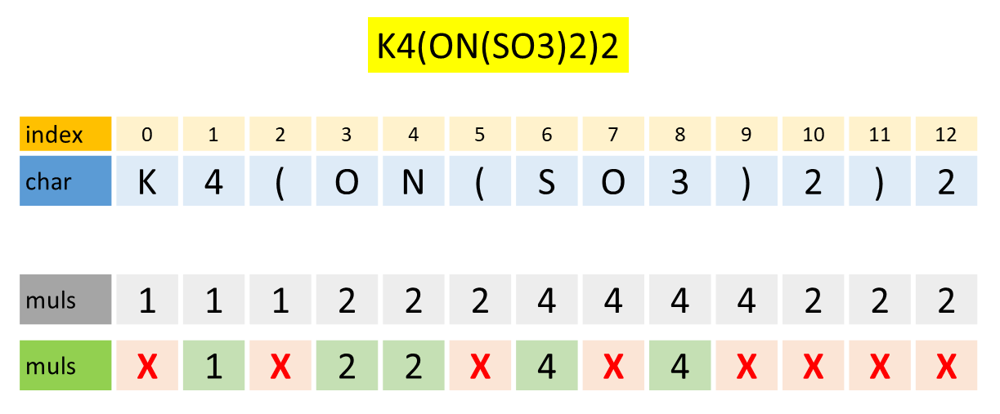

## Solution

---

### Overview

In this problem, we are given a string `formula`, which represents a **valid** chemical formula. The `formula` follows certain rules, as mentioned in the problem description. We are supposed to return the count of each atom in the formula.

> An atom contains a UPPERCASE letter followed by zero or more lowercase letters.

Since the problem revolves around `formula`, let's dissect the `formula` and understand what it contains.

A `formula` can contain the following

- **UPPERCASE LETTER**: `A`, `B` ... `Z`. Let's denote the group as **U**.

- **lowercase letter**: `a`, `b` ... `z`. Let's denote the group as **L**.

- **Digits**: `0`, `1` ... `9`. Let's denote the group as **D**.

- **Left Parenthesis**: `(`

- **Right Parenthesis**: `)`

Can we have **L** followed by **D**?
Yes, the formula can contain a lowercase letter followed by a digit.

Can we have **D** followed by **L**?
No, the formula cannot contain a digit followed by a lowercase letter. An atom begins with a UPPERCASE letter.

Hence, only certain groups can be followed by certain groups. Let's summarise it in a table. The (row, column) of this table comments on whether the group in the row can be followed by the group in the column, and further explains the significance of the combination.

|   | **U** | **L** | **D** | `(` | `)` |
|---|---|---|---|---|---|
| **U** | Yes. It will signify that the current atom has a one-character representation with an immediate count as 1 | Yes. It will signify that the current atom has a multi-character representation | Yes. It will signify that the current atom has a one-character representation with a count greater than 1 | Yes. It will signify that the current atom has a one-character representation with an immediate count as 1 | Yes. It will signify that the current atom has a one-character representation with an immediate count as 1 |
| **L** | Yes. It signifies that the atom of which this lowercase letter is a part has a multi-character representation with an immediate count as 1 | Yes. It signifies that the atom of which this lowercase letter is a part has a multi-character representation | Yes. It signifies that the atom of which this lowercase letter is a part has a multi-character representation with a count greater than 1 | Yes. It signifies that the atom of which this lowercase letter is a part has a multi-character representation with an immediate count as 1 | Yes. It signifies that the atom of which this lowercase letter is a part has multi-character representation with immediate count as 1 |
| **D** | Yes. The immediate count of the current atom is greater than 1 | No. A digit cannot be followed by a lowercase letter | Yes. The immediate count of the current atom is greater than or equal to 10 | Yes. The immediate count of the current atom is greater than 1 | Yes. The immediate count of the current atom is greater than 1 |
| `(` | Yes. It signifies the beginning of a grouped formula | No. An atom begins with a UPPERCASE LETTER | No. Count cannot be allotted to a left parenthesis | Yes. It signifies the beginning of a grouped formula | No. A left parenthesis cannot be immediately followed by a right parenthesis |
| `)` | Yes. It signifies the end of a grouped formula | No. An atom begins with a UPPERCASE LETTER | Yes. It signifies the end of a grouped formula followed by the count | Yes. It signifies the end of a grouped formula, and the beginning of a new formula | Yes. It signifies the end of two nested grouped formulas |

The analysis might look a bit overwhelming, but it is important to understand the structure of a valid `formula`.

We can define the following **skeleton** to solve the problem.

> To find the count of each atom in the formula, we need to scan the string `formula`, and extract the atoms which may be followed by certain digits representing count. We need to extract those digits and save them as the count of the atom. If no digits are there, we will take the count as 1.
>
> The parenthesis signifies the beginning of the nested formula, which we can analyze (and add) as mentioned in the above paragraph. The count of the nested formula will be multiplied by the count of atoms in the nested formula.

Before moving further, let's emphasize the fact that for every character that we are going to scan, we need to check if it is in **U**, **L**, **D**, or equal to either of `(` or `)`.

<details>

<summary>For this, we can define helper functions that will be helpful in the implementation. Click here to learn more about the helper functions.</summary>

<p>

- $\text{is}_{upper}(char)$: Returns `True` if `char` is an UPPERCASE LETTER, else `False`.

    The logic can be as follows:
- $char \ge 'A' and char \le 'Z'$

- $'A' \le char \le 'Z'$
- The ASCII value of `char` lies between `65` and `90` (inclusive).

    It is worth noting that many programming languages provide built-in functions to check if a character is a UPPERCASE LETTER.
- In Python, we can use `char.isupper()`. It is a method of the `str` class. More details can be found [here](https://docs.python.org/3/library/stdtypes.html#str.isupper).

- In Java, we can use `Character.isUpperCase(char)`. It is a static method of the `Character` class. More details can be found [here](https://docs.oracle.com/en/java/javase/11/docs/api/java.base/java/lang/Character.html#isUpperCase(char)).
- In C++, we can use `std::isupper(char)`. It is a function of the `cctype` library. More details can be found [here](https://en.cppreference.com/w/cpp/string/byte/isupper).

- $\text{is}_{lower}(char)$: Returns `True` if `char` is a lowercase letter, else `False`.

    The logic can be as follows:
- $char \ge 'a' and char \le 'z'$

- $'a' \le char \le 'z'$
- The ASCII value of `char` lies between `97` and `122` (inclusive).

    It is worth noting that many programming languages provide built-in functions to check if a character is a lowercase letter.

- In Python, we can use `char.islower()`. It is a method of the `str` class. More details can be found [here](https://docs.python.org/3/library/stdtypes.html#str.islower).

- In Java, we can use `Character.isLowerCase(char)`. It is a static method of the `Character` class. More details can be found [here](https://docs.oracle.com/en/java/javase/11/docs/api/java.base/java/lang/Character.html#isLowerCase(char)).

- In C++, we can use `std::islower(char)`. It is a function of the `cctype` library. More details can be found [here](https://en.cppreference.com/w/cpp/string/byte/islower).

- $\text{is}_{digit}(char)$: Returns `True` if `char` is a digit, else `False`.

    The logic can be as follows:
- $char \ge '0' and char \le '9'$

- $'0' \le char \le '9'$
- The ASCII value of `char` lies between `48` and `57` (inclusive).

    It is worth noting that many programming languages provide built-in functions to check if a character is a digit.
- In Python, we can use `char.isdigit()`. It is a method of the `str` class. More details can be found [here](https://docs.python.org/3/library/stdtypes.html#str.isdigit).

- In Java, we can use `Character.isDigit(char)`. It is a static method of the `Character` class. More details can be found [here](https://docs.oracle.com/en/java/javase/11/docs/api/java.base/java/lang/Character.html#isDigit(char)).
- In C++, we can use `std::isdigit(char)`. It is a function of the `cctype` library. More details can be found [here](https://en.cppreference.com/w/cpp/string/byte/isdigit).

- `str_to_int(string)`: Returns the integer representation of the string. It is assumed that the string contains only digits.

    It is worth noting that many programming languages provide built-in functions to convert a string to an integer.
- In Python, we can use `int(string)`. More details can be found [here](https://docs.python.org/3/library/functions.html#int).

- In Java, we can use `Integer.parseInt(string)`. More details can be found [here](https://docs.oracle.com/en/java/javase/11/docs/api/java.base/java/lang/Integer.html#parseInt(java.lang.String)).
- In C++, we can use `std::stoi(string)`. More details can be found [here](https://en.cppreference.com/w/cpp/string/basic_string/stol).

</p>

<br>

</details>

<br/>

With all tools in our hands, let's understand various ways to solve the problem.

---

### Approach 1: Recursion

#### Intuition

Let's again focus on the **skeleton** that we defined in the [Overview](#overview) section.

> To find the count of each atom in the formula, we need to scan the string `formula`, and extract the atoms which may be followed by certain digits representing count. We need to extract those digits and save them as the count of the atom. If no digits are there, we will take the count as 1.
>
> The parenthesis signifies the beginning of the nested formula, which we can analyze (and add) as mentioned in the above paragraph. The count of the nested formula will be multiplied by the count of atoms in the nested formula.

In the second paragraph, we are calling the methodology defined in the first paragraph. In other words, the skeleton uses the skeleton itself. Is there a programming paradigm that uses the same concept?
Yes, it is called **recursion**.

> **Recursion** is a programming paradigm where a function calls itself. The function solves a smaller instance of the same problem and then combines the result to solve the original problem. To avoid infinite recursion, there is a base case that stops the recursion.
>
> To deeply understand recursion, it is advised to visit [Recursion-I](https://leetcode.com/explore/learn/card/recursion-i/) and [Recursion-II](https://leetcode.com/explore/learn/card/recursion-ii/) Explore Cards.

Hence, we only need to narrow our attention to solve the *non-nested formula*. The *nested formula* will be solved using the same methodology.

Now, for parsing a *non-nested formula* (or recursively *nested formula*), we need information of the starting index of the formula. What can be the character at the starting index?

- **U**: Yes, it should be a UPPERCASE LETTER.

- **L**: No, an atom cannot start with a lowercase letter.

- **D**: No, an atom cannot start with a digit.

- `(`: Yes, it can be a left parenthesis. However, in this case, we again need to recursively parse the formula inside the parenthesis, until the corresponding right parenthesis is found.

- `)`: No, a formula cannot start with a right parenthesis. However, it is important since it signifies the end of a nested formula.

What should we return after parsing the formula?
Any data structure that stores the (atom, count) as (key, value) pair. The data structure should be able to handle multiple atoms with their counts. A `dictionary` in Python, `HashMap` in Java, or $\text{unordered}_{map}$ in C++ can be used.

Let's dive more into the nitty-gritty of the implementation. Since we are using the index as the input parameter, our entire decision-making will be based on the character at the index. The character can be of five types, as defined in the [Overview](#overview). Assuming our parsing is correct up to this index, the decision cases can be as follows.

- **U**: It signifies the beginning of another atom. Thus, we need to reset our $\text{curr}_{atom}$ variable in which we will save the current atom.

    Before resetting, we need to check if the $\text{curr}_{atom}$ is empty or not. If it is not empty, we need to save/add the count of the $\text{curr}_{atom}$ in the local dictionary $\text{curr}_{map}$ created for the current formula. If the variable $\text{curr}_{count}$ is empty, we will take the count as 1. If it is not empty, we will take the count as $\text{curr}_{count}$.

    After saving the $\text{curr}_{atom}$ and $\text{curr}_{count}$ in $\text{curr}_{map}$, we will reset the $\text{curr}_{count}$ to an empty string and $\text{curr}_{atom}$ to the current UPPERCASE LETTER.

- **L**: It is the continuation of the current atom. We will append the lowercase letter to the $\text{curr}_{atom}$.

- **D**: It signifies the count of the current atom. We will append the digit to the $\text{curr}_{count}$.

- `(`: It signifies the beginning of a nested formula. We will recursively parse the formula inside the parentheses. The result of the nested formula will be added to the $\text{curr}_{map}$.

- `)`: It signifies the end of a nested formula. The last saved $\text{curr}_{atom}$ and $\text{curr}_{count}$ should be saved in the $\text{curr}_{map}$.

    Should we return $\text{curr}_{map}$ right away?
    No, we need to multiply the multiplicity of the nested formula by the count of the atoms in the nested formula. For this, we will scan the digits after the right parentheses and save them in `multiplier`. If the `multiplier` is not empty, we will multiply the count of the atoms in the $\text{curr}_{map}$ with the `multiplier` and return the $\text{curr}_{map}$.

We are not returning the index in the recursive function. However, there is a workaround. We can use a global variable `index` which will be updated in the recursive function. Hence, at any point in time, the `index` will point to the character that we are currently parsing.

We are doing recursion, so we need a base case. What can be the base case?
Well, the base case can be when the `index` is equal to the length of the `formula`. In this case, we need to save the $\text{curr}_{atom}$ and $\text{curr}_{count}$ in the $\text{curr}_{map}$ and return the $\text{curr}_{map}$.

> **Additional Information:** *Recursive Descent Parser* is a top-down parser that recursively parses the input. However, it may not be the best choice for parsing complex grammars.
>
> If the grammar is unambiguous and the grammar is LL(1) (Left-to-right, Leftmost derivation, 1 lookahead), then a Recursive Descent Parser is a good choice.
>
> For our `formula`, we can have the following grammar.
> - $\mathcal{F} \rightarrow \mathcal{SF} \; \vert \; \epsilon$
> - $\mathcal{S} \rightarrow (\mathcal{F})D \; \vert \; \mathcal{A} \mathcal{D}$
> - $\mathcal{A} \rightarrow \mathcal{U} \; \vert \; \mathcal{UL}$
> - $\mathcal{D} \rightarrow \mathcal{DD} \; \vert \; \epsilon$
> - $\mathcal{U} \rightarrow A \; \vert \; B \; \vert \; C \; \vert \; \dots \; \vert \; Z$
> - $\mathcal{L} \rightarrow a \; \vert \; b \; \vert \; c \; \vert \; \dots \; \vert \; z$
> - $\mathcal{D} \rightarrow 0 \; \vert \; 1 \; \vert \; 2 \; \vert \; \dots \; \vert \; 9$
>
> Here, terminals are $($, $)$, $A$, $B$, $C$, $\dots$, $Z$, $a$, $b$, $c$, $\dots$, $z$, $0$, $1$, $2$, $\dots$, $9$.
>
> The above grammar is Context Free Grammar (Type-2 in [Chomsky Hierarchy](https://en.wikipedia.org/wiki/Chomsky_hierarchy)). It can be recognized by Pushdown Automata, which uses a stack to track nested parenthesis. This fact will be mildly used in [next approach](#intuition-1).

We need to sort the map with respect to the atoms. This can be done using the built-in sorting functions of the programming language.

Finally, we need to generate the answer string. We will iterate over the sorted map and append the atom to the answer string. If the count of the atom is greater than 1, we will append the count of the atom to the answer string.

With all the information in hand, let's implement the solution.

#### Algorithm

1. Define a global variable `index` and set it to 0. It will be used to keep track of the current index in the `formula`.

2. Define a recursive function $\text{parse}_{formula}()$ which will return a dictionary containing the count of atoms in the formula.

- Define a hashmap $\text{curr}_{map}$ which will store the count of atoms in the current formula.

- Define two strings $\text{curr}_{atom}$ and $\text{curr}_{count}$ which will store the current atom and count. Both will be initialized to an empty string.

- Using the global variable `index`, iterate over the characters of the `formula`.

- If the character at the current `index` is an UPPERCASE LETTER:

- Save the previous atom and count in the $\text{curr}_{map}$ if it exists.

- Update the $\text{curr}_{atom}$ to the current UPPERCASE LETTER and $\text{curr}_{count}$ to an empty string.

- If the character at the current index is a lowercase letter, append the lowercase letter to the $\text{curr}_{atom}$.

- If the character at the current index is a digit, append the digit to the $\text{curr}_{count}$.

- If the character at the current index is a left parenthesis:

- Increment the `index`, and parse the formula inside the parenthesis by recursively calling the $\text{parse}_{formula}()$ function. Store the result in a hashmap $\text{nested}_{map}$.

- Add the count of atoms in the $\text{nested}_{map}$ to the $\text{curr}_{map}$.

- If the character at the current index is a right parenthesis:

- Save the previous atom and count in the $\text{curr}_{map}$ if it exists.

- Find the integer multiplier after the right parenthesis and store it in a string `multiplier`. If the `multiplier` is not empty, multiply the count of atoms in the $\text{curr}_{map}$ with the `multiplier`.

- Return the $\text{curr}_{map}$. Ensure that `index` points to the first non-digit character after the right parenthesis.

- Before returning the $\text{curr}_{map}$, save the last atom and count in the $\text{curr}_{map}$ if it exists. Return the $\text{curr}_{map}$.

3. Parse the formula using the $\text{parse}_{formula}()$ function and store the result in $\text{final}_{map}$.

4. Sort the $\text{final}_{map}$ with respect to the atoms (which are the keys of the map).

5. Generate the answer string `ans` by iterating over the sorted map. Append the atom to the `ans`. If the count of the atom is greater than 1, append the count of the atom to the `ans`.

6. Return the `ans`.

#### Implementation

```python
class Solution:
    def countOfAtoms(self, formula: str) -> str:
        # Length of the formula
        n = len(formula)

        # Current index. It should be global as needs
        # to be updated in the recursive function
        self.index = 0

        # Recursively parse the formula
        def parse_formula():
            # Local variable
            curr_map = defaultdict(int)
            curr_atom = ""
            curr_count = ""

            # Iterate until the end of the formula
            while self.index < n:
                # UPPERCASE LETTER
                if formula[self.index].isupper():
                    # Save the previous atom and count
                    if curr_atom:
                        if curr_count == "":
                            curr_map[curr_atom] += 1
                        else:
                            curr_map[curr_atom] += int(curr_count)

                    curr_atom = formula[self.index]
                    curr_count = ""
                    self.index += 1

                # lowercase letter
                elif formula[self.index].islower():
                    curr_atom += formula[self.index]
                    self.index += 1

                # Digit. Concatenate the count
                elif formula[self.index].isdigit():
                    curr_count += formula[self.index]
                    self.index += 1

                # Left Parenthesis
                elif formula[self.index] == "(":
                    self.index += 1
                    nested_map = parse_formula()
                    for atom in nested_map:
                        curr_map[atom] += nested_map[atom]

                # Right Parenthesis
                elif formula[self.index] == ")":
                    # Save the last atom and count of nested formula
                    if curr_atom:
                        if curr_count == "":
                            curr_map[curr_atom] += 1
                        else:
                            curr_map[curr_atom] += int(curr_count)

                    self.index += 1
                    multiplier = ""
                    while self.index < n and formula[self.index].isdigit():
                        multiplier += formula[self.index]
                        self.index += 1
                    if multiplier:
                        multiplier = int(multiplier)
                        for atom in curr_map:
                            curr_map[atom] *= multiplier

                    return curr_map

            # Save the last atom and count
            if curr_atom:
                if curr_count == "":
                    curr_map[curr_atom] += 1
                else:
                    curr_map[curr_atom] += int(curr_count)

            return curr_map

        # Parse the formula
        final_map = parse_formula()

        # Sort the final map
        final_map = dict(sorted(final_map.items()))

        # Generate the answer string
        ans = ""
        for atom in final_map:
            ans += atom
            if final_map[atom] > 1:
                ans += str(final_map[atom])

        return ans
```

**Implementation Note:** Let's implement the above idea slightly differently. In the code, we can see that we return the $\text{curr}_{map}$ if $\text{formula}[index]$ is `')'`. This we can merge with the last return statement. Moreover, whenever we encounter a UPPERCASE LETTER, we can find corresponding lowercase letters and digits in one go.

```python
class Solution:
    def countOfAtoms(self, formula: str) -> str:
        # Length of the formula
        n = len(formula)

        # Current index. It should be global as needs
        # to be updated in the recursive function
        self.index = 0

        # Recursively parse the formula
        def parse_formula():
            # To save the count of atoms in the formula
            curr_map = defaultdict(int)

            # Iterate until the right parenthesis or end of the formula
            while self.index < n and formula[self.index] != ")":
                # If left parenthesis, do recursion
                if formula[self.index] == "(":
                    self.index += 1
                    nested_map = parse_formula()
                    for atom in nested_map:
                        curr_map[atom] += nested_map[atom]

                # Otherwise, it should be UPPERCASE LETTER
                # Extract the atom and count in one go.
                else:
                    curr_atom = formula[self.index]
                    self.index += 1
                    while self.index < n and formula[self.index].islower():
                        curr_atom += formula[self.index]
                        self.index += 1

                    curr_count = ""
                    while self.index < n and formula[self.index].isdigit():
                        curr_count += formula[self.index]
                        self.index += 1

                    if curr_count == "":
                        curr_map[curr_atom] += 1
                    else:
                        curr_map[curr_atom] += int(curr_count)

            # If the right parenthesis, extract the multiplier
            # and multiply the count of atoms in the curr_map
            self.index += 1
            multiplier = ""
            while self.index < n and formula[self.index].isdigit():
                multiplier += formula[self.index]
                self.index += 1

            if multiplier:
                multiplier = int(multiplier)
                for atom in curr_map:
                    curr_map[atom] *= multiplier

            return curr_map

        # Parse the formula
        final_map = parse_formula()

        # Sort the final map
        final_map = dict(sorted(final_map.items()))

        # Generate the answer string
        ans = ""
        for atom in final_map:
            ans += atom
            if final_map[atom] > 1:
                ans += str(final_map[atom])

        return ans
```

**Task:** Global variables are *not* recommended in programming. Readers are encouraged to implement and comment below their recursive solution without using global variables.

#### Complexity Analysis

Let $N$ be the length of the `formula`.

* Time complexity: $O(N^2)$

    The recursive function $\text{parse}_{formula}()$ will be called $O(N)$ times.

    However, we are iterating over the atoms of the nested formula to add the count to the current formula. This will take time equal to the number of atoms in the nested formula. The number of atoms in the nested formula can be equal to $O(N)$. Thus, the time complexity of the recursive function will be $O(N^2)$.

    > One such example of worst case is `(A(B(C(D(E(F(G(H(I(J(K(L(M(N(O(P(Q(R(S(T(U(V(W(X(Y(Z)2)2)2)2)2)2)2)2)2)2)2)2)2)2)2)2)2)2)2)2)2)2)2)2)2)`. In this case, whenever we encounter a right parenthesis, we will have to iterate over all the atoms in the nested formula to add the count to the current formula.

    > In actual it is $O(PN)$ where $P$ is the number of paranthese pairs. Here $P$ can be at most $N/2$, or $P = O(N)$. However, $P$ is not a function of input size. Hence, we shouldn't consider it in the time complexity.

    Sorting will take $O(N \log N)$ time. This may vary depending on the implementation of the sorting algorithm in the programming language. Generating the answer string will take $O(N)$ time.

    Hence, the overall time complexity will be $O(N^2)$.

* Space complexity: $O(N)$

    The space complexity will be $O(N)$ due to the space used by the recursive function call stack.

    The space used by the $\text{final}_{map}$ will be $O(N)$. Moreover, we are sorting the $\text{final}_{map}$. In sorting, some extra space is used. The space complexity depends on the implementation of the sorting algorithm in the programming language, but it will be $O(N)$.

    The space used by the answer string `ans` will be $O(N)$.

    Hence, the overall space complexity will be $O(N)$.

---

### Approach 2: Stack

#### Intuition

The [Approach 1](#approach-1-recursion) uses recursion to parse the formula. The recursion is a powerful tool to solve problems where the structure of the input is recursive. Recursion internally uses a stack to keep track of the function calls.

> Unfolding a recursion can be done by replacing the role of the system call stack. At each occurrence of recursion, we push the parameters as a new element into the data structure that we created, instead of invoking a recursion. More details can be found in [Recursion explore card](https://leetcode.com/explore/learn/card/recursion-ii/503/recursion-to-iteration/2693/)

> **Stack** is a linear data structure that follows the Last In First Out (LIFO) principle. To understand the stack in depth, it is advised to visit [Stack explore card](https://leetcode.com/explore/learn/card/queue-stack/230/usage-stack/1369/).

In this approach, we will unfold the recursion using a stack. Instead of making a recursive call to parse the formula inside the parenthesis, we will use a stack to keep track of the atoms and their counts of the nested formula. The result of the nested formula will be added to the current formula (which itself may be a nested formula for some other formula).

Hence, in the stack, our initial top element would be an empty hashmap. It will store the final count of atoms in the formula.

We will populate the hashmap as we parse the formula. When we encounter a left parenthesis, we will push another empty hashmap to the stack. It will store the count of atoms in the nested formula. When we encounter the corresponding right parenthesis, we will pop the top element from the stack, multiply the count with the multiplicity of the nested formula, and add the count to the current formula (which would then be on the top of the stack).

Since each left parenthesis will have a corresponding right parenthesis, in the end, the stack will have only one element (which we pushed initially). This element will contain the total count of atoms in the formula.

> **Additional Information:** As mentioned in the [intuition of Approach 1](#intuition), the grammar of the `formula` can be recognized by Pushdown Automata, which uses a stack. Hence, this approach is inspired by pushdown automata.

The following animation visualizes the intuition for the input `"Na2ZnRb5(PuS11(SH)6W)2(H2S)Unu8Pu"`

!?!../Documents/726/726_slideshow_stack.json:960,540!?!
<br/>

Readers are encouraged to implement the solution on their own.

#### Algorithm

1. Initialize a stack `stack`. The top element of the stack will be an empty hashmap. It will store the count of atoms in the `formula`.

2. Initialize the integer `index` to 0. It will keep track of the current character in the `formula`.

3. Iterate over the characters of the `formula` using the index `index`.

- If the character at the current index is a left parenthesis, push an empty hashmap to the stack. It will store the count of atoms in the nested formula.

- If the character at the current index is a right parenthesis, pop the top element from the `stack`.

- Find the multiplier after the right parenthesis and store it in `multiplier`. If the `multiplier` is not empty, multiply the count of atoms in the popped hashmap with the `multiplier`.

- Add the count of atoms in the popped hashmap to the hashmap which is on the top of the `stack`.

- Otherwise, it should be a UPPERCASE LETTER. Extract the complete atom with frequency and add it to the hashmap which is on the top of the `stack`.

4. Sort the hashmap which is on the top of the `stack` using the keys.

5. Generate the answer string `ans` by iterating over the sorted hashmap. Append the atom to the `ans`. If the count of the atom is greater than 1, append the count of the atom to the `ans`.

6. Return the `ans`.

#### Implementation

```python
class Solution:
    def countOfAtoms(self, formula: str) -> str:
        # Stack to keep track of the atoms and their counts
        stack = [defaultdict(int)]

        # Index to keep track of the current character
        index = 0

        # Parse the formula
        while index < len(formula):
            # If left parenthesis, insert a new hashmap to the stack. It will
            # keep track of the atoms and their counts in the nested formula
            if formula[index] == "(":
                stack.append(defaultdict(int))
                index += 1

            # If right parenthesis, pop the top element from the stack
            # Multiply the count with the multiplicity of the nested formula
            elif formula[index] == ")":
                curr_map = stack.pop()
                index += 1
                multiplier = ""
                while index < len(formula) and formula[index].isdigit():
                    multiplier += formula[index]
                    index += 1
                if multiplier:
                    multiplier = int(multiplier)
                    for atom in curr_map:
                        curr_map[atom] *= multiplier

                for atom in curr_map:
                    stack[-1][atom] += curr_map[atom]

            # Otherwise, it must be a UPPERCASE LETTER. Extract the complete
            # atom with frequency, and update the most recent hashmap
            else:
                curr_atom = formula[index]
                index += 1
                while index < len(formula) and formula[index].islower():
                    curr_atom += formula[index]
                    index += 1

                curr_count = ""
                while index < len(formula) and formula[index].isdigit():
                    curr_count += formula[index]
                    index += 1

                if curr_count == "":
                    stack[-1][curr_atom] += 1
                else:
                    stack[-1][curr_atom] += int(curr_count)

        # Sort the final map
        final_map = dict(sorted(stack[0].items()))

        # Generate the answer string
        ans = ""
        for atom in final_map:
            ans += atom
            if final_map[atom] > 1:
                ans += str(final_map[atom])

        return ans
```

#### Complexity Analysis

Let $N$ be the length of the `formula`.

* Time complexity: $O(N^2)$

    The stack will have at most $O(N)$ elements. Each element will be popped and pushed at most once. However, since we need to revisit the atoms in the nested formula to add the count to the current formula, in the worst case, the time complexity of the stack operations will be $O(N^2)$.

    Sorting will take $O(N \log N)$ time. This may vary depending on the implementation of the sorting algorithm in the programming language. Generating the answer string will take $O(N)$ time.

    Hence, the overall time complexity will be $O(N^2)$.

* Space complexity: $O(N)$

    The space used by the `stack` will be $O(N)$.

    The space used by the $\text{final}_{map}$ will be $O(N)$. Moreover, we are sorting the $\text{final}_{map}$. In sorting, some extra space is used. The space complexity depends on the implementation of the sorting algorithm in the programming language. However, it will be $O(N)$.

    The space used by the answer string `ans` will be $O(N)$.

    Hence, the overall space complexity will be $O(N)$.

---

### Approach 3: Regular Expression

#### Intuition

In this problem, we are parsing a string to extract the atoms and their counts. Parsing is often associated with regular expressions. Regular expressions are a powerful tool to match patterns in strings.

> **Regular Expression** is a sequence of characters that define a search pattern. It is used to match character combinations in strings. To understand regular expressions in depth, readers can solve [Regular Expression Matching](https://leetcode.com/problems/regular-expression-matching/description/) problem.
>
> To understand the regular expression more formally, readers can visit [Wikipedia](https://en.wikipedia.org/wiki/Regular_expression#Formal_language_theory)

Let's understand a few examples of regular expressions used in daily life.

- **Dates** can be matched using regular expressions. For example, a date in the format `mm/dd/yyyy` can be matched using the regular expression $(0[1-9]|1[0-2])/(0[1-9]|[12][0-9]|3[01])/\d{4}$.

- `(0[1-9] | 1[0-2])` signifies the month should be between 01 and 12. It briefly lists `01`, `02`, `03`, `04`, `05`, `06`, `07`, `08`, `09`, `10`, `11`, and `12`. The `|` signifies logical OR.

- $(0[1-9] | [12][0-9] | 3[01])$ signifies the day should be between 01 and 31. It briefly lists `01`, `02`, `03`, `04`, `05`, `06`, `07`, `08`, `09`, `10`, `11`, `12`, `13`, `14`, `15`, `16`, `17`, `18`, `19`, `20`,

- `\d{4}` signifies the year should be a 4-digit number. The `\d` is used to match a digit, and `{4}` is used to convey that there should be exactly 4 digits.

- **Phone Numbers** can be matched using regular expressions. For example, a phone number in the format `xxx-xxx-xxxx` can be matched using the regular expression `\d{3}-\d{3}-\d{4}`.

- **Emails** can be validated using $^[a-zA-Z0-9._\%+-]+@[a-zA-Z0-9.-]+\.[a-zA-Z]{2,}$$

- To **ensure a strong password** we can use $^(?=.*[a-z])(?=.*[A-Z])(?=.*\d)(?=.*[@$!%*?&])[A-Za-z\d@$!\%*?\&]{8,}$$. It will ensure that the password should have at least 8 characters, one UPPERCASE letter, one lowercase letter, one digit, and one special character.

> It is worth noting that in different programming languages, the syntax of regular expressions can vary. Hence, it is **strongly advised** to visit the official documentation of the programming language. Scroll down to [implementation](#implementation-2) for language-specific notes.

**How is regular expression relevant to this problem?**

The atom along with its count is a regular expression
- It begins with an UPPERCASE LETTER,
- Followed by zero or more lowercase letters,
- Followed by zero or more digits.

The regular expression will be $UL^*D^*$. In code, it will be `[A-Z][a-z]*\d*`. Hence, we can extract the atom and their count using this regular expression.

> Since we want atoms and count separately, we will use two tuples. The first tuple will contain the atom and the second tuple will contain the count. It will be `([A-Z][a-z]*)(\d*)`.

However, we didn't take into account the nestedness. For that, let's extract the parenthesis as well.

- The regular expression for the left parenthesis will be `\(`.
- The regular expression for the right parenthesis followed by the multiplier will be `(\))(\d*)`. The grouping ensures that we can extract the multiplier separately.

Hence, we can scan these five entities (atom, count, left parenthesis, right parenthesis, and multiplier) in the `formula` using regular expressions.

As done in [stack approach](#approach-2-stack), whenever we encounter a left parenthesis, we will push an empty hashmap to the stack. Whenever we encounter a right parenthesis, we will pop the top element from the stack, multiply the count with the multiplicity of the nested formula, and add the count to the current formula (which would then be on the top of the stack).

> **Additional Information:** In [Approach 1](#intuition), we mentioned that `formula` can be represented using Context Free Grammar (CFG).
>
> In this approach we are using regular expressions to parse the `formula`. Regular expressions can be represented using Regular Grammar.
>
> Regular Grammar (Type-3) is a subset of CFG (Type-2). It is less expressive than CFG. For CFG, we have *pushdown automata*, while for Regular Grammar, we have *finite automata*.

**We are using stack, then how is it different from [Approach 2](#approach-2-stack)?**
In this approach, we won't be manually extracting atoms and counts, it will be done using regular expressions. We will be using stack only to ensure that the nested formula gets multiplied with the correct multiplicity.

#### Algorithm

1. Define a regular expression `regex` to extract the atom, count, left parenthesis, right parenthesis, and corresponding multiplier as quintuples. Deep dive into the documentation of your preferred programming language to formulate the required regular expression.

2. Using `regex`, find all the occurrences of the quintuples in the `formula`. Store the result in `matcher`.

3. Initialize a stack `stack` to keep track of the atoms and their counts. The top element of the stack will be an empty hashmap. It will store the count of atoms in the `formula`.

    The more the distance of the top element is from the bottom element, the more nested the formula is.

4. Iterate over all the quintuples `(atom, count, left, right, multiplier)` in the parsed `formula` using the `matcher`.

- If the `atom` is not empty, then add it to the top hashmap of the `stack`. If the `count` is empty, the corresponding value will be incremented by 1. Otherwise, the corresponding value will be incremented by the `count`.

- Else if the `left` is not empty, push an empty hashmap to the `stack`. It signifies the beginning of a nested formula.

- Else if the `right` is not empty, pop the top element as $\text{curr}_{map}$ from the `stack`. If the `multiplier` is not empty, multiply the count of atoms in the $\text{curr}_{map}$ with the `multiplier`.

        Add the count of atoms in the $\text{curr}_{map}$ to the hashmap which is on the top of the stack.

5. Sort the hashmap which is on the top of `stack` using the keys.

6. Generate the answer string `ans` by iterating over the sorted hashmap. Append the atom to the `ans`. If the count of the atom is greater than 1, append the count of the atom to the `ans`.

7. Return the `ans`.

#### Implementation

```python
class Solution:
    def countOfAtoms(self, formula: str) -> str:
        # Regular expression to extract atom, count, (, ), multiplier
        # Every element of matcher will be a quintuple
        regex = r"([A-Z][a-z]*)(\d*)|(\()|(\))(\d*)"
        matcher = re.findall(regex, formula)

        # Stack to keep track of the atoms and their counts
        stack = [defaultdict(int)]

        # Parse the formula
        for atom, count, left, right, multiplier in matcher:
            # If atom, add it to the top hashmap
            if atom:
                stack[-1][atom] += int(count) if count else 1

            # If left parenthesis, insert a new hashmap to the stack
            elif left:
                stack.append(defaultdict(int))

            # If right parenthesis, pop the top element from the stack
            # Multiply the count with the attached multiplicity.
            # Add the count to the current formula
            elif right:
                curr_map = stack.pop()
                if multiplier:
                    multiplier = int(multiplier)
                    for atom in curr_map:
                        curr_map[atom] *= multiplier
                for atom in curr_map:
                    stack[-1][atom] += curr_map[atom]

        # Sort the final map
        final_map = dict(sorted(stack[0].items()))

        # Generate the answer string
        ans = ""
        for atom in final_map:
            ans += atom
            if final_map[atom] > 1:
                ans += str(final_map[atom])

        return ans
```

**Implementation Note:** Ensure that the regular expression is correct, and doesn't include any extra spaces. Moreover, it is **strongly advised** to visit the official documentation to understand the nitty-gritty of regular expressions in the programming language.
- For Python, readers can visit the documentation of [re](https://docs.python.org/3/library/re.html) module.
- For Java, readers can visit the documentation of [Pattern](https://docs.oracle.com/javase/8/docs/api/java/util/regex/Pattern.html) class.
- For C++, readers can visit documentation of [regex](https://en.cppreference.com/w/cpp/regex) library.

#### Complexity Analysis

Let $N$ be the length of the `formula`.

* Time complexity: $O(N^2)$

- Parsing the `regex` in the `formula` will take $O(N)$ time.

- There will be at most $O(N)$ quintuples in the `matcher`. Now, since for the right parenthesis, we need to revisit the atoms in the nested formula to add the count to the current formula, in the worst case, the time complexity of the stack operations will be $O(N^2)$.

- Sorting will take $O(N \log N)$ time. This may vary depending on the implementation of the sorting algorithm in the programming language.

- Generating the answer string will take $O(N)$ time.

    Hence, the overall time complexity will be $O(N^2)$.

* Space complexity: $O(N)$

- There will be at most $O(N)$ quintuples in the `matcher`.

- The space used by the stack will be $O(N)$.

- The space used by the $\text{final}_{map}$ will be $O(N)$. Moreover, we are sorting the $\text{final}_{map}$. In sorting, some extra space is used. The space complexity depends on the implementation of the sorting algorithm in the programming language. However, it will be $O(N)$.

- The space used by the answer string `ans` will be $O(N)$.

    Hence, the overall space complexity will be $O(N)$.

---

### Approach 4: Reverse Scanning

#### Intuition

In all the approaches we have discussed so far, whenever we encounter a right parenthesis, we need to traverse backward (in a way) to ensure that multiplicity is applied to the atoms in the nested formula.

This is primarily because we get to know about the multiplicity of the nested formula only after the end of the nested formula. Hence, we need to revisit the atoms in the nested formula to apply the multiplicity.

**What if we could know the multiplicity of the nested formula in the beginning itself?**
Then we can apply the multiplicity to the atoms as we parse them. This will eliminate the need to revisit the atoms in the nested formula.

**How can we know the multiplicity of the nested formula in the beginning itself?**
By traversing right-to-left, we can know the multiplicity of the nested formula in the beginning itself.

As soon as we encounter a number followed by a right parenthesis, we can store the multiplicity.
*(Note that number followed by lowercase letter will be count, and not multiplicity)*

**However, what if we encounter a left parenthesis?**
Then the most recent multiplicity will cease to exist. Accessing the most recent element can be done using the Last-in-First-Out (LIFO) principle. Hence, we can use a stack to store the multiplicity.

To fasten the process, we can use an integer `multiplier` to store the current multiplier, which will be the product of all the multipliers in the stack. Initially, the `multiplier` will be 1.
- On encountering `)`, we need to multiply the `multiplier` with the just scanned multiplier.
- On encountering `(`, we need to divide the `multiplier` by the popped element from the stack.

Readers are encouraged to implement the solution on their own. Plan all the cases that we need to take care of while scanning from right to left.

It is worth noting that for forming atoms and count, we won't "append" the characters. Instead, we will "prepend" the characters. This is because we are scanning the `formula` in reverse. Moreover, a UPPERCASE LETTER signifies the end of the scanning of the atom and not the beginning.

#### Algorithm

1. Initialize the integer $\text{running}_{mul}$ to 1. It will store the valid multiplier for atoms to be scanned.

2. Initialize the stack `stack` to store the multipliers. Push `1` to the stack. The product of elements in the stack will be the valid multiplier for atoms to be scanned, which is also stored in $\text{running}_{mul}$.

3. Initialize the hashmap $\text{final}_{map}$ to store the count of atoms.

4. Initialize the strings $\text{curr}_{atom}$ and $\text{curr}_{count}$ to store the current atom and count.

5. Traverse right-to-left in the `formula` using the iterator `index`.

- If the character at the current index is a digit, prepend it to the $\text{curr}_{count}$.

- If the character at the current index is a lowercase letter, prepend it to the $\text{curr}_{atom}$.

- If the character at the current index is an UPPERCASE LETTER, prepend it to the $\text{curr}_{atom}$. Now, the $\text{curr}_{atom}$ is complete.

- Add the $\text{curr}_{atom}$ to the $\text{final}_{map}$. If the $\text{curr}_{count}$ is not empty, the value of the $\text{curr}_{atom}$ will be the product of $\text{curr}_{count}$ and $\text{running}_{mul}$. Otherwise, the value of the $\text{curr}_{atom}$ will be $\text{running}_{mul}$.

- Reset the $\text{curr}_{atom}$ and $\text{curr}_{count}$.

- If the character at the current index is a right parenthesis, the $\text{curr}_{count}$, if any, will be considered as $\text{curr}_{multiplier}$. If $\text{curr}_{count}$ is empty, $\text{curr}_{multiplier}$ will be 1.

- Push the $\text{curr}_{multiplier}$ to the `stack`.

- Multiply the $\text{running}_{mul}$ by the $\text{curr}_{multiplier}$.

- Reset the $\text{curr}_{count}$.

- If the character at the current index is a left parenthesis, divide the $\text{running}_{mul}$ by the popped element from the `stack`.

6. Sort the $\text{final}_{map}$ using the keys.

7. Generate the answer string `ans` by iterating over the sorted $\text{final}_{map}$. Append the atom to the `ans`. If the count of the atom is greater than 1, append the count of the atom to the `ans`.

8. Return the `ans`.

The following animation visualizes the algorithm.

!?!../Documents/726/726_slideshow_reverse_scanning.json:960,540!?!
<br/>

#### Implementation

```python
class Solution:
    def countOfAtoms(self, formula: str) -> str:
        # For multipliers
        running_mul = 1
        stack = [1]

        # Map to store the count of atoms
        final_map = defaultdict(int)

        # Strings to take care of current atom and count
        curr_atom = ""
        curr_count = ""

        # Index to traverse the formula in reverse
        index = len(formula) - 1

        # Parse the formula
        while index >= 0:
            # If digit, update the count
            if formula[index].isdigit():
                curr_count = formula[index] + curr_count

            # If lowercase letter, prepend to the curr_atom
            elif formula[index].islower():
                curr_atom = formula[index] + curr_atom

            # If UPPERCASE LETTER, prepend and update the finalMap
            elif formula[index].isupper():
                curr_atom = formula[index] + curr_atom
                if curr_count:
                    final_map[curr_atom] += int(curr_count) * running_mul
                else:
                    final_map[curr_atom] += 1 * running_mul

                curr_atom = ""
                curr_count = ""

            # If the right parenthesis, the curr_count if any
            # will be considered a multiplier
            elif formula[index] == ")":
                curr_multiplier = int(curr_count) if curr_count else 1
                stack.append(curr_multiplier)
                running_mul *= curr_multiplier
                curr_count = ""

            # If left parenthesis, update the running_mul
            elif formula[index] == "(":
                running_mul //= stack.pop()

            index -= 1

        # Sort the final map
        final_map = dict(sorted(final_map.items()))

        # Generate the answer string
        ans = ""
        for atom in final_map:
            ans += atom
            if final_map[atom] > 1:
                ans += str(final_map[atom])

        return ans
```

#### Complexity Analysis

Let $N$ be the length of the `formula`.

* Time complexity: $O(N^2)$

- Declaring and Initializing the variables before the `while` loop will take $O(1)$ time.

- The `while` loop will run $O(N)$ times. The number of steps in one `while` loop depends on the character at the current index.

- In the case of a digit, lowercase letter, or UPPERCASE LETTER, we are prepending the characters. Appending is $O(1)$ operation, however, prepending is $O(N)$ operation.

            > $s = s + a$ is different from $s = a + s$. The former can be augmented as `s += a`, while the latter can't be augmented.
            >
            > Although it may vary with programming language, in general, inserting at the end is $O(1)$ operation, while inserting at the beginning is $O(N)$ operation.

            > The worst case example of this can be when the `formula` is `"Qabcdefghij"`.

- In the case of the left parenthesis, we are converting the string $\text{curr}_{count}$ to integer $\text{curr}_{multiplier}$. This may take $O(N)$ time in the worst case. However, the amortized time complexity will be $O(1)$.

- In the case of the right parenthesis, we are updating the $\text{running}_{mul}$ and `stack`. This will take $O(1)$ time.

        Hence, the time complexity of the `while` loop will be $O(N^2)$.

- Sorting will take $O(N \log N)$ time. This may vary depending on the implementation of the sorting algorithm in the programming language.

- Generating the answer string will take $O(N)$ time.

    Hence, the overall time complexity will be $O(N^2)$.

* Space complexity: $O(N)$

- The `stack` may have at most $O(N)$ elements.

- The space used by the $\text{final}_{map}$ will be $O(N)$. Moreover, we are sorting the $\text{final}_{map}$. In sorting, some extra space is used. The space complexity depends on the implementation of the sorting algorithm in the programming language. However, it will be $O(N)$.

- The space used by the `ans` will be $O(N)$.

- The space used by the $\text{curr}_{atom}$ and $\text{curr}_{count}$ will be $O(N)$.

- The space used by the $\text{running}_{mul}$ will be $O(1)$, since it is of integer type, which allocates fixed space.

    Hence, the overall space complexity will be $O(N)$.

---

### Approach 5: Preprocessing

#### Intuition

In [previous approach](#approach-4-reverse-scanning), the bottleneck in the `while` loop (as mentioned in the [complexity analysis](#complexity-analysis-3) section) was

> Prepending the characters to $\text{curr}_{atom}$ and $\text{curr}_{count}$ was taking $O(N)$ time.

*The alternative is to NOT prepend the characters. Instead, we can append the characters and reverse the string before using it. Since there will be at most $O(N)$ characters in the string, reversing the string will take $O(N)$ time. However, the amortized time complexity will be $O(1)$. Readers are encouraged to implement the solution on their own and comment their implementation below.*

In this approach, we will pre-process the `formula` to make the left-to-right parsing easier. For every index, we will store the valid multiplier beforehand.

> Pre-processing is a common technique to make the actual processing easier.

As done in [Approach 4](#approach-4-reverse-scanning), we will use a stack to store the multipliers.
We can use another array `muls` to store the valid multiplier for every index. After this pre-processing, we can traverse the `formula` left-to-right, and apply the multiplier to the atoms as we scan them. During left-to-right traversal, we can append the characters to $\text{curr}_{atom}$ and $\text{curr}_{count}$, which is a constant time operation.

Let's see if it helps in optimizing the runtime.

#### Algorithm

1. Initialize the array `muls` to store the valid multiplier for every index. Initialize the integer $\text{running}_{mul}$ to 1. It will store the valid multiplier for atoms to be scanned.

2. Initialize the stack `stack` to store the multipliers. Push `1` to the stack. The product of elements in the stack will be the valid multiplier for atoms to be scanned, which is also stored in $\text{running}_{mul}$.

3. Initialize the empty string $\text{curr}_{number}$ to store the current number.

4. Do the pre-processing by traversing right-to-left in the `formula` using the iterator `index`, which is initialized to the $\text{formula.length}() - 1$.

- If the character at the current index is a digit, append it to the $\text{curr}_{number}$.

- If the character at the current index is a letter, it means the scanned number was count and not a multiplier. Discard the $\text{curr}_{number}$.

- If the character at the current index is a right parenthesis, the scanned number was multiplier. However, it was scanned in reverse.

- If $\text{curr}_{number}$ is not empty, reverse it and convert it to an integer in the variable $\text{curr}_{multiplier}$. If it was empty, $\text{curr}_{multiplier}$ will be 1.

- Multiply the $\text{running}_{mul}$ by the $\text{curr}_{multiplier}$.

- Push the $\text{curr}_{multiplier}$ to the `stack`.

- Reset the $\text{curr}_{number}$.

- If the character at the current index is a left parenthesis, the most recent multiplier will cease to exist. Hence, divide the $\text{running}_{mul}$ by the popped element from the `stack`. Moreover, reset the $\text{curr}_{number}$.

- Append the $\text{running}_{mul}$ to the `muls`.

5. Reverse the `muls`.

6. Initialize the hashmap $\text{final}_{map}$ to store the count of atoms.

7. Process the `formula` left-to-right using the iterator `index`, which is initialized to 0.

    If the character at the current index is a UPPERCASE LETTER, extract the entire atom and count (which by default should be 1). Add into the $\text{final}_{map}$ the atom and count, multiplied by the valid multiplier at the current index.

8. Sort the $\text{final}_{map}$ using the keys.

9. Generate the answer string `ans` by iterating over the sorted $\text{final}_{map}$. Append the atom to the `ans`. If the count of the atom is greater than 1, append the count of the atom to the `ans`.

10. Return the `ans`.

Here's how `muls` should look like for the input `"K4(ON(SO3)2)2"`. The only values of `muls` we ultimately care about are
- On the last letter of the atom, if there is no associated number.
- On the last number of the digit followed by an atom.

The remaining values are intermediate values that helped us in producing the values we care about.


<br/>

#### Implementation

```python
class Solution:
    def countOfAtoms(self, formula: str) -> str:
        # For every index, store the valid multiplier
        muls = []
        running_mul = 1

        # Stack to take care of nested formula
        stack = [1]

        # Preprocess the formula and extract all multipliers
        index = len(formula) - 1
        curr_number = ""
        while index >= 0:
            if formula[index].isdigit():
                curr_number += formula[index]

            # If we encountered a letter, then the scanned
            # number was count and not multiplier. Discard it.
            elif formula[index].isalpha():
                curr_number = ""

            # If we encounter a right parenthesis, then the
            # scanned number was a multiplier. Store it.
            elif formula[index] == ")":
                curr_multiplier = int(curr_number[::-1]) if curr_number else 1
                running_mul *= curr_multiplier
                stack.append(curr_multiplier)
                curr_number = ""

            # If we encounter a left parenthesis, then the
            # most recent multiplier will cease to exist.
            elif formula[index] == "(":
                running_mul //= stack.pop()
                curr_number = ""

            # For every index, store the valid multiplier
            muls.append(running_mul)
            index -= 1

        # Reverse the muls
        muls = muls[::-1]

        # Map to store the count of atoms
        final_map = defaultdict(int)

        # Traverse left to right in the formula
        index = 0
        while index < len(formula):
            # If UPPER CASE LETTER, extract the entire atom
            if formula[index].isupper():
                curr_atom = formula[index]
                curr_count = ""
                index += 1
                while index < len(formula) and formula[index].islower():
                    curr_atom += formula[index]
                    index += 1

                # Extract the count
                while index < len(formula) and formula[index].isdigit():
                    curr_count += formula[index]
                    index += 1

                # Update the final map
                if curr_count:
                    final_map[curr_atom] += int(curr_count) * muls[index - 1]
                else:
                    final_map[curr_atom] += 1 * muls[index - 1]

            else:
                index += 1

        # Sort the final map
        final_map = dict(sorted(final_map.items()))

        # Generate the answer string
        ans = ""
        for atom in final_map:
            ans += atom
            if final_map[atom] > 1:
                ans += str(final_map[atom])

        return ans
```

**Implementation Note:** In the above implementation
- We are reversing a string $\text{curr}_{number}$
- We are converting variables $\text{curr}_{number}$ and $\text{curr}_{count}$ to integer.

We can avoid both of these if we form integers from characters as we scan them. This will need a little bit of Mathematics. Readers are encouraged to implement the solution on their own and comment their implementation below.

#### Complexity Analysis

Let $N$ be the length of the `formula`.

* Time complexity: $O(N \log N)$

- The while loop of pre-processing will have $O(N)$ iterations.

- When the current character is alphanumeric, or left parenthesis, the time complexity will be $O(1)$.

- When the current character is a right parenthesis, the time complexity can be $O(N)$ in the worst case, because of the string reversal and conversion to integer. However, the amortized time complexity will be $O(1)$.

        Hence, the time complexity of pre-processing will be $O(N)$.

- Reversing the `muls` will take $O(N)$ time.

- The while loop of the processing will have $O(N)$ iterations.

        Every character will be processed at most twice, once during extracting, and other during storing.

        Hence, the time complexity of the processing will be $O(N)$.

- Sorting will take $O(K \log K)$ time, where $K$ is the number of unique atoms. In the worst case, $K$ can be equal to $N$. It is worth noting that this may vary depending on the implementation of the sorting algorithm in the programming language.

- Generating the answer string will take $O(N)$ time.

    Hence, the overall time complexity will be $O(N + N + N \log N + N)$, which is $O(N \log N)$.

* Space complexity: $O(N)$

- The space used by the `muls` will be $O(N)$.

- The space used by the `stack` will be $O(N)$.

- The space used by the $\text{final}_{map}$ will be $O(N)$. Moreover, we are sorting the $\text{final}_{map}$. In sorting, some extra space is used. The space complexity depends on the implementation of the sorting algorithm in the programming language. However, it will be $O(N)$.

- The space used by the answer string `ans` will be $O(N)$.

    Hence, the overall space complexity will be $O(N)$.

---

### Approach 6: Reverse Scanning with Regex

#### Intuition

In [Approach-4](#approach-4-reverse-scanning), the bottleneck in the `while` loop (as mentioned in the [complexity analysis](#complexity-analysis-3) section) was

> Prepending the characters to $\text{curr}_{atom}$ and $\text{curr}_{count}$ was taking $O(N)$ time.

The purpose of prepending was to extract atoms and count. However, we have seen in [Approach 3](#approach-3-regular-expression) that regular expressions can be used to extract atoms and counts.

After extracting the atoms and counts, we can do reverse scanning to ensure that in each nested formula, the atoms are multiplied by the correct multiplicity. This approach is inspired by the same thought process.

> We have achieved $O(N \log N)$ time complexity in [Approach 5](#approach-5-preprocessing). Can we do better than this?
> Practically, it is difficult to achieve better time complexity than $O(N \log N)$, because sorting will take at least $O(N \log N)$ time. Since we have to sort the strings, the non-comparison based sorting algorithms (counting sort, radix sort, bucket sort) can't be used.

Readers are encouraged to implement the solution on their own. It will be a combination of [Approach 3](#approach-3-regular-expression) and [Approach 4](#approach-4-reverse-scanning), but somewhat concise and optimized.

#### Algorithm

1. Define a regular expression `regex` to extract the atom, count, left parenthesis, right parenthesis, and corresponding multiplier as quintuples. Deep dive into the documentation of your preferred programming language to formulate the required regular expression.

2. Using `regex`, find all the occurrences of the quintuples in the `formula`. Store the result in `matcher`, and reverse it.

3. Initialize the hashmap $\text{final}_{map}$ to store the count of atoms.

4. Initialize the stack `stack` to keep track of the nested multiplicities. Push integer `1` to the stack.

5. Initialize the integer $\text{running}_{mul}$ to 1. It will store the valid multiplier for atoms to be scanned.

6. Parse the formula by iterating over the `matcher`.

- If the current element is an atom, add it to the $\text{final}_{map}$.

        The value will be the product of the count and the $\text{running}_{mul}$. If the count is not present, the value will be $1 * \text{running}_{mul}$.

- If the current element is a right parenthesis.

      - If the `multiplier` is present, multiply the $\text{running}_{mul}$ by the `multiplier`. Push the `multiplier` to the `stack`.

      - If the `multiplier` is not present, push `1` to the `stack`.

- If the current element is a left parenthesis, divide the $\text{running}_{mul}$ by the popped element from the `stack`.

7. Sort the $\text{final}_{map}$ using the keys.

8. Generate the answer string `ans` by iterating over the sorted $\text{final}_{map}$. Append the atom to the `ans`. If the count of the atom is greater than 1, append the count of the atom to the `ans`.

9. Return the `ans`.

#### Implementation

```python
class Solution:
    def countOfAtoms(self, formula: str) -> str:
        # Every element of matcher will be a quintuple
        matcher = re.findall(r"([A-Z][a-z]*)(\d*)|(\()|(\))(\d*)", formula)
        matcher.reverse()

        # Map to store the count of atoms
        final_map = defaultdict(int)

        # Stack to keep track of the nested multiplicities
        stack = [1]

        # Current Multiplicity
        running_mul = 1

        # Parse the formula
        for atom, count, left, right, multiplier in matcher:
            # If atom, add it to the final map
            if atom:
                if count:
                    final_map[atom] += int(count) * running_mul
                else:
                    final_map[atom] += 1 * running_mul

            # If the right parenthesis, multiply the running_mul
            elif right:
                if not multiplier:
                    multiplier = 1
                else:
                    multiplier = int(multiplier)
                running_mul *= multiplier
                stack.append(multiplier)

            # If left parenthesis, divide the running_mul
            elif left:
                running_mul //= stack.pop()

        # Sort the final map
        final_map = dict(sorted(final_map.items()))

        # Generate the answer string
        ans = ""
        for atom in final_map:
            ans += atom
            if final_map[atom] > 1:
                ans += str(final_map[atom])

        return ans
```

#### Complexity Analysis

Let $N$ be the length of the `formula`.

* Time complexity: $O(N \log N)$

- The time complexity of finding all the quintuples using regular expression will depend on the programming language. In general, it will be $O(N)$.

- The time complexity of the `for` loop will be $O(N)$.

- If atom, adding it to the $\text{final}_{map}$ will take $O(1)$ time.

- If the right parenthesis, multiplying the $\text{running}_{mul}$ and pushing the multiplier to the `stack` will take $O(1)$ time.

- If left parenthesis, dividing the $\text{running}_{mul}$ by the popped element from the `stack` will take $O(1)$ time.

        Hence, the time complexity of the `for` loop will be $O(N)$.

- Sorting will take $O(K \log K)$ time, where $K$ is the number of unique atoms. In the worst case, $K$ can be equal to $N$. It is worth noting that this may vary depending on the implementation of the sorting algorithm in the programming language.

- Generating the answer string will take $O(N)$ time.

    Hence, the overall time complexity will be $O(N + N + N \log N + N)$, which is $O(N \log N)$.

* Space complexity: $O(N)$

- The space used by the quintuples will be $O(N)$.

- The space used by the $\text{final}_{map}$ will be $O(N)$. Moreover, we are sorting the $\text{final}_{map}$. In sorting, some extra space is used. The space complexity depends on the implementation of the sorting algorithm in the programming language. However, it will be $O(N)$.

- The space used by the answer string `ans` will be $O(N)$.

- The space used by the `stack` will be $O(N)$.

    Hence, the overall space complexity will be $O(N)$.

---