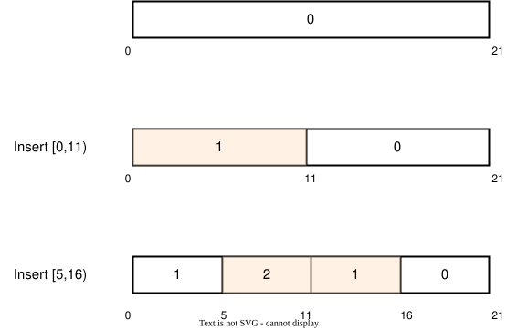

## Solution

---

### Overview

The problem asked for the maximum value of overlapped intervals at some points each time after adding a new interval. The main challenge here is to find an efficient way to maintain those added intervals and query how many intervals cover a single point quickly and dynamically.

This solution article provides three approaches with different performances. We will start from the most intuitive way, which is also mentioned in the solution to [731. My Calendar II](https://leetcode.com/problems/my-calendar-ii/solution/), and then generalize such kind of interval problems step by step to give two additional approaches.

---

### Approach 1: Sweep-line Algorithm

#### Intuition

If we look at each time point separately, our task is to find out how many events are going on at this time point and find the time point of the max number of events. Every time we book a new event `[start, end)`, what we actually do is add 1 to the event counts to all time points in the range `[start, end)`. The final result of each `book` call is exactly the max count of a single time in the whole range of $[1, 1e9)$.

For such kind of problem that increases all counts in some ranges by some constant values several times and asks to obtain all counts for those time points,  we have a very classic solution called [**sweep-line algorithm**](https://en.wikipedia.org/wiki/Sweep_line_algorithm): instead of keeping all values of counts in a traditional way, we use a *differential array* to represent the change that occurs at each time point. In this problem, we will increase the count by 1 at point `start` and decrease the count by 1 at point `end`. After enumerating all booked events and updating the differential array, we can simulate scanning the *differential array* with a vertical sweep-line from the origin time point `0` to the maximum `1e9` and obtain the *prefix sum* at each time point `t`, which is also the event count of time `t`. All we need to do now is find the maximum value of such counts when we scan the array.

#### Algorithm

1. Initialize a HashMap `diff` as empty. We use a HashMap here instead of an array because the times given by the inputs are sparse as there are at most 400 calls of `book()` function, we don't have to create records for all numbers in $[1, 1e9)$.
2. Each time we book a new event `[start, end)`
   - Update the $\text{diff}[start]$ by adding 1 while $\text{diff}[end]$ by subtracting 1.
   - Initialize an integer $cur = 0$ to represent the number of intervals at the current time
   - Enumerate all times that have records in `diff` in order, accumulate the corresponding value to `cur`, and record the max value of `cur` during our enumeration, which is the result of `book()` call.

```python
from sortedcontainers import SortedDict

class MyCalendarThree:

    def __init__(self):
        self.diff = SortedDict()

    def book(self, start: int, end: int) -> int:
        self.diff[start] = self.diff.get(start, 0) + 1
        self.diff[end] = self.diff.get(end, 0) - 1
        cur = res = 0
        for delta in self.diff.values():
            cur += delta
            res = max(cur, res)
        return res
```

#### Complexity Analysis

Let $N$ be the number of events booked.

* Time Complexity: $O(N^2)$. For each new event, we update the changes at two points in $O(\log{N})$ because we keep the HashMap in sorted order. Then we traverse `diff` in $O(N)$ time.

* Space Complexity: $O(N)$, the size of `diff`.

---

### Approach 2: Segment Tree

#### Intuition

If we use an array `vals` with length `1e9` to represent how many events (intervals) covering a time `t`, each time a new event `[start, end)` is added, we just need to increase all values in the subarray of `vals` from index `start` to `end-1` by 1, and then return the max value in `val`.

A segment tree with *lazy tags* is often used in this scenario to update scalar data (e.g., max, min, sum, etc.) of a subarray quickly. In this problem, we can use a `TreeNode` to store the max numbers of intervals in a time range `[L, R]`. A `TreeNode` has the following fields:

- `L` and `R`: the end points of the interval represented by this `TreeNode`.
- `val`: the max number of events at a time included in this range `[L, R]`
- `lazy`: the number of events covering all times in the range. As all numbers that belong to this range will be added by some increment, we don't have to propagate the base increment to every time in the interval, all we need to do is putting the number in this `lazy` field. We only update `val` by adding `lazy` when requested to query the max numbers of intervals in `[L, R]`.
- `left` and `right`: The left and right child nodes of this node, should represent the range `[L, M]` and `[M + 1, R]` respectively unless $left = right$, $M = (L + R) / 2$ here.

#### Algorithm

Each time adding a new event `[start, end)`, we start from the root node, which represents the time interval `[0, C]`, where `C` is the largest possible time and equals to `1e9` in this problem, check if `[start, end - 1]` has any intersection with current range `[L, R]` (`[0, C]` for the root node), and update those nodes recursively:

1. If $L > end - 1$ or `R < start`, no elements in `[start, end - 1]` are included in current node, just return.
2. If $start \le L$ and $R \le end - 1$, the range represented by this node is completely contained in `[start, end - 1]`. All elements in the range will be added by 1, so we just need to increase its `lazy` and `val` by 1 and stop.
3. Otherwise, only partial numbers in this range are coverd by `[start, end)`. We just go to the two child nodes and repeat the checking steps above to update them. After updating data in child nodes, don't forget to update `val` of our current node by $lazy + max(\text{left.val}, \text{right.val})$, because the max numbers must come from either left or right half of the range, plus the number shared by all elements in the interval, which is stored in `lazy`.
4. The `val` of the root node is exactly the answer we want.

#### Implementation

As we discussed before, the input endpoints are sparse. We don't have to create TreeNode for all intervals in the beginning. We can create a node dynamically when needed. Besides, we don't need to define a `TreeNode` class, instead, we can represent them by hashmap with unique `idx`s as keys and specify values at key $2 * idx$ and $2 * idx + 1$ as its left and right child nodes for any `idx > 0`.

```python
from collections import Counter

class MyCalendarThree:

    def __init__(self):
        self.vals = Counter()
        self.lazy = Counter()

    def update(self, start: int, end: int, left: int = 0, right: int = 10**9, idx: int = 1) -> None:
        if start > right or end < left:
            return

        if start <= left <= right <= end:
            self.vals[idx] += 1
            self.lazy[idx] += 1
        else:
            mid = (left + right)//2
            self.update(start, end, left, mid, idx*2)
            self.update(start, end, mid+1, right, idx*2 + 1)
            self.vals[idx] = self.lazy[idx] + \
                max(self.vals[2*idx], self.vals[2*idx+1])

    def book(self, start: int, end: int) -> int:
        self.update(start, end-1)
        return self.vals[1]
```

#### Complexity Analysis

Let $N$ be the number of events booked and $C$ be the largest time (i.e., $10^9$ in this problem)

* Time Complexity: $O(N \log{C})$. The max possible depth of the segment tree is $\log{C}$. At most $O(\log{C})$ nodes will be visited in each `update` operation. Thus, the time complexity of booking $N$ new events is $O(N \log{C})$.
* Space Complexity: $O(N \log{C})$. Instead of creating a segment tree of $4C$ at first, we create tree nodes dynamically when needed. Every time `update` is called, we create at most $O(\log{C})$ nodes because the max depth of the segment tree is $\log{C}$.

---

### Approach 3: Balanced Tree

#### Intuition

Inspired by Approach 2, what if we keep all consecutive and disjoint intervals in a sorted container? We mark those intervals with the number of events occurring during it. When we are asked to book a new event `[start, end)`, find which intervals the two endpoints `start` and `end` are located in, and split the intervals by `start` and `end` to create new smaller intervals. After that, we can increase the number of events for those intervals within `start` and `end` by 1.

For example, assume we have a time interval $[0, 21)$ in the beginning without any booked event. We mark the interval as 0. Then,

1. Add a new event $[0, 11)$, then we split the interval into $[0,11)$ and $[11,21)$, and mark $[0, 11)$ as 1.
2. Add another new event $[5, 16)$, then we split the interval $[0,11)$ into $[0, 5)$ and $[5, 11)$,  $[11, 21)$ into $[11, 16)$ and $[16, 21)$, then we increase the events in  $[5, 11)$ and $[11, 16)$ by 1.

The process is shown in the following picture:



With the help of those sorted intervals, we can precisely locate those intervals contained in a given `[start, end)` and increase the events in them by 1. Now, it is much easier to know the events in different time slots and find the max one.

#### Algorithm

To keep all intervals mentioned above sorted, we first use a **balanced tree** as a container initialized with the largest time range $[1, 1e9)$, which has no events, that is, we have $intervals = [[1, 1e9)]$ at first. All intervals are stored in the array `intervals` in the form of `[left, right)`.

When we need to book a new event `[start, end)`:

1. Binary search all starting points in `intervals` to find the first interval `[L1, R1)` that has $L1 \le start$, then we split the interval into `[L1, start)` and `[start, R1)`, keep the events in them the same as the origin interval `[L1, R1)`, and put them back in `intervals` container.
2. Similarly, perform a binary search to get the first `[L2, R2)` that satisfies $L2 \le end$, split it into`[L2, end)` and `[end, R2)` and inserting them into `intervals`.
3. For all non-empty intervals between `[start, R1)` and `[end, R2)` inclusively in `intervals`, increase the events of them by 1 as we added a new event in time `[start, end)` just now. Because only the number of events in those intervals are updated, to get the max number of events now, we just need to compare the last max number of events with them.

#### Implementation

The balanced tree container has different implementations in different languages. We use `map` in C++, `TreeMap` in java and `SortedList` in Python to mimic how a balanced tree behaves.

And also, we can maintain only starting points of intervals without their end points, because all intervals are consecutive, the end point of an interval is also the starting point of the next one.

```python
from sortedcontainers import SortedList

class MyCalendarThree:

    def __init__(self):
        # only store the starting point and count of events
        self.starts = SortedList([[0,0]])
        self.res = 0

    def split(self, x: int) -> None:
        idx = self.starts.bisect_left([x,0])
        if idx < len(self.starts) and self.starts[idx][0] == x:
            return idx
        self.starts.add([x,self.starts[idx-1][1]])

    def book(self, start: int, end: int) -> int:
        self.split(start)
        self.split(end)
        for interval in self.starts.irange([start,0], [end,0], (True,False)):
            interval[1] += 1
            self.res = max(self.res, interval[1])
        return self.res
```

#### Complexity Analysis

Let $N$ be the number of events booked.

* Time Complexity: $O(N^2)$  in the worst case. For each new `[start, end)`, we find the intervals that contains point `start` and `end` in $O(\log{N})$ time, split and add new intervals in $O(\log{N})$ time. We increase at most 2 new intervals each time, so the size of `intervals`(or `starts`) is at most $2N+1$. Finally, we enumerate all intervals contained in `[start, end)` to get the max number of events, which takes $O(N)$ time. Therefore, the overall time complexity of booking $N$ events is $O(N^2)$.

Though the time complexity looks not ideal in the worst case, if the given `[start, end)` is distributed uniformly, the time complexity is $O(N\log\log N)$ (See also: [Crate $\text{chtholly}_{tree}$](https://docs.rs/chtholly_tree/latest/chtholly_tree/)). The proof is not easy so we ignore it here.

* Space Complexity: $O(N)$, the size of `intervals`(or `starts`) is at most $2N+1$ as we analyzed before.