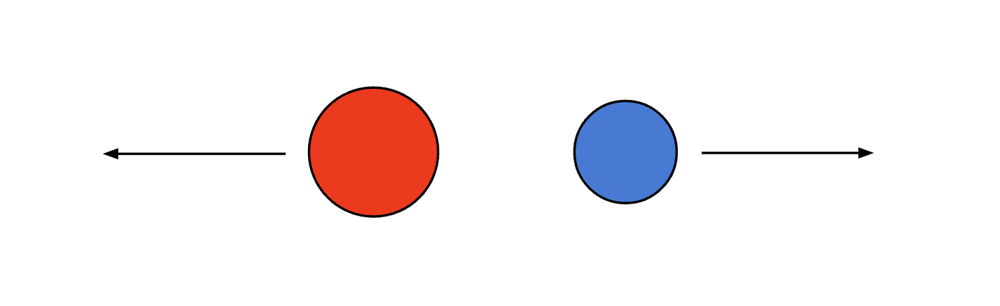
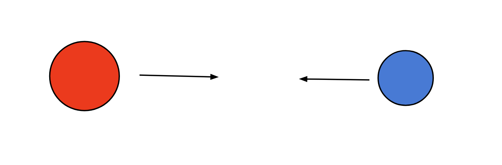
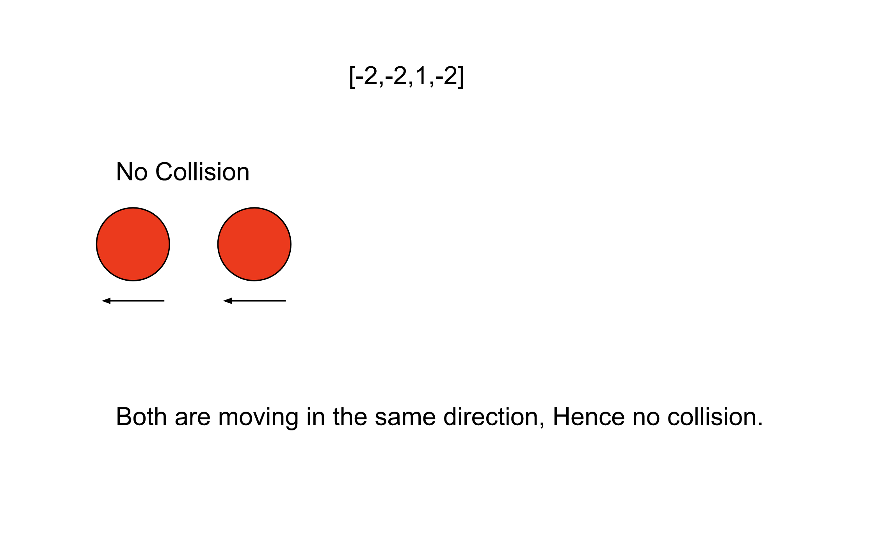
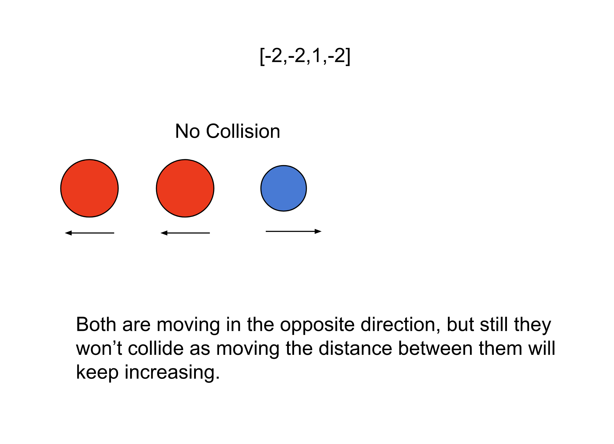
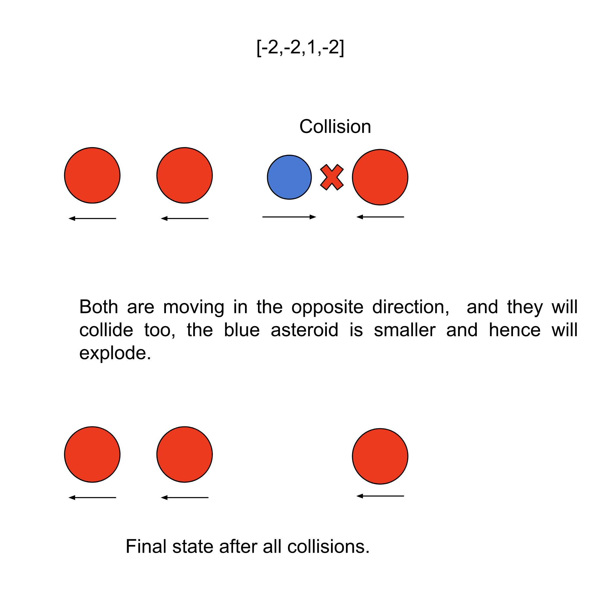

## Solution

### Approach: Stack

**Intuition**

We have $N$ asteroids, each represented by an integer. The absolute value represents the size, and the sign (positive or negative) of the integer represents the direction the asteroid is moving; all stones are moving at the same speed. These asteroids can collide, and if they do, the smaller one explodes and vanishes. If both asteroids are of the same size, then both will explode. We need to return the final state of asteroids after all collisions.

The first important thing to find out is when two asteroids will collide. Two stones moving in the same direction can never collide. Hence it's tempting to assume that whenever two asteroids are moving in opposite directions, they will collide. However, consider the below image; the red stone is moving in the left direction, and the blue stone is moving in the right direction. It is clear from the picture these two asteroids will never collide.



On the other hand, if the red stone is moving towards the right and the blue stone is moving towards the left, they will collide, as shown below. Therefore, the only case when the asteroids will collide is when the asteroid on the left-hand side is moving towards the right, and the asteroid on the right side is moving towards the left.



Now, if we iterate over asteroids from left to right, then each asteroid moving left will collide with asteroids that came before it that are moving right. If the current stone is smaller than the one we saw earlier, it will explode, and the collision chain will stop there. On the other hand, if it's bigger, it will keep moving toward the left and might collide further with other asteroids we saw earlier that are moving toward the right. Hence, the observation here is that each stone might keep colliding with asteroids on its left until it collides with a bigger asteroid and explodes. This requirement could be fulfilled by the stack data structure; if we keep asteroids in the stack, then for each asteroid, the collision chain can be executed by checking the top of the stack and popping if an asteroid should be destroyed.

The below slideshow demonstrates how directions and size are used to detect all collisions.







**Algorithm**

1. Iterate over the asteroids from left to right; for each `asteroid` do the following:

   i. Initialize a boolean `flag` to `true`. We will use this flag later to determine if we should store this asteroid in the stack or if it will explode.

   ii. If there is an asteroid in the stack and the asteroid on the top of the stack can collide with this asteroid, then we have some options here.

        a. If the `asteroid` is bigger than the asteroid on the top, then this asteroid on the top will explode, and we will pop it from the stack.
        b. If the `asteroid` has the same size as the asteroid on the top, then both will explode. Hence we will pop it from the stack; also, we will mark `flag` as `false` because this `asteroid` will also explode, and hence we won't save it into the stack.
        c. If the `asteroid` is smaller than the asteroid on the top, then the asteroid on the top will not explode, so we will not pop it. But the `asteroid` will explode and thus we will mark `flag` as `false`.

   iii. If `flag` is `true`, add the `asteroid` to the stack.

2. Add the asteroids from the stack into the list `remainingAsteroids` in the reverse order.
3. Return `remainingAsteroids`.

**Implementation**

```cpp
class Solution {
public:
    vector<int> asteroidCollision(vector<int>& asteroids) {
        stack<int> st;

        for (int asteroid : asteroids) {
            int flag = 1;
            while (!st.empty() && (st.top() > 0 && asteroid < 0)) {
                // If the top asteroid in the stack is smaller, then it will explode.
                // Hence pop it from the stack, also continue with the next asteroid in the stack.
                if (abs(st.top()) < abs(asteroid)) {
                    st.pop();
                    continue;
                }
                // If both asteroids are the same size, then both asteroids will explode.
                // Pop the asteroid from the stack; also, we won't push the current asteroid to the stack.
                else if (abs(st.top()) == abs(asteroid)) {
                    st.pop();
                }

                // If we reach here, the current asteroid will be destroyed
                // Hence, we should not add it to the stack
                flag = 0;
                break;
            }

            if (flag) {
                st.push(asteroid);
            }
        }

        // Add the asteroids from the stack to the vector in the reverse order.
        vector<int> remainingAsteroids (st.size());
        for (int i = remainingAsteroids.size() - 1; i >= 0; i--){
            remainingAsteroids[i] = st.top();
            st.pop();
        }

        return remainingAsteroids;
    }
};
```

**Complexity Analysis**

Here, $N$ is the number of asteroids in the list.

* Time complexity: $O(N)$.

  We iterate over each asteroid in the list, and for each asteroid, we might iterate over the asteroids we have in the stack and keep popping until they explode. The important point is that each asteroid can be added and removed from the stack only once. Therefore, each asteroid can be processed only twice, first when we iterate over it and then again while popping it from the stack. Therefore, the total time complexity is equal to $O(N)$.

* Space complexity: $O(N)$.

  The only space required is for the stack; the maximum number of asteroids that could be there in the stack is $N$ when there is no asteroid collision. The final list that we return, `remainingAsteroids`, is used to store the output, which is generally not considered part of space complexity. Hence, the total space complexity equals $O(N)$.
  <br/>

---