## Solution

---

### Overview

In this problem, we are given a list of temperatures where the temperature at index $i$ represents the temperature of the $i^{th}$ day. Our goal is to, for each day, find the number of days until the next day that is warmer than the current day.  Often, the best place to start solving a problem is by considering a brute-force approach. The naive/brute-force way to solve this problem is to iterate through the array, and for each day, iterate through all of the remaining days until you find a warmer temperature. This approach would have a time complexity of $O(N^2)$, which is very slow given the constraints $N < 10^5$. What makes brute-force so inefficient?

```python
class Solution:
    def dailyTemperatures(self, temperatures: List[int]) -> List[int]:
        n = len(temperatures)
        answer = [0] * n
        for day in range(n):
            for future_day in range(day + 1, n):
                if temperatures[future_day] > temperatures[day]:
                    answer[day] = future_day - day
                    break

        return answer
```

Imagine if you had multiple days in a row with a decreasing temperature, and then one very hot day - `[40, 39, 38, 37, 36, 35, 34, 65]`. The final day is the "answer" day for all the other days. Why? Because all the other days are in descending order (and cooler than the last day). If we make use of the fact that temperatures in descending order can share the same "answer" day, we can improve the time complexity.

In the above example, we can "delay" finding the answer for the first 7 days, and upon finding a warmer temperature `65`, we can move backward to find the answer for all 7 days at the same time. This process of storing elements and then walking back through them matches the behavior of a stack.

### Approach 1: Monotonic Stack

**Intuition**

Let's look at a data structure known as a [Monotonic Stack](https://leetcode.com/tag/monotonic-stack/). A monotonic stack is simply a stack where the elements are always in sorted order. How does this help us? We can use a monotonic decreasing stack to hold temperatures. Monotonic **decreasing** means that the stack will always be sorted in descending order. Because the problem is asking for the **number** of days, instead of storing the temperatures themselves, we should store the indices of the days, and use $\text{temperatures}[i]$ to find the temperature of the $i^{th}$ day.

> Monotonic stacks are a good option when a problem involves comparing the size of numeric elements, with their order being relevant.

On each day, there are two possibilities. If the current day's temperature is not warmer than the temperature on the top of the stack, we can just push the current day onto the stack - since it is not as warm (equal or smaller), this will maintain the sorted property.

If the current day's temperature is warmer than the temperature on top of the stack, this is significant. It means that the current day is the **first** day with a warmer temperature than the day associated with the temperature on top of the stack. When we find a warmer temperature, the number of days is the difference between the current index and the index on the top of the stack. We can declare an `answer` array before iterating through the input and populate `answer` as we go along.

When we find a warmer temperature, we can't stop after checking only one element at the top. Using the example $temperatures = [75, 71, 69, 72]$, once we arrive at the last day our stack looks like $stack = [0, 1, 2]$. For clarity, here's what the stack looks like with each temperature associated with the day: $stack = [(0, 75), (1, 71), (2, 69)]$. `72` (the current temperature) is greater than `69`, but it is also greater than `71`. To make sure we don't miss any days, we should pop from the stack until the top of the stack is no longer colder than the current temperature. Once that is the case, we can push the current day onto the stack.

**Algorithm**

1. Initialize an array `answer` with the same length as `temperatures` and all values initially set to `0`. Also, initialize a stack as an empty array.

2. Iterate through `temperatures`. At each index `currDay`:
- If the stack is not empty, that means there are previous days for which we have not yet seen a warmer day. While the current temperature is warmer than the temperature of `prevDay` (the index of the day at the top of the stack):
- Set $\text{answer}[prevDay]$ equal to the number of days that have passed between `prevDay` and the current day, that is, $\text{answer}[prevDay] = currDay - prevDay$.
- Push the current index `currDay` onto the stack.

3. Return `answer`.

Here's an example animation showing how this algorithm works. For clarity, temperatures of the days are included with the indices:

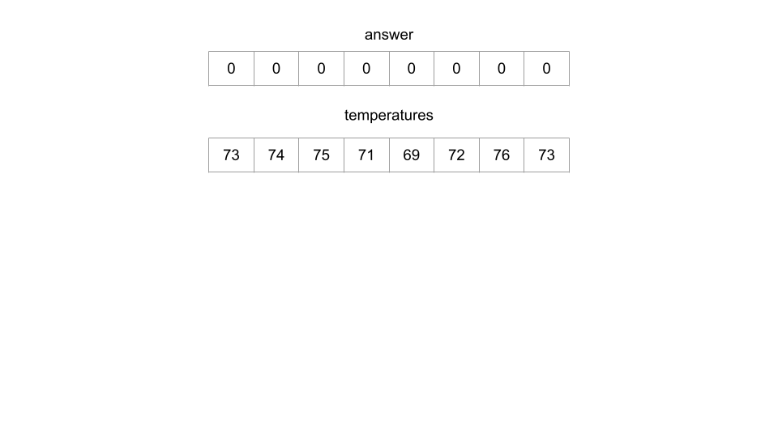

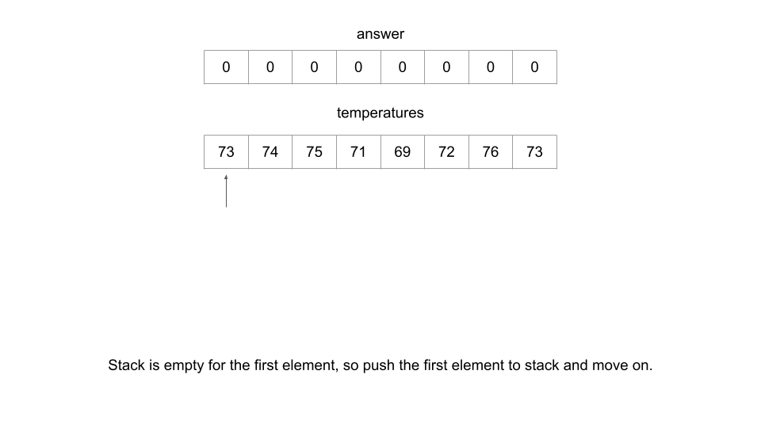

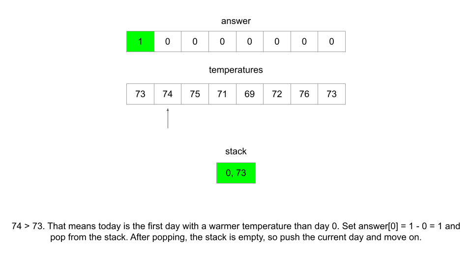

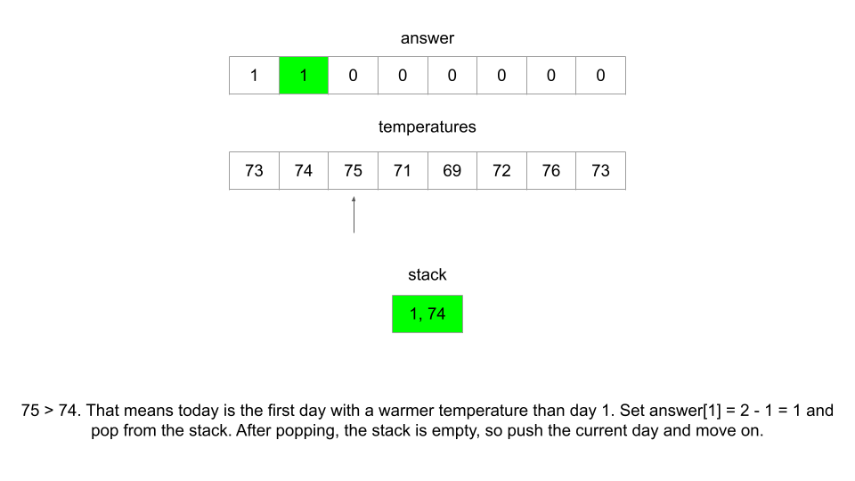

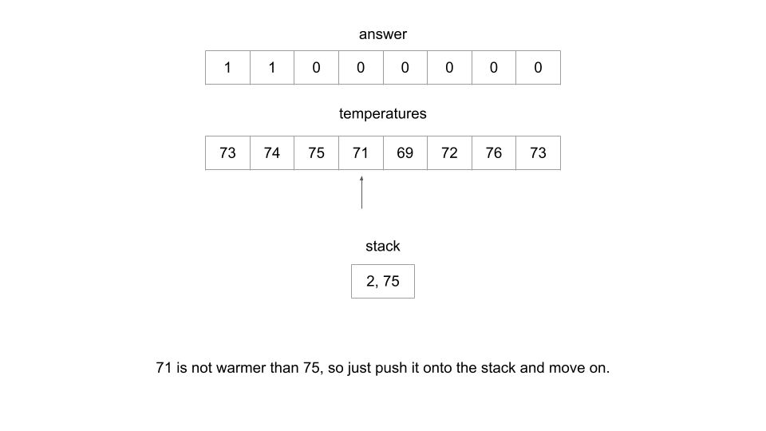

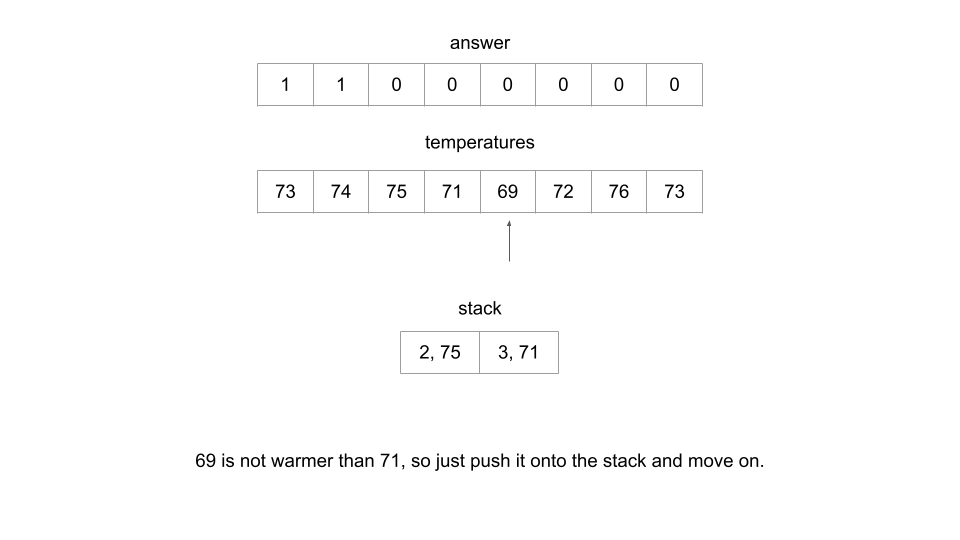

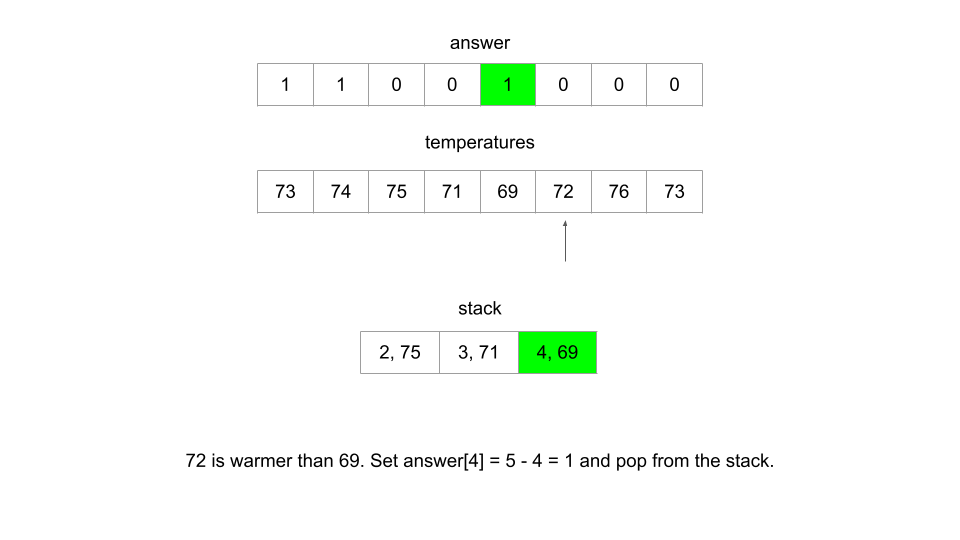

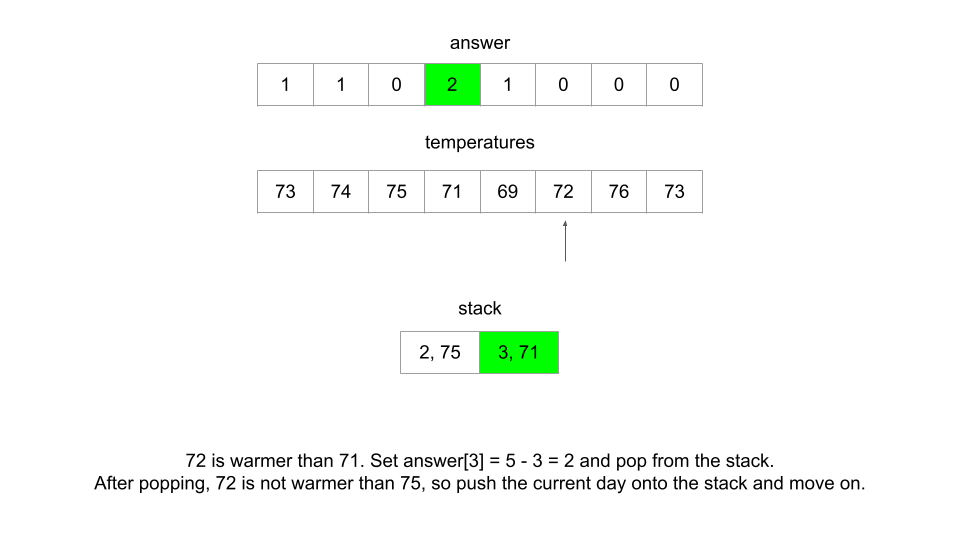

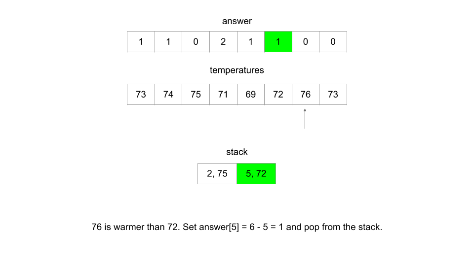

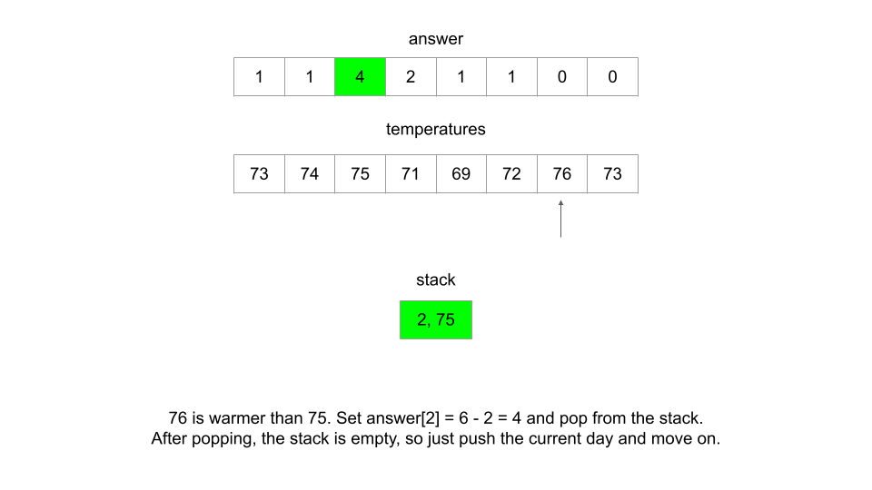

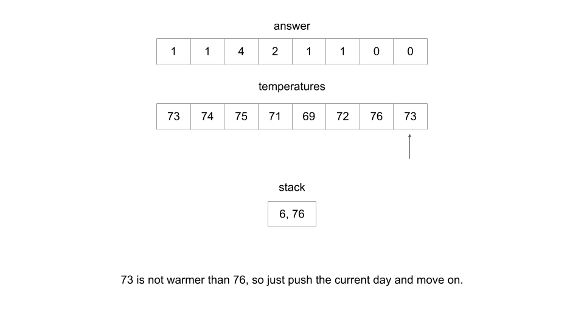

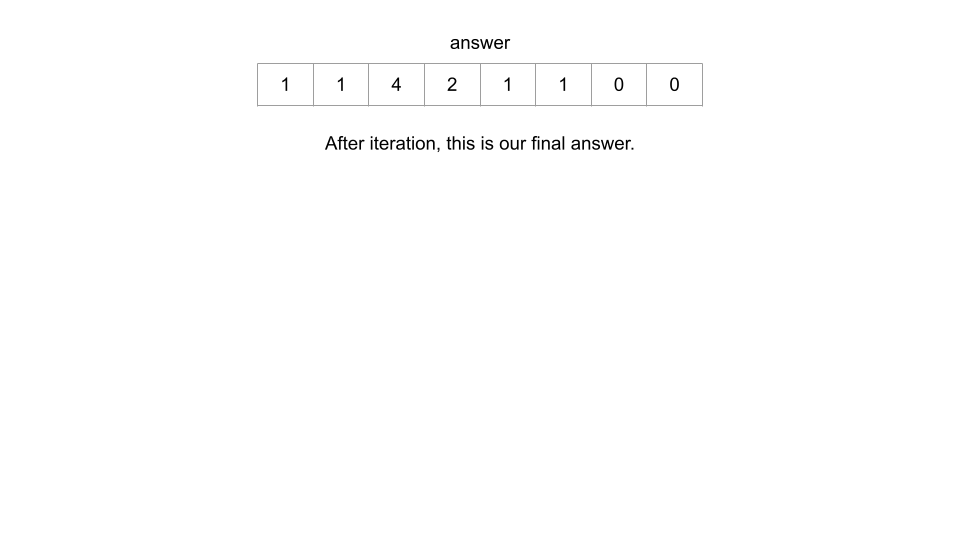

<br>

**Implementation**

```python
class Solution:
    def dailyTemperatures(self, temperatures: List[int]) -> List[int]:
        n = len(temperatures)
        answer = [0] * n
        stack = []

        for curr_day, curr_temp in enumerate(temperatures):
            # Pop until the current day's temperature is not
            # warmer than the temperature at the top of the stack
            while stack and temperatures[stack[-1]] < curr_temp:
                prev_day = stack.pop()
                answer[prev_day] = curr_day - prev_day
            stack.append(curr_day)

        return answer
```

**Complexity Analysis**

Given $N$ as the length of `temperatures`,

* Time complexity: $O(N)$

    At first glance, it may look like the time complexity of this algorithm should be $O(N^2)$, because there is a nested while loop inside the for loop. However, each element can only be added to the stack once, which means the stack is limited to $N$ pops. Every iteration of the while loop uses 1 pop, which means the while loop will not iterate more than $N$ times in total, across all iterations of the for loop.

    An easier way to think about this is that in the worst case, every element will be pushed and popped once. This gives a time complexity of $O(2 \cdot N) = O(N)$.

* Space complexity: $O(N)$

    If the input was non-increasing, then no element would ever be popped from the stack, and the stack would grow to a size of `N` elements at the end.

    Note: `answer` does not count towards the space complexity because space used for the output format does not count.

<br/>

---

### Approach 2: Array, Optimized Space

**Intuition**

With the monotonic stack, we iterated forward through the array and moved backwards when we found a warmer day. In this approach, we'll do the reverse - iterate backwards through the array, and move forwards to find the number of days until a warmer day.

In the first approach, `answer` exists only to hold the answer. An important thing to notice is that `answer` carries information that we can use to solve the problem. We can save space and replace the functionality of the stack by using information from `answer`.

Let's use the example test case $temperatures = [73, 74, 75, 71, 69, 72, 76, 73]$. Iterating backwards, after 5 days we have: $answer = [0, 0, 0, 2, 1, 1, 0, 0]$.

The next day to calculate is the day at index 2 with temperature `75`. How can we use `answer` to help us do this? Well, let's first check the next day - we might be lucky and it could be warmer. The next day (at index 3) has a temperature of `71`, which is not warmer. However, $\text{answer}[3]$ tells us that the day at index 3 will not see a warmer temperature for `2` more days. A temperature warmer than `75` must also be warmer than `71` - so we know it is pointless to check $\text{answer}[4]$. We should check $temperatures[3 + \text{answer}[3]] = \text{temperatures}[5] = 72$, which is not warmer than `75`. Again, we know from $\text{answer}[5]$ that we will not have a warmer temperature than `72` for `1` day. Therefore, the next day to check is $temperatures[5 + \text{answer}[5]] = \text{temperatures}[6] = 76$, which is warmer - we found our day.

To keep track of the number of days, we can use a variable `days` initially set to `1` and continuously add to it to query the next day. Using the above example, we would start with $currDay = 2$, and query $temperatures[currDay + days] = temperatures[2 + 1]$. After finding that it is not warmer, we will add $\text{answer}[3]$ to `days`, and our next search will be at $temperatures[currDay + days] = temperatures[2 + 3]$. When we find our warmer day, we can set $\text{answer}[currDay] = days$.

From this small example, it may seem like this algorithm isn't very efficient. However, imagine if we had something like $answer = [0, 85134, ...]$ and we needed to calculate the answer for the first day (at index 0). If the second day is not warmer than the first day, then this algorithm allows us to skip over 85000 days, because we already know that none of those days could be warmer than the first day.

One last note: this process does not work for a day that does not have a warmer day in the future. Therefore, we need to use a variable `hottest` to keep track of the hottest day seen so far. If a day is warmer than `hottest`, then we know the answer for that day is `0`, and we don't need to go through the process described above.

**Algorithm**

1. Initialize an array `answer` with the same length as `temperatures` and all values initially set to `0`. Also, initialize an integer $hottest = 0$ to track the hottest temperature seen so far.

2. Iterate backwards through the input. At each index `currDay`, check if the current day is the hottest one seen so far. If it is, update `hottest` and move on. Otherwise, do the following:
- Initialize a variable $days = 1$ because the next warmer day must be at least one day in the future.
- While $temperatures[currDay + days] \le \text{temperatures}[currDay]$:
- Add $answer[currDay + days]$ to `days`. This effectively jumps directly to the next warmer day.
- Set $\text{answer}[currDay] = days$.

3. Return `answer`.

**Implementation**

```python
class Solution:
    def dailyTemperatures(self, temperatures: List[int]) -> List[int]:
        n = len(temperatures)
        hottest = 0
        answer = [0] * n

        for curr_day in range(n - 1, -1, -1):
            current_temp = temperatures[curr_day]
            if current_temp >= hottest:
                hottest = current_temp
                continue

            days = 1
            while temperatures[curr_day + days] <= current_temp:
                # Use information from answer to search for the next warmer day
                days += answer[curr_day + days]
            answer[curr_day] = days

        return answer
```

**Complexity Analysis**

Given $N$ as the length of `temperatures`,

* Time complexity: $O(N)$

    Similar to the first approach, the nested while loop makes this algorithm look worse than $O(N)$. However, same as in the first approach, the total number of iterations in the while loop does not exceed $N$, which gives this algorithm a time complexity of $O(2 \cdot N) = O(N)$.

    The reason the iterations in the while loop does not exceed $N$ is because the "jumps" prevent an index from being visited twice. If we had the example $temperatures = [45, 43, 45, 43, 45, 31, 32, 33, 50]$, after 5 iterations we would have $answer = [..., 4, 1, 1, 1, 0]$. The day at index `2` will use $\text{answer}[4]$ to jump to the final day (which is the next warmer day), and then $\text{answer}[4]$ will not be used again. This is because at the first day, $\text{answer}[2]$ will be used to jump all the way to the end. The final solution is $answer = [8,1,6,1,4,1,1,1,0]$. The `6` was found with the help of the `4` and the `8` was found with the help of the `6`.

* Space complexity: $O(1)$

    As stated above, while `answer` does use $O(N)$ space, the space used for the output does not count towards the space complexity. Thus, only constant extra space is used.

<br/>

---