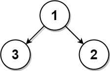
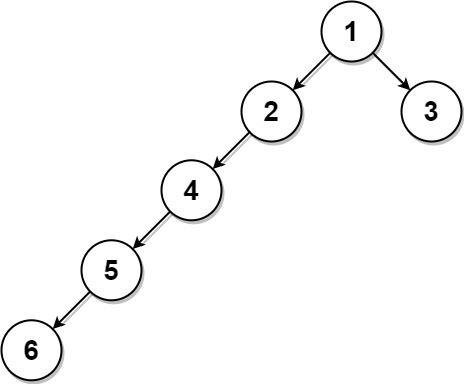

### 1. Description

Given the `root` of a binary tree where every node has **a unique value** and a target integer `k`, return *the value of the **nearest leaf node** to the target *`k`* in the tree*.

**Nearest to a leaf** means the least number of edges traveled on the binary tree to reach any leaf of the tree. Also, a node is called a leaf if it has no children.

### 2. Function Contract

`solve(root: TreeNode, k: int) -> int`

Let $n$ be the number of nodes in the tree.

**Inputs**

- `root`: the root node of a nonempty binary tree with unique integer values. The app-local `TreeNode` has fields `val`, `left`, and `right`.
- `k`: a value guaranteed to occur in exactly one tree node.

**Return value**

Return the value of a leaf at minimum edge distance from the node whose value is `k`. If several leaves tie at that distance, returning any of their values is valid.

### 3. Examples

#### Example 1

- **Input:** `root = [1,3,2], k = 1`
- **Output:** `2`
- **Explanation:** Either 2 or 3 is the nearest leaf node to the target of 1.

#### Example 2

- **Input:** `root = [1], k = 1`
- **Output:** `1`
- **Explanation:** The nearest leaf node is the root node itself.

#### Example 3

- **Input:** `root = [1,2,3,4,null,null,null,5,null,6], k = 2`
- **Output:** `3`
- **Explanation:** The leaf node with value 3 (and not the leaf node with value 6) is nearest to the node with value 2.

### 4. Constraints

- The number of nodes in the tree is in the range `[1, 1000]`.

- $1 \le \text{Node.val} \le 1000$

- All the values of the tree are **unique**.

- There exist some node in the tree where $\text{Node.val} = k$.
