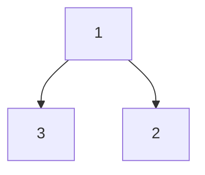
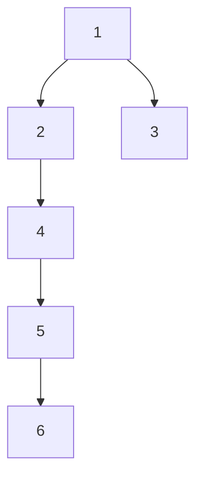

## Examples

**Example 1**

- Input: `root = [1,3,2], k = 1`
- Output: `2`
- Explanation: Leaves `2` and `3` are equally near the target node `1`, so either value is valid.

**Example 2**

- Input: `root = [1], k = 1`
- Output: `1`
- Explanation: The root is itself the nearest leaf.

**Example 3**

- Input: `root = [1,2,3,4,null,null,null,5,null,6], k = 2`
- Output: `3`
- Explanation: Leaf `3`, rather than leaf `6`, has the smaller edge distance from node `2`.
