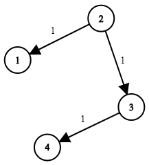

## Description

You are given a network of `n` nodes, labeled from `1` to `n`. You are also given `times`, a list of travel times as directed edges $\text{times}[i] = (u_{i}, v_{i}, w_{i})$, where $u_{i}$ is the source node, $v_{i}$ is the target node, and $w_{i}$ is the time it takes for a signal to travel from source to target.

We will send a signal from a given node `k`. Return *the **minimum** time it takes for all the* `n` *nodes to receive the signal*. If it is impossible for all the `n` nodes to receive the signal, return `-1`.
### Function Contract

- `n`: Input parameter.
- Returns expected result.

### Examples

#### Example 1

- **Input:** $times = [[2,1,1],[2,3,1],[3,4,1]], n = 4, k = 2$
- **Output:** `2`
#### Example 2

- **Input:** $times = [[1,2,1]], n = 2, k = 1$
- **Output:** `1`
#### Example 3

- **Input:** $times = [[1,2,1]], n = 2, k = 2$
- **Output:** `-1`
### Constraints

- $1 \le k \le n \le 100$

- $1 \le \text{times.length} \le 6000$

- $\text{times}[i].length = 3$

- $1 \le u_{i}, v_{i} \le n$

- $u_{i} \neq v_{i}$

- $0 \le w_{i} \le 100$

- All the pairs $(u_{i}, v_{i})$ are **unique**. (i.e., no multiple edges.)