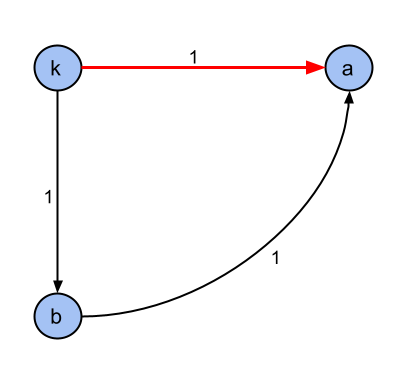
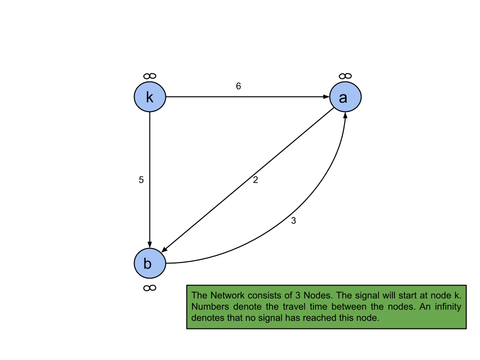
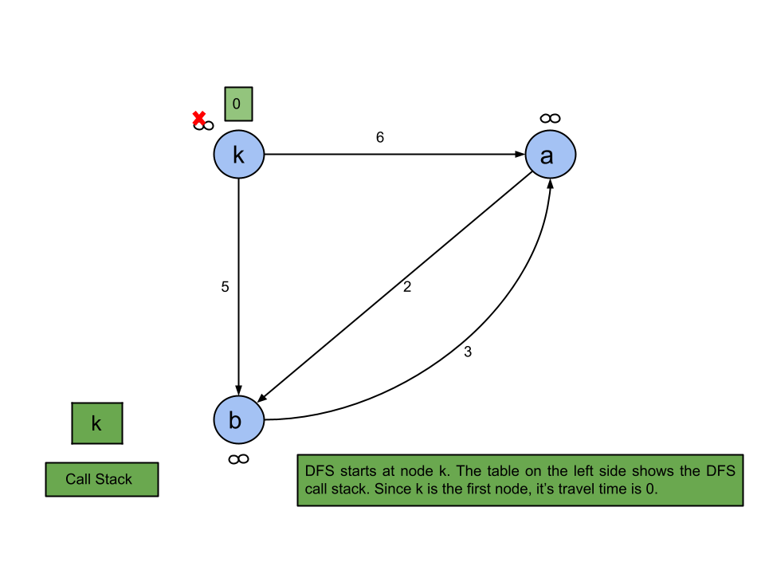
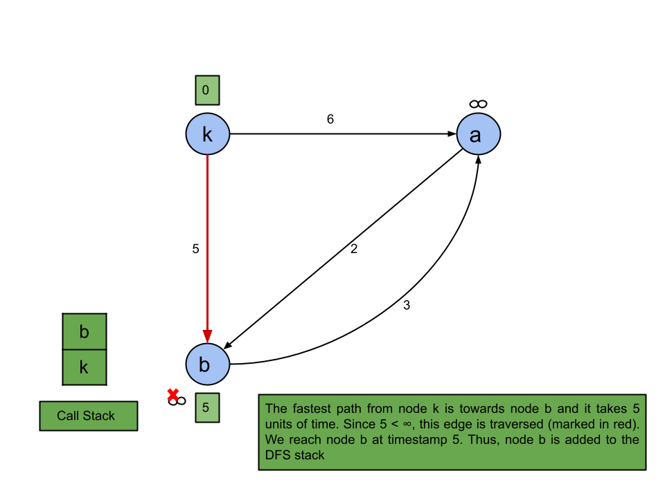
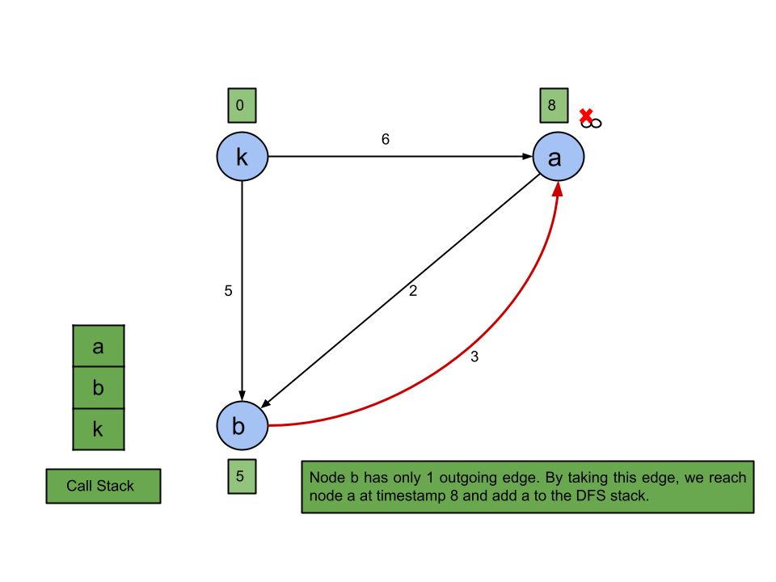
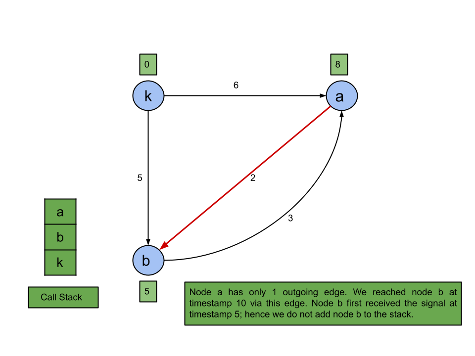
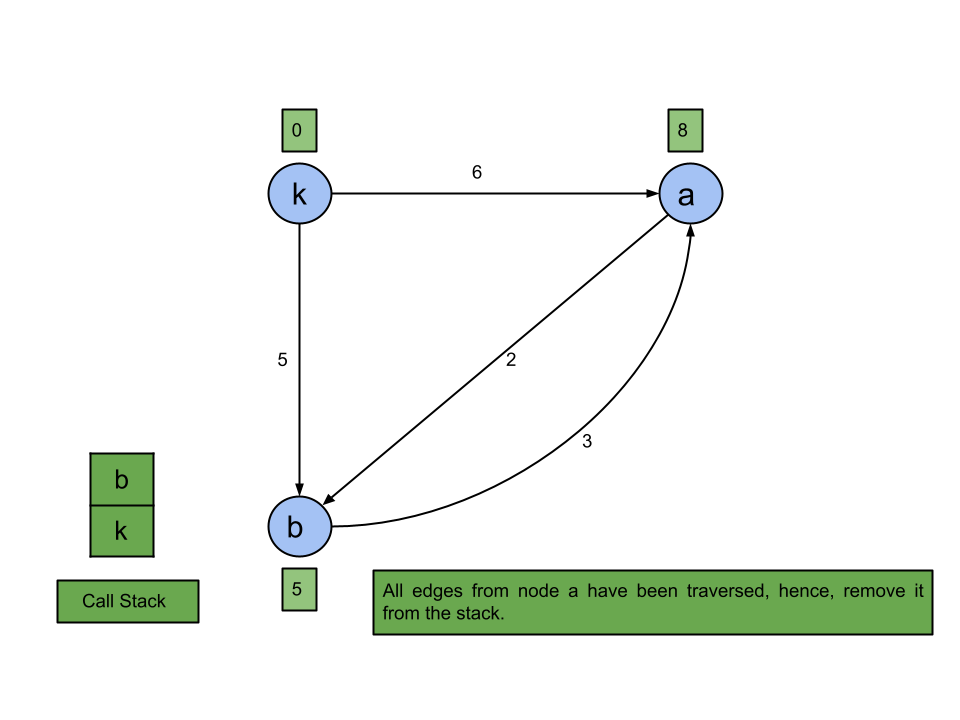
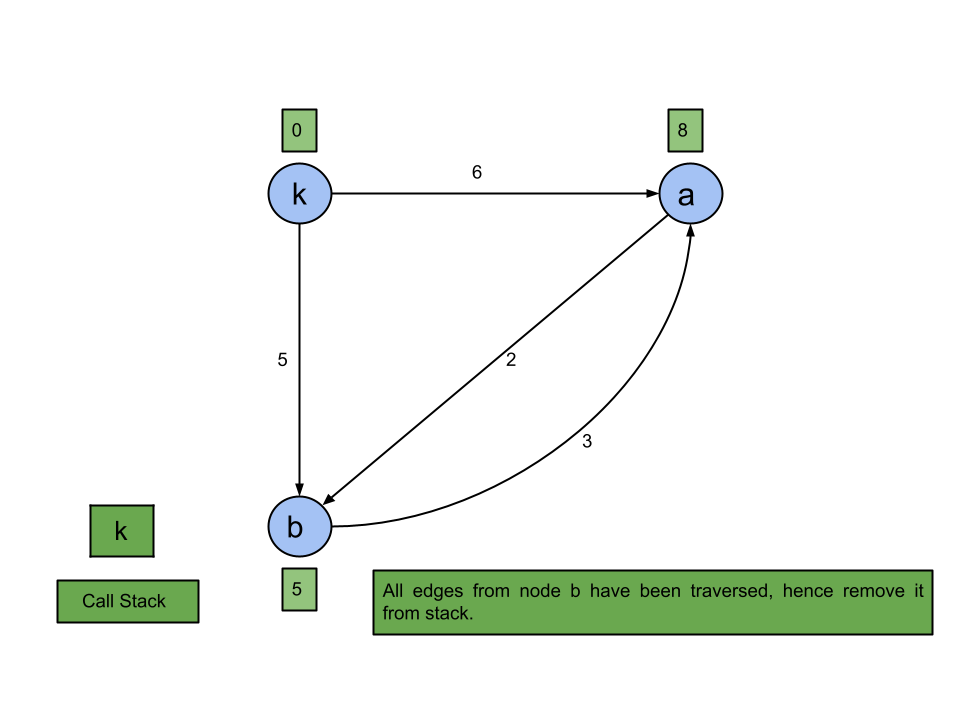
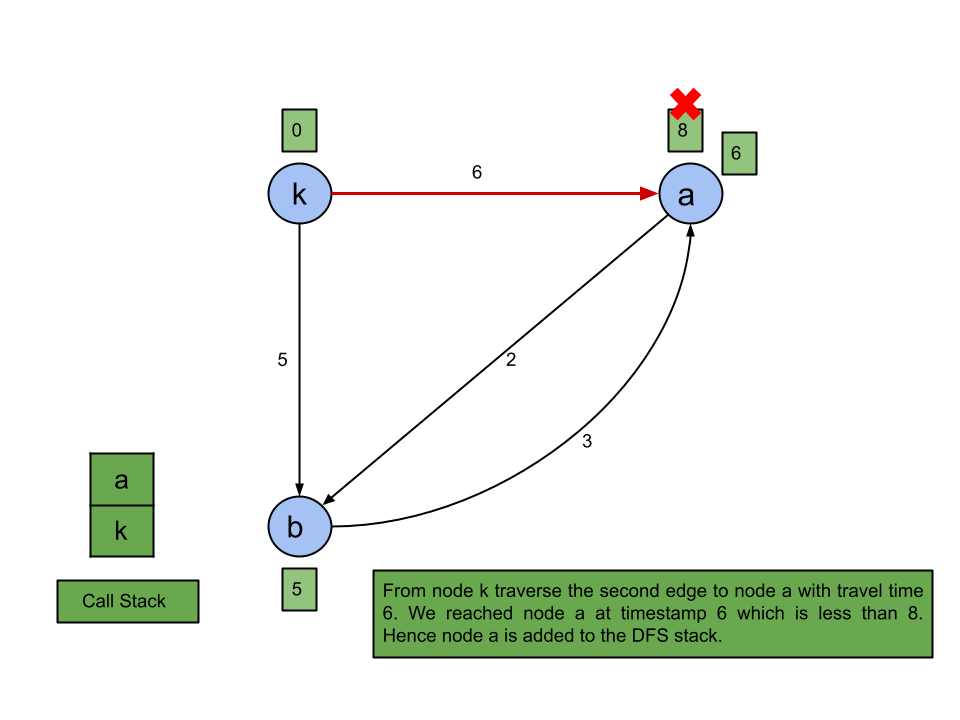
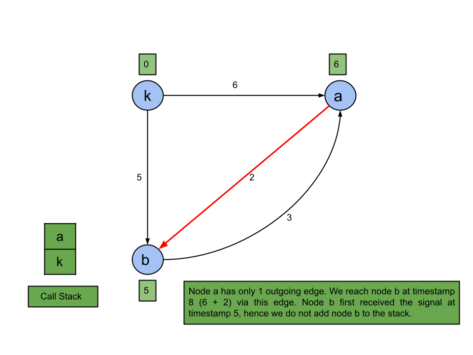

## Solution

---

### Overview

We have a network consisting of some nodes and directed edges. Each edge has three components: source, destination, and time. The time of an edge denotes the time it takes for a signal to travel from the source node to the destination node. A signal sent from node $k$ will travel along the edges and will reach some or all the nodes in the network. Our goal is to determine how much time the signal takes to reach every node in the network. If the signal cannot reach every node, we will return `-1`.

It is possible for a node to receive signals from multiple adjacent nodes at different times. The figure below shows that node `a` receives signals from node `k` and node `b` at timestamps `1` and `2`, respectively. The two signals are identical; hence, the timestamp at which a node receives the signal is the time that the first signal reaches the node. In the following example, the time required for node `a` to receive the signal will be `1` unit as this is the first signal to reach node `a`.



Therefore, the problem boils down to finding the time required for each node to receive the signal, and the answer will be the maximum time required by any of the nodes. Why maximum? Because we need to find the time at which all nodes receive the signal, so the timestamp at which the last node receives the signal is the answer.
</br>

---

### Approach 1: Depth-First Search (DFS)

**Intuition**

> If you're not familiar with DFS, check out our [Graph Explore Card](https://leetcode.com/explore/featured/card/graph/619/depth-first-search-in-graph/).

In this approach, we will simulate the signal and send it through the nodes as per the problem description to find the answer. Starting from node $k$, the signal will travel to the adjacent nodes along the directed edges. We will track the signal movement with respect to time in a Depth-First Search manner.

Start the DFS with node $currNode = k$ and current timestamp $currTime = 0$. Before we traverse to the adjacent we mark the time required for the `currNode` in the array `signalReceivedAt` as `currTime` ($\text{signalReceivedAt}[currNode] = currTime]$). Now we will traverse all the adjacent nodes to the `currNode`. For each adjacent node, we will start a DFS with the updated timestamp i.e., equal to the sum of `currTime` and the time it takes to traverse the edge from `currNode` to the adjacent node.

As we discussed before, there can be multiple signals received at a particular node and we are only interested in the time that the first signal reached the node. Hence, we will perform the DFS only if the `currTime` is less than the time we have stored corresponding to `currNode` in `signalReceivedAt`. This is because if the `currTime` is greater than or equal to $\text{signalReceivedAt}[currNode]$, it means that `currNode` received a signal before the current signal could reach it.

There is a trick that can reduce the execution time. Instead of traversing adjacent nodes arbitrarily, we can traverse them in increasing order of their travel time. Although this will increase the time complexity of the algorithm, it will increase the probability of finding the fastest time path first. Hence there could be fewer DFS calls and hence better execution time. The below slideshow demonstrates the algorithm.




















 <br>

**Algorithm**

1. Create an adjacency list such that $\text{adj}[source]$ contains all destination nodes (`dest`) that the signal can travel to from the source node (`source`). For each destination node, there will be a pair `(time, dest)`. Here, `time` denotes the time required for the signal to travel from `source` to `dest`.
2. Sort the edges connecting to every node in `adj` in increasing order of their travel time.
3. For all nodes, initialize `signalReceivedAt` as a large value to signify that, so far, no signal has been received.
4. Perform DFS on the node `currNode` as $k$ and with the `currTime` as `0`. For each recursive call:
- If the `currTime` is greater than or equal to $\text{signalReceivedAt}[currNode]$ then return.
- Otherwise, set $\text{signalReceivedAt}[currNode]$ equal to `currTime` which is the new shortest time required to reach `currNode`. Then, perform a DFS for each of the adjacent nodes using the updated timestamp.
5. Find the maximum value in the array `signalReceivedAt`. If any value in `signalReceivedAt` is still the large value we initialized the array with, then return -1 as that node is not reachable from `k`. Otherwise, return the maximum value in the array.

**Implementation**

```cpp
class Solution {
public:
    // Adjacency list, defined it as per the maximum number of nodes
    // But can be defined with the input size as well
    vector<pair<int, int>> adj[101];

    void DFS(vector<int>& signalReceivedAt, int currNode, int currTime) {
        // If the current time is greater than or equal to the fastest signal received
        // Then no need to iterate over adjacent nodes
        if (currTime >= signalReceivedAt[currNode]) {
            return;
        }

        // Fastest signal time for currNode so far
        signalReceivedAt[currNode] = currTime;

        // Broadcast the signal to adjacent nodes
        for (pair<int, int> edge : adj[currNode]) {
            int travelTime = edge.first;
            int neighborNode = edge.second;

            // currTime + time : time when signal reaches neighborNode
            DFS(signalReceivedAt, neighborNode, currTime + travelTime);
        }
    }

    int networkDelayTime(vector<vector<int>>& times, int n, int k) {
        // Build the adjacency list
        for (vector<int> time : times) {
            int source = time[0];
            int dest = time[1];
            int travelTime = time[2];

            adj[source].push_back({travelTime, dest});
        }

        // Sort the edges connecting to every node
        for (int i = 1; i <= n; i++) {
            sort(adj[i].begin(), adj[i].end());
        }

        vector<int> signalReceivedAt(n + 1, INT_MAX);
        DFS(signalReceivedAt, k, 0);

        int answer = INT_MIN;
        for (int node = 1; node <= n; node++) {
            answer = max(answer, signalReceivedAt[node]);
        }

        // INT_MAX signifies atleat one node is unreachable
        return answer == INT_MAX ? -1 : answer;
    }
};
```

**Complexity Analysis**

Here $N$ is the number of nodes and $E$ is the number of total edges in the given network.

* Time complexity: $O((N - 1)! + E \log E)$

  In a complete graph with $N$ nodes and $N*(N - 1)$ directed edges, we can end up traversing all the paths of all the possible lengths. The total number of paths can be represented as $\sum_{len=1}^{N} {{N} \choose {len}} * len!$, where `len` is the length of path which can be $1$ to $N$. This number can be represented as $e.N!$, it's essentially equal to the [number of arrangements](https://oeis.org/wiki/Number_of_arrangements) for $N$ elements. In our case, the first element will always be $K$, hence the number of arrangements is $e.(N - 1)!$.

  Also, we sort the edges corresponding to each node, this can be expressed as $E \log E$ because sorting each small bucket of outgoing edges is bounded by sorting all of them, using the inequality $x \log x + y \log y \leq (x+y) \log (x+y)$. Also, finding the minimum time required in `signalReceivedAt` takes $O(N)$.

* Space complexity: $O(N + E)$

  Building the adjacency list will take $O(E)$ space and the run-time stack for DFS can have at most $N$ active functions calls hence, $O(N)$ space.
<br/>

---

### Approach 2: Breadth-First Search (BFS)

**Intuition**

> If you're not familiar with BFS, check out our [Graph Explore Card](https://leetcode.com/explore/featured/card/graph/620/breadth-first-search-in-graph/).

Similar to the previous approach, we will simulate the signal and send it through the nodes as per the problem description but this time using BFS. Starting from node $k$, the signal will travel to the adjacent nodes along the directed edges. We will track the signal movement with respect to time in a Breadth-First Search manner.

We will initialize the queue with the node `currNode` as $k$ and store the corresponding time required in `signalReceivedAt` as `0`.  The signal from node `currNode` will travel to every adjacent node. Iterate over every adjacent node `neighborNode`. We will add each adjacent node to the queue only if the signal from `currNode` via the current edge takes less time than the fastest signal to reach the adjacent node so far. Time taken by the fastest signal for `currNode` is denoted by $\text{signalReceivedAt}[currNode]$.

**Algorithm**

1. Create an adjacency list such that $\text{adj}[source]$ contains all destination nodes (`dest`) that the signal can travel to from the source node (`source`). For each destination node, there will be a pair `(time, dest)`. Here, `time` denotes the time required for the signal to travel from `source` to `dest`.
2. For all nodes, initialize `signalReceivedAt` as a large value to signify that, so far, no signal has been received.
3. Add $k$ to the queue. While the queue is not empty:

- Pop the front node `currNode` from the queue
- Traverse all the edges connected to `currNode`. Add the adjacent node `neighborNode` to the queue only if the signal takes less time than the value at $\text{signalReceivedAt}[neighborNode]$. Update the time at $\text{signalReceivedAt}[neighborNode]$ to current signal time.
4. Find the maximum value in the array `signalReceivedAt`. If any value in `signalReceivedAt` is still the large value we initialized the array with, then return -1 as that node is not reachable from `k`. Otherwise, return the maximum value in the array.

**Implementation**

```cpp
class Solution {
public:
    // Adjacency list, defined it as per the maximum number of nodes
    // But can be defined with the input size as well
    vector<pair<int, int>> adj[101];

    void BFS(vector<int>& signalReceivedAt, int k) {
        queue<int> q;
        q.push(k);

        // Time for starting node is 0
        signalReceivedAt[k] = 0;

        while (!q.empty()) {
            int currNode = q.front();
            q.pop();

            // Broadcast the signal to adjacent nodes
            for (pair<int, int> edge : adj[currNode]) {
                int time = edge.first;
                int neighborNode = edge.second;

                int arrivalTime = signalReceivedAt[currNode] + time;
                if (signalReceivedAt[neighborNode] > arrivalTime) {
                    // Fastest signal time for neighborNode so far
                    // signalReceivedAt[currNode] + time :
                    // time when signal reaches neighborNode
                    signalReceivedAt[neighborNode] = arrivalTime;
                    q.push(neighborNode);
                }
            }
        }
    }

    int networkDelayTime(vector<vector<int>>& times, int n, int k) {
        // Build the adjacency list
        for (vector<int> time : times) {
            int source = time[0];
            int dest = time[1];
            int travelTime = time[2];

            adj[source].push_back({travelTime, dest});
        }

        vector<int> signalReceivedAt(n + 1, INT_MAX);
        BFS(signalReceivedAt, k);

        int answer = INT_MIN;
        for (int i = 1; i <= n; i++) {
            answer = max(answer, signalReceivedAt[i]);
        }

        // INT_MAX signifies atleat one node is unreachable
        return answer == INT_MAX ? -1 : answer;
    }
};
```

**Complexity Analysis**

Here $N$ is the number of nodes and $E$ is the number of total edges in the given network.

* Time complexity: $O(N \cdot E)$

   Each of the $N$ nodes can be added to the queue for all the edges connected to it, hence in a complete graph, the total number of operations would be $O(NE)$. Also, finding the minimum time required in `signalReceivedAt` takes $O(N)$.

* Space complexity: $O(N \cdot E)$

  Building the adjacency list will take $O(E)$ space and the queue for BFS will use $O(N \cdot E)$ space as there can be this much number of nodes in the queue.
<br/>

---

### Approach 3: Dijkstra's Algorithm

**Intuition**

> If you're not familiar with Dijkstra's Algorithm, check out this topic in our [Graph Explore Card](https://leetcode.com/explore/featured/card/graph/622/single-source-shortest-path-algorithm/3862/).

As mentioned earlier, our objective is to find the fastest path from node $k$ to every other node. This is a typical use case for the Single Source Shortest Path algorithm. Hence, In this approach, we will use Dijkstra's Algorithm to find the fastest path to every node from node $k$.

This approach is very similar to the previous BFS approach. We will start with node $k$ and then iterate over every adjacent node `neighborNode`. In the previous approach, we used a queue and hence broadcasted the signal from visited nodes in a FIFO manner. However, in this approach, we will use a priority queue to traverse the nodes in increasing order of the time required to reach them. Therefore, in each iteration, we will visit the node with the shortest travel time. This will help us in finding the fastest time path first.

**Algorithm**

1. Create an adjacency list such that $\text{adj}[source]$ contains all destination nodes (`dest`) that the signal can travel to from the source node (`source`). For each destination node, there will be a pair `(time, dest)`. Here, `time` denotes the time required for the signal to travel from `source` to `dest`.
2. For all nodes, initialize `signalReceivedAt` as a large value to signify that, so far, no signal has been received.
3. Initialize priority queue with the pair of starting node $k$ and its distance $0$, store its distance in `signalReceivedAt` as $0$. While the priority queue is not empty:

-  Pop the top node `currNode` from the priority queue.
- Traverse all outgoing edges connected to `currNode`.
- Add the adjacent node `neighborNode` to the priority queue only if the current path takes less time than the value at $\text{signalReceivedAt}[neighborNode]$. Update the time at $\text{signalReceivedAt}[neighborNode]$ to current path time.
4. Find the maximum value in the array `signalReceivedAt`. If any value in `signalReceivedAt` is still the large value we initialized the array with, then return -1 as that node is not reachable from `k`. Otherwise, return the maximum value in the array.

**Implementation**

```cpp
class Solution {
public:
    // Adjacency list, defined it as per the maximum number of nodes
    // But can be defined with the input size as well
    vector<pair<int, int>> adj[101];

    void dijkstra(vector<int>& signalReceivedAt, int source, int n) {
        priority_queue<pair<int, int>, vector<pair<int, int>>,
        greater<pair<int, int>>> pq;
        pq.push({0, source});

        // Time for starting node is 0
        signalReceivedAt[source] = 0;

        while (!pq.empty()) {
            int currNodeTime = pq.top().first;
            int currNode = pq.top().second;
            pq.pop();

            if (currNodeTime > signalReceivedAt[currNode]) {
                continue;
            }

            // Broadcast the signal to adjacent nodes
            for (pair<int, int> edge : adj[currNode]) {
                int time = edge.first;
                int neighborNode = edge.second;

                // Fastest signal time for neighborNode so far
                // signalReceivedAt[currNode] + time :
                // time when signal reaches neighborNode
                if (signalReceivedAt[neighborNode] > currNodeTime + time) {
                    signalReceivedAt[neighborNode] = currNodeTime + time;
                    pq.push({signalReceivedAt[neighborNode], neighborNode});
                }
            }
        }
    }

    int networkDelayTime(vector<vector<int>>& times, int n, int k) {
        // Build the adjacency list
        for (vector<int> time : times) {
            int source = time[0];
            int dest = time[1];
            int travelTime = time[2];

            adj[source].push_back({travelTime, dest});
        }

        vector<int> signalReceivedAt(n + 1, INT_MAX);
        dijkstra(signalReceivedAt, k, n);

        int answer = INT_MIN;
        for (int i = 1; i <= n; i++) {
            answer = max(answer, signalReceivedAt[i]);
        }

        // INT_MAX signifies atleat one node is unreachable
        return answer == INT_MAX ? -1 : answer;
    }
};
```

**Complexity Analysis**

Here $N$ is the number of nodes and $E$ is the number of total edges in the given network.

* Time complexity: $O(N + E \log N)$

  Dijkstra's Algorithm takes $O(E \log N)$. Finding the minimum time required in `signalReceivedAt` takes $O(N)$.

  The maximum number of vertices that could be added to the priority queue is $E$. Thus, push and pop operations on the priority queue take $O(\log E)$ time. The value of $E$ can be at most $N \cdot (N - 1)$. Therefore, $O(\log E)$ is equivalent to $O(\log N^2)$ which in turn equivalent to $O(2 \cdot \log N)$. Hence, the time complexity for priority queue operations equals $O(\log N)$.

  Although the number of vertices in the priority queue could be equal to $E$, we will only visit each vertex only once. If we encounter a vertex for the second time, then `currNodeTime` will be greater than $\text{signalReceivedAt}[currNode]$, and we can continue to the next vertex in the priority queue. Hence, in total $E$ edges will be traversed and for each edge, there could be one priority queue insertion operation.

  Hence, the time complexity is equal to $O(N + E \log N)$.

* Space complexity: $O(N + E)$

  Building the adjacency list will take $O(E)$ space. Dijkstra's algorithm takes $O(E)$ space for priority queue because each vertex could be added to the priority queue $N - 1$ time which makes it $N * (N - 1)$ and $O(N^2)$ is equivalent to $O(E)$. `signalReceivedAt` takes $O(N)$ space.

<br/>

---