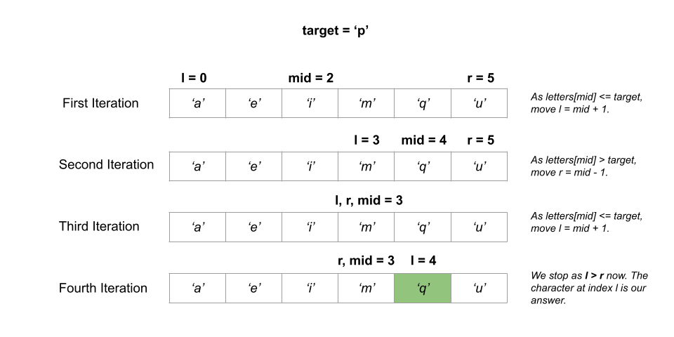

[TOC]

## Solution

---

### Overview

We are given array of characters `letters` that is sorted in non-decreasing order, and a character `target`.

Our task is to find the smallest character in `letters` that is lexicographically greater than `target`. If such a character does not exist, we have to return the first character in `letters`.

---

### Approach 1: Brute Force

#### Intuition

We can use brute force to go through all of the characters in `letters` and compare each of them to `target`. When we come across a letter that is lexicographically greater than `target`, we return it. If no letter greater than `target` is found, we return the first character.

Every character has an ASCII value associated with it. For example, the ASCII value of `a` is `97`, `b` is `98`, and so on. We can simply use logical operators (`>`, `<`, `==`) to compare two characters that use these ASCII values for comparison internally.

#### Algorithm

1. Iterate over all the characters in `letters` and for each `letter`, check if `letter > target`. If `letter > target`, return `letter`.
2. We did not get any `letter` that is lexicographically greater than `target`. We return $\text{letters}[0]$.

#### Implementation

```python
class Solution:
    def nextGreatestLetter(self, letters: List[str], target: str) -> str:
        for letter in letters:
            if letter > target:
                return letter
        return letters[0]
```

#### Complexity Analysis

Here $n$ is the number of characters in `letters`.

* Time complexity: $O(n)$.
- We loop through all of the characters in `letters` and compare them to `target`, which takes $O(n)$ time for all $n$ characters.

* Space complexity: $O(1)$.
- Except for a variable `letter` (used in the loop) that takes constant space, we do not consume any other space.

---

### Approach 2: Binary Search

#### Intuition

We are given that the array of characters `letters` is sorted in non-decreasing order. It means that for an index `i`, if $\text{letter}[i] \le target$, all the indices smaller than or equal to `i` would also have characters that are lexicographically smaller than `target`. Our answer lies in some of the indices from $i + 1$ to the last index.

If $\text{letter}[i] > target$, all the indices greater than or equal to `i` would also have characters that are lexicographically greater than `target` because `letters` is sorted. Our answer is either `i` or some index smaller than it.

A scenario like this where our task is to search for an element `x` (or just greater than it) from a given range `(left, right)` where all values smaller than `x` do not satisfy a certain condition and all values greater than or equal to `x` satisfy it (or vice-versa), can be solved optimally with a binary search algorithm. In binary search, we repeatedly divide the solution space where the answer could be in half until the range contains just one element.

Following the above discussion, we use binary search to solve this problem. We create an integer `left` and initialize it to the starting index `0`. We also create another integer variable `right` and set it to the last index of `letters`, i.e., $\text{letters.length} - 1$.

We get the middle of the range $mid = (left + right) / 2$ and compare it with `target`. If $\text{letters}[mid] \le target$, we move to the upper half of the range by setting $left = mid + 1$. Otherwise, we move to lower half of range by setting $right = mid - 1$ as all the characters at indices greater or equal to `mid` would also be greater than `target`.

The answer would be within the range `(left, right)` at any point. All the indices smaller than `left` would contain characters smaller than `target` and all characters at indices greater than `right` would be greater than `target`. We continue the search until $left \le right$.

When `left > right`, `left` denotes the index of the smallest character that is lexicographically greater than `target`. This is because all characters at indices greater than `right` would be greater than `target` and character immediately next to index `right` would be `left` (or $right + 1$) after the completion of binary search algorithm.

Here is a visual representation of an example to illustrate how it works:



#### Algorithm

1. Create three integers $left = 0$, $right = \text{letters.length} - 1$ and `mid` to start the binary search algorithm.
2. While $left \le right$:
- Find the midpoint of the range `(left, right)` in the variable $mid = (left + right) / 2$.
- Compare the letter at index `mid` with `target`. If $\text{letters}[mid] \le target$, it means all the characters at indices smaller or equal to `mid` would also be smaller than `target` because the characters in `letters` are sorted. As a result, we move to upper half of the range by setting $left = mid + 1$.
- Otherwise, it means all the characters at indices greater or equal to `mid` would also be greater than `target` because the characters in `letters` are sorted. As a result, we move to lower half of the range by setting $right = mid - 1$.
- At the end of the binary search algorithm, `left` will store the index of the smallest character that is lexicographically greater than `target`.
3. If $left = \text{letters.length}$, it means there is no character in `letters` that is lexicographically greater than `target`. We return $\text{letters}[0]$. Otherwise, we return $\text{letters}[left]$ as `left` holds the smallest character greater than `target`.

#### Implementation

```python
class Solution:
    def nextGreatestLetter(self, letters: List[str], target: str) -> str:
        left = 0
        right = len(letters) - 1

        while left <= right:
            mid = (left + right) // 2
            if letters[mid] <= target:
                left = mid + 1
            else:
                right = mid - 1

        if left == len(letters):
            return letters[0]
        else:
            return letters[left]
```

#### Complexity Analysis

Here $n$ is the number of characters in `letters`.

* Time complexity: $O(\log n)$.
- We perform $O(\log n)$ iterations using the binary search algorithm as the problem set is divided into half in each iteration.

* Space complexity: $O(1)$.
- Except for a few variables `left`, `right`, and `mid` which take constant space each, we do not consume any other space.