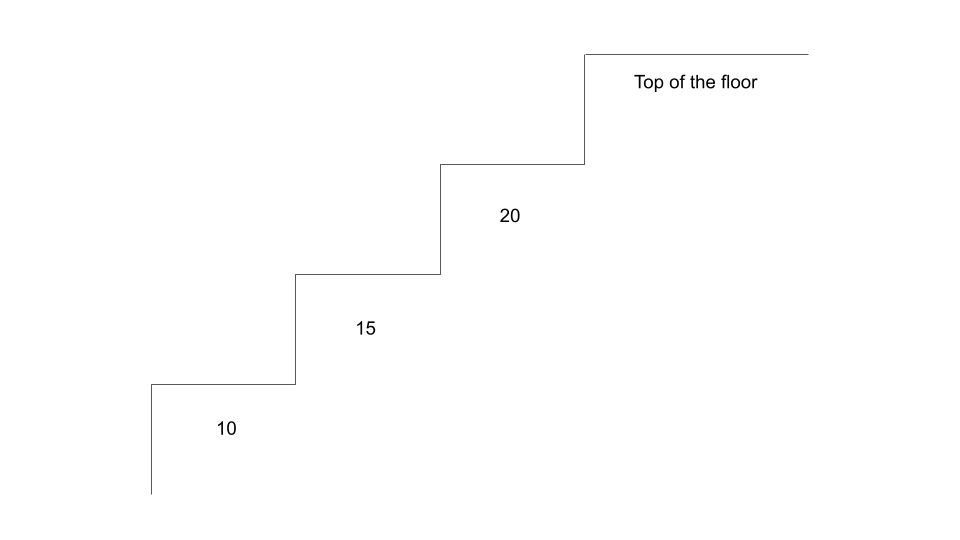
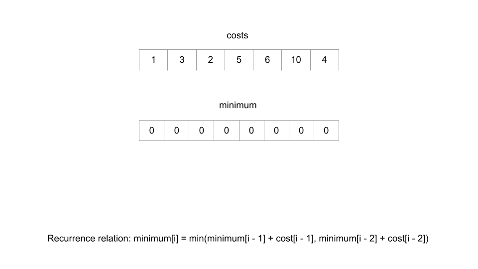
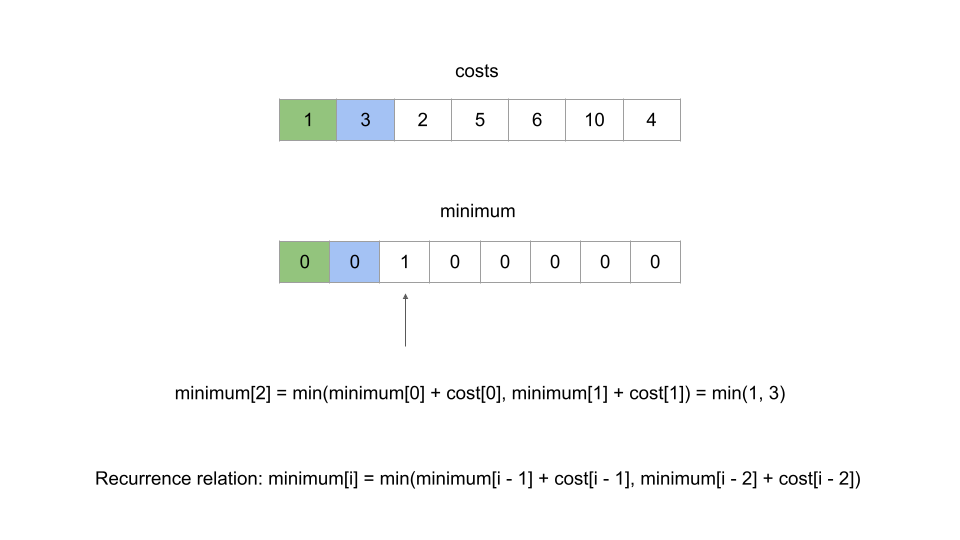
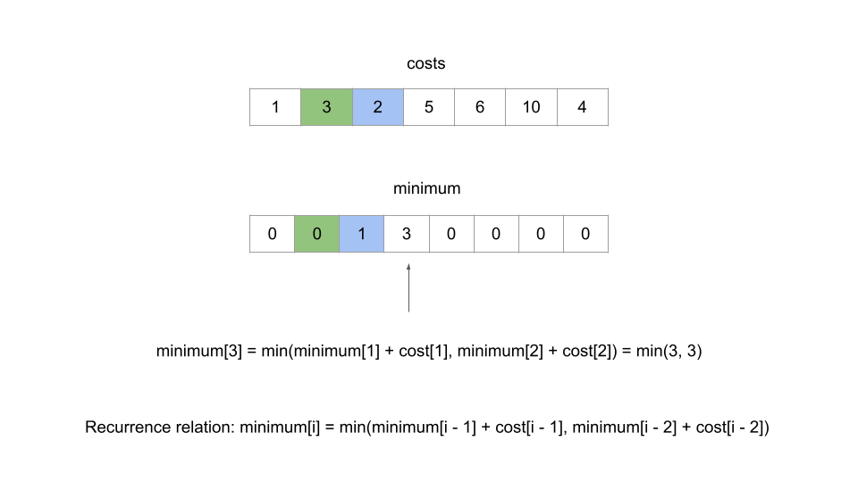
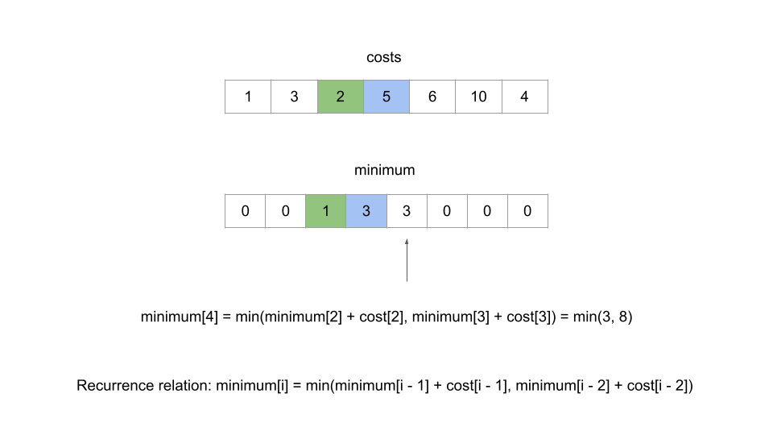
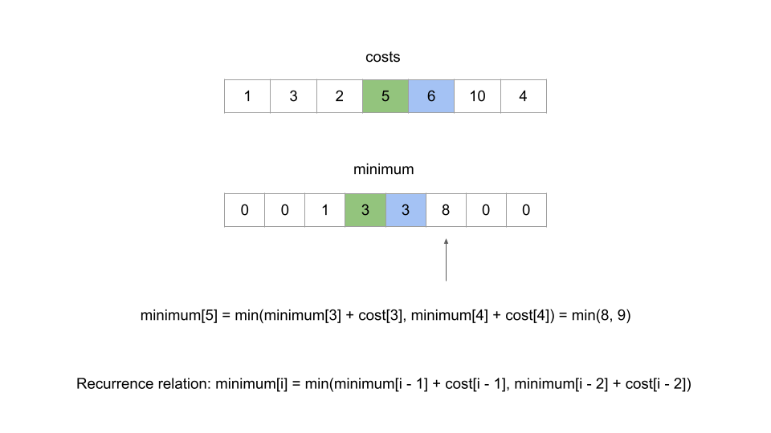
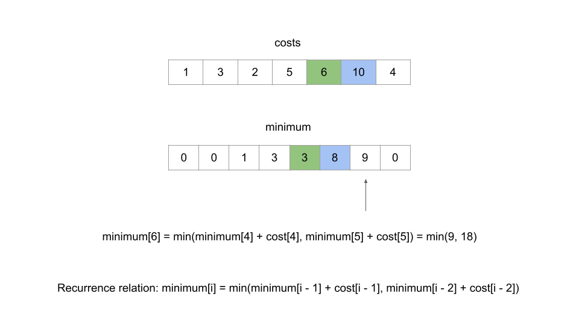
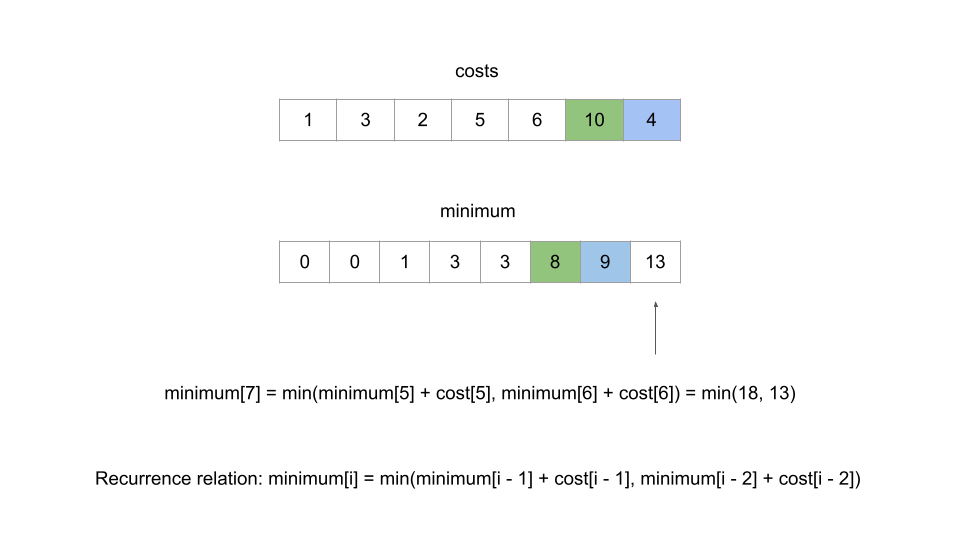
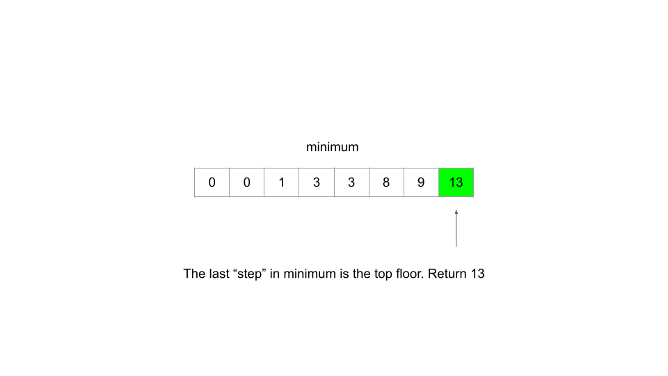
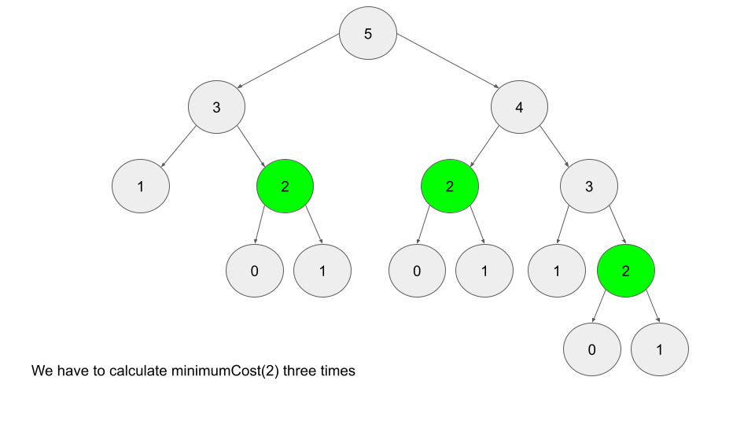

[TOC]

## Solution

---

### Overview

We can make two important observations about this problem. First, we need to find the maximum or minimum of something. Second, we have to make decisions that might look different depending on decisions we made previously. These characteristics are typical of a dynamic programming problem. In this case, we need to make decisions about either taking 1 step or 2 steps at a time, and our goal is to minimize the overall cost.

If you're new to dynamic programming, this question may seem more like a medium. Don't worry though, this is a great problem for getting started with dynamic programming. Generally, there are two main ways to implement a dynamic programming algorithm - top-down and bottom-up. In this article, we will take a look at both.

Before we begin, let's clear up some of the confusion surrounding the problem statement. <br>

 <br>

The "top of the floor" does not refer to the final index of `costs`. We actually need to "arrive" beyond the array's bounds.

</br>

---

### Approach 1: Bottom-Up Dynamic Programming (Tabulation)

**Intuition**

Bottom-up dynamic programming is also known as **tabulation** and is done iteratively. Dynamic programming is based on the concept of **overlapping subproblems** and **optimal substructure**. This is when the solution to a problem can be constructed from solutions to similar and smaller subproblems. Solving a smaller version of the problem can be easier and faster, thus if we break up the problem into smaller subproblems, solving them can lead us to the final solution easier and faster.

Let's look at an example $costs = [0,1,2,3,4,5]$. Since we can take 1 or 2 steps at a time, we need to reach either step 4 or step 5 (0-indexed), and then pay the respective cost to reach the top. For this example, to reach step 4 optimally would cost **2** by taking path `0 --> 2 --> 4` (we're not counting the cost of step 4 yet since we are only talking about *reaching* the step right now). To reach step 5 optimally would cost **4** by taking path `1 --> 3 --> 5`.

Now, imagine that before we started the problem, somebody came up to us and said "to optimally reach step 4 costs **2** and to optimally reach step 5 costs **4**." Well, then the problem is trivial - the answer is the minimum of $2 + \text{cost}[4] = 6$ and $4 + \text{cost}[5] = 9$. The only reason this was so easy was because we already knew the cost to reach steps 4 and 5.

So how do we find the minimum cost to reach step 4 or step 5? Well, you might notice that it's the exact same problem, just with a smaller input. For example, finding the minimum cost to reach step 4 is like solving the original problem with input `[0,1,2,3]` (step 4 is the "top of the floor" now). To solve this subproblem, we need to find the minimum cost to reach steps 2 and 3, which requires us to answer the original problem for inputs `[0,1]` and `[0,1,2]`.

This pattern is known as a **recurrence relation**, and in this case, the minimum cost to reach the $i^{th}$ step is equal to $\text{minimumCost}[i] = min(minimumCost[i - 1] + cost[i - 1], minimumCost[i - 2] + cost[i - 2])$. As you can see, we get the solution for the $i^{th}$ step by using solutions from earlier steps. So, when does the sequence terminate? For this question, the base cases are given in the problem description - we are allowed to start at either step 0 or step 1, so $\text{minimumCost}[0]$ and $\text{minimumCost}[1]$ are both `0`.

**Algorithm**

With our base cases and recurrence relation, we can now easily solve this problem.

1. Define an array `minimumCost`, where $\text{minimumCost}[i]$ represents the minimum cost of reaching the $i^{th}$ step. The array should be one element longer than `costs` and start with all elements set to `0`.
- The reason the array should contain one additional element is because we will treat the *top floor* as the *step* to reach.

2. Iterate over the array starting at the 2nd index. The problem statement says we are allowed to start at the $0^{th}$ or $1^{st}$ step, so we know the minimum cost to reach those steps is `0`.

3. For each step, apply the recurrence relation - $\text{minimumCost}[i] = min(minimumCost[i - 1] + cost[i - 1], minimumCost[i - 2] + cost[i - 2])$. As you can see, as we populate `minimumCost`, it becomes possible to solve future subproblems. For example, before solving the 5th and 6th steps we are required to solve the 4th step.

4. At the end, return the final element of `minimumCost`. Remember, we are treating this "step" as the top floor that we need to reach.

Here's an animation that shows how and why this algorithm works:

















**Implementation**

```python
class Solution:
    def minCostClimbingStairs(self, cost: List[int]) -> int:
        # The array's length should be 1 longer than the length of cost
        # This is because we can treat the "top floor" as a step to reach
        minimum_cost = [0] * (len(cost) + 1)

        # Start iteration from step 2, since the minimum cost of reaching
        # step 0 and step 1 is 0
        for i in range(2, len(cost) + 1):
            take_one_step = minimum_cost[i - 1] + cost[i - 1]
            take_two_steps = minimum_cost[i - 2] + cost[i - 2]
            minimum_cost[i] = min(take_one_step, take_two_steps)

        # The final element in minimum_cost refers to the top floor
        return minimum_cost[-1]
```

**Complexity Analysis**

Given $N$ as the length of `cost`,

* Time complexity: $O(N)$.

    We iterate $N - 1$ times, and at each iteration we apply an equation that requires $O(1)$ time.

* Space complexity: $O(N)$.

    The array `minimumCost` is always 1 element longer than the array `cost`.

<br/>

---

### Approach 2: Top-Down Dynamic Programming (Recursion + Memoization)

**Intuition**

Bottom-up dynamic programming is named as such because we start from the bottom (in this case, the bottom of the staircase) and iteratively work our way to the top. Top-down dynamic programming starts at the top and works its way down to the base cases. Typically, this is implemented through recursion, and then made efficient using _memoization_. Memoization refers to storing the results of expensive function calls in order to avoid duplicate computations - we'll soon see why this is important for this problem. If you're new to recursion, check out the [recursion explore card](https://leetcode.com/explore/featured/card/recursion-i/).

Similar to the first approach, we will make use of the recurrence relation we found. This time, we will implement `minimumCost` as a function instead of an array. Again, `minimumCost(i)` will represent the minimum cost to reach the $i^{th}$ step. The base cases for this function will be $minimumCost(0) = minimumCost(1) = 0$, since we are allowed to start on either step 0 or step 1. For any other step `i`, we can refer to our recurrence relation - we know $minimumCost(i) = min(cost[i - 1] + minimumCost(i - 1), cost[i - 2] + minimumCost(i - 2))$.

We can implement this function easily enough, but there's a major problem - repeated computations. If we want to find `minimumCost(5)`, then we call `minimumCost(3)` and `minimumCost(4)`. However, `minimumCost(4)` will then call `minimumCost(3)`, and both `minimumCost(3)` calls will call `minimumCost(2)`, on top of another `minimumCost(2)` call from `minimumCost(4)`. <br>

 <br>

As you can see, there are a ton of repeat computations. When there are only 5 stairs, it might not seem that bad. However, imagine if there were 6 stairs instead. This entire image would be one child of the root. As `n` increases, the amount of computations required grows exponentially. So, how do we resolve this issue? If we calculate, say, `minimumCost(3)`, then why should we calculate it again? Instead of going through the entire subtree every time we want to calculate `minimumCost(3)`, let's just store the value of `minimumCost(3)` after calculating it the first time, and refer to that instead.

This is what memoization is - caching "expensive" function calls to avoid duplicate computations. Imagine what the recursion tree would look like for a call to `minimumCost(10000)`, and how expensive calls like `minimumCost(9998)` would be to compute multiple times. We can use a hash map for the memoization, where each key will have the value `minimumCost(key)`.

**Algorithm**

1. Define a hash map `memo`, where $\text{memo}[i]$ represents the minimum cost of reaching the $i^{th}$ step.

2. Define a function `minimumCost`, where `minimumCost(i)` will determine the minimum cost to reach the $i^{th}$ step.

3. In our function `minimumCost`, first check the base cases: `return 0` when $i = 0$ or $i = 1$. Next, check if the argument `i` has already been calculated and stored in our hash map `memo`. If so, $return \text{memo}[i]$. Otherwise, use the recurrence relation to calculate $\text{memo}[i]$, and then return $\text{memo}[i]$.

4. Simply call and return `minimumCost(cost.length)`. Once again, we can make use of the trick from approach 1 where we treat the top floor as an extra "step". Since `cost` is 0-indexed, `cost.length` will be an index 1 step above the last element of `cost`.

**Implementation**

```python
class Solution:
    def minCostClimbingStairs(self, cost: List[int]) -> int:
        def minimum_cost(i):
            # Base case, we are allowed to start at either step 0 or step 1
            if i <= 1:
                return 0

            # Check if we have already calculated minimum_cost(i)
            if i in memo:
                return memo[i]

            # If not, cache the result in our hash map and return it
            down_one = cost[i - 1] + minimum_cost(i - 1)
            down_two = cost[i - 2] + minimum_cost(i - 2)
            memo[i] = min(down_one, down_two)
            return memo[i]

        memo = {}
        return minimum_cost(len(cost))
```

**Extra Notes**

For this approach, we are using hash maps as our data structure to memoize function calls. We could also use an array since the calls to `minimumCost` are very well defined (between 0 and $\text{cost.length} + 1$). However, a hash map is used for most top-down dynamic programming solutions, as there will often be multiple function arguments, the arguments will not be integers, or a variety of other reasons that require a hash map instead of an array. Although using an array is slightly more efficient, using a hash map here is good practice that can be applied to other problems.

In Python, the [functools](https://docs.python.org/3/library/functools.html) module contains functions that can be used to automatically memoize a function. In LeetCode, modules are automatically imported, so you can just add the `@cache` wrapper to any function definition to have it automatically memoize.

```python
class Solution:
    def minCostClimbingStairs(self, cost: List[int]) -> int:
        @cache
        def minimum_cost(i):
            if i <= 1:
                return 0

            down_one = cost[i - 1] + minimum_cost(i - 1)
            down_two = cost[i - 2] + minimum_cost(i - 2)
            return min(down_one, down_two)

        return minimum_cost(len(cost))
```

You can observe that by removing the @cache wrapper, on attempted submission, the code will exceed the time limit.

**Complexity Analysis**

Given $N$ as the length of `cost`,

* Time complexity: $O(N)$

    `minimumCost` gets called with each index from `0` to `N`. Because of our memoization, each call will only take $O(1)$ time.

* Space complexity: $O(N)$

    The extra space used by this algorithm is the recursion call stack. For example, `minimumCost(10000)` will call `minimumCost(9999)`, which calls `minimumCost(9998)` etc., all the way down until the base cases at `minimumCost(0)` and `minimumCost(1)`. In addition, our hash map `memo` will be of size `N` at the end, since we populate it with every index from `0` to `N`.

<br/>

---

### Approach 3: Bottom-Up, Constant Space

**Intuition**

You may have noticed that our recurrence relation from the previous two approaches only cares about 2 steps below the current step. For example, if we are calculating the minimum cost to reach step 12, we only care about data from step 10 and step 11. While we would have needed to calculate the minimum cost for steps 2-9 as well, at the time of the actual calculation for step 12, we no longer care about any of those steps.

Therefore, instead of using $O(n)$ space to keep an array, we can improve to $O(1)$ space using only two variables.

**Algorithm**

1. Initialize two variables, `downOne` and `downTwo`, that represent the minimum cost to reach one step and two steps below the current step, respectively. We will start iteration from step 2, which means these variables will initially represent the minimum cost to reach steps 0 and 1, so we will initialize each of them to 0.

2. Iterate over the array, again with 1 extra iteration at the end to treat the top floor as the final "step". At each iteration, simulate moving 1 step up. This means `downOne` will now refer to the current step, so apply our recurrence relation to update `downOne`. `downTwo` will be whatever `downOne` was prior to the update, so let's use a temporary variable to help with the update.

3. In the end, since we treated the top floor as a *step*, `downOne` will refer to the minimum cost to reach the top floor. Return `downOne`.

**Implementation**

```python
class Solution:
    def minCostClimbingStairs(self, cost: List[int]) -> int:
        down_one = down_two = 0
        for i in range(2, len(cost) + 1):
            temp = down_one
            down_one = min(down_one + cost[i - 1], down_two + cost[i - 2])
            down_two = temp

        return down_one
```

**Complexity Analysis**

Given $N$ as the length of `cost`,

* Time complexity: $O(N)$.

    We only iterate $N - 1$ times, and at each iteration we apply an equation that uses $O(1)$ time.

* Space complexity: $O(1)$

    The only extra space we use is 2 variables, which are independent of input size.

<br/>

---

### Closing Notes

If you're new to dynamic programming, hopefully you learned something from this article. Please post any questions you may have in the comment section below. For additional practice, here's a list of similar dynamic programming questions that are good for beginners.

[70. Climbing Stairs (Easy)](https://leetcode.com/problems/climbing-stairs/)

[198. House Robber (Medium)](https://leetcode.com/problems/house-robber/)

[256. Paint House (Medium)](https://leetcode.com/problems/paint-house/)

[509. Fibonacci Number (Easy)](https://leetcode.com/problems/fibonacci-number/)

[931. Minimum Falling Path Sum (Medium)](https://leetcode.com/problems/minimum-falling-path-sum/)

---