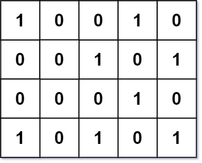
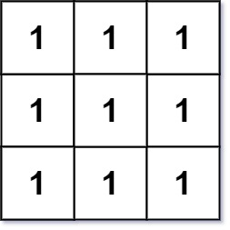
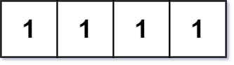

### 1. Description

Given an `m x n` integer matrix `grid` where each entry is only `0` or `1`, return *the number of **corner rectangles***.

A **corner rectangle** is four distinct `1`'s on the grid that forms an axis-aligned rectangle. Note that only the corners need to have the value `1`. Also, all four `1`'s used must be distinct.

### 2. Function Contract

$solve(grid: list[\text{list}[int]]) -> int$

Let $m$ be the number of rows and $n$ be the number of columns.

**Inputs**

- `grid`: a nonempty rectangular $m \times n$ matrix whose entries are binary integers.

**Return value**

Return the number of choices of row indices $r_1 < r_2$ and column indices $c_1 < c_2$ for which all four cells $\text{grid}[r1][c1]$, $\text{grid}[r1][c2]$, $\text{grid}[r2][c1]$, and $\text{grid}[r2][c2]$ equal `1`.

### 3. Examples

#### Example 1

- **Input:** `grid = [[1,0,0,1,0],[0,0,1,0,1],[0,0,0,1,0],[1,0,1,0,1]]`
- **Output:** `1`
- **Explanation:** There is only one corner rectangle, with corners grid[1][2], grid[1][4], grid[3][2], grid[3][4].
#### Example 2

- **Input:** `grid = [[1,1,1],[1,1,1],[1,1,1]]`
- **Output:** `9`
- **Explanation:** There are four 2x2 rectangles, four 2x3 and 3x2 rectangles, and one 3x3 rectangle.
#### Example 3

- **Input:** `grid = [[1,1,1,1]]`
- **Output:** `0`
- **Explanation:** Rectangles must have four distinct corners.

### 4. Constraints

- $m = \text{grid.length}$

- $n = \text{grid}[i].length$

- $1 \le m, n \le 200$

- $\text{grid}[i][j]$ is either `0` or `1`.

- The number of `1`'s in the grid is in the range `[1, 6000]`.