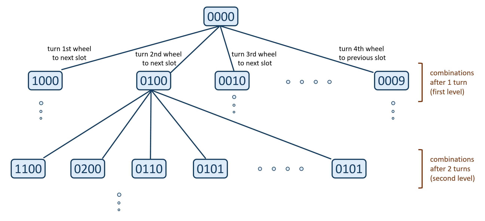
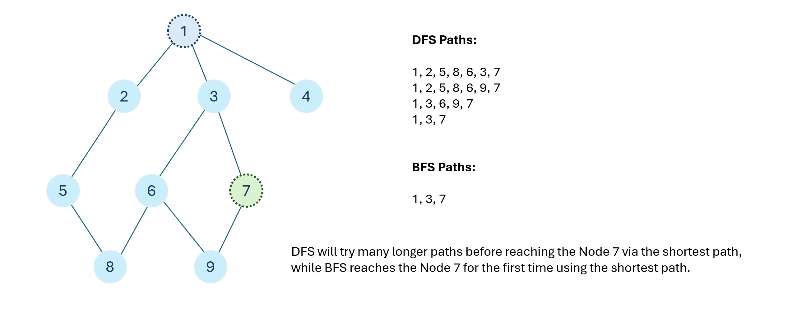
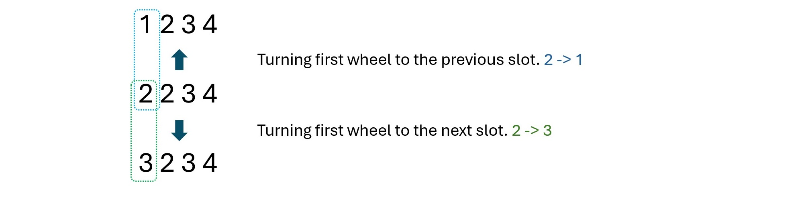
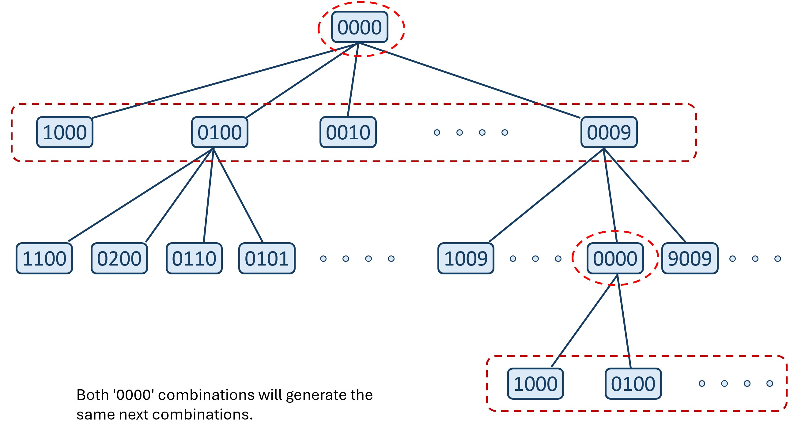

[TOC]

## Solution

---

### Overview

For simplicity, let's say any combination of any state of all wheels represents one lock combination. e.g. `'0000', '1000', '2000', ... ` etc. all represent a lock combination.

Say we are currently at combination `'0000'`, and we make one wheel turn. Now we are at combination `1000`. This combination change due to one wheel turn can be visualized as traversing a graph from node 1 (`combination '0000'`) to node 2 (`combination '1000'`).

It can be better understood with the help of the following image:



In this graph, each node represents a lock combination, and the edge represents one wheel turn.

According to the problem statement, we start from the lock combination `'0000'`. We can make one wheel turn at a time and need to find the minimum steps required to reach the target lock combination.

As we observed, each lock combination is a graph's node, and each wheel turn is an edge connecting two nodes. The given problem statement can be re-worded as: "We start from node `lock combination '0000'` and have to find the minimum number of edges to traverse to reach the target lock combination node." Thus, the given problem can be converted into a graph traversal problem.

To traverse nodes in a graph, we mainly utilize two algorithms: depth-first search (DFS), and breadth-first search (BFS). If you are new to these algorithms we recommend reading our [Depth-First Search](https://leetcode.com/explore/learn/card/graph/619/depth-first-search-in-graph/3882/) and [Breadth-First Search](https://leetcode.com/explore/learn/card/graph/620/breadth-first-search-in-graph/3883/) explore cards.

We can solve this problem using both traversals, but given the constraints, the depth-first search will result in a TLE. This is because DFS explores as deeply as possible along each branch before backtracking. It doesn't necessarily explore nodes in any particular order; it might go deep into a branch before exploring other branches.

BFS is well-suited for finding the shortest path in unweighted graphs, which makes it a good fit for this problem because BFS explores nodes level by level. It starts from the source node and explores all its neighbors before moving on to the next level of neighbors. Due to its level-order exploration strategy, BFS guarantees that the first time it reaches a node, it has found the shortest path to that node.



<br />

**Note:** Being familiar with level-order traversal using breadth-first search will help you solve this problem. If you need to brush up, you can practice these LeetCode problems first:
- [102. Binary Tree Level Order Traversal](https://leetcode.com/problems/binary-tree-level-order-traversal/)
- [429. N-ary Tree Level Order Traversal](https://leetcode.com/problems/n-ary-tree-level-order-traversal/)
- [637. Average of Levels in Binary Tree](https://leetcode.com/problems/average-of-levels-in-binary-tree/)

---

### Approach: Breadth-First Search

#### Intuition

We will keep a queue, $\text{pending}_{combinations}$, containing the lock combinations yet to be visited using BFS.
Initially, it will contain the starting combination `'0000'`.

We will visit each combination stored in the queue one by one. If the current popped combination is the target combination, we will return the number of edges traversed (number of wheel turns we made) to reach this combination. BFS guarantees the shortest path in an unweighted graph, so as soon as we find an answer, we know it is the optimal one.
Otherwise, we will generate new combinations from the current combination, by rotating each of the four wheels to the next slot digit and the previous slot digit one by one. Then we will push the new combinations into the queue.



We will keep two additional data structures to quickly fetch the next and the previous slot digits for the current slot digits whenever needed.

<br />

Notice that we might reach the same lock combinations, again and again, using different paths, and these duplicate combinations will always generate the same next combinations.



So, we will keep one additional data structure to mark visited combinations to avoid traversing on a combination more than once.
We also have some dead-end combinations from which we can't proceed further. We can consider these combinations as visited combinations because we cannot generate new combinations using these combinations.

Thus, we will keep a hash set $\text{visited}_{combinations}$, insert the dead-end combinations in it initially, and will insert the visited combinations while doing the BFS.

#### Algorithm

1. Initialization:
- Create two character maps, $\text{next}_{slot}$ to map the current slot digit with its next slot digit, and $\text{prev}_{slot}$ to map the current slot digit with its previous slot digit.
- Create a hash set $\text{visited}_{combinations}$, initially containing all `deadends` array combinations.
- Create a queue $\text{pending}_{combinations}$ to traverse all combinations in level-wise BFS.
- Create an integer variable `turns` initially storing `0`, to denote the number of wheel turns made.

2. If $\text{visited}_{combinations}$ contains the starting combination `'0000'` then we can never reach the target combination and will return `-1`.

3. Insert the starting combination `'0000'` in the queue and mark it as visited.

4. While there are elements in the queue, iterate on all current level combinations using a for loop:
- Pop the current combination from the front of the queue.
- If the current combination is the target combination return `turns`.
- Otherwise, iterate on all four wheels; for each wheel, generate the new combination by turning the respective wheel to the next slot and the previous slot. If the new combination is not present in $\text{visited}_{combinations}$ then push it in the queue and mark it as visited.
- After iterating on all current level combinations increment `turns` by `1`.

5. If we never reach the target combination, then, return `-1`.

#### Implementation

```python
class Solution:
    def openLock(self, deadends: List[str], target: str) -> int:
        # Map the next slot digit for each current slot digit.
        next_slot = {
            "0": "1",
            "1": "2",
            "2": "3",
            "3": "4",
            "4": "5",
            "5": "6",
            "6": "7",
            "7": "8",
            "8": "9",
            "9": "0",
        }
        # Map the previous slot digit for each current slot digit.
        prev_slot = {
            "0": "9",
            "1": "0",
            "2": "1",
            "3": "2",
            "4": "3",
            "5": "4",
            "6": "5",
            "7": "6",
            "8": "7",
            "9": "8",
        }

        # Set to store visited and dead-end combinations.
        visited_combinations = set(deadends)
        # Queue to store combinations generated after each turn.
        pending_combinations = deque()

        # Count the number of wheel turns made.
        turns = 0

        # If the starting combination is also a dead-end,
        # then we can't move from the starting combination.
        if "0000" in visited_combinations:
            return -1

        # Start with the initial combination '0000'.
        pending_combinations.append("0000")
        visited_combinations.add("0000")

        while pending_combinations:
            # Explore all combinations of the current level.
            curr_level_nodes_count = len(pending_combinations)
            for _ in range(curr_level_nodes_count):
                # Get the current combination from the front of the queue.
                current_combination = pending_combinations.popleft()

                # If the current combination matches the target,
                # return the number of turns/level.
                if current_combination == target:
                    return turns

                # Explore all possible new combinations
                # by turning each wheel in both directions.
                for wheel in range(4):
                    # Generate the new combination
                    # by turning the wheel to the next digit.
                    new_combination = list(current_combination)
                    new_combination[wheel] = next_slot[new_combination[wheel]]
                    new_combination_str = "".join(new_combination)
                    # If the new combination is not a dead-end and
                    # was never visited,
                    # add it to the queue and mark it as visited.
                    if new_combination_str not in visited_combinations:
                        pending_combinations.append(new_combination_str)
                        visited_combinations.add(new_combination_str)

                    # Generate the new combination
                    # by turning the wheel to the previous digit.
                    new_combination = list(current_combination)
                    new_combination[wheel] = prev_slot[new_combination[wheel]]
                    new_combination_str = "".join(new_combination)
                    # If the new combination is not a dead-end and
                    # is never visited,
                    # add it to the queue and mark it as visited.
                    if new_combination_str not in visited_combinations:
                        pending_combinations.append(new_combination_str)
                        visited_combinations.add(new_combination_str)

            # We will visit next-level combinations.
            turns += 1

        # We never reached the target combination.
        return -1
```

#### Complexity Analysis

Here, $n = 10$ is the number of slots on a wheel, $w = 4$ is the number of wheels, and $d$ is the number of elements in the `deadends` array.

* Time complexity: $O(4(d +$10^{4}$))$
- Initializing the hash maps with $n$ key-value pairs, and the hash set with $d$ combinations of length $w$ will take $O(2 \cdot n)$ and $O(d \cdot w)$ time respectively.
- In the worst case, we might iterate on all $n^w$ unique combinations, and for each combination, we perform $2 \cdot w$ turns. Thus, it will take $O(n^w \cdot 2 \cdot w) = O(n^w \cdot w)$ time.
- So, this approach will take $O(n + (d + n^w) \cdot w) =$\mathcal{O}(10 + (d + 10^{4})$\cdot 4) =$\mathcal{O}(4(d + 10^{4})$)$ time.
* Space complexity: $O(4(d +$10^{4}$))$
- The hash maps with $n$ key-value pairs, and the hash set with $d$ combinations of length $w$ will take $O(2 \cdot n)$ and $O(d \cdot w)$ space respectively.
- In the worst case, we might push all $n^w$ unique combinations of length $w$ in the queue and the hash set. Thus, it will take $O(n^w \cdot w)$ space.
- So, this approach will take $O(n + (d + n^w) \cdot w) =$\mathcal{O}(4(d + 10^{4})$)$ space.