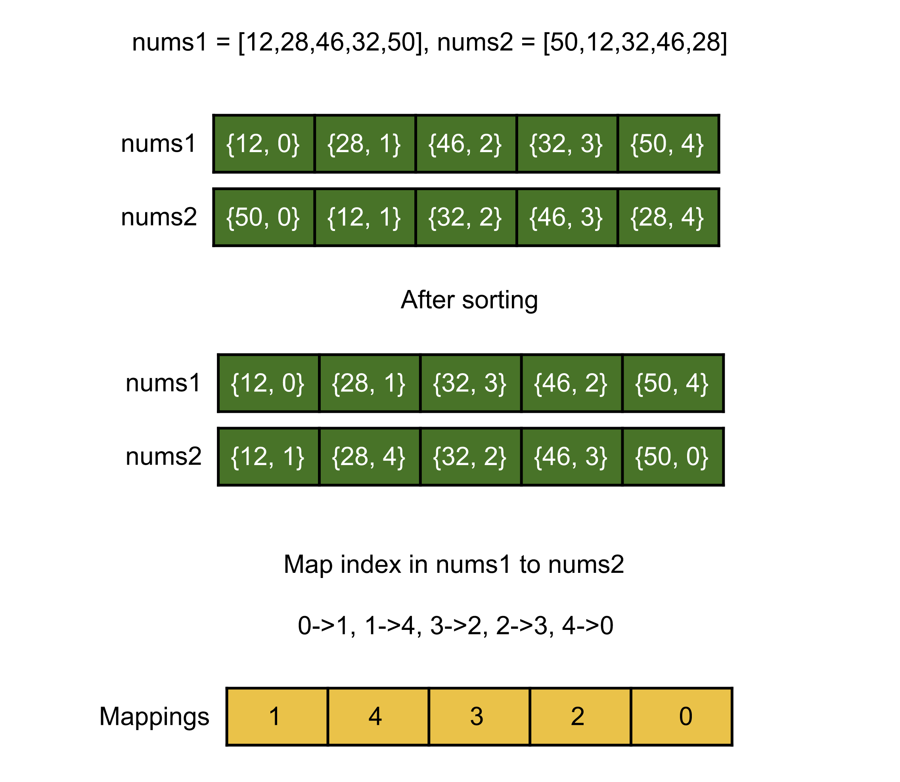
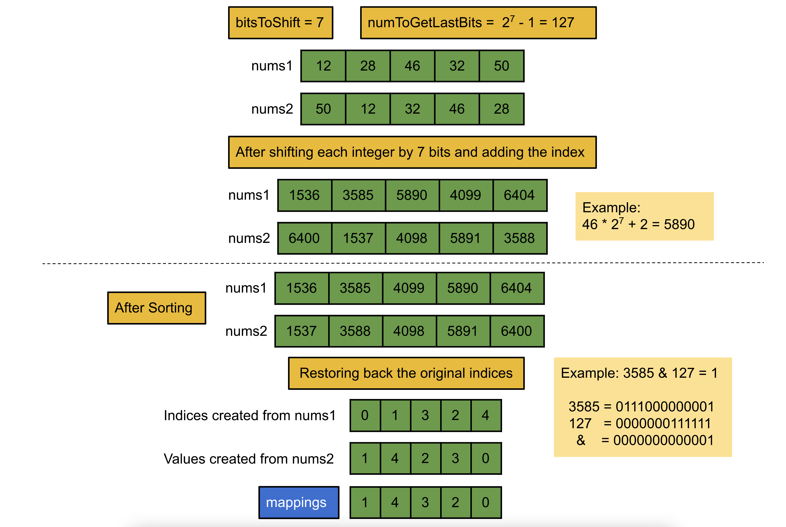

[TOC]

## Video Solution
---

<div>
    <div class="video-container">
        <iframe src="https://player.vimeo.com/video/824222070" width="640" height="360" frameborder="0" allow="autoplay; fullscreen" allowfullscreen></iframe>
    </div>
</div>

<div>
</div>

## Solution Article

---

### Overview

We have two lists of $N$ integers `nums1` and `nums2`; both lists may have duplicates. We want to map each integer in the first list, `nums1`, to any index having the same integer in the second list, `nums2`. There could be many-to-one mappings, i.e., if there are duplicate integers in the list `nums1`, each of them can be mapped to the same index in the list `nums2`.
</br>

---

### Approach 1: Brute Force

**Intuition**

The first approach one can think of is to iterate over each integer in the list `nums1`, and for each integer, iterate over the integers in the list `nums2`. If the integer in the list `nums2` is the same as in the list `nums1`, we can store the index and break out as the search for the integer in `nums1` is done.

**Algorithm**

1. Create a list `mappings` of size $N$ to store the final mappings.
2. Iterate over the list `nums1`, and for each integer `num`:

- Iterate over each integer in the list `nums2`. If an integer is equal to `num`, break here and store the index in the list `mappings`.

3. Return `mappings`.

**Implementation**

```cpp
class Solution {
public:
    vector<int> anagramMappings(vector<int>& nums1, vector<int>& nums2) {
        // List to store the anagram mappings.
        vector<int> mappings;

        for (int num : nums1) {
            for (int i = 0; i < nums2.size(); i++) {
                // Store the corresponding index of number in the second list.
                if (num == nums2[i]) {
                    mappings.push_back(i);
                    break;
                }
            }
        }
        return mappings;
    }
};
```

**Complexity Analysis**

Here, $N$ is the number of integers in the list `nums1` and `nums2`.

* Time complexity: $O(N^2)$.

  Consider the case when $nums1 = {a, b, c, d}$ and $nums2 = {d, c, b, a}$; the number of operations in these cases where the second array is just the reverse of the first one will be $N + (N - 1) + (N - 2) + ... + 1$. This sum can be written as $\dfrac{N \cdot (N + 1)}{2}$, and therefore the total time complexity in the worst case is equal to $O(N^2)$.

* Space complexity: $O(1)$.

  We just need $O(N)$ space to store the final mappings; however, the space needed to store the output is not considered under the space complexity, and hence the space complexity is constant.
  <br/>

---

### Approach 2: HashMap

**Intuition**

We can observe that for each integer in the list `nums1`, we need to find any index in the second list `nums2` with the same integer. Finding the index in the second list can become much simpler if we store the integers and their corresponding indices of the second list in an unordered hash map. Using this map, instead of linearly searching each element in list `nums2` which takes $O(N)$ time, we can find the index in $O(1)$ for each integer in the list `nums1`.

**Algorithm**

1. Iterate over the integers in the list `nums2` and store the index corresponding to its value in the hash map `valueToPos`.
2. Iterate over the integers in the list `nums1`, and for each integer `num`, insert the index stored at $\text{valueToPos}[num]$ in the list `mappings`.
3. Return `mappings`.

**Implementation**

```cpp
class Solution {
public:
    vector<int> anagramMappings(vector<int>& nums1, vector<int>& nums2) {
        // Store the index corresponding to the value in the second list.
        unordered_map<int, int> valueToPos;
        for (int i = 0; i < nums2.size(); i++) {
            valueToPos[nums2[i]] = i;
        }

        // List to store the anagram mappings.
        vector<int> mappings;
        for (int num : nums1) {
            mappings.push_back(valueToPos[num]);
        }

        return mappings;
    }
};
```

**Complexity Analysis**

Here, $N$ is the number of integers in the list `nums1` and `nums2`.

* Time complexity: $O(N)$.

  We first iterate over the list `nums1` to store the indices in the map and then iterate over the first list `nums1` to get the corresponding index in the second list from the map. Therefore, the total time complexity equals $O(N)$.

* Space complexity: $O(N)$.

  We need $O(N)$ space to store the indices in the unordered map `valueToPos`; thus, the total space complexity equals $O(N)$.
  <br/>

---

### Approach 3: Bit Manipulation + Sorting

**Intuition**

> Note: This approach is more advanced, requires changing the input lists, is slower than the previous approach, and hence is not advisable. This approach has been added for the sake of completion or if the interviewer specifically asks for it. We will assume that you are already familiar with bit operations.

Both given lists are anagrams of each other, so if we sort both of them, then the same integers would come at the same indices (the arrays are equal). For example, $nums1 = {2, 3, 2, 1}$ and $nums2 = {3, 2, 1, 2}$, then after sorting both lists will be `{1, 2, 2, 3}`. Now, before sorting, we can store each element with its index (using pair or tuple etc.) to keep track of the original indices as in the final mapping, we will be storing the original index of each integer in the list `nums2`.



Instead of storing indices separately, we can save space using bit manipulation to store the index within the integer itself. This can be done using the left shift ($<<$) operator; we will shift both integer lists before sorting and adding their indices to them; these indices would be in the `0's` that would have been created due to shifting. Also, after sorting, we can fetch the original index of integers by performing bit-wise AND ($\&$) operations and use them to create the final mappings.

Now, the next question is, how many bits should we shift the integers to the left? After shifting, we need to add an index to the number, which could be at max $99$. So we need to at least create as many `0's` in the end to accommodate $99$. Hence, if we left shift the integer by, say, $x$ bits, then the last $x$ bits can make the maximum number as $2^x - 1$, which has to be greater than or equal to $99$, i.e. $2^x - 1 \geq 99$. This implies $x$ should be equal to $7$ at least.

> **Note** that we are working with integers here that have 32 bits in C++/Java; in total, we will need 24 bits: 17 bits for the original integer ($10^5$) and 7 extra bits for the left shift. Hence, this logic can work here; any change in the problem constraint might invalidate this approach.

Also, to get the original index from the left-shifted integer, we can perform the AND (&) operation with $2^ 7 -1 = 127$. This is because $127$ equals $01111111$, i.e. the last $7$ bits are $1$, and the rest are $0$. Hence, when we perform the AND operation, every bit except the last $7$ will become $0$.



**Algorithm**

1. Iterate over each integer in the list `nums1` and `nums2` and shift them by $bitsToShift = 7$ bits to the left and then add their indices to it.
2. Sort the list `nums1` and `nums2`.
3. Iterate over the indices from $0$ to $N - 1$, and for each, store the index of the integer in the list `nums2` in the list `mappings` at the index of the integer in the list `nums1`. We can use bit manipulation as described above to retrieve the indices.
4. Return `mappings`.

**Implementation**

```cpp
class Solution {
public:
    const int bitsToShift = 7;
    const int numToGetLastBits = (1 << bitsToShift) - 1;

    vector<int> anagramMappings(vector<int>& nums1, vector<int>& nums2) {
        // Store the index within the integer itself.
        for (int i = 0; i < nums1.size(); i++) {
            nums1[i] = (nums1[i] << bitsToShift) + i;
            nums2[i] = (nums2[i] << bitsToShift) + i;
        }

        // Sort both lists so that the original integers end up at the same index.
        sort(nums1.begin(), nums1.end());
        sort(nums2.begin(), nums2.end());

        // List to store the anagram mappings.
        vector<int> mappings(nums1.size());
        for (int i = 0; i < nums1.size(); i++) {
            // Store the index in the second list corresponding to the integer index in the first list.
            mappings[nums1[i] & numToGetLastBits] = (nums2[i] & numToGetLastBits);
        }

        return mappings;
    }
};
```

**Complexity Analysis**

Here, $N$ is the number of integers in the list `nums1` and `nums2`.

* Time complexity: $O(N \log N)$.

  We first iterate over the lists; this takes $O(N)$ time. Then we sort the lists, which would take $O(N \log N)$ time. Then we again iterate over the list to create mappings. Therefore the total time complexity equals $O(N \log N)$.

* Space complexity: $O(\log N)$.

  The lists used for input and output are not considered in the space complexity. However, some space is required for sorting. The space complexity of the sorting algorithm depends on the implementation of each programming language. For instance, in Java, the `Arrays.sort()` for primitives is implemented as a variant of the quicksort algorithm whose space complexity is $O(\log⁡ N)$. In C++ `sort()` function provided by STL is a hybrid of Quick Sort, Heap Sort, and Insertion Sort and has a worst-case space complexity of $O(\log⁡ N)$. Thus, the inbuilt sort() function might add up to $O(\log⁡ N)$ to space complexity. Hence, the space complexity equals $O(\log⁡ N)$.
  <br/>

---