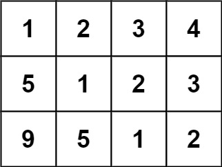

### 1. Description

Given an `m x n` `matrix`, return *`true` if the matrix is Toeplitz. Otherwise, return `false`.*

A matrix is **Toeplitz** if every diagonal from top-left to bottom-right has the same elements.

### 2. Function Contract

- `n`: Input parameter.
- Returns expected result.

### 3. Examples

#### Example 1

- **Input:** $matrix = [[1,2,3,4],[5,1,2,3],[9,5,1,2]]$
- **Output:** `true`
- **Explanation:**
In the above grid, the diagonals are:
"[9]", "[5, 5]", "[1, 1, 1]", "[2, 2, 2]", "[3, 3]", "[4]".
In each diagonal all elements are the same, so the answer is True.
#### Example 2

- **Input:** $matrix = [[1,2],[2,2]]$
- **Output:** `false`
- **Explanation:**
The diagonal "[1, 2]" has different elements.

### 4. Constraints

- $m = \text{matrix.length}$

- $n = \text{matrix}[i].length$

- $1 \le m, n \le 20$

- $0 \le \text{matrix}[i][j] \le 99$

**Follow up:**

- What if the `matrix` is stored on disk, and the memory is limited such that you can only load at most one row of the matrix into the memory at once?

- What if the `matrix` is so large that you can only load up a partial row into the memory at once?