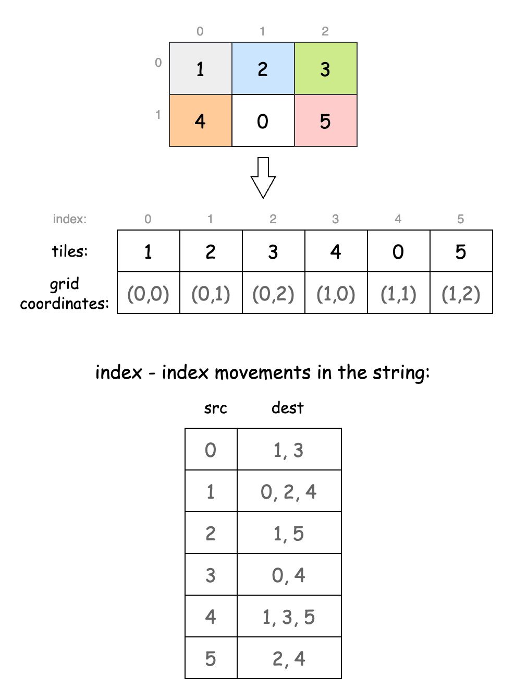

[TOC]

## Solution

---

### Approach 1: Depth-First Search (DFS)

#### Intuition

A brute-force approach is feasible due to the problem's small constraints. We can explore all possible board states and track the number of moves taken to reach each one. Once we reach the solved state, we return the move count.

The first step is to identify the possible moves from each board position. Each move shifts the '0' (blank square) in one of the four cardinal directions. To simplify, we’ll flatten the 2-D board to a 1-D string by appending the first row to the second. The moves at each square are now converted as given below, where each index represents the position of the zero, and lists the indices in the 1-D string it can go to:



The above figure demonstrates how each tile position is mapped to an index in the 1-D string, and how the tile movements are simulated in the string.

We'll use depth-first search (DFS) to explore all board states. DFS is well-suited here because it allows us to explore each possible path to the solution one by one, fully exploring each path before backtracking. Starting from the initial board state as a flattened string, we maintain a `visited` map, where each board state is a key, and the value is the number of moves taken to reach it. In our DFS, if the current state already exists in the map with fewer moves, we return early. Otherwise, we update the map with the current move count and explore all possible moves.

Next, we can put the current state in the map with the current move count and start exploring all possible moves from this position. We modify the board based on the next move and recursively call the DFS function to explore further.

After exploring all moves, if the solved state appears in the map, we return its move count; if not, we return -1, as solving the board is impossible.

#### Algorithm

- Define a 2-D array `directions` which represents the possible moves for the empty tile (`0`) at each position on a flattened 1D representation of the $2 \times 3$ board.

Main method `slidingPuzzle`:

- Initialize a string `startState` to represent the initial state of the board in a 1-D string format.
- Iterate over each cell in the 2-D board and append each element to `startState`.
- Initialize a map `visited` to store each unique state of the board encountered during the search.
- Call a helper function `dfs` on `startState`, passing `visited`, the index of `0` in `startState`, and a move count initialized to `0`.
- Return the minimum moves required to reach the solved state (`"123450"`), or -1 if the state was not found in `visited`.

Helper method `dfs`:

- Check if the `state` has already been visited with fewer or equal moves than the current count (`moves`).
  - If so, skip further exploration of this path.
- Update `visited` with the current state and move count.
- For each adjacent position `nextPos` in `directions`:
  - Swap the characters at `zeroPos` and `nextPos` in `state`.
  - Recursively call `dfs` on the newly generated state with `moves` incremented by 1.

#### Implementation

```python
class Solution:
    # Direction map for zero's possible moves in a flattened 1D array (2x3 board)
    directions = [
        [1, 3],
        [0, 2, 4],
        [1, 5],
        [0, 4],
        [3, 5, 1],
        [4, 2],
    ]

    def slidingPuzzle(self, board: List[List[int]]) -> int:
        # Helper method to swap characters at indices i and j in the string
        def _swap(s, i, j):
            s = list(s)
            s[i], s[j] = s[j], s[i]
            return "".join(s)

        # Convert the 2D board into a string representation to use as state
        start_state = "".join(str(num) for row in board for num in row)

        # Dictionary to store the minimum moves for each visited state
        visited = {}

        def _dfs(state, zero_pos, moves):
            # Skip if this state has been visited with fewer or equal moves
            if state in visited and visited[state] <= moves:
                return
            visited[state] = moves

            # Try moving zero to each possible adjacent position
            for next_pos in self.directions[zero_pos]:
                new_state = _swap(
                    state, zero_pos, next_pos
                )  # Swap to generate new state
                _dfs(
                    new_state, next_pos, moves + 1
                )  # Recursive DFS with updated state and move count

        # Start DFS traversal from initial board state
        _dfs(start_state, start_state.index("0"), 0)

        # Return the minimum moves required to reach the target state, or -1 if unreachable
        return visited.get("123450", -1)
```

#### Complexity Analysis

Let $m$ be the number of rows and $n$ be the number of columns of the board.

> Note: The values of m and n are fixed by the problem constraints, so their complexities can be considered constant. However, we have kept them as variables for clarity and better understanding.

- Time complexity: $O((m \cdot n)! \times (m \cdot n)^2)$

    In DFS, each of the $(m \cdot n)!$ possible board states can be revisited multiple times due to different move sequences, as DFS doesn’t prioritize the shortest path and may explore all possible paths, reaching the same state repeatedly. Since each state has up to four possible moves on a 2D board, DFS could re-explore each configuration from different directions, leading to up to $O((m \cdot n)! \times (m \cdot n))$ recursive calls. Generating each new configuration requires $O(m \cdot n)$ operations.

    Thus, the time complexity is $O((m \cdot n)! \times (m \cdot n)^2)$.

- Space complexity: $O((m \cdot n)!)$

    The DFS approach requires storing each of the $(m \cdot n)!$ unique states in a `visited` map to avoid recalculations when a state is reached with the same or fewer moves. In the worst case, the DFS call stack can reach a maximum depth of $O((m \cdot n)!)$, giving a space complexity of $O((m \cdot n)!)$.

---

### Approach 2: Breadth-First Search (BFS)

#### Intuition

The DFS approach explores all possible board states before reaching the final state, which can be inefficient. Although we might find the solution early, DFS will still continue to explore all paths, potentially with non-optimal move counts. To address this, we switch to Breadth-First Search (BFS). BFS is better suited in scenarios like this because it explores all states at the current move level before going deeper, ensuring that the first time it reaches the goal, it has found the shortest path.

Our setup remains similar: we convert the board to a 1-D string and use a set to track visited states. A queue will handle the BFS traversal, starting from the initial state. The queue’s structure works well to support BFS’s layered exploration, since each level is processed sequentially and we stop as soon as we reach the goal.

We then loop while the queue is not empty, processing all states at the current move count. If we encounter the final state, we return the current move count as the answer. Otherwise, we explore all possible moves from the current state, modify the board accordingly, and, if unvisited, add the new state to the queue for further exploration.

#### Algorithm

- Define an array `directions` to map the possible moves for the empty tile (`0`) at each position.
- Initialize a string:
  -  `target` to "123450", representing the goal state of the board.
  -  `startState` to store the initial configuration of the board in string form.
- Iterate through each row and column of `board`:
   - Append each tile value to `startState` to create a single string representing the initial board state.
- Initialize:
  -  a set `visited` to store all the board states already processed to prevent redundant calculations.
  - a `queue` for the Breadth-First Search (BFS) traversal.
  - an integer `moves` to 0, which will track the number of moves taken to reach the goal state.
- Add `startState` to `visited` to mark it as processed.
- Start a while loop that continues as long as `queue` is not empty:
  - Store the current size of `queue` in `size`. For each item in the current level:
- Remove the front element of `queue` and assign it to `currentState`.
- Check if `currentState` matches `target`. If it does, return `moves` as the minimum moves required to reach the solved state.
- Set `zeroPos` to the position of zero in `currentState`.
- For each valid new position `newPos` in $\text{directions}[zeroPos]$:
      - Generate `nextState` by swapping `zeroPos` and `newPos`.
      - If `nextState` is already in `visited`, skip it to avoid redundant processing.
      - Otherwise, add `nextState` to both `visited` and `queue`.
  - Increment `moves` to continue to the next level of BFS.
- If `queue` becomes empty without reaching the target, return -1, indicating the puzzle is unsolvable.

#### Implementation

```python
class Solution:
    def slidingPuzzle(self, board):
        # Direction map for zero's possible moves in a 1D representation of the 2x3 board
        directions = [
            [1, 3],
            [0, 2, 4],
            [1, 5],
            [0, 4],
            [1, 3, 5],
            [2, 4],
        ]

        # Helper method to swap characters at indices i and j in the string
        def _swap(state, i, j):
            state_list = list(state)
            state_list[i], state_list[j] = state_list[j], state_list[i]
            return "".join(state_list)

        target = "123450"
        start_state = "".join(str(num) for row in board for num in row)

        visited = set()  # To store visited states
        queue = deque([start_state])
        visited.add(start_state)

        moves = 0

        # BFS to find the minimum number of moves
        while queue:
            for _ in range(len(queue)):
                current_state = queue.popleft()

                # Check if we reached the target solved state
                if current_state == target:
                    return moves

                zero_pos = current_state.index("0")
                for new_pos in directions[zero_pos]:
                    next_state = _swap(current_state, zero_pos, new_pos)

                    # Skip if this state has been visited
                    if next_state in visited:
                        continue

                    # Mark the new state as visited and add it to the queue
                    visited.add(next_state)
                    queue.append(next_state)
            moves += 1

        return -1
```

#### Complexity Analysis

Let $m$ be the number of rows and $n$ be the number of columns of the board.

* Time complexity: $O((m \cdot n)! \times (m \cdot n))$

    The algorithm uses Breadth-First Search (BFS) to explore all possible board configurations. With $(m \cdot n)!$ unique configurations, BFS may process each configuration once. Each configuration requires checking moves and generating new ones, taking $O(m \cdot n)$ operations.

    Therefore, the overall time complexity is $O((m \cdot n)! \times (m \cdot n))$.

* Space complexity: $O((m \cdot n)!)$

    The space complexity is determined by the `visited` set and the BFS queue, each of which can hold up to $(m \cdot n)!$ unique configurations in the worst case. Therefore, the space complexity is $O((m \cdot n)!)$.

---