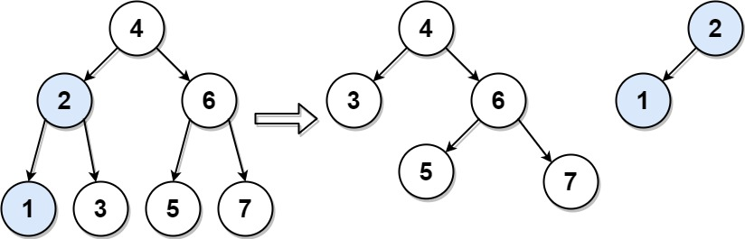

## Description

Given the `root` of a binary search tree (BST) and an integer `target`, split the tree into two subtrees where the first subtree has nodes that are all smaller or equal to the target value, while the second subtree has all nodes that are greater than the target value. It is not necessarily the case that the tree contains a node with the value `target`.

Additionally, most of the structure of the original tree should remain. Formally, for any child `c` with parent `p` in the original tree, if they are both in the same subtree after the split, then node `c` should still have the parent `p`.

Return *an array of the two roots of the two subtrees in order*.
### Function Contract

**Inputs**

- `root`: the root node of a binary search tree, represented in cases by level-order values.
- `target`: the integer threshold used to partition the nodes; it need not equal any node value.

The operation reuses the original nodes. For every original parent-child edge whose endpoints remain in the same output subtree, that direct relationship must be preserved.

**Return value**

- A two-element list `[smaller, greater]`. `smaller` contains exactly the nodes with values smaller than or equal to `target`, and `greater` contains exactly the nodes with values greater than `target`. Either root may be `None`.

### Examples

#### Example 1

- **Input:** `root = [4,2,6,1,3,5,7], target = 2`
- **Output:** `[[2,1],[4,3,6,null,null,5,7]]`
#### Example 2

- **Input:** `root = [1], target = 1`
- **Output:** `[[1],[]]`
### Constraints

- The number of nodes in the tree is in the range `[1, 50]`.

- $0 \le \text{Node.val}, target \le 1000$