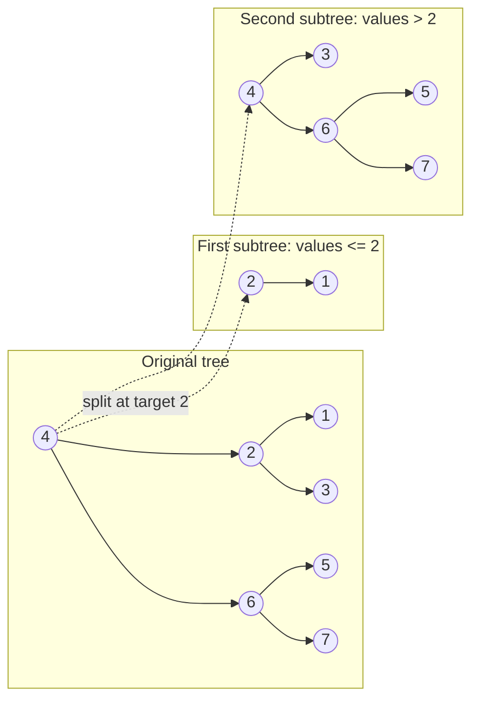

## Examples

**Example 1**

- Input: `root = [4,2,6,1,3,5,7], target = 2`
- Output: `[[2,1],[4,3,6,null,null,5,7]]`

The source illustration shows this original tree and the two resulting trees. The diagram below independently preserves every node, edge, partition, and returned-root relationship from that illustration.

**Example 2**

- Input: `root = [1], target = 1`
- Output: `[[1],[]]`
