## Solution

---

### Approach 1: Binary Tree Traversal

#### Intuition

Let's approach this problem as a binary tree challenge. We'll start with a single node, create two new child nodes for each node in the current row, move to the next row, and repeat the process of creating new child nodes until we have $n$ rows in our tree. Finally, we return the $k^{th}$ nodes in the $n^{th}$ row.

The tree we will generate is a Perfect Binary Tree with all levels completely filled.
> **Note:** The number of nodes in the $i^{th}$ row of a perfect binary tree is given by: $2^{(i - 1)}$, where $i = 1, 2, 3,...$

If the current node is $0$, its left child will be $0$ and the right child will be $1$.
Otherwise, if the current node is $1$, its left child will be $1$ and the right child will be $0$.

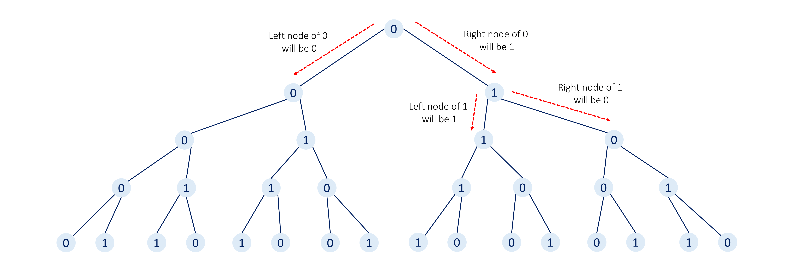

After generating the binary tree a naive way to reach the $k^{th}$ node of $n^{th}$ row will be to traverse all rows (levels) of the tree one by one by keeping track of the current (row, nodeIndex) position. However, this approach will be sub-optimal as it would require iterating over all nodes in our tree and the number of nodes will grow exponentially with each row.

Instead, we can try to perform a binary search-like algorithm where we discard the left or right half of the sub-tree based on the condition where the final target node must be present. Provided this hint, we recommend you stop here and try thinking a bit about how this method will work here.
> The pre-requisite here will be that you must have a good understanding of how searching in a binary search tree works.

<br />

**This approach might not be intuitive to everyone, so let's proceed gradually using an example.**

Consider the case where we need to find the $21^{st}$ node in $6^{th}$ row.

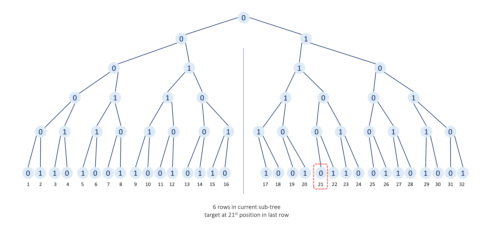

The number of nodes in the $6^{th}$ row will be $2^{6 - 1} = $2^{5}$ = 32$.
Therefore, the $21^{st}$ node will be present in the right half of the last row in our current binary tree.

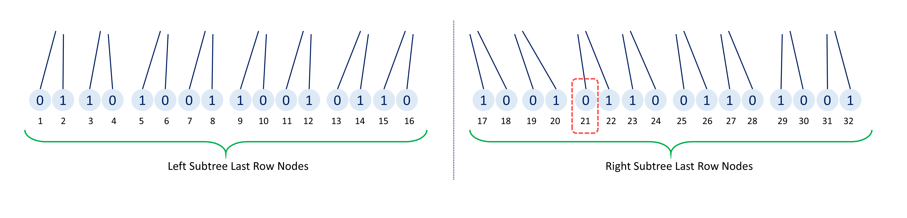

Hence, we can be certain that our target node is not present in the left sub-tree of the current root node. As a result, we can discard the whole left sub-tree.
This simplifies our problem to finding the $21 - 16$ (current position - half skipped nodes) $= 5^{th}$ node in the last row of the sub-tree of $5$ rows.

<br />

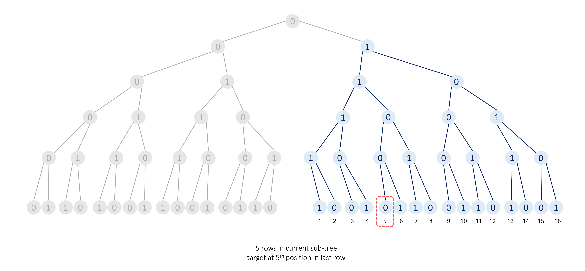

Within this subtree of $5$ rows, we have to find the $5^{th}$ node in the $5^{th}$ row.
The number of nodes in the $5^{th}$ row is given by $2^{5 - 1} = $2^{4}$ = 16$. Therefore, the $5^{th}$ node will be present in the left sub-tree and we can discard the right sub-tree, and this time the position of the target node will remain unchanged.

<br />

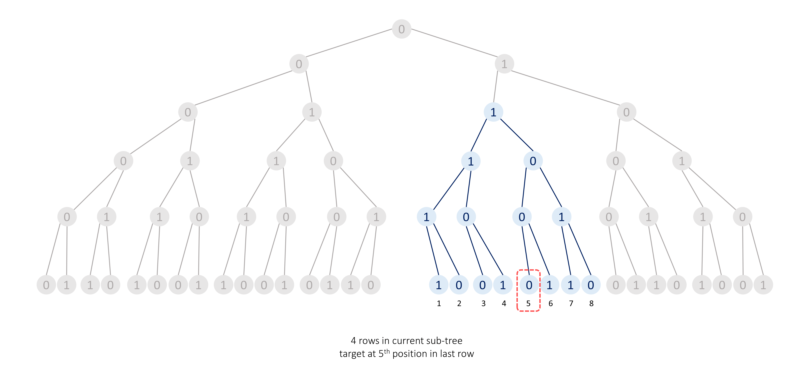

Within the subtree of $4$ rows, we have to find the $5^{th}$ node in the $4^{th}$ row.
The number of nodes in the $4^{th}$ row will be $2^{4 - 1} = $2^{3}$ = 8$. Thus, the $5^{th}$ node will be present in the right sub-tree and we can discard the left sub-tree.

<br />

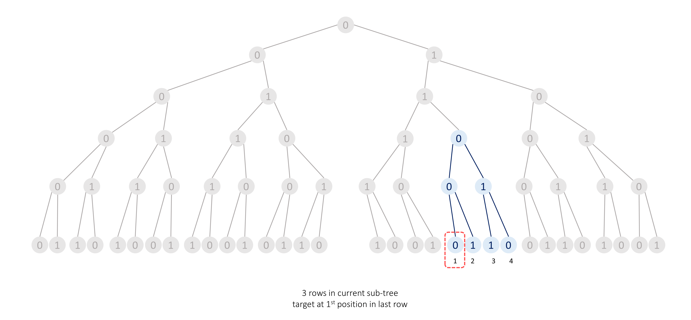

Within this subtree of $3$ rows, we have to find the $1^{st}$ node in the $3^{rd}$ row.
The number of nodes in the $3^{rd}$ row will be $2^{3 - 1} = $2^{2}$ = 4$. Therefore, the $1^{st}$ node will be present in the left sub-tree and we can discard the right sub-tree.

<br />

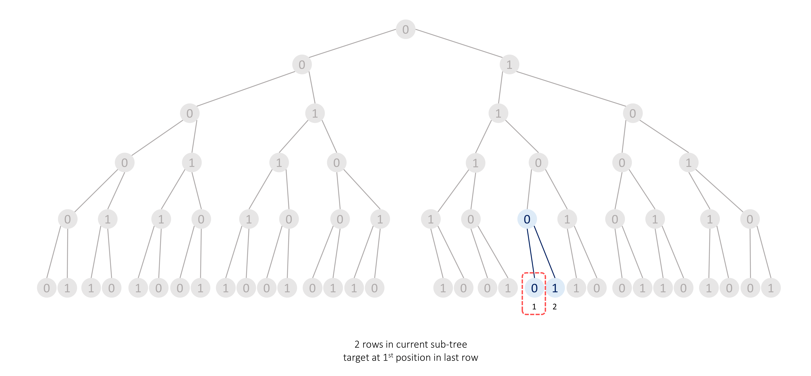

Within this subtree of $2$ rows, we have to find the $1^{st}$ node in the $2^{nd}$ row.
The number of nodes in the $2^{nd}$ row will be $2^{2 - 1} = $2^{1}$ = 2$. Hence, the $1^{st}$ node will be present in the left sub-tree and we can discard the right sub-tree.

<br />

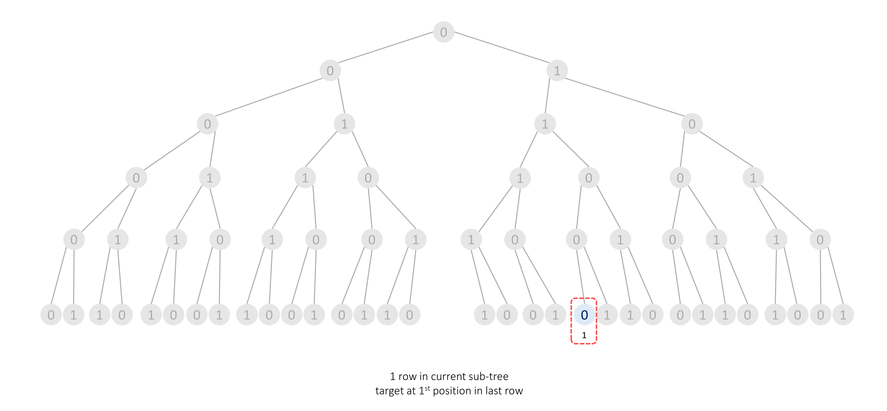

Now, in this subtree of $1$ row, we have to find the $1^{st}$ node in the $1^{st}$ row. Since this row consists of only one node, the root node will be our target node.

<br />

> As shown in the picture above, we can simplify this problem to a recursive binary tree challenge, where we traverse down to the root node of the appropriate sub-tree until we reach the target node.

#### Algorithm

1. Create a method `depthFirstSearch` which takes `n` number of rows in the current tree, `k` target node position in the last row, and `rootVal` current tree's root's value as parameters:

- If `n` is `1`, then we will have a single node in our tree and this node is our target node. So, we return its value `rootVal`.

- Find the number of nodes in the last row of the current tree, `totalNodes`, $2^{(n - 1)}$.

- If the current target node `k` lies in the left half of the last row of the current subtree (i.e. $k \le totalNodes / 2$), we will move to the left sub-tree.
    If the current node's value `rootVal` is `0` then the next node's value will be `0`, otherwise, the next node's value will be `1`.
    Return $depthFirstSearch(n - 1, k, nextRootVal)$.

- Otherwise, if the current target node `k` lies in the right half of the last row of the current subtree (i.e. $k > totalNodes / 2$), we will move to the right sub-tree.
    If the current node's value `rootVal` is `0` then the next node's value will be `1`, otherwise, the next node's value will be `0`.
    Additionally, the target's position will change to $(k - (totalNodes / 2))$.
    Return $depthFirstSearch(n - 1, newPosition, nextRootVal)$.

2. We return the result returned by calling `depthFirstSearch(n, k, 0)` with the number of rows as `n`, target node position `k`, and root node's value `0`.

#### Implementation

```python
class Solution:
    def depthFirstSearch(self, n: int, k: int, rootVal: int) -> int:
        if n == 1:
            return rootVal

        totalNodes = 2 ** (n - 1)

        # Target node will be present in the right half sub-tree of the current root node.
        if k > (totalNodes / 2):
            nextRootVal = 1 if rootVal == 0 else 0
            return self.depthFirstSearch(n - 1, k - (totalNodes / 2), nextRootVal)
        # Otherwise, the target node is in the left sub-tree of the current root node.
        else:
            nextRootVal = 0 if rootVal == 0 else 1
            return self.depthFirstSearch(n - 1, k, nextRootVal)

    def kthGrammar(self, n: int, k: int) -> int:
        return self.depthFirstSearch(n, k, 0)
```

#### Complexity Analysis

* Time complexity: $O(n)$
- With each recursive call, we reduce `n` by one until `n` becomes equal to `1`. As a result, the overall time complexity is $O(n)$.

* Space complexity: $O(n)$
- Each recursive call will add a new frame to the stack until we reach the base case (when `n` becomes equal to `1`). Hence, the space complexity is also $O(n)$.

<br />

---

### Approach 2: Normal Recursion

#### Intuition

> **Note:** The previous approach will be sufficient during a real interview setting as these next approaches are not intuitive enough to think of them during the limited time availability. So don't get disheartened if these approaches seem hard to you. But it's recommended to read these approaches too, to have a new perspective to look at the same problem.

First of all, after generating a few rows using the steps given in the problem description, we can observe two patterns:

1. The previous row is used as the prefix of the next row.

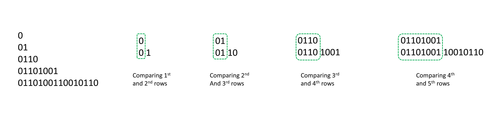

2. If we divide any row into two equal halves then the symbol at each position will be opposite of each other in both halves (i.e. if we have a `0` in the left half at index `i`, then the right half will have a `1` at index `i`, and vice versa).

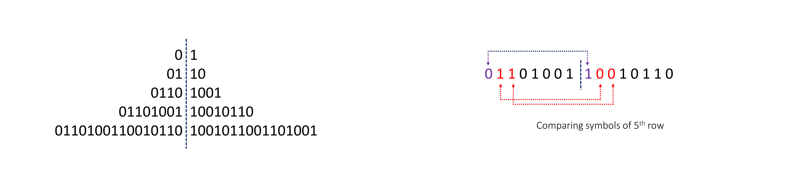

Now, these two points might seem very unintuitive to read at first, but we highly recommend you write down some examples and try to reach these observations on your own.

<details>
  <summary><strong>Otherwise, click here to expand the explanation</strong> </summary>

<br />

Let's write down 6 rows.


1. **The previous row will always be present as the prefix of the next row.**

    We start with a `0` which generates `01`. We can see that the first symbol of the second row is the same as the first row. It means, whatever the first row has generated will also be generated by the first symbol of the second row.
Thus, the second row and the prefix of the third row will be the same as they both are generated from the same symbols.

    Again, let's consider one more row. The second row is `01` which generated `0110` as the third row. Again the `0110` will be used as a prefix in the fourth row because the second row was `01` which generated `0110` and this third row also has `01` as the first two symbols (as we previously saw the second row will be used as a prefix in the third row) which will again generate `0110`. Thus, the third row and the prefix of the fourth row will be the same.

**Conclusion:** Prefix in $(i - 1)^{th}$ and  $(i - 2)^{th}$ rows are the same, these same symbols will generate the same symbols for the next respective rows, so, the prefix of $i^{th}$ row will always be the same as $(i - 1)^{th}$ row.

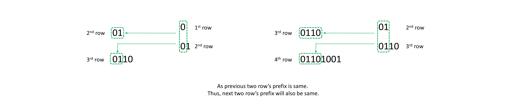

<br />

<br />

2. **If we divide any row into two equal halves then the symbol at each position will be opposite of each other in both halves.**

    It's given that `0` generates `01` and `1` generates `10`, meaning, both symbols are opposite and generate the next row which contains opposite symbols at the same positions. So we start with a `0`, it generates `01` which when broken into two halves have opposite symbols.

    The next row generated by the left half of $2^{nd}$ row `0` will be `01` and by the right half of $2^{nd}$ row `1` will be `10`, Thus, the $3^{rd}$ row `01 10` when broken into two halves will also contain opposite symbols at same positions.
    Additionally, each symbol of these two halves of $3^{rd}$ row will generate the next row with opposite symbols at the same positions, and this pattern will continue.

**Conclusion:** The first half symbols in $i^{th}$ will be opposite of the respective next half symbols at the same positions.


</details>

<br />

> **Note:** To flip (find the opposite of) a symbol $X$, where, $X \in (0, 1)$, we can perform $X' = 1 - X$.
If $X = 0$, $X' = 1$, and if $X = 1$, $X' = 0$,

Now, suppose we want to find the $21^{st}$ symbol of the $6^{th}$ row.

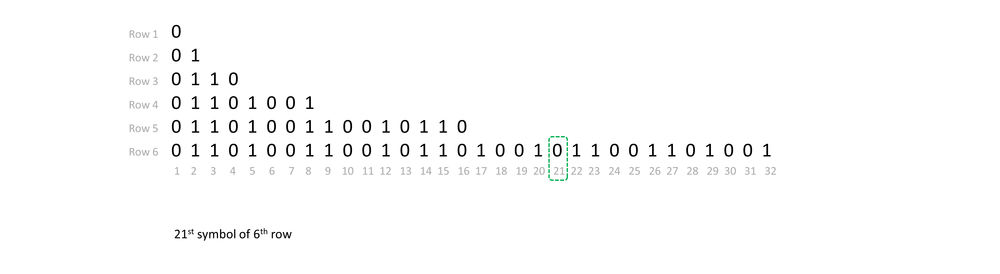

<br />

The number of nodes in the $6^{th}$ row will be $2^{6 - 1} = $2^{5}$ = 32$.
As we discussed the symbols of the first half of any row are opposite of the second half.
$\implies$ $21^{st}$ symbol of the $6^{th}$ row will be equal to $(1 - 5^{th}$ symbol of the $6^{th}$ row $)$.

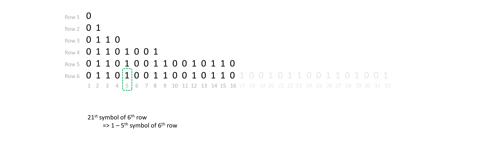

<br />

As the prefix of $6^{th}$ row will be the same as the $5^{th}$ row.
Hence, $5^{th}$ symbol of the $6^{th}$ row will be equal to $5^{th}$ symbol of the $5^{th}$ row.
$\implies$ $21^{st}$ symbol of the $6^{th}$ row will be equal to $(1 - 5^{th}$ symbol of the $5^{th}$ row $)$.

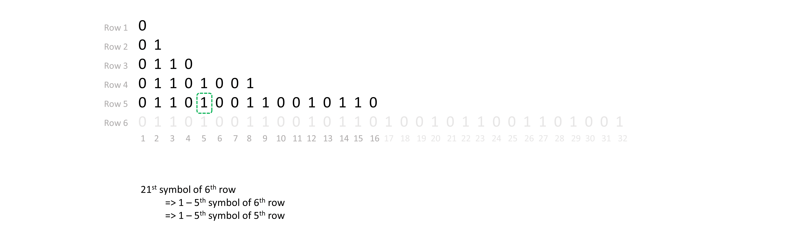

<br />

Similarly, the prefix of $5^{th}$ row will be the same as the $4^{th}$ row.
Therefore, $5^{th}$ symbol of the $5^{th}$ row will be equal to $5^{th}$ symbol of the $4^{th}$ row.
$\implies$ $21^{st}$ symbol of the $6^{th}$ row will be equal to $(1 - 5^{th}$ symbol of the $4^{th}$ row $)$.

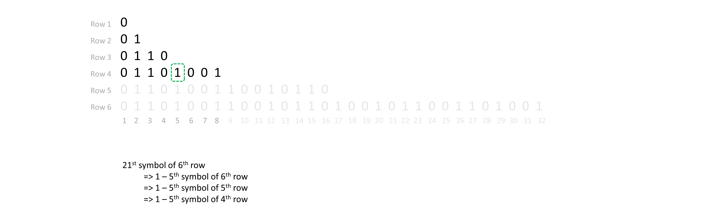

<br />

The number of nodes in the $4^{th}$ row will be $2^{4 - 1} = $2^{3}$ = 8$. As the symbols of the first half of any row are opposite of the second half.
So, $5^{th}$ symbol of the $4^{th}$ row will be equal to $(1 - 1^{st}$ symbol of the $4^{th}$ row $)$.
$\implies$ $21^{st}$ symbol of the $6^{th}$ row will be equal to $(1 - (1 - 1^{st}$ symbol of the $4^{th}$ row $))$.

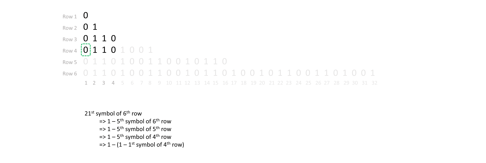

<br />

As the prefix of the $4^{th}$ row will be the same as the $3^{rd}$ row.
So, $1^{st}$ symbol of the $4^{th}$ row will be equal to $1^{st}$ symbol of the $3^{rd}$ row.
$\implies$ $21^{st}$ symbol of the $6^{th}$ row will be equal to $(1 - (1 - 1^{st}$ symbol of the $3^{rd}$ row $))$.

Similarly, the prefix of the $3^{rd}$ row will be the same as the $2^{nd}$ row.
So, $1^{st}$ symbol of the $3^{rd}$ row will be equal to $1^{st}$ symbol of the $2^{nd}$ row.
$\implies$ $21^{st}$ symbol of the $6^{th}$ row will be equal to $(1 - (1 - 1^{st}$ symbol of the $2^{nd}$ row $))$.

Similarly, the prefix of the $2^{nd}$ row will be the same as the $1^{st}$ row.
So, $1^{st}$ symbol of the $2^{nd}$ row will be equal to $1^{st}$ symbol of the $1^{st}$ row.
$\implies$ $21^{st}$ symbol of the $6^{th}$ row will be equal to $(1 - (1 - 1^{st}$ symbol of the $1^{st}$ row $))$.

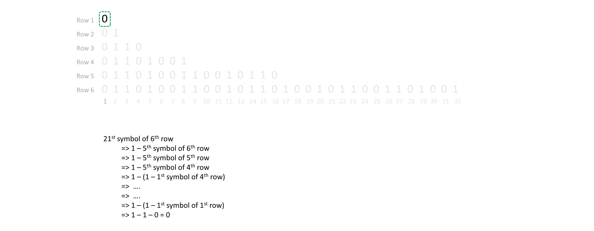

<br />

> And, as we know $1^{st}$ symbol of the $1^{st}$ row is `0`.
> Thus, the $21^{st}$ symbol of the $6^{th}$ row will be equal to $1 - (1 - (0)) = 0$.

With each step, we are converting our bigger problem into a similar smaller sub-problem.

So, here we can write a recursive approach, where our current problem is to find the symbol at a given position $(k)$ in a given row $(n)$.

If the current position lies in the right half of the current row then we know this symbol will be opposite of the symbol present in the left half at the same position, and **recursively we will find what is the symbol at this new position in the same row**.
And, if the current symbol lies in the left half then this symbol will be the same as the symbol in the previous row at the same position, and **recursively we will find what is the symbol at this position in the previous row**.

We will write a method `recursion(n, k)` which takes current row `n`, and the position of the symbol in current row `k` as parameters:

- The recursive step will be:
- If `k` lies in the right half of the current row. Then we return $1 - recursion(n, k - halfElements)$.
- Otherwise, we return $recursion(n - 1, k)$.
    ```
    if k > halfElements:
        return 1 - recursion(n, k - halfElements)
    else:
        return recursion(n - 1, k)
    ```

- The base case to stop recursive calls will be a condition we can evaluate the result without any computation, i.e. we know if $n = 1$ it will only have one symbol `0` which will be our result. Thus, this condition will be our base case.
    ```
    if n == 1:
        return 0
    ```

#### Algorithm

1. Create a method `recursion()` which takes `n`, current row number, `k`, and target position as parameters:

- If `n` is `1`, then we can return `0` as the first row will have only one symbol.

- Find the number of symbols in the current row, `totalElements`, $2^{(n - 1)}$, and $halfElements = totalElements / 2$.

- If the current target position `k` lies in the right half of the current row (i.e. `k > halfElements`), then, we switch to the current row's respective left half position symbol, (i.e. at position $k - halfElements$).
    Thus, we return, $1 - recursion(n, k - halfElements)$.

- If the current target position `k` lies in the left half of the current row (i.e. $k \le halfElements$), then, we switch to the previous row's respective same position symbol, (i.e. present in the row $n - 1$ at position `k`).
    Thus, we return, $recursion(n - 1, k)$.

2. We return the result returned by calling `recursion(n, k)` with the current row as `n`, and target symbol position `k`.

#### Implementation

```python
class Solution:
    def recursion(self, n: int, k: int) -> int:
        # First row will only have one symbol '0'.
        if n == 1:
            return 0

        total_elements = 2 ** (n - 1)
        half_elements = total_elements // 2

        # If the target is present in the right half, we switch to the respective left half symbol.
        if k > half_elements:
            return 1 - self.recursion(n, k - half_elements)

        # Otherwise, we switch to the previous row.
        return self.recursion(n - 1, k)

    def kthGrammar(self, n: int, k: int) -> int:
        return self.recursion(n, k)
```

#### Complexity Analysis

* Time complexity: $O(n)$
- With each recursive call, we reduce `n` by one until `n` becomes equal to `1`. Thus, it will take $O(n)$ time.

* Space complexity: $O(n)$
- The recursive stack will also use $O(n)$ space in the worst case.

<br />

---

### Approach 3: Recursion to Iteration

#### Intuition

The previous recursive can be optimized to an iterative approach to eliminate the use of the recursion stack.

Let's explore finding the $21^{st}$ symbol of the $6^{th}$ row.
We can follow the same process of the previous approach but in an iterative manner.

In the previous approach, we started with the first row's symbol `0` and flipped it as we switched it from left to right half positions, until we reached the target position.

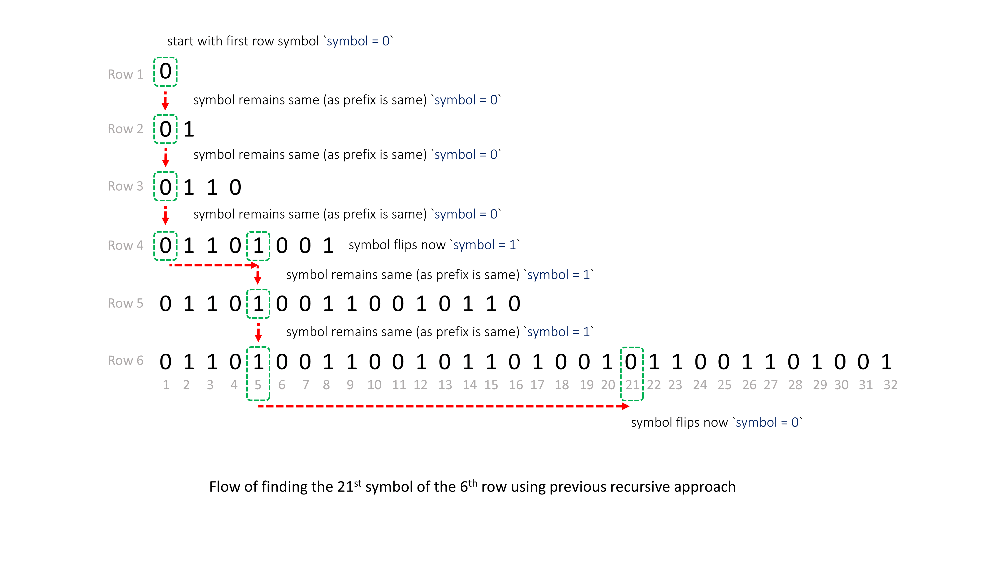

<br />

If we try to go from top to down then it will be difficult to conclude at which step the current symbol needs to be flipped.
However, if we go from the bottom up, we can identify the flips that will be done when the current position exceeds half the count of the symbols of the current row.

Let's assume the $21^{st}$ symbol of the $6^{th}$ row is, $symbol = X$.
We follow the same process, and if at the end `symbol` changes to `0`, it means that we started with the correct $21^{st}$ symbol of the $6^{th}$ row, `X`, otherwise, the correct symbol will be $1 - X$.

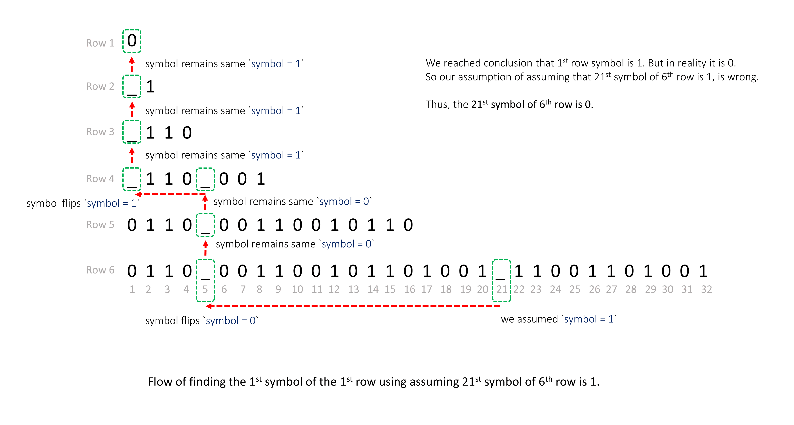

#### Algorithm

1. If `n` is `1` we can directly return `0`.

2. Otherwise, we assume that the target `symbol` is `1`, and iterate on all rows `currRow` from `n` to `2`.

3. For each row `currRow`, find the number of symbols in the current row, `totalElements`, $2^{(currRow - 1)}$, and $halfElements = totalElements / 2$. If `k` lies in the right half of the current row (i.e. `k > halfElements`),  switch to the current row's respective left half position symbol.
    Thus, flipping $symbol = 1 - symbol$ and changing position $k = k - halfElements$.

4. We will stop when the current row will become `1`. We check if the `symbol` is `0`, which means that our assumption that the target symbol is `1` is correct, otherwise, the target symbol is `0`.

#### Implementation

```python
class Solution:
    def kthGrammar(self, n: int, k: int) -> int:
        if n == 1:
            return 0

        # We assume the symbol at the target position is '1'.
        symbol = 1

        for curr_row in range(n, 1, -1):
            total_elements = 2 ** (curr_row - 1)
            half_elements = total_elements // 2

            # If 'k' lies in the right half symbol, then we flip over to the respective left half symbol.
            if k > half_elements:
                # Flip the symbol.
                symbol = 1 - symbol
                # Change the position after flipping.
                k -= half_elements

        # We reached the 1st row; if the symbol is not '0', we started with the wrong symbol.
        if symbol != 0:
            # Thus, the start symbol was '0', not '1'.
            return 0

        # The start symbol was indeed what we started with, a '1'.
        return 1
```

#### Complexity Analysis

* Time complexity: $O(n)$
- In each iteration, we reduce `n` by one until `n` becomes equal to `1`. Therefore, the overall time complexity is $O(n)$.

* Space complexity: $O(1)$
- We have not used any additional space.

<br />

---

### Approach 4: Math

#### Intuition

> **Note:** This approach is highly unintuitive, and it is completely fine to skip it. We list it here for completeness and to offer you an alternative perspective on how to approach the same problem.

After reviewing the previous approaches, we can see that we start with `0` and flip it `x` number of times.

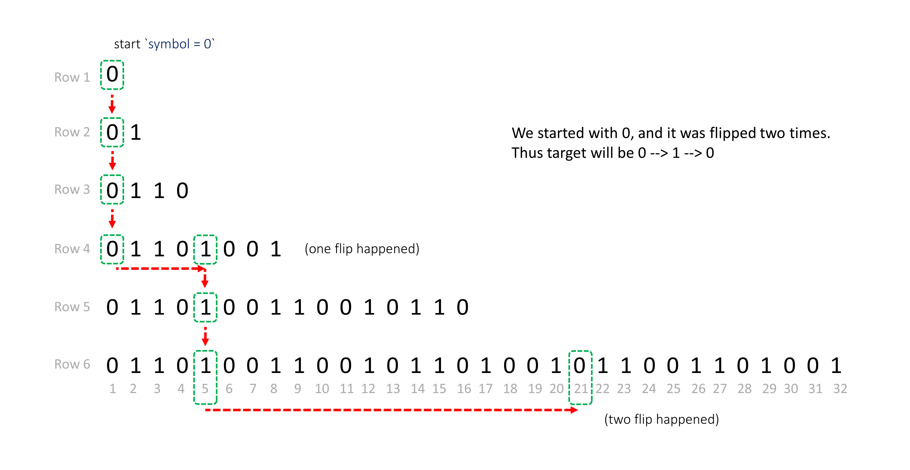

The most challenging aspect is determining the number of flips required.

From the previous approach, we know that whenever the current $k$ is more than half of the total number of symbols of the current row then **we flip it, and subtract the first half symbols count from** $k$.
A flip happens at each subtraction, thus the number of flips is equal to the number of subtractions performed.

Each row will have some $2^a$ elements, it means half of it will be $2^b$.
Thus, at each step, we subtract $2^b$ from `k` until `k` becomes `1`.

We can say that,
$k - 2^b - 2^c - 2^d - 2^e - .... = 1$
$(k - 1) = 2^b + 2^c + 2^d + 2^e + .... \space \space$   (remember this expression)

> Therefore, we can conclude that the number of flips is equal to the number of terms RHS of the previous expression has.

Now, we all know that every decimal number $d$ can be expressed as,

$d = (A \cdot $2^{0}$) +  (B \cdot $2^{1}$) + (C \cdot $2^{2}$) + (D \cdot $2^{3}$) + (E \cdot $2^{4}$) + (F \cdot $2^{5}$) + ....$
where, $A, B, C, D, E, F, .... \in (0, 1)$
and, the binary representation of $d$ is, $(d)_2 = \space ...FEDCBA$

For example: $(25)_2 = 11001$, and
$25 = $2^{0}$ + $2^{3}$ + 2^4$
$25 = 1.$2^{0}$ + 0.$2^{1}$ + 0.$2^{2}$ + 1.$2^{3}$ + 1.2^4$

<br />

$(k - 1)$ can also be expressed as $(A \cdot $2^{0}$) +  (B \cdot $2^{1}$) + (C \cdot $2^{2}$) + (D \cdot $2^{3}$) + (E \cdot $2^{4}$) + (F \cdot $2^{5}$) + ....$
We just need to find which all coefficients $A, B, C, D, E, F, ....$ will be $1$ to convert it to $2^b + 2^c + 2^d + 2^e + ....$.

Thus, the number of flips required will be the number of $1s$ present in the binary representation of the number $(k - 1)$.

> Finally, we just need to determine the number of `1` bits `count` in the binary representation of $(k - 1)$. The symbol at the position $k^{th}$ in $n^{th}$ row will be $0$ flipped `count` times.
If `count` is even then `0` will remain `0`, otherwise `0` will change to `1`.

#### Algorithm

1. Find the `count` of the number of `1` bits in $k - 1$.
2. Return `0` if `count` is even, `1` otherwise.

#### Implementation

```python
class Solution:
    def kthGrammar(self, n: int, k: int) -> int:
        count = bin(k - 1).count('1')
        return 0 if count % 2 == 0 else 1
```

#### Complexity Analysis

* Time complexity: $O(\log k)$
- The number of bits in number $k$ is $\log k$. In Python, Javascript, and Swift, we first convert the number to a binary string, which takes $O(\log k)$ time.
- Counting all $1$ bits takes $O(\log k)$ time.
- Hence, the overall time complexity is $O(\log k)$.

* Space complexity: $O(1)$ or $O(\log k)$
- In Python, Javascript, and Swift, we convert the number to a binary string, which takes an additional $O(\log k)$ space.
- In C++ and Java, we don't use any additional space.