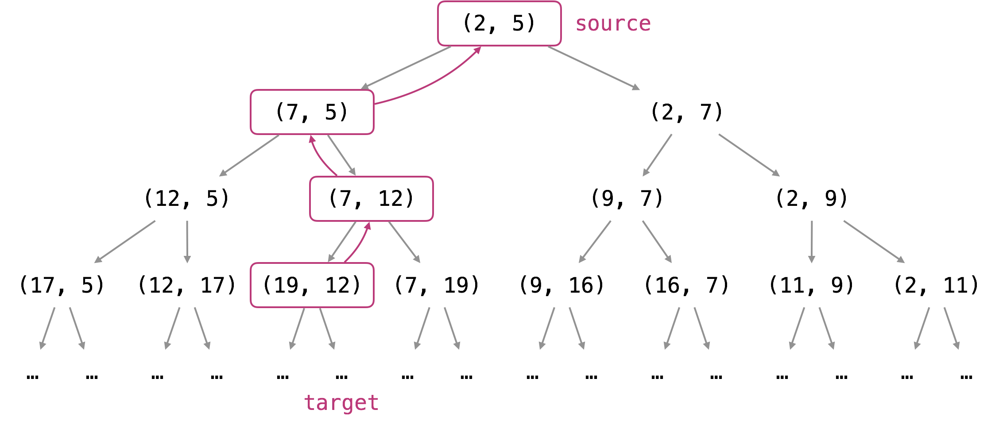

---
### Approach #1: Exhaustive Search [Time Limit Exceeded]

**Intuition and Algorithm**

Each point has two children as specified in the problem.  We try all such points recursively.

```python
class Solution(object):
    def reachingPoints(self, sx, sy, tx, ty):
        if sx > tx or sy > ty: return False
        if sx == tx and sy == ty: return True
        return self.reachingPoints(sx+sy, sy, tx, ty) or \
               self.reachingPoints(sx, sx+sy, tx, ty)
```

**Complexity Analysis**

* Time Complexity:  $O(2^{tx + ty})$, a loose bound found by considering every move as `(x, y) -> (x+1, y)` or `(x, y) -> (x, y+1)` instead.

* Space Complexity:  $O(tx * ty)$, the size of the implicit call stack.

---
### Approach #2: Dynamic Programming [Time Limit Exceeded]

**Intuition and Algorithm**

As in *Approach #1*, we search the children of every point recursively, except we use a set `seen` so that we don't repeat work.

```python
class Solution(object):
    def reachingPoints(self, sx, sy, tx, ty):
        seen = set()
        def search(x, y):
            if (x, y) in seen: return
            if x > tx or y > ty: return
            seen.add((x, y))
            search(x+y, y)
            search(x, x+y)

        search(sx, sy)
        return (tx, ty) in seen
```

**Complexity Analysis**

* Time Complexity:  $O(tx * ty)$, as at most $tx * ty$ points are searched once per point.

* Space Complexity:  $O(tx * ty)$, the size of the implicit call stack.

---
### Approach #3: Work Backwards (Naive Variant) [Time Limit Exceeded]

**Intuition**

Every parent point `(x, y)` has two children, `(x, x+y)` and `(x+y, y)`.  However, every point `(x, y)` only has one parent candidate `(x-y, y)` if $x \ge y$, else `(x, y-x)`.  This is because we never have points with negative coordinates.

<br />
<center>
    
</center>
<br />

Looking at previous successive parents of the target point, we can find whether the starting point was an ancestor.  For example, if the target point is `(19, 12)`, the successive parents must have been `(7, 12)`, `(7, 5)`, and `(2, 5)`; so `(2, 5)` is a starting point of `(19, 12)`.

**Algorithm**

Repeatedly subtract the smaller of `{tx, ty}` from the larger of `{tx, ty}`.  The answer is true if and only if we eventually reach `sx, sy`.

```python
class Solution(object):
    def reachingPoints(self, sx, sy, tx, ty):
        while tx >= sx and ty >= sy:
            if sx == tx and sy == ty: return True
            if tx > ty:
                tx -= ty
            else:
                ty -= tx
        return False
```

**Complexity Analysis**

* Time Complexity:  $O(\max(tx, ty))$.  If say $ty = 1$, we could be subtracting `tx` times.

* Space Complexity:  $O(1)$.

---
### Approach #4: Work Backwards (Modulo Variant) [Accepted]

**Intuition**

As in *Approach #3*, we work backwards to find the answer, trying to transform the target point to the starting point via applying the parent operation `(x, y) -> (x-y, y) or (x, y-x)` [depending on which one doesn't have negative coordinates.]

We can speed up this transformation by bundling together parent operations.

**Algorithm**

Say `tx > ty`.  We know that the next parent operations will be to subtract `ty` from `tx`, until such time that $tx = tx \% ty$.  When both `tx > ty` and `ty > sy`, we can perform all these parent operations in one step, replacing `while tx > ty: tx -= ty` with `tx %= ty`.

Otherwise, if say $tx > ty and ty \le sy$, then we know `ty` will not be changing (it can only decrease).  Thus, only `tx` will change, and it can only change by subtracting by `ty`.  Hence, $(tx - sx) \% ty = 0$ is a necessary and sufficient condition for the problem's answer to be True.

The analysis above was for the case `tx > ty`, but the case `ty > tx` is similar.  When $tx = ty$, no more moves can be made.

```python
class Solution(object):
    def reachingPoints(self, sx, sy, tx, ty):
        while tx >= sx and ty >= sy:
            if tx == ty:
                break
            elif tx > ty:
                if ty > sy:
                    tx %= ty
                else:
                    return (tx - sx) % ty == 0
            else:
                if tx > sx:
                    ty %= tx
                else:
                    return (ty - sy) % tx == 0

        return tx == sx and ty == sy
```

**Complexity Analysis**

* Time Complexity:  $O(\log(\max{(tx, ty)}))$.  The analysis is similar to the analysis of the Euclidean algorithm, and we assume that the modulo operation can be done in $O(1)$ time.

* Space Complexity:  $O(1)$.