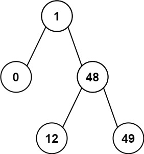

### 1. Description

Given the `root` of a Binary Search Tree (BST), return *the minimum difference between the values of any two different nodes in the tree*.

### 2. Function Contract

**Methods**

- `TreeNode(val=0, left=None, right=None)`: Initializes the data structure.
- `minDiffInBST(root: Optional[TreeNode]) -> `int``: Executes operation.

### 3. Examples

#### Example 1

- **Input:** `root = [4,2,6,1,3]`
- **Output:** `1`

#### Example 2

- **Input:** `root = [1,0,48,null,null,12,49]`
- **Output:** `1`

### 4. Constraints

- The number of nodes in the tree is in the range `[2, 100]`.

- $0 \le \text{Node.val} \le 10^{5}$

### 5. Note

This question is the same as 530: <a href="https://leetcode.com/problems/minimum-absolute-difference-in-bst/" target="_blank">https://leetcode.com/problems/minimum-absolute-difference-in-bst/</a>
