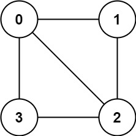
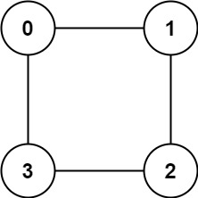

## Description

There is an **undirected** graph with `n` nodes, where each node is numbered between `0` and $n - 1$. You are given a 2D array `graph`, where $\text{graph}[u]$ is an array of nodes that node `u` is adjacent to. More formally, for each `v` in $\text{graph}[u]$, there is an undirected edge between node `u` and node `v`. The graph has the following properties:

- There are no self-edges ($\text{graph}[u]$ does not contain `u`).

- There are no parallel edges ($\text{graph}[u]$ does not contain duplicate values).

- If `v` is in $\text{graph}[u]$, then `u` is in $\text{graph}[v]$ (the graph is undirected).

- The graph may not be connected, meaning there may be two nodes `u` and `v` such that there is no path between them.

A graph is **bipartite** if the nodes can be partitioned into two independent sets `A` and `B` such that **every** edge in the graph connects a node in set `A` and a node in set `B`.

Return `true`* if and only if it is **bipartite***.
### Function Contract

- `n`: Input parameter.
- Returns expected result.

### Examples

#### Example 1

- **Input:** $graph = [[1,2,3],[0,2],[0,1,3],[0,2]]$
- **Output:** `false`
- **Explanation:** There is no way to partition the nodes into two independent sets such that every edge connects a node in one and a node in the other.
#### Example 2

- **Input:** $graph = [[1,3],[0,2],[1,3],[0,2]]$
- **Output:** `true`
- **Explanation:** We can partition the nodes into two sets: {0, 2} and {1, 3}.
### Constraints

- $\text{graph.length} = n$

- $1 \le n \le 100$

- $0 \le \text{graph}[u].length < n$

- $0 \le \text{graph}[u][i] \le n - 1$

- $\text{graph}[u]$ does not contain `u`.

- All the values of $\text{graph}[u]$ are **unique**.

- If $\text{graph}[u]$ contains `v`, then $\text{graph}[v]$ contains `u`.