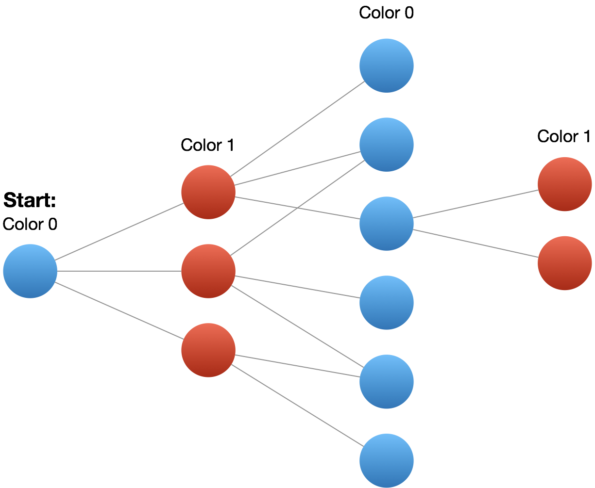

[TOC]

---
### Approach #1: Coloring by Depth-First Search [Accepted]

**Intuition**

Color a node blue if it is part of the first set, else red.  We should be able to greedily color the graph if and only if it is bipartite: one node being blue implies all it's neighbors are red, all those neighbors are blue, and so on.

<br />
<center>
    
</center>
<br />

**Algorithm**

We'll keep an array (or hashmap) to lookup the color of each node: $\text{color}[node]$.  The colors could be `0`, `1`, or uncolored (`-1` or `null`).

We should be careful to consider disconnected components of the graph, by searching each node.  For each uncolored node, we'll start the coloring process by doing a depth-first-search on that node.  Every neighbor gets colored the opposite color from the current node.  If we find a neighbor colored the same color as the current node, then our coloring was impossible.

To perform the depth-first search, we use a `stack`.  For each uncolored neighbor in $\text{graph}[node]$, we'll color it and add it to our `stack`, which acts as a sort of "todo list" of nodes to visit next.  Our larger loop `for start...` ensures that we color every node. Here is a visual dry-run of the algorithm whose Python code is below.

<div>
    <div class="video-container">
        <iframe src="https://player.vimeo.com/video/810324729" width="640" height="360" frameborder="0" allow="autoplay; fullscreen" allowfullscreen></iframe>
    </div>
</div>

<div>
</div>

```python
class Solution(object):
    def isBipartite(self, graph):
        color = {}
        for node in xrange(len(graph)):
            if node not in color:
                stack = [node]
                color[node] = 0
                while stack:
                    node = stack.pop()
                    for nei in graph[node]:
                        if nei not in color:
                            stack.append(nei)
                            color[nei] = color[node] ^ 1
                        elif color[nei] == color[node]:
                            return False
        return True
```

**Complexity Analysis**

* Time Complexity:  $O(N + E)$, where $N$ is the number of nodes in the graph, and $E$ is the number of edges.  We explore each node once when we transform it from uncolored to colored, traversing all its edges in the process.

* Space Complexity:  $O(N)$, the space used to store the `color`.