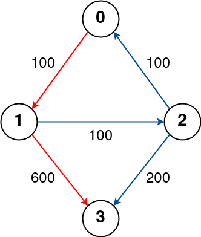
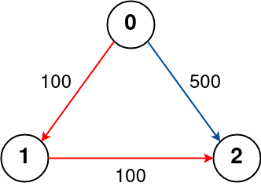
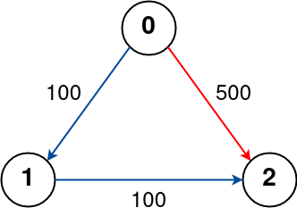

### 1. Description

There are `n` cities connected by some number of flights. You are given an array `flights` where $\text{flights}[i] = [\text{from}_{i}, \text{to}_{i}, \text{price}_{i}]$ indicates that there is a flight from city $\text{from}_{i}$ to city $\text{to}_{i}$ with cost $\text{price}_{i}$.

You are also given three integers `src`, `dst`, and `k`, return ***the cheapest price** from *`src`* to *`dst`* with at most *`k`* stops. *If there is no such route, return* *`-1`.

### 2. Function Contract

**Inputs**

- `n`: Input parameter (`int`).
- `flights`: Input parameter (`List[List[int]]`).
- `src`: Input parameter (`int`).
- `dst`: Input parameter (`int`).
- `k`: Input parameter (`int`).

**Return value**

- Returns `int`.

### 3. Examples

#### Example 1

- **Input:** $n = 4, flights = [[0,1,100],[1,2,100],[2,0,100],[1,3,600],[2,3,200]], src = 0, dst = 3, k = 1$
- **Output:** `700`
- **Explanation:** The graph is shown above.
The optimal path with at most 1 stop from city 0 to 3 is marked in red and has cost 100 + 600 = 700.
Note that the path through cities [0,1,2,3] is cheaper but is invalid because it uses 2 stops.

#### Example 2

- **Input:** $n = 3, flights = [[0,1,100],[1,2,100],[0,2,500]], src = 0, dst = 2, k = 1$
- **Output:** `200`
- **Explanation:** The graph is shown above.
The optimal path with at most 1 stop from city 0 to 2 is marked in red and has cost 100 + 100 = 200.

#### Example 3

- **Input:** $n = 3, flights = [[0,1,100],[1,2,100],[0,2,500]], src = 0, dst = 2, k = 0$
- **Output:** `500`
- **Explanation:** The graph is shown above.
The optimal path with no stops from city 0 to 2 is marked in red and has cost 500.

### 4. Constraints

- $2 \le n \le 100$

- $0 \le \text{flights.length} \le (n * (n - 1) / 2)$

- $\text{flights}[i].length = 3$

- $0 \le \text{from}_{i}, \text{to}_{i} < n$

- $\text{from}_{i} \neq \text{to}_{i}$

- $1 \le \text{price}_{i} \le 10^{4}$

- There will not be any multiple flights between two cities.

- $0 \le src, dst, k < n$

- $src \neq dst$
