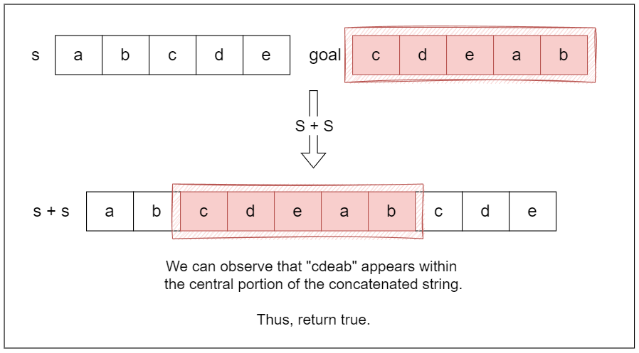

## Solution

---

### Approach 1: Brute Force

#### Intuition

A rotation shifts the characters of the string to the right, one by one. The simplest way to solve this problem is to simulate each possible rotation of the string `s` and compare the result to the `goal`.

If the lengths of `s` and `goal` are not equal, there's no way `s` can be rotated to become `goal`. This is the base case. If they are of equal length, we can then proceed with checking each rotation.

To simulate a rotation, we move the first character of `s` to the end and compare the new string with `goal`. We repeat this process for every possible rotation. If at any point, `s` matches `goal`, we can conclude that the rotation works, and we return `true`. If none of the rotations match the `goal`, we return `false`.

#### Algorithm

- Check if the lengths of `s` and `goal` are different:
  - If they are not equal, return `false` since one string cannot be a rotation of the other.

- Initialize `length` to store the length of string `s`.

- Use a loop to attempt all possible rotations of `s`:
  - For each possible rotation count from `0` to $length - 1$:
- Perform one left rotation on `s`, moving the first character to the end of the string.
- Check if the rotated string `s` is equal to `goal`:
      - If they are equal, return `true`, indicating that `goal` is a rotation of `s`.

- If all rotations have been checked and none match `goal`, return `false`.

#### Implementation

```python
class Solution:
    def rotateString(self, s: str, goal: str) -> bool:
        if len(s) != len(goal):
            return False
        length = len(s)

        # Try all possible rotations of the string
        for _ in range(length):
            # Perform one rotation
            s = s[1:] + s[0]
            if s == goal:
                return True
        return False
```

#### Complexity Analysis

Let $n$ be the size of string $s$ (and also the size of string $goal$, since they must be of equal length to be rotations).

- Time complexity: $O(n^2)$

    Checking if the lengths of both strings are different takes $O(1)$.

    The loop iterates $n$ times (for each possible rotation).

    Inside the loop, the `rotate` function performs a rotation, which takes $O(n)$, and comparing two strings $s$ and $goal$ also takes $O(n)$.

    Therefore, for each of the $n$ rotations, we are performing operations that take $O(n)$, leading to an overall time complexity of $O(n^2)$.

- Space complexity: $O(n)$ or $O(1)$

    Each rotation creates a new string $s$ of length $n$, so the additional space for each new string is $O(n)$.

    Java and Python’s string immutability means that every new rotation stores a new string in memory, leading to $O(n)$ space complexity for each rotation.

    Therefore, the overall space complexity is $O(n)$ for Java and Python, as we maintain the current rotated string in memory and for CPP its $O(1)$.

---

### Approach 2: Concatenation Check

#### Intuition

Instead of rotating the string and checking after each rotation, we can observe a relationship between `s` and `goal`. If `goal` can be formed by rotating `s`, it must be possible to find `goal` as a substring in some version of `s`.

A clever way to exploit this is by concatenating `s` with itself. Why? Because this effectively creates a string that contains all possible rotations of `s` within it. For example, if `s = "abcde"`, then $s + s = "abcdeabcde"$. Notice how every possible rotation of `s` appears somewhere in this concatenated string.

So, if `goal` can be obtained by rotating `s`, it must be a substring of $s + s$. To implement this, we simply check if `goal` is a substring of the concatenated string. If it is, we return `true`; otherwise, we return `false`.



#### Algorithm

- Check if the lengths of strings `s` and `goal` are different:
  - If they are, return `false` because a rotation of `s` cannot match `goal`.

- Create a new string `doubledString` by concatenating `s` with itself.

- Use a string search method to find the substring `goal` within `doubledString`:
  - If `goal` is found, check if this index is less than the length of `doubledString`.
  - If it is, return `true`, indicating that `goal` is a valid rotation of `s`. Otherwise, return `false`.

#### Implementation

```python
class Solution:
    def rotateString(self, s: str, goal: str) -> bool:
        # Check if the lengths are different
        if len(s) != len(goal):
            return False

        # Create a new string by concatenating 's' with itself
        doubled_string = s + s

        # Use find to search for 'goal' in 'doubledString'
        # If find returns an index that is not -1
        # then 'goal' is a substring
        return doubled_string.find(goal) != -1
```

#### Complexity Analysis

Let $n$ be the size of string $s$ (and also the size of string $goal$, since they must be of equal length to be rotations).

- Time complexity: $O(n^2)$

    Checking if the lengths of both strings are different takes $O(1)$.

    Concatenating the string $s$ with itself to create `doubledString` takes $O(n)$ because we are creating a new string that is twice the length of $s$.

    The standard library substring search used here (`std::string::find` in C++, `str.find` in Python, `String.contains` in Java) is a naive implementation that, in the worst case, compares the pattern of length $n$ against each of the $2n$ positions in `doubledString`, giving $O(n \cdot 2n) = O(n^2)$.

    Therefore, the overall time complexity is $O(n^2)$.

- Space complexity: $O(n)$

    The space used for the `doubledString` is $O(n)$ since it stores a string that is double the size of $s$ (specifically, $O(2 \cdot n) \approx O(n)$).

    Thus, the overall space complexity is $O(n)$ due to the concatenated string.

---

### Approach 3: KMP Algorithm

#### Intuition

We can refine the substring search using the [Knuth-Morris-Pratt (KMP) algorithm](https://en.wikipedia.org/wiki/Knuth%E2%80%93Morris%E2%80%93Pratt_algorithm). This follows the same intuition as the concatenation approach but improves how we search for `goal` within the concatenated string $s + s$.

The KMP algorithm allows us to search for substrings in linear time by preprocessing the pattern (in this case, `goal`) to identify where matches might fail early. The idea is to avoid rechecking characters we’ve already confirmed don’t match.

First, we preprocess `goal` to create the longest prefix suffix (LPS) array. The LPS array stores the lengths of the longest proper prefix of the substring that matches a proper suffix for every prefix of `goal`. For example, if a mismatch occurs after matching a certain number of characters, the LPS array tells us how many characters we can skip and where to resume checking in the pattern. This way we don't need to start from the beginning of `goal` each time a mismatch happens.

Once the LPS array is ready, we scan through the concatenated string $s + s$ and use the LPS array to efficiently find the `goal`. As we iterate through $s + s$, we compare characters from `goal` against the characters of the concatenated string. If we find a match, we continue comparing; however, if a mismatch occurs, we use the value from the LPS array to determine the next position in `goal` to check.

> Note: This approach doesn't change much in terms of time complexity and space complexity compared to the previous approach, but we included it as we thought it could be a good problem to demonstrate the use of KMP in general.

#### Algorithm

- Check if the lengths of strings `s` and `goal` are different:
  - If they are, return `false` (they can't be rotations).

- Concatenate `s` with itself to create `doubledString`, which contains all possible rotations of `s`.

- Call the `kmpSearch` function to check if `goal` is a substring of `doubledString`.

- In the `kmpSearch` function:
  - Precompute the LPS (Longest Prefix Suffix) array for the `pattern` (which is `goal`).

  - Initialize indices `textIndex` and `patternIndex` to track positions in `text` and `pattern`, respectively.

  - Loop through `text`:
- If the characters at $\text{text}[textIndex]$ and $\text{pattern}[patternIndex]$ match:
      - Increment both indices.
      - If `patternIndex` equals the length of the pattern, return `true` (the pattern has been found).

- If there's a mismatch after some matches:
      - Use the LPS array to update `patternIndex` to skip unnecessary comparisons.

- If there are no matches:
      - Move `textIndex` to the next character.

  - If the loop finishes without finding the pattern, return `false`.

- In the `computeLPS` function:
  - Initialize the LPS array with zeros.

  - Build the LPS array to store the lengths of the longest prefix that is also a suffix for each position in the pattern:
- While the `index` is less than the length of the pattern:
      - If characters match, increment the length and set the corresponding LPS value.
      - If there's a mismatch, update the length using the previous LPS value.
      - If there's no match and the length is zero, set the LPS value to zero.

- Return the constructed LPS array.

#### Implementation

```python
class Solution:
    def rotateString(self, s: str, goal: str) -> bool:
        # Check if the lengths of both strings are different; if so, they can't be rotations
        if len(s) != len(goal):
            return False

        # Concatenate 's' with itself to create a new string containing all possible rotations
        doubled_string = s + s

        # Perform KMP substring search to check if 'goal' is a substring of 'doubled_string'
        return self.kmp_search(doubled_string, goal)

    def kmp_search(self, text: str, pattern: str) -> bool:
        # Precompute the LPS (Longest Prefix Suffix) array for the pattern
        lps = self.compute_lps(pattern)
        text_index = pattern_index = 0
        text_length = len(text)
        pattern_length = len(pattern)

        # Loop through the text to find the pattern
        while text_index < text_length:
            # If characters match, move both indices forward
            if text[text_index] == pattern[pattern_index]:
                text_index += 1
                pattern_index += 1
                # If we've matched the entire pattern, return true
                if pattern_index == pattern_length:
                    return True
            # If there's a mismatch after some matches, use the LPS array to skip unnecessary comparisons
            elif pattern_index > 0:
                pattern_index = lps[pattern_index - 1]
            # If no matches, move to the next character in text
            else:
                text_index += 1
        # Pattern not found in text
        return False

    def compute_lps(self, pattern: str) -> list:
        pattern_length = len(pattern)
        lps = [0] * pattern_length
        length = 0
        index = 1

        # Build the LPS array
        while index < pattern_length:
            # If characters match, increment length and set lps value
            if pattern[index] == pattern[length]:
                length += 1
                lps[index] = length
                index += 1
            # If there's a mismatch, update length using the previous LPS value
            elif length > 0:
                length = lps[length - 1]
            # No match and length is zero
            else:
                lps[index] = 0
                index += 1

        return lps
```

#### Complexity Analysis

Let $n$ be the size of string $s$ (and also the size of string $goal$, since they must be of equal length to be rotations).

- Time complexity: $O(n)$

    Checking if the lengths of both strings are different takes $O(1)$.

    Concatenating the string $s$ with itself to create `doubledString` takes $O(n)$ because we are creating a new string that is twice the length of $s$.

    The KMP substring search involves computing the LPS array for the `goal`, which takes $O(n)$, and the search process itself also runs in $O(n)$. Thus, the total time for KMP is $O(n)$.

    Overall, the most significant operation is linear in terms of $n$, resulting in a total time complexity of $O(n)$.

- Space complexity: $O(n)$

    The space used for the `doubledString` is $O(n)$ since it stores a string that is double the size of $s$.

    The LPS array in the `computeLPS` function is of size $n$, which contributes $O(n)$ space.

    Thus, the overall space complexity is $O(n)$ due to the concatenated string and the LPS array.

---