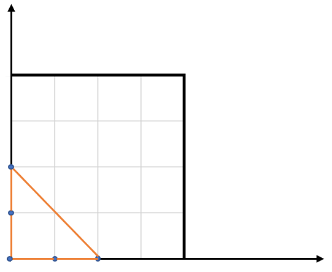

## Description

Given an array of points on the **X-Y** plane `points` where $\text{points}[i] = [x_{i}, y_{i}]$, return *the area of the largest triangle that can be formed by any three different points*. Answers within $10^{-5}$ of the actual answer will be accepted.
### Function Contract

- `n`: Input parameter.
- Returns expected result.

### Examples
#### Example 1

- **Input:** $points = [[0,0],[0,1],[1,0],[0,2],[2,0]]$
- **Output:** `2.00000`
- **Explanation:** The five points are shown in the above figure. The red triangle is the largest.
#### Example 2

- **Input:** $points = [[1,0],[0,0],[0,1]]$
- **Output:** `0.50000`
### Constraints

- $3 \le \text{points.length} \le 50$

- $-50 \le x_{i}, y_{i} \le 50$

- All the given points are **unique**.