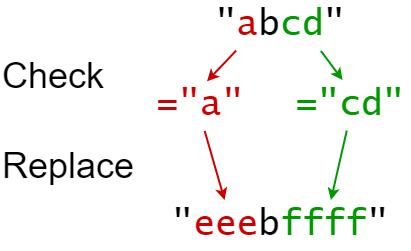
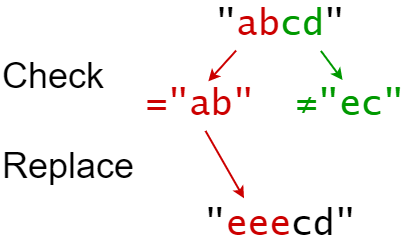

### 1. Description

You are given a **0-indexed** string `s` that you must perform `k` replacement operations on. The replacement operations are given as three **0-indexed** parallel arrays, `indices`, `sources`, and `targets`, all of length `k`.

To complete the $$i^{\text{th}}$$ replacement operation:

- Check if the **substring** $\text{sources}[i]$ occurs at index $\text{indices}[i]$ in the **original string** `s`.

- If it does not occur, **do nothing**.

- Otherwise if it does occur, **replace** that substring with $\text{targets}[i]$.

For example, if `s = "<u>ab</u>cd"`, $\text{indices}[i] = 0$, $\text{sources}[i] = "ab"$, and $\text{targets}[i] = "eee"$, then the result of this replacement will be `"<u>eee</u>cd"`.

All replacement operations must occur **simultaneously**, meaning the replacement operations should not affect the indexing of each other. The testcases will be generated such that the replacements will **not overlap**.

- For example, a testcase with `s = "abc"`, $indices = [0, 1]$, and $sources = ["ab","bc"]$ will not be generated because the `"ab"` and `"bc"` replacements overlap.

Return *the **resulting string** after performing all replacement operations on *`s`.

A **substring** is a contiguous sequence of characters in a string.

### 2. Function Contract

**Inputs**

- `s`: Input parameter (`str`).
- `indices`: Input parameter (`List[int]`).
- `sources`: Input parameter (`List[str]`).
- `targets`: Input parameter (`List[str]`).

**Return value**

- Returns `str`.

### 3. Examples

#### Example 1

- **Input:** `s = "abcd", indices = [0, 2], sources = ["a", "cd"], targets = ["eee", "ffff"]`
- **Output:** `"eeebffff"`
- **Explanation:** "a" occurs at index 0 in s, so we replace it with "eee".
"cd" occurs at index 2 in s, so we replace it with "ffff".

#### Example 2

- **Input:** `s = "abcd", indices = [0, 2], sources = ["ab","ec"], targets = ["eee","ffff"]`
- **Output:** `"eeecd"`
- **Explanation:** "ab" occurs at index 0 in s, so we replace it with "eee".
"ec" does not occur at index 2 in s, so we do nothing.

### 4. Constraints

- $1 \le \text{s.length} \le 1000$

- $k = \text{indices.length} = \text{sources.length} = \text{targets.length}$

- $1 \le k \le 100$

- $0 \le \text{indexes}[i] < \text{s.length}$

- $1 \le \text{sources}[i].length, \text{targets}[i].length \le 50$

- `s` consists of only lowercase English letters.

- $\text{sources}[i]$ and $\text{targets}[i]$ consist of only lowercase English letters.
