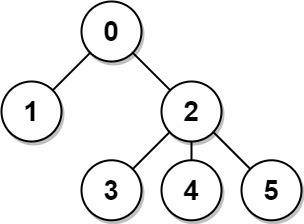
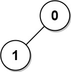

### 1. Description

There is an undirected connected tree with `n` nodes labeled from `0` to $n - 1$ and $n - 1$ edges.

You are given the integer `n` and the array `edges` where $\text{edges}[i] = [a_{i}, b_{i}]$ indicates that there is an edge between nodes $a_{i}$ and $b_{i}$ in the tree.

Return an array `answer` of length `n` where $\text{answer}[i]$ is the sum of the distances between the $i^{\text{th}}$ node in the tree and all other nodes.

### 2. Function Contract

**Inputs**

- `n`: Input parameter (`int`).
- `edges`: Input parameter (`List[List[int]]`).

**Return value**

- Returns `List[int]`.

### 3. Examples

#### Example 1

- **Input:** $n = 6, edges = [[0,1],[0,2],[2,3],[2,4],[2,5]]$
- **Output:** `[8,12,6,10,10,10]`
- **Explanation:** The tree is shown above.
We can see that dist(0,1) + dist(0,2) + dist(0,3) + dist(0,4) + dist(0,5)
equals 1 + 1 + 2 + 2 + 2 = 8.
Hence, answer[0] = 8, and so on.

#### Example 2

- **Input:** $n = 1, edges = []$
- **Output:** `[0]`

#### Example 3

- **Input:** $n = 2, edges = [[1,0]]$
- **Output:** `[1,1]`

### 4. Constraints

- $1 \le n \le 3 * 10^{4}$

- $\text{edges.length} = n - 1$

- $\text{edges}[i].length = 2$

- $0 \le a_{i}, b_{i} < n$

- $a_{i} \neq b_{i}$

- The given input represents a valid tree.
