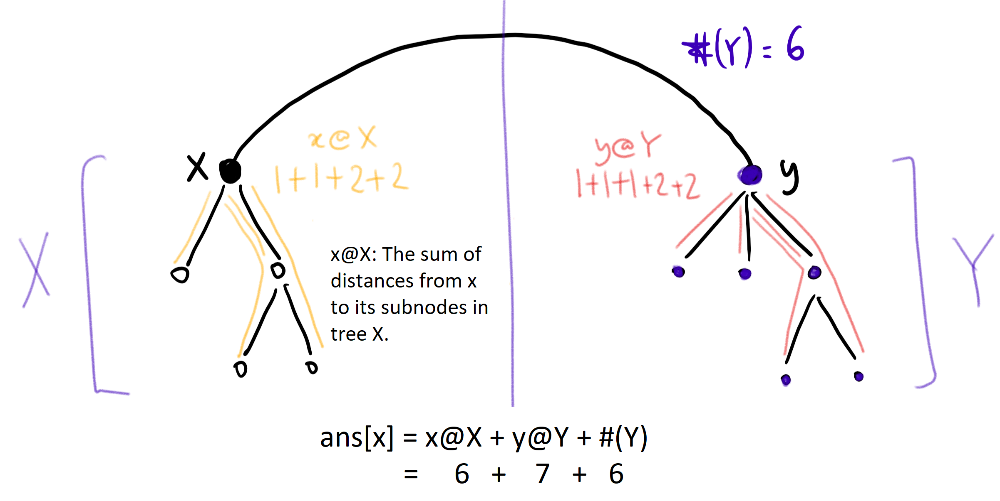
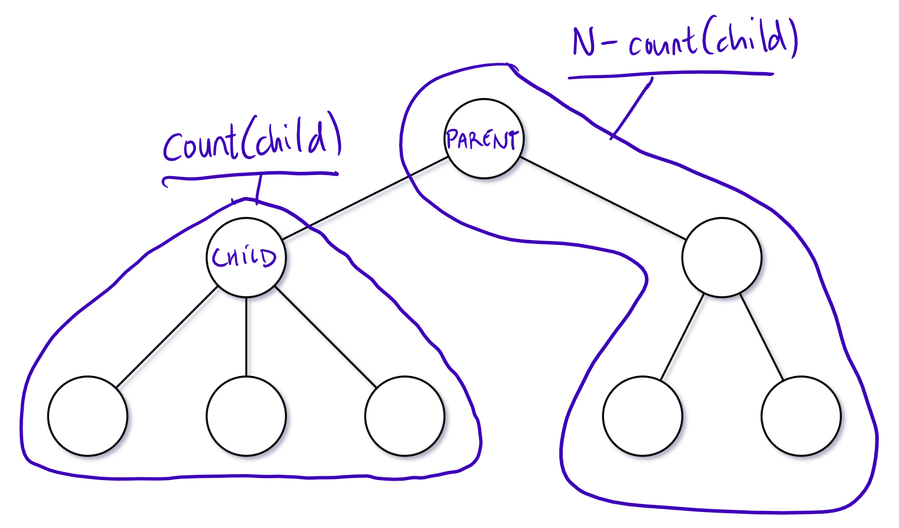

---
### Approach #1: Subtree Sum and Count [Accepted]

**Intuition**

Let `ans` be the returned answer, so that in particular $\text{ans}[x]$ be the answer for node `x`.

Naively, finding each $\text{ans}[x]$ would take $O(N)$ time  (where $N$ is the number of nodes in the graph), which is too slow.  This is the motivation to find out how $\text{ans}[x]$ and $\text{ans}[y]$ are related, so that we cut down on repeated work.

Let's investigate the answers of neighboring nodes $x$ and $y$.  In particular, say $xy$ is an edge of the graph, that if cut would form two trees $X$ (containing $x$) and $Y$ (containing $y$).

<center>
    
</center>

Then, as illustrated in the diagram, the answer for $x$ in the entire tree, is the answer of $x$ on $X$ `"x@X"`, plus the answer of $y$ on $Y$ `"y@Y"`, plus the number of nodes in $Y$ `"#(Y)"`.  The last part `"#(Y)"` is specifically because for any node `z in Y`, $dist(x, z) = dist(y, z) + 1$.

By similar reasoning, the answer for $y$ in the entire tree is $\text{ans}[y] = x@X + y@Y + #(X)$.  Hence, for neighboring nodes $x$ and $y$, $\text{ans}[x] - \text{ans}[y] = #(Y) - #(X)$.

**Algorithm**

Root the tree.  For each node, consider the subtree $S_{\text{node}}$ of that node plus all descendants.  Let $\text{count}[node]$ be the number of nodes in $S_{\text{node}}$, and $\text{stsum}[node]$ ("subtree sum") be the sum of the distances from `node` to the nodes in $S_{\text{node}}$.

We can calculate `count` and `stsum` using a post-order traversal, where on exiting some `node`, the `count` and `stsum` of all descendants of this node is correct, and we now calculate $\text{count}[node] += \text{count}[child]$ and $\text{stsum}[node] += \text{stsum}[child] + \text{count}[child]$.

This will give us the right answer for the `root`: $\text{ans}[root] = \text{stsum}[root]$.

Now, to use the insight explained previously: if we have a node `parent` and it's child `child`, then these are neighboring nodes, and so $\text{ans}[child] = \text{ans}[parent] - \text{count}[child] + (N - \text{count}[child])$.  This is because there are $\text{count}[child]$ nodes that are `1` easier to get to from `child` than `parent`, and $N-\text{count}[child]$ nodes that are `1` harder to get to from `child` than `parent`.

<center>
    
</center>

Using a second, pre-order traversal, we can update our answer in linear time for all of our nodes.

```python
class Solution(object):
    def sumOfDistancesInTree(self, N, edges):
        graph = collections.defaultdict(set)
        for u, v in edges:
            graph[u].add(v)
            graph[v].add(u)

        count = [1] * N
        ans = [0] * N
        def dfs(node = 0, parent = None):
            for child in graph[node]:
                if child != parent:
                    dfs(child, node)
                    count[node] += count[child]
                    ans[node] += ans[child] + count[child]

        def dfs2(node = 0, parent = None):
            for child in graph[node]:
                if child != parent:
                    ans[child] = ans[node] - count[child] + N - count[child]
                    dfs2(child, node)

        dfs()
        dfs2()
        return ans
```

**Complexity Analysis**

* Time Complexity:  $O(N)$, where $N$ is the number of nodes in the graph.

* Space Complexity:  $O(N)$.