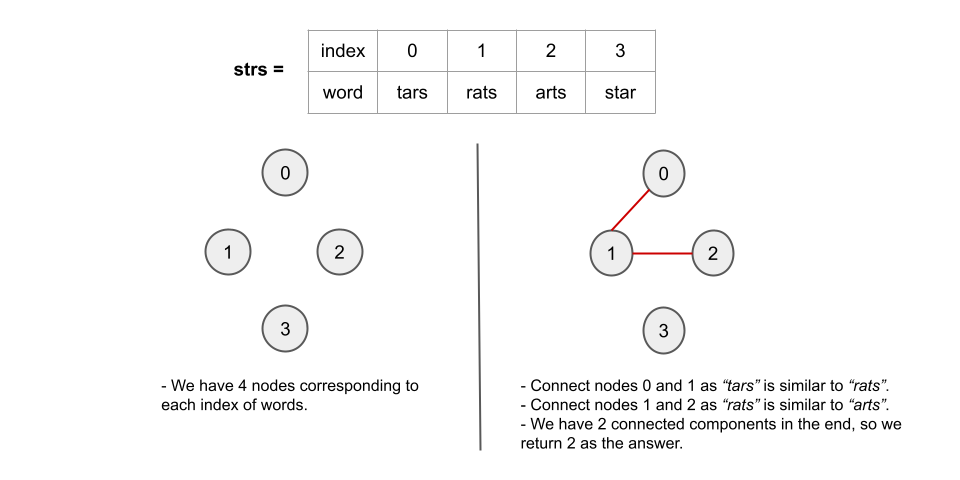

## Solution

---

### Overview

The problem states that two strings `X` and `Y` are similar if two letters (in different positions) of `X` can be swapped to form string `Y`. Also, if two strings `X` and `Y` are equal, they are similar.

We are given an array of strings called `strs`, where each string is an anagram of every other string in the array.

Our task is to group the strings together, where strings in the same group are similar to at least one other string in the group.

We have to return the number of such groups that will be formed.

---

### Approach 1: Depth First Search

#### Intuition

We can see that two words `A` and `B` belong to the same group if they are similar or equal, or if there are some words in the group such as `X1`, `X2`,... `XN`, such that `A` is similar to `X1`, `X1` is similar to `X2`,... `XN` is similar to `B`. It means that if we can create a path from `A` to `B` using words from the group, then `A` and `B` are also members of that group.

This prompts us to think about the problem in terms of graphs.

Each word in `strs` can be viewed as a node. We add an undirected edge between each pair of similar words. If there is a path in this graph from words `A` to `B`, then `A` and `B` belong to the same group. Because the graph is undirected, `A` and `B` belong to the same group if and only if they belong to the same component of the graph.

**The number of required groups is the number of connected components formed in such a graph.**

To make the graph, we use a hash map called `adj` with an integer as the key and a list of integers as the value to map the index of the word to a list of indices of words that are similar to it. We are using the indices as the nodes instead of the strings themselves because dealing with integers is faster than strings.

For a pair of similar words `A` and `B` with indices `i` and `j` in `strs`, we add `j` to the $\text{adj}[i]$ map and `i` to the $\text{adj}[j]$ map. This adds an undirected edge between nodes `i` and `j`. We iterate over all the pairs of words that can be formed in `strs`, see if they are similar, and then add an edge between them. This forms our graph.

To check the number of connected components in a graph, we can use a graph traversal algorithm like depth first search (DFS).

We use the `dfs` method, which takes `node, adj, visit` as parameters. The parameter `node` is the index of the word from which we start our path. `visit` is used to keep track of visited indices. `adj` is the adjacency list.

In the `dfs` method, we mark `node` as visited. We then iterate over all the neighbors of `node` and recursively visit them to cover all the nodes in the current connected component.

To figure out how many connected components there are in the graph, we first mark all nodes as unvisited. We create a variable called `count` to count the number of connected components in the graph and initialize it to `0`.

We iterate through all the nodes from `0` to $n - 1$, checking whether each `node` has been visited or not. If `node` is not visited, we begin a DFS traversal from `node` and increment `count` by `1` (a new connected component is discovered). The DFS traversal would visit all of the nodes in the component to which `node` belongs.

As an answer, we return `count`.

Here's a visual representation of how the approach works in the first example given in the problem description:



#### Algorithm

1. Create an integer variable `n` which stores the number of words in `strs`.
2. Create an adjacency list of size `n` using `strs` where $\text{adj}[x]$ contains all the indices of words similar to word $\text{str}[x]$.
- We iterate over all pairs of words that can be formed by selecting any two words from `str` to generate the adjacency list.
- For any two words at index `i` and `j`, we check whether the words $\text{strs}[i]$ and $\text{strs}[j]$ are similar or not by iterating over all the letters of the words. If the words are equal or they differ at two indices only, the words are similar.
- If they are similar, we add `j` to the $\text{adj}[i]$ and `i` to the $\text{adj}[j]$ map.
3. Create a `visit` array of length `n` to keep track of nodes that have been visited.
4. Create an integer `count` which stores the number of connected components in the graph. Initialize it to `0`.
5. Iterate through all of the nodes, and for each node `i` check if it has been visited or not. If node `i` is not visited, we increment `count` by `1` and start a DFS traversal:
- We use the `dfs` function to perform the traversal. For each call, pass `node`, `adj`, and `visit` as the parameters. We start with node `i`.
- We mark `node` as visited.
- We iterate over all the neighbors of `node`. If any `neighbor` has not yet been visited, we recursively call `dfs` with `neighbor` as the node.
6. Return `count`.

#### Implementation

```cpp
class Solution {
public:
    void dfs(int node, vector<vector<int>>& adj, vector<bool>& visit) {
        visit[node] = true;
        for (int neighbor : adj[node]) {
            if (!visit[neighbor]) {
                dfs(neighbor, adj, visit);
            }
        }
    }

    bool isSimilar(string& a, string& b) {
        int diff = 0;
        for (int i = 0; i < a.size(); i++) {
            if (a[i] != b[i]) {
                diff++;
            }
        }
        return diff == 0 || diff == 2;
    }

    int numSimilarGroups(vector<string>& strs) {
        int n = strs.size();
        vector<vector<int>> adj(n);
        // Form the required graph from the given strings array.
        for (int i = 0; i < n; i++) {
            for (int j = i + 1; j < n; j++) {
                if (isSimilar(strs[i], strs[j])) {
                    adj[i].push_back(j);
                    adj[j].push_back(i);
                }
            }
        }

        vector<bool> visit(n);
        int count = 0;
        // Count the number of connected components.
        for (int i = 0; i < n; i++) {
            if (!visit[i]) {
                dfs(i, adj, visit);
                count++;
            }
        }

        return count;
    }
};
```

#### Complexity Analysis

Here $n$ is the size of `strs` and `m` is length of each word in `strs`.

* Time complexity: $O(n^2 \cdot m)$.
- To iterate over all the pairs of words that can be formed using `strs`, we need $O(n^2)$ time. We also need $O(m)$ time to determine whether the chosen two words are similar or not, which results in $O(n^2 \cdot m)$ operations to check all the pairs.
- The `dfs` function visits each node once, which takes $O(n)$ time because there are $n$ nodes in total. We can have up to $O(n^2)$ edges between $n$ nodes (assume every word is similar to every other word). Because we have undirected edges, each edge can only be iterated twice (by nodes at the end), resulting in $O(n^2)$ operations total in the worst-case scenario while visiting all nodes.

* Space complexity: $O(n^2)$.
- As there can be a maximum of $O(n^2)$ edges, building the adjacency list takes $O(n^2)$ space.
- The `visit` array takes $O(n)$ space.
- The recursion call stack used by `dfs` can have no more than $n$ elements in the worst-case scenario. It would take up $O(n)$ space in that case.

---

### Approach 2: Breadth First Search

#### Intuition

As we just have to find the number of connected components in the graph, another method is to use a breadth-first search (BFS).

BFS is an algorithm for traversing or searching a graph. It traverses in a level-wise manner, i.e., all the nodes at the present level (say `l`) are explored before moving on to the nodes at the next level ($l + 1$), where a level's number is the distance from a starting node. BFS is implemented with a queue.

#### Algorithm

1. Create an integer variable `n` which stores the number of words in `strs`.
2. Create an adjacency list of size `n` using `strs` where $\text{adj}[x]$ contains all the indices of words similar to word $\text{str}[x]$.
- We iterate over all pairs of words that can be formed by selecting any two words from `str` to generate the adjacency list.
- For any two words at index `i` and `j`, we check whether the words $\text{strs}[i]$ and $\text{strs}[j]$ are similar or not by iterating over all the letters of the words. If the words are equal or they differ at two indices only, the words are similar.
- If they are similar, we add `j` to the $\text{adj}[i]$ and `i` to the $\text{adj}[j]$ map.
3. Create a `visit` array of length `n` to keep track of nodes that have been visited.
4. Create an integer `count` which stores the number of connected components in the graph. Initialize it to `0`.
5. Iterate through all of the nodes and for each node `i` check if it has been visited or not. If node `i` is not visited, we increment `count` by `1` and start a BFS traversal:
- We use the `bfs` function to perform the traversal. For each call, pass `node`, `adj`, and `visit` as the parameters. We start with node `i`.
- We create an integer queue `q` and push `node` into it. We also mark `node` as visited.
- We now loop until the queue is empty. The queue's first element, `node`, is popped out. We iterate over all the neighbors of `node`. If any `neighbor` has not yet been visited, we mark it as visited and push it into the queue.
6. Return `count`.

#### Implementation

```cpp
class Solution {
public:
    void bfs(int node, vector<vector<int>>& adj, vector<bool>& visit) {
        queue<int> q;
        q.push(node);
        visit[node] = true;

        while (!q.empty()) {
            node = q.front();
            q.pop();

            for (int neighbor : adj[node]) {
                if (!visit[neighbor]) {
                    visit[neighbor] = true;
                    q.push(neighbor);
                }
            }
        }
    }

    bool isSimilar(string& a, string& b) {
        int diff = 0;
        for (int i = 0; i < a.size(); i++) {
            if (a[i] != b[i]) {
                diff++;
            }
        }
        return diff == 0 || diff == 2;
    }

    int numSimilarGroups(vector<string>& strs) {
        int n = strs.size();
        vector<vector<int>> adj(n);
        // Form the required graph from the given strings array.
        for (int i = 0; i < n; i++) {
            for (int j = i + 1; j < n; j++) {
                if (isSimilar(strs[i], strs[j])) {
                    adj[i].push_back(j);
                    adj[j].push_back(i);
                }
            }
        }

        vector<bool> visit(n);
        int count = 0;
        // Count the number of connected components.
        for (int i = 0; i < n; i++) {
            if (!visit[i]) {
                bfs(i, adj, visit);
                count++;
            }
        }

        return count;
    }
};
```

#### Complexity Analysis

Here $n$ is the size of `strs` and `m` is length of each word in `strs`.

* Time complexity: $O(n^2 \cdot m)$.
- We need $O(n^2)$ time to iterate over all the pairs of words that can be formed using `strs`. We further need $O(m)$ time to check whether the chosen two words are similar or not, resulting in $O(n^2 \cdot m)$ operations to check all the pairs.
- Each queue operation in the BFS algorithm takes $O(1)$ time, and a single node can only be pushed once, leading to $O(n)$ operations for $n$ nodes. As discussed above, we can have up to $O(n^2)$ edges between $n$ nodes (assume every word is similar to every other word). Because we have undirected edges, each edge can only be iterated twice (by nodes at the end), resulting in $O(n^2)$ operations total in the worst-case scenario while visiting all nodes.

* Space complexity: $O(n^2)$.
- As there can be a maximum of $O(n^2)$. edges, building the adjacency list takes $O(n^2)$. space in the worst case.
- The BFS queue takes $O(n)$ because each node is added at most once.
- The `visit` array takes $O(n)$ space as well.

---

### Approach 3: Union-find

#### Intuition

Another approach to solving questions based on graph connectivity is the union-find data structure.

A disjoint-set data structure also called a union–find data structure or merge–find set, is a data structure that stores a collection of disjoint (non-overlapping) sets. Equivalently, it stores a partition of a set into disjoint subsets. It provides operations for adding new sets, merging sets (replacing them by their union), and finding a representative member of a set. It implements two useful operations:

1. `Find`: Determine which subset a particular element is in. This can be used to determine if two elements are in the same subset.
2. `Union`: Join two subsets into a single subset.

If you are new to Union-Find, we suggest you read our [Leetcode Explore Card](https://leetcode.com/explore/learn/card/graph/618/disjoint-set/3881/). We will not talk about implementation details in this article, but only about the interface to the data structure.

Our task, as with the previous approaches, is to count the number of connected components formed in the graph by indices of words acting as nodes and an edge between indices of every two similar words.

We initialize all nodes as separate components in the union-find data structure. We declare and initialize a variable called `count` to count the number of connected components in the graph. We iterate over all the edges, decrementing `count` by `1` for each edge whenever two different components are merged into a single one using that edge.

We iterate through all of the pairs that can be formed by selecting any two words from `strs`, and for each pair of similar words at index `i` and `j`, we use the `find` operation to determine which components both of them belong to. If they belong to different components, i.e., $find(node1)\neq find(node2)$, we perform a `union` operation on both nodes, combining the two different connected components into a single connected component. We also reduce `count` by one. We don't do anything if `i` and `j` belong to the same component.

As an answer, we return `count`.

#### Algorithm

1. Createa an integer variable `n` which stores the number of words in `strs`.
2. Create an instance of `UnionFind` of size `n`.
3. For any two words at index `i` and `j` that behave as nodes, we check whether the words $\text{strs}[i]$ and $\text{strs}[j]$ are similar or not by iterating over all the letters of the words. The words are similar if they are equal or differ only at two indices.
- If the words are similar, we use the `find` operation to determine the components of both the nodes.
- If both nodes belong to different components, we use the `union` operation over both nodes to combine the two different connected components into a single one. We also decrement `count` by `1`.
4. Return `count`.

#### Implementation

```cpp
class UnionFind {
private:
    vector<int> parent, rank;
    int count;

public:
    UnionFind(int size) {
        parent.resize(size);
        rank.resize(size, 0);
        count = size;
        for (int i = 0; i < size; i++) {
            parent[i] = i;
        }
    }
    int find(int x) {
        if (parent[x] != x) parent[x] = find(parent[x]);
        return parent[x];
    }
    void union_set(int x, int y) {
        int xset = find(x), yset = find(y);
        if (rank[xset] < rank[yset]) {
            parent[xset] = yset;
        } else if (rank[xset] > rank[yset]) {
            parent[yset] = xset;
        } else {
            parent[yset] = xset;
            rank[xset]++;
        }
    }
};

class Solution {
public:
    bool isSimilar(string& a, string& b) {
        int diff = 0;
        for (int i = 0; i < a.size(); i++) {
            if (a[i] != b[i]) {
                diff++;
            }
        }
        return diff == 0 || diff == 2;
    }

    int numSimilarGroups(vector<string>& strs) {
        int n = strs.size();
        UnionFind dsu(n);
        int count = n;
        for (int i = 0; i < n; i++) {
            for (int j = i + 1; j < n; j++) {
                if (isSimilar(strs[i], strs[j]) && dsu.find(i) != dsu.find(j)) {
                    count--;
                    dsu.union_set(i, j);
                }
            }
        }

        return count;
    }
};
```

#### Complexity Analysis

Here $n$ is the size of `strs` and `m` is length of each word in `strs`.

* Time complexity: $O(n^2 \cdot m)$.
- We need $O(n^2)$ time to iterate over all the pairs of words that can be formed using `strs`. We further need $O(m)$ time to check whether the chosen two words are similar or not, resulting in $O(n^2 \cdot m)$ operations to check all the pairs.
- For $T$ operations, the amortized time complexity of the union-find algorithm (using path compression with union by rank) is $O(alpha(T))$. Here, $\alpha(T)$ is the inverse Ackermann function that grows so slowly, that it doesn't exceed $4$ for all reasonable $T$ (approximately $T < 10^{600}$). You can read more about the complexity of union-find [here](https://en.wikipedia.org/wiki/Disjoint-set_data_structure#Time_complexity).  Because the function grows so slowly, we consider it to be $O(1)$.
- Initializing `UnionFind` takes $O(n)$ time beacuse we are initializing the `parent` and `rank` arrays of size `n` each.
- We iterate through every edge and use the `find` operation to find the component of nodes connected by each edge. It takes $O(1)$ per operation and takes $O(e)$ time for all the $e$ edges. As discussed above, we can have a maximum of $O(n^2)$ edges in between $n$ nodes, so it would take $O(n^2)$ time. If nodes from different components are connected by an edge, we also perform `union` of the nodes, which takes $O(1)$ time per operation. In the worst-case scenario, it may be called $O(n)$ times to connect all the components to form a connected graph with only one component.

* Space complexity: $O(n)$.
- We are using the `parent` and `rank` arrays, both of which require $O(n)$ space each.