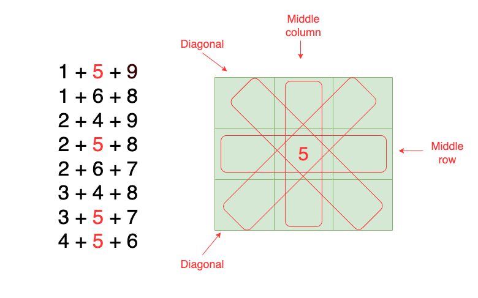
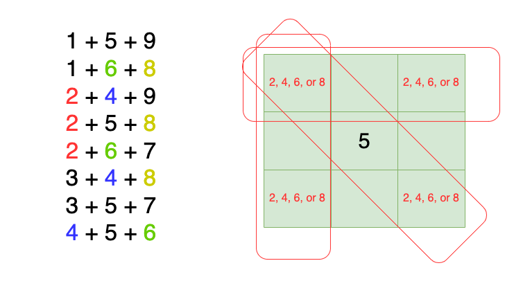
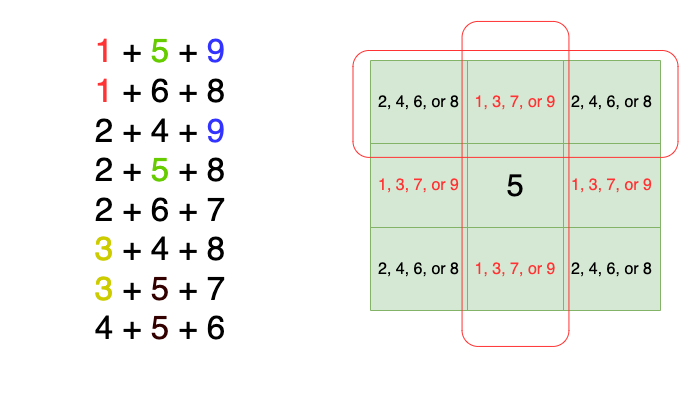
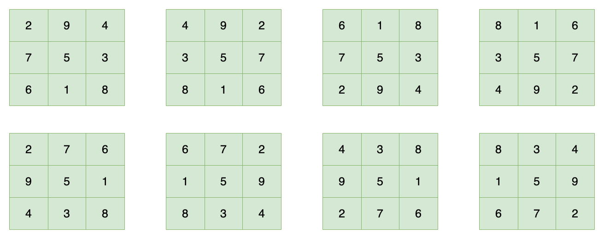

[TOC]

## Solution

---

### Overview

Let's start by clarifying some common points of confusion over this problem description. Note that:
1. The given grid may contain integers above `9`, but a magic grid may only contain integers `1` to `9`.
2. The given grid may contain duplicate values, but every value in a magic grid must be distinct. In other words, no duplicate values are allowed.

With the given `grid`, you want to find the number of subarrays in `grid` that are magic squares. A `3 x 3` magic square is defined as a `3 x 3` array containing distinct integers from `1` to `9` whose rows, columns, and diagonals all have the same sum.

---

### Approach 1: Manual Scan

### Intuition

One brute-force approach is to consider each `3 x 3` subarray of the `grid` and manually check if each subarray satisfies the definition of a `3 x 3` magic square.

We iterate through the entire grid, examining each possible `3 x 3` subarray. For each subarray, we'll check each element to make sure that it is within the allowed range and that it isn't a duplicate. Then, we verify that the sums of all three rows, three columns, and the two diagonals are equal. If all these conditions are met, then the subarray is a magic square.

### Algorithm

1. Initialize `ans` to `0`, representing the total count of magic squares.
2. Define a helper function `isMagicSquare(grid, row, col)` that determines if the subarray of `grid` starting at index `(row, col)` is a magic square:
* For each element `num` of the subarray:
* If it falls outside the allowed range (`num > 9` or `num < 1`), return `false`
* If we have seen `num` in the previous iteration, that means the values aren't distinct, so return `false`
* Initialize `diagonal1` and `diagonal2` as the sums for the 2 diagonals.
* If $diagonal1 \neq diagonal2$, return `false`
* Initialize `row1`, `row2`, and `row3` as the sums for the 3 rows.
* If any of the row sums don't equal `diagonal1`, then there are different sums for the rows and columns, so return `false`
* Initialize `col1`, `col2`, and `col3` as the sums for the 3 columns.
* Similarly, if any of the column sums don't equal `diagonal1`, return `false`
3. For each index `(row, col)` of `grid`:
* If `isSquareMagic(grid, row col)` is `true`, then increment `ans`.
4. Return `ans`.

### Implementation

```python
class Solution:
    def numMagicSquaresInside(self, grid: List[List[int]]) -> int:
        ans = 0
        m = len(grid)
        n = len(grid[0])
        for row in range(m - 2):
            for col in range(n - 2):
                if self._isMagicSquare(grid, row, col):
                    ans += 1
        return ans

    def _isMagicSquare(self, grid, row, col):
        seen = [False] * 10
        for i in range(3):
            for j in range(3):
                num = grid[row + i][col + j]
                if num < 1 or num > 9:
                    return False
                if seen[num]:
                    return False
                seen[num] = True

        # Check if diagonal sums are the same
        diagonal1 = (
            grid[row][col] + grid[row + 1][col + 1] + grid[row + 2][col + 2]
        )
        diagonal2 = (
            grid[row + 2][col] + grid[row + 1][col + 1] + grid[row][col + 2]
        )

        if diagonal1 != diagonal2:
            return False

        # Check if all row sums are the same as the diagonal sums
        row1 = grid[row][col] + grid[row][col + 1] + grid[row][col + 2]
        row2 = (
            grid[row + 1][col] + grid[row + 1][col + 1] + grid[row + 1][col + 2]
        )
        row3 = (
            grid[row + 2][col] + grid[row + 2][col + 1] + grid[row + 2][col + 2]
        )

        if not (row1 == diagonal1 and row2 == diagonal1 and row3 == diagonal1):
            return False

        # Check if all column sums are the same as the diagonal sums
        col1 = grid[row][col] + grid[row + 1][col] + grid[row + 2][col]
        col2 = (
            grid[row][col + 1] + grid[row + 1][col + 1] + grid[row + 2][col + 1]
        )
        col3 = (
            grid[row][col + 2] + grid[row + 1][col + 2] + grid[row + 2][col + 2]
        )

        if not (col1 == diagonal1 and col2 == diagonal1 and col3 == diagonal1):
            return False

        return True
```

### Time Complexity

Let `M` and `N` be the number of rows and columns of `grid`, respectively.

* Time Complexity: $O(M \cdot N)$

    The number of `3 x 3` subarrays to check for `grid` is linearly proportional to the size of `grid`, which is $M \cdot N$. For each `3 x 3` subarray of `grid`, we iterate through all its values to check that they are distinct and within range, which takes constant time. We also perform the sum calculations that involve additional array indexing into a `grid`, which also takes constant time. Thus, the total time complexity is $O(M \cdot N)$.

* Space Complexity: $O(1)$

    `isMagicSquare` uses an array to keep track of which values the current subarray of `grid` contains. However, this array has a constant size of $10$, so the space complexity is $O(1)$

### Approach 2: Check Unique Properties of Magic Square

### Intuition

In Approach 1, we determined whether each subarray of `grid` is a magic square by explicitly checking each criterion of the magic square definition given in the problem statement.

We can dive deeper into the definition of a `3 x 3` magic square to find additional properties that can help us simplify the logic for determining if a subarray is a magic square:

**Constant Sum**

By definition, every row has the same sum $S$. Furthermore, the definition states that a magic grid **can** only contain values `1` to `9` and each value must be distinct. Since every `3 x 3` magic grid will contain exactly `9` squares, we can see that every magic grid **will** have exactly one of each allowed value. Thus, we can see that the total sum of an entire `3 x 3` magic square is $1 + 2 + 3 + ... + 9 = 45$.

Because each magic square consists of $3$ rows, we can say that $3S = 45$ and thus $S = 15$. This means that every row sum, and in turn every column sum and diagonal sum, equals $15$.

**Limited Number of Arrangements**

If every row, column, and diagonal has to sum up to $15$ and can only contain distinct values from $1$ to $9$, then there are only a limited number of arrangements to form a magic square. Listed below are all possible combinations of 3-part sums that add up to $15$, where each value is between $1$ and $9$:

$1 + 5 + 9$

$1 + 6 + 8$

$2 + 4 + 9$

$2 + 5 + 8$

$2 + 6 + 7$

$3 + 4 + 8$

$3 + 5 + 7$

$4 + 5 + 6$

We can see that there are 8 different ways, which map directly to the 8 3-part sums in the magic square (3 rows + 3 columns + 2 diagonals = 8 total sums). We can explore further constraints on arranging the possible magic squares.

**Constraint 1 - Middle element**

5 appears in exactly 4 of these sums. The only element that would appear in 4 sums is the middle element of the magic square. Specifically, the middle element appears in the sums for the middle row, the middle column, and both diagonals. Thus, we know that for a subarray to be a magic square, its middle element has to be 5.



**Constraint 2 - Even numbers**

 Moreover, the even numbers (2, 4, 6, and 8) each appear in exactly 3 of the sums. Only the corner elements of the grid can appear in exactly 3 sums. Specifically, they appear in the sum for one row, one column, and one diagonal. Thus, we know the corner elements have to be even numbers.



**Constraint 3 - Odd numbers**

Finally, the only numbers remaining are the odd numbers (1, 3, 7, and 9). They each appear in exactly 2 of the sums. The remaining elements on the edges of the grid also appear in exactly 2 sums: the sums for one row and one column. Thus, we know the remaining edge elements have to be odd numbers.



Using these constraints, we can more easily generate all the possible arrangements for a `3 x 3` magic square:



We observe that for all possible arrangements, the elements around the border (the even/odd numbers from constraints 2/3 above) all follow the ordered sequence

$2, 9, 4, 3, 8, 1, 6, 7$

either moving clockwise or counter-clockwise around the border, starting at a corner element.

Thus, we know that a subarray is a magic square if and only if it satisfies the 2 following properties:

1. The middle element is 5
2. The bordering elements follow the $2, 9, 4, 3, 8, 1, 6, 7$ sequence, starting at some corner element and going either clockwise or counter-clockwise.

### Algorithm

1. Initialize `ans` to `0`, representing the total count of magic squares.
2. Define a helper function `isMagicSquare(grid, row, col)` that determines if the subarray of `grid` starting at index `(row, col)` is a magic square:
* Initialize the magic sequence `sequence` to `2943816729438167`.
* Also initialize the reversed sequence `reversedSequence` to `7618349276183492` to account for the opposite direction.
* Initialize a string `S`.
* Starting from the first element $\text{grid}[row][col]$, append all bordering elements in clockwise order to `S`.
* If `S` is contained in either `sequence` or `reversedSequence`, the first element is even, and the middle element is $5$, then the subarray is a magic square so return `true`
* Otherwise, return `false`
3. For each index `(row, col)` of `grid`:
* If `isMagicSquare(grid, row col)` is `true`, then increment `ans`.
4. Return `ans`.

### Implementation

```python
class Solution:
    def numMagicSquaresInside(self, grid: List[List[int]]) -> int:
        ans = 0
        m = len(grid)
        n = len(grid[0])
        for row in range(m - 2):
            for col in range(n - 2):
                if self._isMagicSquare(grid, row, col):
                    ans += 1
        return ans

    def _isMagicSquare(self, grid, row, col):
        # The sequences are each repeated twice to account for
        # the different possible starting points of the sequence
        # in the magic square
        sequence = "2943816729438167"
        sequenceReversed = "7618349276183492"

        border = []
        # Flattened indices for bordering elements of 3x3 grid
        borderIndices = [0, 1, 2, 5, 8, 7, 6, 3]
        for i in borderIndices:
            num = grid[row + i // 3][col + (i % 3)]
            border.append(str(num))

        borderConverted = "".join(border)

        # Make sure the sequence starts at one of the corners
        return (
            grid[row][col] % 2 == 0
            and (
                sequence.find(borderConverted) != -1
                or sequenceReversed.find(borderConverted) != -1
            )
            and grid[row + 1][col + 1] == 5
        )
```

### Time Complexity

Let `M` and `N` be the number of rows and columns of `grid`, respectively.

* Time Complexity: $O(M \cdot N)$

    Similar to Approach 1, the pattern checking in `isMagicSquare` is done in constant time. This function is called $O(M \cdot N)$ times, so the total time complexity is $O(M \cdot N)$.

* Space Complexity: $O(1)$

    The only auxiliary data structure used is a string storing our bordering pattern, which is a constant size. Thus, the space complexity is $O(1)$.