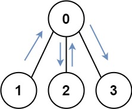

## Description

You have an undirected, connected graph of `n` nodes labeled from `0` to $n - 1$. You are given an array `graph` where $\text{graph}[i]$ is a list of all the nodes connected with node `i` by an edge.

Return *the length of the shortest path that visits every node*. You may start and stop at any node, you may revisit nodes multiple times, and you may reuse edges.
### Function Contract

- `n`: Input parameter.
- Returns expected result.

### Examples

#### Example 1

- **Input:** $graph = [[1,2,3],[0],[0],[0]]$
- **Output:** `4`
- **Explanation:** One possible path is [1,0,2,0,3]
#### Example 2

- **Input:** $graph = [[1],[0,2,4],[1,3,4],[2],[1,2]]$
- **Output:** `4`
- **Explanation:** One possible path is [0,1,4,2,3]
### Constraints

- $n = \text{graph.length}$

- $1 \le n \le 12$

- $0 \le \text{graph}[i].length < n$

- $\text{graph}[i]$ does not contain `i`.

- If $\text{graph}[a]$ contains `b`, then $\text{graph}[b]$ contains `a`.

- The input graph is always connected.